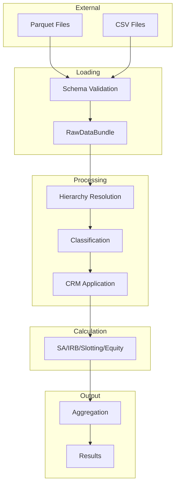

# Data Flow

This document describes how data flows through the RWA calculator, including schemas, transformations, and validation points.

## Data Flow Overview



## Input Data

### Required Files

| File | Description | Required |
|------|-------------|----------|
| `counterparties.parquet` | Counterparty master data | Yes |
| `facilities.parquet` | Credit facilities | Yes |
| `loans.parquet` | Individual loans/draws | Yes |

### Optional Files

| File | Description |
|------|-------------|
| `contingents.parquet` | Off-balance sheet items |
| `collateral.parquet` | Collateral details |
| `guarantees.parquet` | Guarantee information |
| `provisions.parquet` | Provision allocations |
| `ratings.parquet` | Credit ratings |
| `org_mapping.parquet` | Organization hierarchy |
| `lending_mapping.parquet` | Retail lending groups |

## Schema Definitions

Schemas are defined in `data/schemas.py`. The key column names use `_reference` suffixes (e.g., `counterparty_reference`, `facility_reference`) rather than `_id`.

### Counterparty Schema

```python
COUNTERPARTY_SCHEMA = {
    "counterparty_reference": pl.String,  # Unique identifier
    "counterparty_name": pl.String,       # Legal name
    "entity_type": pl.String,             # Single source of truth: sovereign, institution, corporate, etc.
    "country_code": pl.String,            # ISO country code
    "annual_revenue": pl.Float64,         # For SME classification (EUR 50m threshold)
    "total_assets": pl.Float64,           # For large FSE threshold (EUR 70bn)
    "default_status": pl.Boolean,         # Default indicator
    "sector_code": pl.String,             # Based on SIC
    "is_regulated": pl.Boolean,           # For FI scalar: unregulated FSE gets 1.25x correlation
    "is_managed_as_retail": pl.Boolean,   # SME managed on pooled retail basis - 75% RW
}
```

### Facility Schema

```python
FACILITY_SCHEMA = {
    "facility_reference": pl.String,      # Unique identifier
    "product_type": pl.String,            # Product classification
    "book_code": pl.String,               # Book identifier
    "counterparty_reference": pl.String,  # Link to counterparty
    "value_date": pl.Date,                # Facility start
    "maturity_date": pl.Date,             # Final maturity
    "currency": pl.String,                # ISO currency code
    "limit": pl.Float64,                  # Total commitment
    "committed": pl.Boolean,              # Committed flag
    "lgd": pl.Float64,                    # A-IRB modelled LGD
    "beel": pl.Float64,                   # Best estimate expected loss
    "is_revolving": pl.Boolean,           # Revolving facility flag
    "seniority": pl.String,              # senior/subordinated - affects F-IRB LGD
    "risk_type": pl.String,              # FR/MR/MLR/LR - determines CCF
    "ccf_modelled": pl.Float64,          # A-IRB modelled CCF (0.0-1.5)
    "is_short_term_trade_lc": pl.Boolean, # 20% CCF under F-IRB (Art. 166(9))
    "is_buy_to_let": pl.Boolean,         # BTL - excluded from SME supporting factor
}
```

### Loan Schema

```python
LOAN_SCHEMA = {
    "loan_reference": pl.String,          # Unique identifier
    "product_type": pl.String,            # Product classification
    "book_code": pl.String,               # Book identifier
    "counterparty_reference": pl.String,  # Link to counterparty
    "value_date": pl.Date,                # Loan start
    "maturity_date": pl.Date,             # Final maturity
    "currency": pl.String,                # ISO currency code
    "drawn_amount": pl.Float64,           # Outstanding principal
    "interest": pl.Float64,              # Accrued interest (adds to EAD)
    "lgd": pl.Float64,                   # A-IRB modelled LGD
    "beel": pl.Float64,                  # Best estimate expected loss
    "seniority": pl.String,             # senior/subordinated
    "is_buy_to_let": pl.Boolean,        # BTL property lending
}
```

### Rating Schema

```python
RATINGS_SCHEMA = {
    "rating_reference": pl.String,        # Unique identifier
    "counterparty_reference": pl.String,  # Link to counterparty
    "rating_type": pl.String,             # internal/external
    "rating_agency": pl.String,           # internal, S&P, Moodys, Fitch, DBRS, etc.
    "rating_value": pl.String,            # AAA, AA+, Aa1, etc.
    "cqs": pl.Int8,                       # Credit Quality Step 1-6
    "pd": pl.Float64,                     # Probability of Default (for internal ratings)
}
```

### Collateral Schema

```python
COLLATERAL_SCHEMA = {
    "collateral_reference": pl.String,    # Unique identifier
    "collateral_type": pl.String,         # cash, gold, equity, bond, real_estate, etc.
    "currency": pl.String,                # ISO currency code
    "maturity_date": pl.Date,             # Collateral maturity
    "market_value": pl.Float64,           # Current market value
    "nominal_value": pl.Float64,          # Nominal value
    "pledge_percentage": pl.Float64,      # Fraction of beneficiary EAD (0.5 = 50%)
    "beneficiary_type": pl.String,        # counterparty/loan/facility/contingent
    "beneficiary_reference": pl.String,   # Reference to linked entity
    "issuer_cqs": pl.Int8,               # CQS of issuer (1-6) for haircut lookup
    "issuer_type": pl.String,            # sovereign/pse/corporate/securitisation
    "residual_maturity_years": pl.Float64, # For haircut bands
    "property_type": pl.String,          # residential/commercial (RE collateral)
    "property_ltv": pl.Float64,          # Loan-to-value ratio
    "is_income_producing": pl.Boolean,   # Material income dependence
    "is_adc": pl.Boolean,               # Acquisition/Development/Construction
}
```

## Data Transformations

### Stage 1: Loading

**Input:** Raw files
**Output:** `RawDataBundle`

Transformations:
- Load files as LazyFrames
- Validate against schemas
- Convert data types
- Add metadata columns

```python
# Example transformation
counterparties = (
    pl.scan_parquet(path / "counterparties.parquet")
    .with_columns(
        _load_timestamp=pl.lit(datetime.now()),
        _source_file=pl.lit("counterparties.parquet")
    )
)
```

### Stage 2: Hierarchy Resolution

**Input:** `RawDataBundle`
**Output:** `ResolvedHierarchyBundle`

See [`hierarchy.py`](https://github.com/OpenAfterHours/rwa_calculator/blob/master/src/rwa_calc/engine/hierarchy.py) for implementation.

Transformations:
- Resolve parent-child relationships
- Calculate aggregate exposures
- Inherit ratings
- Resolve lending groups

```python
# Hierarchy resolution adds columns
resolved = (
    exposures
    .with_columns(
        ultimate_parent_id=...,
        group_total_exposure=...,
        inherited_rating=...,
        inherited_cqs=...,
    )
)
```

??? example "Hierarchy Resolution (hierarchy.py)"
    ```python
    --8<-- "src/rwa_calc/engine/hierarchy.py:208:277"
    ```

### Stage 3: Classification

**Input:** `ResolvedHierarchyBundle`
**Output:** `ClassifiedExposuresBundle`

See [`classifier.py`](https://github.com/OpenAfterHours/rwa_calculator/blob/master/src/rwa_calc/engine/classifier.py) for implementation.

Transformations:
- Assign exposure class
- Determine calculation approach
- Calculate CCFs
- Calculate EAD

```python
# Classification adds columns
classified = (
    resolved
    .with_columns(
        exposure_class=...,
        approach_type=...,
        ccf=...,
        ead=pl.col("drawn_amount") + pl.col("undrawn_amount") * pl.col("ccf"),
    )
)
```

??? example "Classification Logic (classifier.py)"
    ```python
    --8<-- "src/rwa_calc/engine/classifier.py:195:244"
    ```

### Stage 4: CRM Processing

**Input:** `ClassifiedExposuresBundle`
**Output:** `CRMAdjustedBundle`

See [`crm/processor.py`](https://github.com/OpenAfterHours/rwa_calculator/blob/master/src/rwa_calc/engine/crm/processor.py) for implementation.

Transformations:
- Apply provision deductions
- Calculate collateral haircuts
- Apply guarantee substitution
- Calculate net exposure

```python
# CRM processing adds columns
crm_adjusted = (
    classified
    .with_columns(
        provision_amount=...,
        collateral_value=...,
        collateral_haircut=...,
        guaranteed_amount=...,
        guarantor_rw=...,
        net_ead=...,
    )
)
```

??? example "CRM Processing (processor.py)"
    ```python
    --8<-- "src/rwa_calc/engine/crm/processor.py:96:169"
    ```

### Stage 5: RWA Calculation

**Input:** `CRMAdjustedBundle`
**Output:** Result bundles

See [`sa/calculator.py`](https://github.com/OpenAfterHours/rwa_calculator/blob/master/src/rwa_calc/engine/sa/calculator.py) and [`irb/formulas.py`](https://github.com/OpenAfterHours/rwa_calculator/blob/master/src/rwa_calc/engine/irb/formulas.py) for implementations.

Transformations:
- Look up risk weights (SA)
- Calculate K formula (IRB)
- Apply maturity adjustment
- Calculate RWA

```python
# SA calculation
sa_result = (
    sa_exposures
    .with_columns(
        risk_weight=...,
        supporting_factor=...,
        rwa=pl.col("ead") * pl.col("risk_weight") * pl.col("supporting_factor"),
    )
)

# IRB calculation
irb_result = (
    irb_exposures
    .with_columns(
        pd_floored=...,
        lgd_floored=...,
        correlation=...,
        k=...,
        maturity_adjustment=...,
        rwa=pl.col("k") * 12.5 * pl.col("ead") * pl.col("ma") * scaling,
        expected_loss=pl.col("pd") * pl.col("lgd") * pl.col("ead"),
    )
)
```

??? example "IRB Formula Application (formulas.py)"
    ```python
    --8<-- "src/rwa_calc/engine/irb/formulas.py:75:179"
    ```

### Stage 6: Aggregation

**Input:** Result bundles
**Output:** `AggregatedResultBundle`

See [`aggregator.py`](https://github.com/OpenAfterHours/rwa_calculator/blob/master/src/rwa_calc/engine/aggregator.py) for implementation.

Transformations:
- Combine results from all approaches
- Apply output floor (Basel 3.1)
- Calculate totals and breakdowns

```python
# Aggregation
aggregated = (
    pl.concat([sa_result, irb_result, slotting_result])
    .with_columns(
        # Basel 3.1 output floor
        rwa_floored=pl.when(framework == "BASEL_3_1")
            .then(pl.max_horizontal("rwa", "sa_equivalent_rwa" * floor))
            .otherwise(pl.col("rwa"))
    )
)
```

??? example "Aggregation (aggregator.py)"
    ```python
    --8<-- "src/rwa_calc/engine/aggregator.py:1:80"
    ```

## Data Validation

### Schema Validation

```python
def validate_schema(
    df: pl.LazyFrame,
    expected_schema: dict[str, pl.DataType]
) -> list[ValidationError]:
    """Validate DataFrame against expected schema."""
    errors = []

    for column, expected_type in expected_schema.items():
        if column not in df.columns:
            errors.append(ValidationError(
                field=column,
                message=f"Missing required column: {column}"
            ))
        elif df.schema[column] != expected_type:
            errors.append(ValidationError(
                field=column,
                message=f"Type mismatch: expected {expected_type}, got {df.schema[column]}"
            ))

    return errors
```

### Business Rule Validation

```python
def validate_exposure(exposure: dict) -> list[ValidationError]:
    """Validate exposure against business rules."""
    errors = []

    # EAD must be positive
    if exposure["ead"] <= 0:
        errors.append(ValidationError(
            field="ead",
            message="EAD must be positive"
        ))

    # PD must be in valid range
    if not (0 <= exposure["pd"] <= 1):
        errors.append(ValidationError(
            field="pd",
            message="PD must be between 0 and 1"
        ))

    return errors
```

## Output Data

### Result Schema

```python
RESULT_SCHEMA = {
    "exposure_id": pl.Utf8,
    "counterparty_id": pl.Utf8,
    "facility_id": pl.Utf8,
    "exposure_class": pl.Utf8,
    "approach_type": pl.Utf8,
    "ead": pl.Float64,
    "risk_weight": pl.Float64,
    "rwa": pl.Float64,
    "expected_loss": pl.Float64,  # IRB only
    "rwa_before_floor": pl.Float64,  # Basel 3.1
    "floor_impact": pl.Float64,  # Basel 3.1
}
```

### Export Formats

```python
# Export to various formats
result.to_parquet("results.parquet")
result.to_csv("results.csv")
result.to_json("results.json")

# Get as DataFrame
df = result.to_dataframe()
```

## Data Lineage

Each calculator produces an audit trail LazyFrame alongside results. The audit trail captures the full calculation reasoning per exposure, including classification decisions, CRM adjustments, and formula parameters. Access audit data via the result bundles:

```python
# Access audit trails from result bundles
result = pipeline.run_with_data(raw_data, config)

# SA audit
sa_audit = result.sa_result.calculation_audit

# IRB audit
irb_audit = result.irb_result.calculation_audit

# Materialize results with full detail
df = result.to_dataframe()
```

## Next Steps

- [Component Overview](components.md) - Individual components
- [API Reference](../api/index.md) - API documentation
- [Data Model](../data-model/index.md) - Complete schema reference
