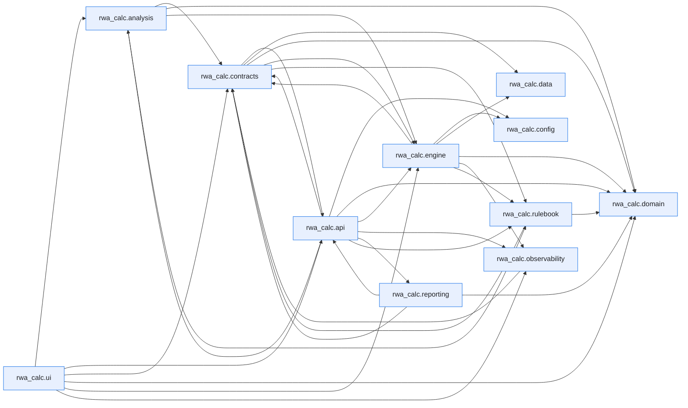

# Module Dependencies

This page is generated by ``scripts/generate_dependency_graph.py`` from the live
import graph of ``src/rwa_calc``, built with the [`curfew`](https://github.com/OpenAfterHours)
dependency tool. It is a snapshot of how the code actually imports itself — not a
hand-drawn design diagram.

Regenerate after structural refactors:

```bash
uv run python scripts/generate_dependency_graph.py
```

Inspect a single module's dependencies and dependents directly:

```bash
uv run curfew report rwa_calc.engine.classifier
```

Last generated: 2026-07-10.


## Package overview

Each node is a top-level subpackage of `rwa_calc`; an arrow `A --> B` means some module in `A` imports some module in `B`. Module-level imports are collapsed to their package here for readability.



## Full module graph

The complete graph, one node per module, exactly as `curfew show --mermaid` emits it.

??? note "Full module-level graph (190 modules)"

    ```mermaid
    flowchart LR
        n0["rwa_calc"]
        n1["rwa_calc.analysis"]
        n2["rwa_calc.analysis.attribution"]
        n3["rwa_calc.analysis.comparison"]
        n4["rwa_calc.analysis.recon_registry"]
        n5["rwa_calc.analysis.reconciliation"]
        n6["rwa_calc.analysis.transition"]
        n7["rwa_calc.api"]
        n8["rwa_calc.api.errors"]
        n9["rwa_calc.api.export"]
        n10["rwa_calc.api.formatters"]
        n11["rwa_calc.api.models"]
        n12["rwa_calc.api.reconciliation"]
        n13["rwa_calc.api.rest"]
        n14["rwa_calc.api.results_cache"]
        n15["rwa_calc.api.service"]
        n16["rwa_calc.api.validation"]
        n17["rwa_calc.config"]
        n18["rwa_calc.config.data_sources"]
        n19["rwa_calc.contracts"]
        n20["rwa_calc.contracts.bundles"]
        n21["rwa_calc.contracts.config"]
        n22["rwa_calc.contracts.context"]
        n23["rwa_calc.contracts.edges"]
        n24["rwa_calc.contracts.errors"]
        n25["rwa_calc.contracts.protocols"]
        n26["rwa_calc.contracts.results"]
        n27["rwa_calc.contracts.validation"]
        n28["rwa_calc.data"]
        n29["rwa_calc.data.column_spec"]
        n30["rwa_calc.data.schemas"]
        n31["rwa_calc.domain"]
        n32["rwa_calc.domain.enums"]
        n33["rwa_calc.engine"]
        n34["rwa_calc.engine.aggregator"]
        n35["rwa_calc.engine.aggregator._collapse"]
        n36["rwa_calc.engine.aggregator._crm_reporting"]
        n37["rwa_calc.engine.aggregator._el_summary"]
        n38["rwa_calc.engine.aggregator._equity_prep"]
        n39["rwa_calc.engine.aggregator._floor"]
        n40["rwa_calc.engine.aggregator._schemas"]
        n41["rwa_calc.engine.aggregator._securitisation"]
        n42["rwa_calc.engine.aggregator._summaries"]
        n43["rwa_calc.engine.aggregator._supporting_factors"]
        n44["rwa_calc.engine.aggregator._utils"]
        n45["rwa_calc.engine.aggregator.aggregator"]
        n46["rwa_calc.engine.ccf"]
        n47["rwa_calc.engine.ccr"]
        n48["rwa_calc.engine.ccr.adjusted_notional"]
        n49["rwa_calc.engine.ccr.ccp"]
        n50["rwa_calc.engine.ccr.default_fund"]
        n51["rwa_calc.engine.ccr.failed_trades"]
        n52["rwa_calc.engine.ccr.hedging_sets"]
        n53["rwa_calc.engine.ccr.maturity_factor"]
        n54["rwa_calc.engine.ccr.pfe"]
        n55["rwa_calc.engine.ccr.pipeline_adapter"]
        n56["rwa_calc.engine.ccr.rc"]
        n57["rwa_calc.engine.ccr.sa_ccr"]
        n58["rwa_calc.engine.ccr.supervisory_delta"]
        n59["rwa_calc.engine.ccr.wwr"]
        n60["rwa_calc.engine.classifier"]
        n61["rwa_calc.engine.crm"]
        n62["rwa_calc.engine.crm.collateral"]
        n63["rwa_calc.engine.crm.expressions"]
        n64["rwa_calc.engine.crm.guarantees"]
        n65["rwa_calc.engine.crm.haircut_tables"]
        n66["rwa_calc.engine.crm.haircuts"]
        n67["rwa_calc.engine.crm.life_insurance"]
        n68["rwa_calc.engine.crm.link_allocation"]
        n69["rwa_calc.engine.crm.look_through"]
        n70["rwa_calc.engine.crm.processor"]
        n71["rwa_calc.engine.crm.provisions"]
        n72["rwa_calc.engine.crm.simple_method"]
        n73["rwa_calc.engine.cva"]
        n74["rwa_calc.engine.cva.ba_cva"]
        n75["rwa_calc.engine.entity_class_maps"]
        n76["rwa_calc.engine.equity"]
        n77["rwa_calc.engine.equity.calculator"]
        n78["rwa_calc.engine.eu_sovereign"]
        n79["rwa_calc.engine.fx_converter"]
        n80["rwa_calc.engine.fx_rate_sync"]
        n81["rwa_calc.engine.hierarchy"]
        n82["rwa_calc.engine.irb"]
        n83["rwa_calc.engine.irb.adjustments"]
        n84["rwa_calc.engine.irb.calculator"]
        n85["rwa_calc.engine.irb.formulas"]
        n86["rwa_calc.engine.irb.guarantee"]
        n87["rwa_calc.engine.irb.stats_backend"]
        n88["rwa_calc.engine.irb.transforms"]
        n89["rwa_calc.engine.kernels"]
        n90["rwa_calc.engine.kernels.allocation"]
        n91["rwa_calc.engine.loader"]
        n92["rwa_calc.engine.materialise"]
        n93["rwa_calc.engine.orchestrator"]
        n94["rwa_calc.engine.pipeline"]
        n95["rwa_calc.engine.re_splitter"]
        n96["rwa_calc.engine.registry"]
        n97["rwa_calc.engine.sa"]
        n98["rwa_calc.engine.sa.b31_risk_weight_tables"]
        n99["rwa_calc.engine.sa.calculator"]
        n100["rwa_calc.engine.sa.crr_risk_weight_tables"]
        n101["rwa_calc.engine.sa.factors_output"]
        n102["rwa_calc.engine.sa.guarantor_rw"]
        n103["rwa_calc.engine.sa.risk_weights"]
        n104["rwa_calc.engine.sa.rw_adjustments"]
        n105["rwa_calc.engine.securitisation"]
        n106["rwa_calc.engine.securitisation.allocator"]
        n107["rwa_calc.engine.sft"]
        n108["rwa_calc.engine.sft.fccm"]
        n109["rwa_calc.engine.slotting"]
        n110["rwa_calc.engine.slotting.calculator"]
        n111["rwa_calc.engine.slotting.transforms"]
        n112["rwa_calc.engine.stages"]
        n113["rwa_calc.engine.stages._ccr_shared"]
        n114["rwa_calc.engine.stages.aggregate"]
        n115["rwa_calc.engine.stages.calc"]
        n116["rwa_calc.engine.stages.ccr"]
        n117["rwa_calc.engine.stages.classify"]
        n118["rwa_calc.engine.stages.classify.approach"]
        n119["rwa_calc.engine.stages.classify.attributes"]
        n120["rwa_calc.engine.stages.classify.audit"]
        n121["rwa_calc.engine.stages.classify.classifier"]
        n122["rwa_calc.engine.stages.classify.permissions"]
        n123["rwa_calc.engine.stages.classify.stage"]
        n124["rwa_calc.engine.stages.classify.subtypes"]
        n125["rwa_calc.engine.stages.crm"]
        n126["rwa_calc.engine.stages.equity"]
        n127["rwa_calc.engine.stages.fx"]
        n128["rwa_calc.engine.stages.fx.conversion"]
        n129["rwa_calc.engine.stages.fx.converter"]
        n130["rwa_calc.engine.stages.hierarchy"]
        n131["rwa_calc.engine.stages.hierarchy.enrich"]
        n132["rwa_calc.engine.stages.hierarchy.facility_undrawn"]
        n133["rwa_calc.engine.stages.hierarchy.graph"]
        n134["rwa_calc.engine.stages.hierarchy.ratings"]
        n135["rwa_calc.engine.stages.hierarchy.resolver"]
        n136["rwa_calc.engine.stages.hierarchy.stage"]
        n137["rwa_calc.engine.stages.hierarchy.unify"]
        n138["rwa_calc.engine.stages.re_split"]
        n139["rwa_calc.engine.stages.re_split.flagging"]
        n140["rwa_calc.engine.stages.re_split.params"]
        n141["rwa_calc.engine.stages.re_split.splitter"]
        n142["rwa_calc.engine.stages.re_split.stage"]
        n143["rwa_calc.engine.stages.securitisation"]
        n144["rwa_calc.engine.stages.sft"]
        n145["rwa_calc.engine.supporting_factors"]
        n146["rwa_calc.engine.thresholds"]
        n147["rwa_calc.engine.utils"]
        n148["rwa_calc.observability"]
        n149["rwa_calc.observability.audit_cache"]
        n150["rwa_calc.observability.context"]
        n151["rwa_calc.observability.formatters"]
        n152["rwa_calc.observability.logging_setup"]
        n153["rwa_calc.reporting"]
        n154["rwa_calc.reporting.corep"]
        n155["rwa_calc.reporting.corep.generator"]
        n156["rwa_calc.reporting.corep.templates"]
        n157["rwa_calc.reporting.kernel"]
        n158["rwa_calc.reporting.kernel.columns"]
        n159["rwa_calc.reporting.kernel.excel"]
        n160["rwa_calc.reporting.kernel.filters"]
        n161["rwa_calc.reporting.kernel.rows"]
        n162["rwa_calc.reporting.kernel.sums"]
        n163["rwa_calc.reporting.pillar3"]
        n164["rwa_calc.reporting.pillar3.generator"]
        n165["rwa_calc.reporting.pillar3.templates"]
        n166["rwa_calc.rulebook"]
        n167["rwa_calc.rulebook.audit"]
        n168["rwa_calc.rulebook.compile"]
        n169["rwa_calc.rulebook.model"]
        n170["rwa_calc.rulebook.packs"]
        n171["rwa_calc.rulebook.packs.b31"]
        n172["rwa_calc.rulebook.packs.common"]
        n173["rwa_calc.rulebook.packs.crr"]
        n174["rwa_calc.rulebook.registry"]
        n175["rwa_calc.rulebook.resolve"]
        n176["rwa_calc.rulebook.v0"]
        n177["rwa_calc.ui"]
        n178["rwa_calc.ui.app"]
        n179["rwa_calc.ui.app.calculator_state"]
        n180["rwa_calc.ui.app.main"]
        n181["rwa_calc.ui.app.output_writer"]
        n182["rwa_calc.ui.app.progress"]
        n183["rwa_calc.ui.app.recon_signoff"]
        n184["rwa_calc.ui.app.recon_state"]
        n185["rwa_calc.ui.views"]
        n186["rwa_calc.ui.views.charts"]
        n187["rwa_calc.ui.views.comparison"]
        n188["rwa_calc.ui.views.method_split"]
        n189["rwa_calc.ui.views.reconciliation"]
        n2 --> n20
        n3 --> n2
        n3 --> n20
        n3 --> n21
        n3 --> n42
        n3 --> n94
        n3 --> n166
        n3 --> n175
        n5 --> n4
        n5 --> n20
        n5 --> n24
        n5 --> n35
        n5 --> n42
        n6 --> n20
        n6 --> n21
        n6 --> n32
        n6 --> n94
        n7 --> n4
        n7 --> n9
        n7 --> n11
        n7 --> n12
        n7 --> n13
        n7 --> n14
        n7 --> n15
        n7 --> n16
        n8 --> n11
        n8 --> n24
        n9 --> n11
        n9 --> n21
        n9 --> n26
        n9 --> n155
        n9 --> n164
        n10 --> n8
        n10 --> n11
        n10 --> n14
        n10 --> n20
        n11 --> n5
        n11 --> n8
        n11 --> n9
        n11 --> n20
        n12 --> n4
        n13 --> n11
        n13 --> n12
        n13 --> n15
        n13 --> n16
        n15 --> n5
        n15 --> n8
        n15 --> n10
        n15 --> n11
        n15 --> n12
        n15 --> n14
        n15 --> n16
        n15 --> n20
        n15 --> n21
        n15 --> n25
        n15 --> n32
        n15 --> n91
        n15 --> n94
        n15 --> n148
        n15 --> n166
        n16 --> n8
        n16 --> n11
        n16 --> n18
        n19 --> n20
        n19 --> n21
        n19 --> n23
        n19 --> n24
        n19 --> n25
        n19 --> n27
        n19 --> n32
        n20 --> n23
        n20 --> n24
        n20 --> n32
        n21 --> n32
        n23 --> n29
        n23 --> n30
        n24 --> n32
        n25 --> n11
        n25 --> n20
        n25 --> n21
        n25 --> n24
        n25 --> n26
        n25 --> n68
        n25 --> n175
        n27 --> n20
        n27 --> n24
        n27 --> n29
        n27 --> n30
        n30 --> n29
        n31 --> n32
        n33 --> n81
        n33 --> n91
        n33 --> n94
        n34 --> n45
        n35 --> n30
        n36 --> n32
        n36 --> n40
        n36 --> n44
        n37 --> n20
        n37 --> n40
        n37 --> n44
        n38 --> n32
        n39 --> n20
        n39 --> n40
        n39 --> n44
        n39 --> n168
        n39 --> n175
        n43 --> n40
        n43 --> n44
        n45 --> n20
        n45 --> n21
        n45 --> n23
        n45 --> n24
        n45 --> n32
        n45 --> n36
        n45 --> n37
        n45 --> n38
        n45 --> n39
        n45 --> n40
        n45 --> n41
        n45 --> n42
        n45 --> n43
        n45 --> n166
        n45 --> n175
        n46 --> n21
        n46 --> n30
        n46 --> n32
        n46 --> n166
        n46 --> n168
        n46 --> n175
        n47 --> n48
        n47 --> n52
        n47 --> n53
        n47 --> n54
        n47 --> n55
        n47 --> n56
        n47 --> n57
        n47 --> n58
        n47 --> n59
        n48 --> n168
        n48 --> n175
        n49 --> n168
        n49 --> n175
        n50 --> n21
        n50 --> n168
        n50 --> n175
        n51 --> n21
        n51 --> n168
        n51 --> n175
        n52 --> n30
        n53 --> n168
        n53 --> n175
        n54 --> n21
        n54 --> n29
        n54 --> n30
        n54 --> n56
        n54 --> n168
        n54 --> n175
        n55 --> n20
        n55 --> n21
        n55 --> n24
        n55 --> n29
        n55 --> n30
        n55 --> n32
        n55 --> n48
        n55 --> n52
        n55 --> n53
        n55 --> n54
        n55 --> n56
        n55 --> n58
        n55 --> n168
        n55 --> n175
        n57 --> n20
        n57 --> n21
        n57 --> n24
        n57 --> n32
        n58 --> n87
        n58 --> n168
        n58 --> n175
        n59 --> n20
        n59 --> n24
        n59 --> n29
        n59 --> n30
        n59 --> n32
        n59 --> n168
        n59 --> n175
        n60 --> n117
        n61 --> n66
        n61 --> n67
        n61 --> n70
        n62 --> n21
        n62 --> n30
        n62 --> n32
        n62 --> n63
        n62 --> n66
        n62 --> n149
        n62 --> n166
        n62 --> n168
        n62 --> n175
        n63 --> n30
        n63 --> n90
        n63 --> n168
        n63 --> n175
        n64 --> n21
        n64 --> n29
        n64 --> n30
        n64 --> n32
        n64 --> n46
        n64 --> n75
        n64 --> n78
        n64 --> n90
        n64 --> n147
        n64 --> n166
        n64 --> n168
        n64 --> n175
        n65 --> n175
        n66 --> n21
        n66 --> n29
        n66 --> n30
        n66 --> n65
        n66 --> n166
        n66 --> n168
        n66 --> n175
        n67 --> n21
        n67 --> n30
        n67 --> n175
        n68 --> n21
        n68 --> n24
        n68 --> n63
        n68 --> n90
        n69 --> n24
        n69 --> n29
        n70 --> n20
        n70 --> n21
        n70 --> n23
        n70 --> n24
        n70 --> n32
        n70 --> n46
        n70 --> n62
        n70 --> n63
        n70 --> n64
        n70 --> n66
        n70 --> n67
        n70 --> n68
        n70 --> n69
        n70 --> n71
        n70 --> n72
        n70 --> n90
        n70 --> n92
        n70 --> n103
        n70 --> n147
        n70 --> n149
        n70 --> n175
        n71 --> n21
        n71 --> n32
        n71 --> n46
        n71 --> n90
        n71 --> n166
        n71 --> n175
        n72 --> n21
        n72 --> n32
        n72 --> n98
        n72 --> n100
        n72 --> n166
        n72 --> n168
        n72 --> n175
        n73 --> n74
        n74 --> n168
        n74 --> n175
        n75 --> n175
        n76 --> n77
        n77 --> n20
        n77 --> n21
        n77 --> n24
        n77 --> n29
        n77 --> n32
        n77 --> n85
        n77 --> n98
        n77 --> n100
        n77 --> n166
        n77 --> n168
        n77 --> n175
        n78 --> n175
        n79 --> n129
        n81 --> n130
        n82 --> n84
        n82 --> n85
        n83 --> n21
        n83 --> n24
        n83 --> n166
        n83 --> n175
        n84 --> n21
        n84 --> n24
        n84 --> n88
        n84 --> n145
        n84 --> n166
        n84 --> n175
        n85 --> n21
        n85 --> n32
        n85 --> n83
        n85 --> n87
        n85 --> n146
        n85 --> n166
        n85 --> n168
        n85 --> n175
        n86 --> n21
        n86 --> n64
        n86 --> n75
        n86 --> n78
        n86 --> n85
        n86 --> n102
        n86 --> n146
        n86 --> n166
        n86 --> n168
        n86 --> n175
        n88 --> n21
        n88 --> n24
        n88 --> n29
        n88 --> n32
        n88 --> n83
        n88 --> n85
        n88 --> n86
        n88 --> n146
        n88 --> n147
        n88 --> n166
        n88 --> n168
        n88 --> n175
        n89 --> n90
        n90 --> n30
        n90 --> n147
        n91 --> n18
        n91 --> n20
        n91 --> n23
        n91 --> n24
        n91 --> n25
        n91 --> n27
        n91 --> n29
        n91 --> n30
        n91 --> n147
        n92 --> n21
        n92 --> n23
        n93 --> n20
        n93 --> n21
        n93 --> n22
        n93 --> n23
        n93 --> n24
        n93 --> n25
        n93 --> n34
        n93 --> n70
        n93 --> n77
        n93 --> n84
        n93 --> n99
        n93 --> n106
        n93 --> n110
        n93 --> n117
        n93 --> n130
        n93 --> n138
        n93 --> n148
        n93 --> n166
        n94 --> n20
        n94 --> n21
        n94 --> n22
        n94 --> n25
        n94 --> n32
        n94 --> n80
        n94 --> n91
        n94 --> n92
        n94 --> n93
        n94 --> n96
        n94 --> n148
        n94 --> n149
        n94 --> n166
        n94 --> n167
        n95 --> n138
        n96 --> n93
        n96 --> n114
        n96 --> n115
        n96 --> n116
        n96 --> n117
        n96 --> n125
        n96 --> n126
        n96 --> n130
        n96 --> n138
        n96 --> n143
        n96 --> n144
        n97 --> n99
        n98 --> n32
        n98 --> n100
        n98 --> n175
        n99 --> n21
        n99 --> n24
        n99 --> n32
        n99 --> n101
        n99 --> n103
        n99 --> n104
        n99 --> n166
        n99 --> n175
        n100 --> n32
        n100 --> n175
        n101 --> n21
        n101 --> n24
        n101 --> n29
        n101 --> n145
        n101 --> n175
        n102 --> n32
        n102 --> n75
        n102 --> n168
        n102 --> n175
        n103 --> n21
        n103 --> n29
        n103 --> n30
        n103 --> n32
        n103 --> n78
        n103 --> n98
        n103 --> n100
        n103 --> n102
        n103 --> n166
        n103 --> n168
        n103 --> n175
        n104 --> n21
        n104 --> n24
        n104 --> n32
        n104 --> n64
        n104 --> n75
        n104 --> n78
        n104 --> n102
        n104 --> n103
        n104 --> n166
        n104 --> n175
        n105 --> n106
        n106 --> n20
        n106 --> n21
        n106 --> n24
        n106 --> n32
        n107 --> n108
        n108 --> n20
        n108 --> n65
        n108 --> n175
        n109 --> n110
        n110 --> n21
        n110 --> n24
        n110 --> n111
        n110 --> n145
        n110 --> n166
        n110 --> n175
        n111 --> n21
        n111 --> n24
        n111 --> n147
        n111 --> n166
        n111 --> n168
        n111 --> n169
        n111 --> n175
        n113 --> n20
        n114 --> n21
        n114 --> n22
        n114 --> n23
        n114 --> n73
        n114 --> n93
        n114 --> n166
        n115 --> n21
        n115 --> n22
        n115 --> n23
        n115 --> n24
        n115 --> n29
        n115 --> n32
        n115 --> n40
        n115 --> n92
        n115 --> n93
        n115 --> n145
        n115 --> n166
        n116 --> n21
        n116 --> n22
        n116 --> n23
        n116 --> n47
        n116 --> n50
        n116 --> n51
        n116 --> n92
        n116 --> n93
        n116 --> n113
        n116 --> n166
        n117 --> n121
        n117 --> n123
        n118 --> n21
        n118 --> n30
        n118 --> n32
        n118 --> n78
        n118 --> n122
        n118 --> n146
        n118 --> n166
        n118 --> n175
        n119 --> n21
        n119 --> n32
        n119 --> n75
        n119 --> n146
        n119 --> n147
        n119 --> n166
        n119 --> n175
        n120 --> n20
        n120 --> n21
        n120 --> n24
        n120 --> n146
        n120 --> n166
        n120 --> n175
        n121 --> n20
        n121 --> n21
        n121 --> n23
        n121 --> n24
        n121 --> n92
        n121 --> n118
        n121 --> n119
        n121 --> n120
        n121 --> n122
        n121 --> n124
        n121 --> n139
        n121 --> n166
        n121 --> n175
        n122 --> n21
        n122 --> n24
        n122 --> n32
        n123 --> n21
        n123 --> n22
        n123 --> n93
        n123 --> n149
        n123 --> n166
        n124 --> n21
        n124 --> n30
        n124 --> n32
        n124 --> n119
        n124 --> n146
        n124 --> n147
        n124 --> n166
        n124 --> n175
        n125 --> n21
        n125 --> n22
        n125 --> n93
        n125 --> n166
        n126 --> n21
        n126 --> n22
        n126 --> n93
        n126 --> n149
        n126 --> n166
        n127 --> n128
        n127 --> n129
        n128 --> n21
        n128 --> n129
        n129 --> n21
        n130 --> n135
        n130 --> n136
        n131 --> n20
        n131 --> n90
        n131 --> n147
        n132 --> n20
        n132 --> n21
        n132 --> n46
        n132 --> n102
        n132 --> n133
        n132 --> n147
        n133 --> n20
        n133 --> n23
        n133 --> n24
        n133 --> n32
        n133 --> n134
        n133 --> n147
        n135 --> n20
        n135 --> n21
        n135 --> n23
        n135 --> n24
        n135 --> n127
        n135 --> n131
        n135 --> n132
        n135 --> n133
        n135 --> n134
        n135 --> n137
        n136 --> n21
        n136 --> n22
        n136 --> n23
        n136 --> n92
        n136 --> n93
        n136 --> n106
        n136 --> n149
        n136 --> n166
        n137 --> n20
        n137 --> n21
        n137 --> n24
        n137 --> n131
        n137 --> n132
        n137 --> n133
        n138 --> n139
        n138 --> n141
        n138 --> n142
        n139 --> n21
        n139 --> n32
        n139 --> n166
        n139 --> n175
        n140 --> n168
        n140 --> n175
        n141 --> n20
        n141 --> n21
        n141 --> n23
        n141 --> n24
        n141 --> n32
        n141 --> n140
        n141 --> n166
        n141 --> n175
        n142 --> n21
        n142 --> n22
        n142 --> n23
        n142 --> n92
        n142 --> n93
        n142 --> n149
        n142 --> n166
        n143 --> n21
        n143 --> n22
        n143 --> n93
        n143 --> n166
        n144 --> n21
        n144 --> n22
        n144 --> n23
        n144 --> n92
        n144 --> n93
        n144 --> n108
        n144 --> n113
        n144 --> n166
        n145 --> n21
        n145 --> n24
        n145 --> n32
        n145 --> n146
        n145 --> n166
        n145 --> n168
        n145 --> n175
        n146 --> n175
        n148 --> n149
        n148 --> n150
        n148 --> n151
        n148 --> n152
        n149 --> n21
        n149 --> n150
        n152 --> n150
        n152 --> n151
        n153 --> n155
        n153 --> n164
        n154 --> n155
        n154 --> n156
        n155 --> n11
        n155 --> n20
        n155 --> n21
        n155 --> n26
        n155 --> n32
        n155 --> n156
        n155 --> n157
        n157 --> n158
        n157 --> n159
        n157 --> n160
        n157 --> n161
        n157 --> n162
        n160 --> n158
        n163 --> n164
        n164 --> n15
        n164 --> n20
        n164 --> n21
        n164 --> n26
        n164 --> n157
        n164 --> n165
        n166 --> n176
        n167 --> n175
        n168 --> n169
        n171 --> n32
        n171 --> n169
        n172 --> n32
        n172 --> n169
        n173 --> n32
        n173 --> n169
        n174 --> n32
        n175 --> n169
        n175 --> n174
        n176 --> n21
        n176 --> n32
        n176 --> n174
        n176 --> n175
        n180 --> n3
        n180 --> n11
        n180 --> n12
        n180 --> n13
        n180 --> n15
        n180 --> n16
        n180 --> n21
        n180 --> n32
        n180 --> n91
        n180 --> n148
        n180 --> n179
        n180 --> n181
        n180 --> n182
        n180 --> n183
        n180 --> n184
        n180 --> n186
        n180 --> n187
        n180 --> n188
        n180 --> n189
        n181 --> n11
        n181 --> n26
        n182 --> n96
        n187 --> n20
        n188 --> n186
        n189 --> n4
        n189 --> n5
        n189 --> n11
        n189 --> n183
        n189 --> n188
        classDef first_party fill:#e8f0fe,stroke:#1a73e8,color:#202124
        class n0,n1,n2,n3,n4,n5,n6,n7,n8,n9,n10,n11,n12,n13,n14,n15,n16,n17,n18,n19,n20,n21,n22,n23,n24,n25,n26,n27,n28,n29,n30,n31,n32,n33,n34,n35,n36,n37,n38,n39,n40,n41,n42,n43,n44,n45,n46,n47,n48,n49,n50,n51,n52,n53,n54,n55,n56,n57,n58,n59,n60,n61,n62,n63,n64,n65,n66,n67,n68,n69,n70,n71,n72,n73,n74,n75,n76,n77,n78,n79,n80,n81,n82,n83,n84,n85,n86,n87,n88,n89,n90,n91,n92,n93,n94,n95,n96,n97,n98,n99,n100,n101,n102,n103,n104,n105,n106,n107,n108,n109,n110,n111,n112,n113,n114,n115,n116,n117,n118,n119,n120,n121,n122,n123,n124,n125,n126,n127,n128,n129,n130,n131,n132,n133,n134,n135,n136,n137,n138,n139,n140,n141,n142,n143,n144,n145,n146,n147,n148,n149,n150,n151,n152,n153,n154,n155,n156,n157,n158,n159,n160,n161,n162,n163,n164,n165,n166,n167,n168,n169,n170,n171,n172,n173,n174,n175,n176,n177,n178,n179,n180,n181,n182,n183,n184,n185,n186,n187,n188,n189 first_party
    ```

