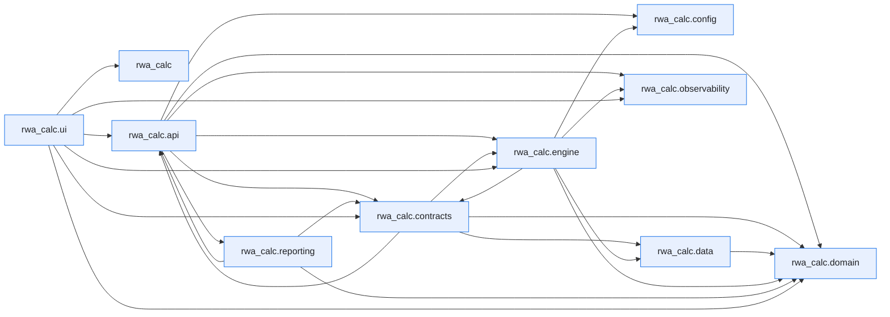

# Module Dependencies

This page is generated by ``scripts/generate_dependency_graph.py`` from the live
import graph of ``src/rwa_calc``, built with the [`curfew`](https://github.com/OpenAfterHours)
dependency tool. It is a snapshot of how the code actually imports itself — not a
hand-drawn design diagram.

Regenerate after structural refactors:

```bash
uv run python scripts/generate_dependency_graph.py
```

Inspect a single module's dependencies and dependents directly:

```bash
uv run curfew report rwa_calc.engine.classifier
```

Last generated: 2026-06-07.


## Package overview

Each node is a top-level subpackage of `rwa_calc`; an arrow `A --> B` means some module in `A` imports some module in `B`. Module-level imports are collapsed to their package here for readability.



## Full module graph

The complete graph, one node per module, exactly as `curfew show --mermaid` emits it.

??? note "Full module-level graph (144 modules)"

    ```mermaid
    flowchart LR
        n0["rwa_calc"]
        n1["rwa_calc.api"]
        n2["rwa_calc.api.errors"]
        n3["rwa_calc.api.export"]
        n4["rwa_calc.api.formatters"]
        n5["rwa_calc.api.models"]
        n6["rwa_calc.api.results_cache"]
        n7["rwa_calc.api.service"]
        n8["rwa_calc.api.validation"]
        n9["rwa_calc.config"]
        n10["rwa_calc.config.data_sources"]
        n11["rwa_calc.config.fx_rates"]
        n12["rwa_calc.contracts"]
        n13["rwa_calc.contracts.bundles"]
        n14["rwa_calc.contracts.config"]
        n15["rwa_calc.contracts.errors"]
        n16["rwa_calc.contracts.protocols"]
        n17["rwa_calc.contracts.validation"]
        n18["rwa_calc.data"]
        n19["rwa_calc.data.column_spec"]
        n20["rwa_calc.data.schemas"]
        n21["rwa_calc.data.tables"]
        n22["rwa_calc.data.tables.airb_floors"]
        n23["rwa_calc.data.tables.b31_equity_rw"]
        n24["rwa_calc.data.tables.b31_risk_weights"]
        n25["rwa_calc.data.tables.b31_slotting"]
        n26["rwa_calc.data.tables.ccf"]
        n27["rwa_calc.data.tables.crm_supervisory"]
        n28["rwa_calc.data.tables.crr_equity_pd_lgd"]
        n29["rwa_calc.data.tables.crr_equity_rw"]
        n30["rwa_calc.data.tables.crr_risk_weights"]
        n31["rwa_calc.data.tables.crr_simple_method"]
        n32["rwa_calc.data.tables.crr_slotting"]
        n33["rwa_calc.data.tables.entity_class_mapping"]
        n34["rwa_calc.data.tables.eu_sovereign"]
        n35["rwa_calc.data.tables.failed_trades_multipliers"]
        n36["rwa_calc.data.tables.firb_lgd"]
        n37["rwa_calc.data.tables.haircuts"]
        n38["rwa_calc.data.tables.output_floor"]
        n39["rwa_calc.data.tables.re_split_parameters"]
        n40["rwa_calc.data.tables.sa_ccr_factors"]
        n41["rwa_calc.domain"]
        n42["rwa_calc.domain.enums"]
        n43["rwa_calc.engine"]
        n44["rwa_calc.engine.aggregator"]
        n45["rwa_calc.engine.aggregator._crm_reporting"]
        n46["rwa_calc.engine.aggregator._el_summary"]
        n47["rwa_calc.engine.aggregator._equity_prep"]
        n48["rwa_calc.engine.aggregator._floor"]
        n49["rwa_calc.engine.aggregator._schemas"]
        n50["rwa_calc.engine.aggregator._securitisation"]
        n51["rwa_calc.engine.aggregator._summaries"]
        n52["rwa_calc.engine.aggregator._supporting_factors"]
        n53["rwa_calc.engine.aggregator._utils"]
        n54["rwa_calc.engine.aggregator.aggregator"]
        n55["rwa_calc.engine.ccf"]
        n56["rwa_calc.engine.ccr"]
        n57["rwa_calc.engine.ccr.adjusted_notional"]
        n58["rwa_calc.engine.ccr.ccp"]
        n59["rwa_calc.engine.ccr.failed_trades"]
        n60["rwa_calc.engine.ccr.hedging_sets"]
        n61["rwa_calc.engine.ccr.maturity_factor"]
        n62["rwa_calc.engine.ccr.namespace"]
        n63["rwa_calc.engine.ccr.pfe"]
        n64["rwa_calc.engine.ccr.pipeline_adapter"]
        n65["rwa_calc.engine.ccr.rc"]
        n66["rwa_calc.engine.ccr.sa_ccr"]
        n67["rwa_calc.engine.ccr.sft_fccm"]
        n68["rwa_calc.engine.ccr.supervisory_delta"]
        n69["rwa_calc.engine.ccr.wwr"]
        n70["rwa_calc.engine.classifier"]
        n71["rwa_calc.engine.comparison"]
        n72["rwa_calc.engine.crm"]
        n73["rwa_calc.engine.crm.collateral"]
        n74["rwa_calc.engine.crm.expressions"]
        n75["rwa_calc.engine.crm.guarantees"]
        n76["rwa_calc.engine.crm.haircuts"]
        n77["rwa_calc.engine.crm.life_insurance"]
        n78["rwa_calc.engine.crm.link_allocation"]
        n79["rwa_calc.engine.crm.look_through"]
        n80["rwa_calc.engine.crm.processor"]
        n81["rwa_calc.engine.crm.provisions"]
        n82["rwa_calc.engine.crm.simple_method"]
        n83["rwa_calc.engine.equity"]
        n84["rwa_calc.engine.equity.calculator"]
        n85["rwa_calc.engine.fx_converter"]
        n86["rwa_calc.engine.fx_rate_sync"]
        n87["rwa_calc.engine.hierarchy"]
        n88["rwa_calc.engine.irb"]
        n89["rwa_calc.engine.irb.adjustments"]
        n90["rwa_calc.engine.irb.calculator"]
        n91["rwa_calc.engine.irb.formulas"]
        n92["rwa_calc.engine.irb.guarantee"]
        n93["rwa_calc.engine.irb.namespace"]
        n94["rwa_calc.engine.irb.stats_backend"]
        n95["rwa_calc.engine.loader"]
        n96["rwa_calc.engine.materialise"]
        n97["rwa_calc.engine.pipeline"]
        n98["rwa_calc.engine.re_splitter"]
        n99["rwa_calc.engine.sa"]
        n100["rwa_calc.engine.sa.calculator"]
        n101["rwa_calc.engine.sa.namespace"]
        n102["rwa_calc.engine.securitisation"]
        n103["rwa_calc.engine.securitisation.allocator"]
        n104["rwa_calc.engine.slotting"]
        n105["rwa_calc.engine.slotting.calculator"]
        n106["rwa_calc.engine.slotting.namespace"]
        n107["rwa_calc.engine.supporting_factors"]
        n108["rwa_calc.engine.utils"]
        n109["rwa_calc.observability"]
        n110["rwa_calc.observability.context"]
        n111["rwa_calc.observability.formatters"]
        n112["rwa_calc.observability.logging_setup"]
        n113["rwa_calc.reporting"]
        n114["rwa_calc.reporting.corep"]
        n115["rwa_calc.reporting.corep.generator"]
        n116["rwa_calc.reporting.corep.templates"]
        n117["rwa_calc.reporting.pillar3"]
        n118["rwa_calc.reporting.pillar3.generator"]
        n119["rwa_calc.reporting.pillar3.templates"]
        n120["rwa_calc.ui"]
        n121["rwa_calc.ui.marimo"]
        n122["rwa_calc.ui.marimo.comparison_app"]
        n123["rwa_calc.ui.marimo.git_ops"]
        n124["rwa_calc.ui.marimo.landing_app"]
        n125["rwa_calc.ui.marimo.results_explorer"]
        n126["rwa_calc.ui.marimo.rwa_app"]
        n127["rwa_calc.ui.marimo.server"]
        n128["rwa_calc.ui.marimo.shared"]
        n129["rwa_calc.ui.marimo.shared.sidebar"]
        n130["rwa_calc.ui.marimo.workbench_app"]
        n131["rwa_calc.ui.marimo.workspaces"]
        n132["rwa_calc.ui.marimo.workspaces.local"]
        n133["rwa_calc.ui.marimo.workspaces.local.book_1"]
        n134["rwa_calc.ui.marimo.workspaces.local.df"]
        n135["rwa_calc.ui.marimo.workspaces.local.my_workbook"]
        n136["rwa_calc.ui.marimo.workspaces.local.my_workbook_1"]
        n137["rwa_calc.ui.marimo.workspaces.local.my_workbook_2"]
        n138["rwa_calc.ui.marimo.workspaces.local.new_folder"]
        n139["rwa_calc.ui.marimo.workspaces.local.new_folder.my_workbook"]
        n140["rwa_calc.ui.marimo.workspaces.local.test_book"]
        n141["rwa_calc.ui.marimo.workspaces.local.tests"]
        n142["rwa_calc.ui.marimo.workspaces.templates"]
        n143["rwa_calc.ui.marimo.workspaces.templates.starter"]
        n1 --> n3
        n1 --> n5
        n1 --> n6
        n1 --> n7
        n1 --> n8
        n2 --> n5
        n2 --> n15
        n3 --> n5
        n3 --> n14
        n3 --> n115
        n3 --> n118
        n4 --> n2
        n4 --> n5
        n4 --> n6
        n4 --> n13
        n5 --> n3
        n7 --> n2
        n7 --> n4
        n7 --> n5
        n7 --> n6
        n7 --> n8
        n7 --> n14
        n7 --> n16
        n7 --> n42
        n7 --> n95
        n7 --> n97
        n7 --> n109
        n8 --> n2
        n8 --> n5
        n8 --> n10
        n9 --> n11
        n12 --> n13
        n12 --> n14
        n12 --> n15
        n12 --> n16
        n12 --> n17
        n12 --> n42
        n13 --> n15
        n13 --> n42
        n14 --> n42
        n15 --> n42
        n16 --> n3
        n16 --> n5
        n16 --> n13
        n16 --> n14
        n16 --> n15
        n16 --> n78
        n17 --> n13
        n17 --> n15
        n17 --> n19
        n17 --> n20
        n20 --> n19
        n21 --> n23
        n21 --> n24
        n21 --> n25
        n21 --> n29
        n21 --> n30
        n21 --> n32
        n21 --> n33
        n21 --> n34
        n21 --> n36
        n21 --> n37
        n21 --> n39
        n23 --> n42
        n24 --> n30
        n24 --> n42
        n25 --> n42
        n26 --> n20
        n27 --> n36
        n29 --> n42
        n30 --> n24
        n30 --> n42
        n32 --> n42
        n33 --> n42
        n39 --> n42
        n41 --> n42
        n43 --> n71
        n43 --> n87
        n43 --> n95
        n43 --> n97
        n44 --> n54
        n45 --> n49
        n45 --> n53
        n46 --> n13
        n46 --> n49
        n46 --> n53
        n47 --> n42
        n48 --> n13
        n48 --> n38
        n48 --> n49
        n48 --> n53
        n52 --> n49
        n52 --> n53
        n54 --> n13
        n54 --> n14
        n54 --> n45
        n54 --> n46
        n54 --> n47
        n54 --> n48
        n54 --> n49
        n54 --> n50
        n54 --> n51
        n54 --> n52
        n55 --> n14
        n55 --> n22
        n55 --> n26
        n55 --> n42
        n56 --> n57
        n56 --> n60
        n56 --> n61
        n56 --> n62
        n56 --> n63
        n56 --> n64
        n56 --> n65
        n56 --> n66
        n56 --> n68
        n57 --> n40
        n58 --> n30
        n59 --> n14
        n59 --> n35
        n60 --> n20
        n61 --> n40
        n62 --> n57
        n62 --> n61
        n62 --> n65
        n62 --> n66
        n62 --> n68
        n63 --> n14
        n63 --> n19
        n63 --> n20
        n63 --> n40
        n63 --> n65
        n64 --> n13
        n64 --> n14
        n64 --> n57
        n64 --> n60
        n64 --> n61
        n64 --> n63
        n64 --> n65
        n64 --> n67
        n64 --> n68
        n66 --> n13
        n66 --> n14
        n66 --> n15
        n66 --> n42
        n67 --> n13
        n67 --> n37
        n68 --> n40
        n68 --> n94
        n69 --> n13
        n69 --> n15
        n69 --> n19
        n69 --> n20
        n69 --> n40
        n69 --> n42
        n70 --> n13
        n70 --> n14
        n70 --> n15
        n70 --> n19
        n70 --> n20
        n70 --> n24
        n70 --> n33
        n70 --> n34
        n70 --> n42
        n70 --> n96
        n70 --> n108
        n71 --> n13
        n71 --> n14
        n71 --> n36
        n71 --> n42
        n71 --> n97
        n72 --> n76
        n72 --> n77
        n72 --> n80
        n73 --> n14
        n73 --> n20
        n73 --> n27
        n73 --> n42
        n73 --> n74
        n73 --> n76
        n73 --> n96
        n74 --> n20
        n74 --> n27
        n75 --> n14
        n75 --> n19
        n75 --> n20
        n75 --> n33
        n75 --> n34
        n75 --> n37
        n75 --> n42
        n75 --> n55
        n75 --> n108
        n76 --> n14
        n76 --> n19
        n76 --> n20
        n76 --> n27
        n76 --> n37
        n77 --> n14
        n77 --> n20
        n78 --> n14
        n78 --> n15
        n78 --> n74
        n79 --> n15
        n79 --> n19
        n80 --> n13
        n80 --> n14
        n80 --> n15
        n80 --> n20
        n80 --> n42
        n80 --> n55
        n80 --> n73
        n80 --> n74
        n80 --> n75
        n80 --> n76
        n80 --> n77
        n80 --> n78
        n80 --> n79
        n80 --> n81
        n80 --> n82
        n80 --> n96
        n80 --> n101
        n80 --> n108
        n81 --> n14
        n81 --> n20
        n81 --> n42
        n81 --> n55
        n82 --> n14
        n82 --> n24
        n82 --> n30
        n82 --> n31
        n82 --> n42
        n83 --> n84
        n84 --> n13
        n84 --> n14
        n84 --> n15
        n84 --> n19
        n84 --> n23
        n84 --> n24
        n84 --> n28
        n84 --> n29
        n84 --> n30
        n84 --> n42
        n84 --> n91
        n85 --> n14
        n87 --> n13
        n87 --> n14
        n87 --> n15
        n87 --> n19
        n87 --> n20
        n87 --> n30
        n87 --> n33
        n87 --> n42
        n87 --> n55
        n87 --> n85
        n87 --> n108
        n88 --> n90
        n88 --> n91
        n88 --> n93
        n89 --> n14
        n89 --> n15
        n90 --> n13
        n90 --> n14
        n90 --> n15
        n90 --> n93
        n90 --> n107
        n91 --> n14
        n91 --> n42
        n91 --> n89
        n91 --> n94
        n92 --> n14
        n92 --> n30
        n92 --> n33
        n92 --> n34
        n92 --> n36
        n92 --> n75
        n92 --> n91
        n93 --> n14
        n93 --> n19
        n93 --> n36
        n93 --> n42
        n93 --> n89
        n93 --> n91
        n93 --> n92
        n93 --> n108
        n95 --> n10
        n95 --> n13
        n95 --> n15
        n95 --> n16
        n95 --> n17
        n95 --> n19
        n95 --> n20
        n95 --> n108
        n96 --> n14
        n96 --> n110
        n97 --> n13
        n97 --> n14
        n97 --> n15
        n97 --> n16
        n97 --> n42
        n97 --> n44
        n97 --> n56
        n97 --> n70
        n97 --> n80
        n97 --> n84
        n97 --> n86
        n97 --> n87
        n97 --> n90
        n97 --> n95
        n97 --> n96
        n97 --> n98
        n97 --> n100
        n97 --> n103
        n97 --> n105
        n97 --> n107
        n97 --> n109
        n98 --> n13
        n98 --> n14
        n98 --> n15
        n98 --> n39
        n98 --> n42
        n99 --> n100
        n99 --> n101
        n100 --> n13
        n100 --> n14
        n100 --> n15
        n100 --> n42
        n100 --> n101
        n101 --> n14
        n101 --> n15
        n101 --> n19
        n101 --> n20
        n101 --> n23
        n101 --> n24
        n101 --> n29
        n101 --> n30
        n101 --> n33
        n101 --> n34
        n101 --> n42
        n101 --> n75
        n101 --> n107
        n102 --> n103
        n103 --> n13
        n103 --> n14
        n103 --> n15
        n103 --> n42
        n104 --> n105
        n104 --> n106
        n105 --> n13
        n105 --> n14
        n105 --> n15
        n105 --> n19
        n105 --> n107
        n106 --> n14
        n106 --> n15
        n106 --> n25
        n106 --> n32
        n106 --> n42
        n106 --> n108
        n107 --> n14
        n107 --> n15
        n107 --> n42
        n109 --> n110
        n109 --> n111
        n109 --> n112
        n112 --> n110
        n112 --> n111
        n113 --> n115
        n113 --> n118
        n114 --> n115
        n114 --> n116
        n115 --> n3
        n115 --> n5
        n115 --> n13
        n115 --> n14
        n115 --> n42
        n115 --> n116
        n117 --> n118
        n118 --> n3
        n118 --> n7
        n118 --> n13
        n118 --> n14
        n118 --> n119
        n122 --> n1
        n122 --> n14
        n122 --> n42
        n122 --> n71
        n122 --> n95
        n126 --> n1
        n127 --> n109
        n127 --> n123
        n129 --> n0
        n130 --> n123
        n134 --> n129
        n135 --> n129
        n136 --> n129
        n137 --> n129
        n141 --> n129
        n143 --> n129
        classDef first_party fill:#e8f0fe,stroke:#1a73e8,color:#202124
        class n0,n1,n2,n3,n4,n5,n6,n7,n8,n9,n10,n11,n12,n13,n14,n15,n16,n17,n18,n19,n20,n21,n22,n23,n24,n25,n26,n27,n28,n29,n30,n31,n32,n33,n34,n35,n36,n37,n38,n39,n40,n41,n42,n43,n44,n45,n46,n47,n48,n49,n50,n51,n52,n53,n54,n55,n56,n57,n58,n59,n60,n61,n62,n63,n64,n65,n66,n67,n68,n69,n70,n71,n72,n73,n74,n75,n76,n77,n78,n79,n80,n81,n82,n83,n84,n85,n86,n87,n88,n89,n90,n91,n92,n93,n94,n95,n96,n97,n98,n99,n100,n101,n102,n103,n104,n105,n106,n107,n108,n109,n110,n111,n112,n113,n114,n115,n116,n117,n118,n119,n120,n121,n122,n123,n124,n125,n126,n127,n128,n129,n130,n131,n132,n133,n134,n135,n136,n137,n138,n139,n140,n141,n142,n143 first_party
    ```

