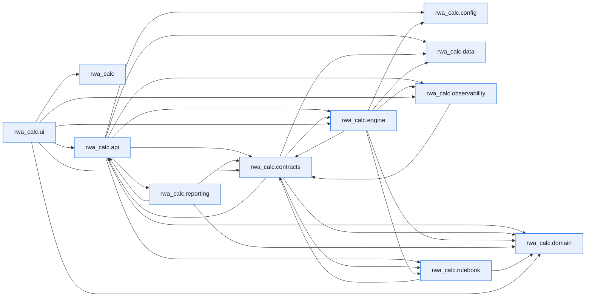

# Module Dependencies

This page is generated by ``scripts/generate_dependency_graph.py`` from the live
import graph of ``src/rwa_calc``, built with the [`curfew`](https://github.com/OpenAfterHours)
dependency tool. It is a snapshot of how the code actually imports itself — not a
hand-drawn design diagram.

Regenerate after structural refactors:

```bash
uv run python scripts/generate_dependency_graph.py
```

Inspect a single module's dependencies and dependents directly:

```bash
uv run curfew report rwa_calc.engine.classifier
```

Last generated: 2026-06-16.


## Package overview

Each node is a top-level subpackage of `rwa_calc`; an arrow `A --> B` means some module in `A` imports some module in `B`. Module-level imports are collapsed to their package here for readability.



## Full module graph

The complete graph, one node per module, exactly as `curfew show --mermaid` emits it.

??? note "Full module-level graph (190 modules)"

    ```mermaid
    flowchart LR
        n0["rwa_calc"]
        n1["rwa_calc.api"]
        n2["rwa_calc.api.errors"]
        n3["rwa_calc.api.export"]
        n4["rwa_calc.api.formatters"]
        n5["rwa_calc.api.models"]
        n6["rwa_calc.api.reconciliation"]
        n7["rwa_calc.api.rest"]
        n8["rwa_calc.api.results_cache"]
        n9["rwa_calc.api.service"]
        n10["rwa_calc.api.validation"]
        n11["rwa_calc.config"]
        n12["rwa_calc.config.data_sources"]
        n13["rwa_calc.contracts"]
        n14["rwa_calc.contracts.bundles"]
        n15["rwa_calc.contracts.config"]
        n16["rwa_calc.contracts.context"]
        n17["rwa_calc.contracts.edges"]
        n18["rwa_calc.contracts.errors"]
        n19["rwa_calc.contracts.protocols"]
        n20["rwa_calc.contracts.results"]
        n21["rwa_calc.contracts.validation"]
        n22["rwa_calc.data"]
        n23["rwa_calc.data.column_spec"]
        n24["rwa_calc.data.schemas"]
        n25["rwa_calc.domain"]
        n26["rwa_calc.domain.enums"]
        n27["rwa_calc.engine"]
        n28["rwa_calc.engine.aggregator"]
        n29["rwa_calc.engine.aggregator._collapse"]
        n30["rwa_calc.engine.aggregator._crm_reporting"]
        n31["rwa_calc.engine.aggregator._el_summary"]
        n32["rwa_calc.engine.aggregator._equity_prep"]
        n33["rwa_calc.engine.aggregator._floor"]
        n34["rwa_calc.engine.aggregator._schemas"]
        n35["rwa_calc.engine.aggregator._securitisation"]
        n36["rwa_calc.engine.aggregator._summaries"]
        n37["rwa_calc.engine.aggregator._supporting_factors"]
        n38["rwa_calc.engine.aggregator._utils"]
        n39["rwa_calc.engine.aggregator.aggregator"]
        n40["rwa_calc.engine.ccf"]
        n41["rwa_calc.engine.ccr"]
        n42["rwa_calc.engine.ccr.adjusted_notional"]
        n43["rwa_calc.engine.ccr.ccp"]
        n44["rwa_calc.engine.ccr.failed_trades"]
        n45["rwa_calc.engine.ccr.hedging_sets"]
        n46["rwa_calc.engine.ccr.maturity_factor"]
        n47["rwa_calc.engine.ccr.pfe"]
        n48["rwa_calc.engine.ccr.pipeline_adapter"]
        n49["rwa_calc.engine.ccr.rc"]
        n50["rwa_calc.engine.ccr.sa_ccr"]
        n51["rwa_calc.engine.ccr.sft_fccm"]
        n52["rwa_calc.engine.ccr.supervisory_delta"]
        n53["rwa_calc.engine.ccr.wwr"]
        n54["rwa_calc.engine.classifier"]
        n55["rwa_calc.engine.comparison"]
        n56["rwa_calc.engine.crm"]
        n57["rwa_calc.engine.crm.collateral"]
        n58["rwa_calc.engine.crm.expressions"]
        n59["rwa_calc.engine.crm.guarantees"]
        n60["rwa_calc.engine.crm.haircut_tables"]
        n61["rwa_calc.engine.crm.haircuts"]
        n62["rwa_calc.engine.crm.life_insurance"]
        n63["rwa_calc.engine.crm.link_allocation"]
        n64["rwa_calc.engine.crm.look_through"]
        n65["rwa_calc.engine.crm.processor"]
        n66["rwa_calc.engine.crm.provisions"]
        n67["rwa_calc.engine.crm.simple_method"]
        n68["rwa_calc.engine.entity_class_maps"]
        n69["rwa_calc.engine.equity"]
        n70["rwa_calc.engine.equity.calculator"]
        n71["rwa_calc.engine.eu_sovereign"]
        n72["rwa_calc.engine.fx_converter"]
        n73["rwa_calc.engine.fx_rate_sync"]
        n74["rwa_calc.engine.hierarchy"]
        n75["rwa_calc.engine.irb"]
        n76["rwa_calc.engine.irb.adjustments"]
        n77["rwa_calc.engine.irb.calculator"]
        n78["rwa_calc.engine.irb.formulas"]
        n79["rwa_calc.engine.irb.guarantee"]
        n80["rwa_calc.engine.irb.stats_backend"]
        n81["rwa_calc.engine.irb.transforms"]
        n82["rwa_calc.engine.kernels"]
        n83["rwa_calc.engine.kernels.allocation"]
        n84["rwa_calc.engine.loader"]
        n85["rwa_calc.engine.materialise"]
        n86["rwa_calc.engine.orchestrator"]
        n87["rwa_calc.engine.pipeline"]
        n88["rwa_calc.engine.re_splitter"]
        n89["rwa_calc.engine.reconciliation"]
        n90["rwa_calc.engine.registry"]
        n91["rwa_calc.engine.sa"]
        n92["rwa_calc.engine.sa.b31_risk_weight_tables"]
        n93["rwa_calc.engine.sa.calculator"]
        n94["rwa_calc.engine.sa.crr_risk_weight_tables"]
        n95["rwa_calc.engine.sa.factors_output"]
        n96["rwa_calc.engine.sa.guarantor_rw"]
        n97["rwa_calc.engine.sa.risk_weights"]
        n98["rwa_calc.engine.sa.rw_adjustments"]
        n99["rwa_calc.engine.securitisation"]
        n100["rwa_calc.engine.securitisation.allocator"]
        n101["rwa_calc.engine.slotting"]
        n102["rwa_calc.engine.slotting.calculator"]
        n103["rwa_calc.engine.slotting.transforms"]
        n104["rwa_calc.engine.stages"]
        n105["rwa_calc.engine.stages.aggregate"]
        n106["rwa_calc.engine.stages.calc"]
        n107["rwa_calc.engine.stages.ccr"]
        n108["rwa_calc.engine.stages.classify"]
        n109["rwa_calc.engine.stages.classify.approach"]
        n110["rwa_calc.engine.stages.classify.attributes"]
        n111["rwa_calc.engine.stages.classify.audit"]
        n112["rwa_calc.engine.stages.classify.classifier"]
        n113["rwa_calc.engine.stages.classify.permissions"]
        n114["rwa_calc.engine.stages.classify.stage"]
        n115["rwa_calc.engine.stages.classify.subtypes"]
        n116["rwa_calc.engine.stages.crm"]
        n117["rwa_calc.engine.stages.equity"]
        n118["rwa_calc.engine.stages.fx"]
        n119["rwa_calc.engine.stages.fx.conversion"]
        n120["rwa_calc.engine.stages.fx.converter"]
        n121["rwa_calc.engine.stages.hierarchy"]
        n122["rwa_calc.engine.stages.hierarchy.enrich"]
        n123["rwa_calc.engine.stages.hierarchy.facility_undrawn"]
        n124["rwa_calc.engine.stages.hierarchy.graph"]
        n125["rwa_calc.engine.stages.hierarchy.ratings"]
        n126["rwa_calc.engine.stages.hierarchy.resolver"]
        n127["rwa_calc.engine.stages.hierarchy.stage"]
        n128["rwa_calc.engine.stages.hierarchy.unify"]
        n129["rwa_calc.engine.stages.re_split"]
        n130["rwa_calc.engine.stages.re_split.flagging"]
        n131["rwa_calc.engine.stages.re_split.params"]
        n132["rwa_calc.engine.stages.re_split.splitter"]
        n133["rwa_calc.engine.stages.re_split.stage"]
        n134["rwa_calc.engine.stages.securitisation"]
        n135["rwa_calc.engine.supporting_factors"]
        n136["rwa_calc.engine.thresholds"]
        n137["rwa_calc.engine.utils"]
        n138["rwa_calc.observability"]
        n139["rwa_calc.observability.audit_cache"]
        n140["rwa_calc.observability.context"]
        n141["rwa_calc.observability.formatters"]
        n142["rwa_calc.observability.logging_setup"]
        n143["rwa_calc.reporting"]
        n144["rwa_calc.reporting.corep"]
        n145["rwa_calc.reporting.corep.generator"]
        n146["rwa_calc.reporting.corep.templates"]
        n147["rwa_calc.reporting.kernel"]
        n148["rwa_calc.reporting.kernel.columns"]
        n149["rwa_calc.reporting.kernel.filters"]
        n150["rwa_calc.reporting.kernel.rows"]
        n151["rwa_calc.reporting.kernel.sums"]
        n152["rwa_calc.reporting.pillar3"]
        n153["rwa_calc.reporting.pillar3.generator"]
        n154["rwa_calc.reporting.pillar3.templates"]
        n155["rwa_calc.rulebook"]
        n156["rwa_calc.rulebook.audit"]
        n157["rwa_calc.rulebook.compile"]
        n158["rwa_calc.rulebook.model"]
        n159["rwa_calc.rulebook.packs"]
        n160["rwa_calc.rulebook.packs.b31"]
        n161["rwa_calc.rulebook.packs.common"]
        n162["rwa_calc.rulebook.packs.crr"]
        n163["rwa_calc.rulebook.registry"]
        n164["rwa_calc.rulebook.resolve"]
        n165["rwa_calc.rulebook.v0"]
        n166["rwa_calc.ui"]
        n167["rwa_calc.ui.app"]
        n168["rwa_calc.ui.app.main"]
        n169["rwa_calc.ui.app.recon_state"]
        n170["rwa_calc.ui.marimo"]
        n171["rwa_calc.ui.marimo.shared"]
        n172["rwa_calc.ui.marimo.shared.sidebar"]
        n173["rwa_calc.ui.marimo.workspaces"]
        n174["rwa_calc.ui.marimo.workspaces.local"]
        n175["rwa_calc.ui.marimo.workspaces.local.book_1"]
        n176["rwa_calc.ui.marimo.workspaces.local.df"]
        n177["rwa_calc.ui.marimo.workspaces.local.my_workbook"]
        n178["rwa_calc.ui.marimo.workspaces.local.my_workbook_1"]
        n179["rwa_calc.ui.marimo.workspaces.local.my_workbook_2"]
        n180["rwa_calc.ui.marimo.workspaces.local.new_folder"]
        n181["rwa_calc.ui.marimo.workspaces.local.new_folder.my_workbook"]
        n182["rwa_calc.ui.marimo.workspaces.local.test_book"]
        n183["rwa_calc.ui.marimo.workspaces.local.tests"]
        n184["rwa_calc.ui.marimo.workspaces.templates"]
        n185["rwa_calc.ui.marimo.workspaces.templates.starter"]
        n186["rwa_calc.ui.views"]
        n187["rwa_calc.ui.views.charts"]
        n188["rwa_calc.ui.views.comparison"]
        n189["rwa_calc.ui.views.reconciliation"]
        n1 --> n3
        n1 --> n5
        n1 --> n6
        n1 --> n7
        n1 --> n8
        n1 --> n9
        n1 --> n10
        n1 --> n15
        n2 --> n5
        n2 --> n18
        n3 --> n5
        n3 --> n15
        n3 --> n20
        n3 --> n145
        n3 --> n153
        n4 --> n2
        n4 --> n5
        n4 --> n8
        n4 --> n14
        n5 --> n2
        n5 --> n3
        n5 --> n14
        n6 --> n15
        n6 --> n24
        n7 --> n5
        n7 --> n6
        n7 --> n9
        n7 --> n10
        n9 --> n2
        n9 --> n4
        n9 --> n5
        n9 --> n6
        n9 --> n8
        n9 --> n10
        n9 --> n15
        n9 --> n19
        n9 --> n26
        n9 --> n84
        n9 --> n87
        n9 --> n89
        n9 --> n138
        n9 --> n155
        n10 --> n2
        n10 --> n5
        n10 --> n12
        n13 --> n14
        n13 --> n15
        n13 --> n17
        n13 --> n18
        n13 --> n19
        n13 --> n21
        n13 --> n26
        n14 --> n17
        n14 --> n18
        n14 --> n26
        n15 --> n24
        n15 --> n26
        n17 --> n23
        n17 --> n24
        n18 --> n26
        n19 --> n5
        n19 --> n14
        n19 --> n15
        n19 --> n18
        n19 --> n20
        n19 --> n63
        n19 --> n164
        n21 --> n14
        n21 --> n18
        n21 --> n23
        n21 --> n24
        n24 --> n23
        n25 --> n26
        n27 --> n55
        n27 --> n74
        n27 --> n84
        n27 --> n87
        n28 --> n39
        n29 --> n24
        n30 --> n34
        n30 --> n38
        n31 --> n14
        n31 --> n34
        n31 --> n38
        n32 --> n26
        n33 --> n14
        n33 --> n34
        n33 --> n38
        n33 --> n157
        n33 --> n164
        n37 --> n34
        n37 --> n38
        n39 --> n14
        n39 --> n15
        n39 --> n17
        n39 --> n30
        n39 --> n31
        n39 --> n32
        n39 --> n33
        n39 --> n34
        n39 --> n35
        n39 --> n36
        n39 --> n37
        n39 --> n155
        n39 --> n164
        n40 --> n15
        n40 --> n24
        n40 --> n26
        n40 --> n155
        n40 --> n157
        n40 --> n164
        n41 --> n42
        n41 --> n45
        n41 --> n46
        n41 --> n47
        n41 --> n48
        n41 --> n49
        n41 --> n50
        n41 --> n52
        n41 --> n53
        n42 --> n157
        n42 --> n164
        n43 --> n157
        n43 --> n164
        n44 --> n15
        n44 --> n157
        n44 --> n164
        n45 --> n24
        n46 --> n157
        n46 --> n164
        n47 --> n15
        n47 --> n23
        n47 --> n24
        n47 --> n49
        n47 --> n157
        n47 --> n164
        n48 --> n14
        n48 --> n15
        n48 --> n23
        n48 --> n24
        n48 --> n42
        n48 --> n45
        n48 --> n46
        n48 --> n47
        n48 --> n49
        n48 --> n51
        n48 --> n52
        n48 --> n157
        n48 --> n164
        n50 --> n14
        n50 --> n15
        n50 --> n18
        n50 --> n26
        n51 --> n14
        n51 --> n60
        n51 --> n164
        n52 --> n80
        n52 --> n157
        n52 --> n164
        n53 --> n14
        n53 --> n18
        n53 --> n23
        n53 --> n24
        n53 --> n26
        n53 --> n157
        n53 --> n164
        n54 --> n108
        n55 --> n14
        n55 --> n15
        n55 --> n26
        n55 --> n87
        n55 --> n164
        n56 --> n61
        n56 --> n62
        n56 --> n65
        n57 --> n15
        n57 --> n24
        n57 --> n26
        n57 --> n58
        n57 --> n61
        n57 --> n139
        n57 --> n155
        n57 --> n157
        n57 --> n164
        n58 --> n24
        n58 --> n83
        n58 --> n157
        n58 --> n164
        n59 --> n15
        n59 --> n23
        n59 --> n24
        n59 --> n26
        n59 --> n40
        n59 --> n68
        n59 --> n71
        n59 --> n83
        n59 --> n137
        n59 --> n155
        n59 --> n157
        n59 --> n164
        n60 --> n164
        n61 --> n15
        n61 --> n23
        n61 --> n24
        n61 --> n60
        n61 --> n155
        n61 --> n157
        n61 --> n164
        n62 --> n15
        n62 --> n24
        n62 --> n164
        n63 --> n15
        n63 --> n18
        n63 --> n58
        n63 --> n83
        n64 --> n18
        n64 --> n23
        n65 --> n14
        n65 --> n15
        n65 --> n17
        n65 --> n18
        n65 --> n26
        n65 --> n40
        n65 --> n57
        n65 --> n58
        n65 --> n59
        n65 --> n61
        n65 --> n62
        n65 --> n63
        n65 --> n64
        n65 --> n66
        n65 --> n67
        n65 --> n83
        n65 --> n85
        n65 --> n97
        n65 --> n137
        n65 --> n139
        n65 --> n164
        n66 --> n15
        n66 --> n26
        n66 --> n40
        n66 --> n83
        n66 --> n155
        n66 --> n164
        n67 --> n15
        n67 --> n26
        n67 --> n92
        n67 --> n94
        n67 --> n155
        n67 --> n157
        n67 --> n164
        n68 --> n164
        n69 --> n70
        n70 --> n14
        n70 --> n15
        n70 --> n18
        n70 --> n23
        n70 --> n26
        n70 --> n78
        n70 --> n92
        n70 --> n94
        n70 --> n155
        n70 --> n157
        n70 --> n164
        n71 --> n164
        n72 --> n120
        n74 --> n121
        n75 --> n77
        n75 --> n78
        n76 --> n15
        n76 --> n18
        n76 --> n155
        n76 --> n164
        n77 --> n15
        n77 --> n18
        n77 --> n81
        n77 --> n135
        n77 --> n155
        n77 --> n164
        n78 --> n15
        n78 --> n26
        n78 --> n76
        n78 --> n80
        n78 --> n136
        n78 --> n155
        n78 --> n157
        n78 --> n164
        n79 --> n15
        n79 --> n59
        n79 --> n68
        n79 --> n71
        n79 --> n78
        n79 --> n96
        n79 --> n136
        n79 --> n155
        n79 --> n157
        n79 --> n164
        n81 --> n15
        n81 --> n18
        n81 --> n23
        n81 --> n26
        n81 --> n76
        n81 --> n78
        n81 --> n79
        n81 --> n136
        n81 --> n137
        n81 --> n155
        n81 --> n157
        n81 --> n164
        n82 --> n83
        n83 --> n24
        n83 --> n137
        n84 --> n12
        n84 --> n14
        n84 --> n17
        n84 --> n18
        n84 --> n19
        n84 --> n21
        n84 --> n23
        n84 --> n24
        n84 --> n137
        n85 --> n15
        n85 --> n17
        n86 --> n14
        n86 --> n15
        n86 --> n16
        n86 --> n17
        n86 --> n18
        n86 --> n19
        n86 --> n28
        n86 --> n65
        n86 --> n70
        n86 --> n77
        n86 --> n93
        n86 --> n100
        n86 --> n102
        n86 --> n108
        n86 --> n121
        n86 --> n129
        n86 --> n138
        n86 --> n155
        n87 --> n14
        n87 --> n15
        n87 --> n16
        n87 --> n19
        n87 --> n26
        n87 --> n73
        n87 --> n84
        n87 --> n85
        n87 --> n86
        n87 --> n90
        n87 --> n138
        n87 --> n139
        n87 --> n155
        n87 --> n156
        n88 --> n129
        n89 --> n14
        n89 --> n15
        n89 --> n18
        n89 --> n24
        n89 --> n29
        n90 --> n86
        n90 --> n105
        n90 --> n106
        n90 --> n107
        n90 --> n108
        n90 --> n116
        n90 --> n117
        n90 --> n121
        n90 --> n129
        n90 --> n134
        n91 --> n93
        n92 --> n26
        n92 --> n94
        n92 --> n164
        n93 --> n15
        n93 --> n18
        n93 --> n26
        n93 --> n95
        n93 --> n97
        n93 --> n98
        n93 --> n155
        n93 --> n164
        n94 --> n26
        n94 --> n164
        n95 --> n15
        n95 --> n18
        n95 --> n23
        n95 --> n135
        n95 --> n164
        n96 --> n26
        n96 --> n68
        n96 --> n157
        n96 --> n164
        n97 --> n15
        n97 --> n23
        n97 --> n24
        n97 --> n26
        n97 --> n71
        n97 --> n92
        n97 --> n94
        n97 --> n96
        n97 --> n155
        n97 --> n157
        n97 --> n164
        n98 --> n15
        n98 --> n18
        n98 --> n26
        n98 --> n59
        n98 --> n68
        n98 --> n71
        n98 --> n96
        n98 --> n97
        n98 --> n155
        n98 --> n164
        n99 --> n100
        n100 --> n14
        n100 --> n15
        n100 --> n18
        n100 --> n26
        n101 --> n102
        n102 --> n15
        n102 --> n18
        n102 --> n103
        n102 --> n135
        n102 --> n155
        n102 --> n164
        n103 --> n15
        n103 --> n18
        n103 --> n137
        n103 --> n155
        n103 --> n157
        n103 --> n158
        n103 --> n164
        n105 --> n15
        n105 --> n16
        n105 --> n86
        n105 --> n155
        n106 --> n15
        n106 --> n16
        n106 --> n17
        n106 --> n18
        n106 --> n26
        n106 --> n85
        n106 --> n86
        n106 --> n135
        n106 --> n155
        n107 --> n14
        n107 --> n15
        n107 --> n16
        n107 --> n17
        n107 --> n41
        n107 --> n85
        n107 --> n86
        n107 --> n155
        n108 --> n112
        n108 --> n114
        n109 --> n15
        n109 --> n24
        n109 --> n26
        n109 --> n71
        n109 --> n113
        n109 --> n136
        n109 --> n155
        n109 --> n164
        n110 --> n15
        n110 --> n26
        n110 --> n68
        n110 --> n136
        n110 --> n137
        n110 --> n155
        n110 --> n164
        n111 --> n14
        n111 --> n15
        n111 --> n18
        n111 --> n136
        n111 --> n155
        n111 --> n164
        n112 --> n14
        n112 --> n15
        n112 --> n17
        n112 --> n18
        n112 --> n85
        n112 --> n109
        n112 --> n110
        n112 --> n111
        n112 --> n113
        n112 --> n115
        n112 --> n130
        n112 --> n155
        n112 --> n164
        n113 --> n15
        n113 --> n18
        n113 --> n26
        n114 --> n15
        n114 --> n16
        n114 --> n86
        n114 --> n139
        n114 --> n155
        n115 --> n15
        n115 --> n24
        n115 --> n26
        n115 --> n110
        n115 --> n136
        n115 --> n137
        n115 --> n155
        n115 --> n164
        n116 --> n15
        n116 --> n16
        n116 --> n86
        n116 --> n155
        n117 --> n15
        n117 --> n16
        n117 --> n86
        n117 --> n139
        n117 --> n155
        n118 --> n119
        n118 --> n120
        n119 --> n15
        n119 --> n120
        n120 --> n15
        n121 --> n126
        n121 --> n127
        n122 --> n14
        n122 --> n83
        n122 --> n137
        n123 --> n14
        n123 --> n15
        n123 --> n40
        n123 --> n96
        n123 --> n124
        n123 --> n137
        n124 --> n14
        n124 --> n17
        n124 --> n18
        n124 --> n26
        n124 --> n125
        n124 --> n137
        n126 --> n14
        n126 --> n15
        n126 --> n17
        n126 --> n18
        n126 --> n118
        n126 --> n122
        n126 --> n123
        n126 --> n124
        n126 --> n125
        n126 --> n128
        n127 --> n15
        n127 --> n16
        n127 --> n17
        n127 --> n85
        n127 --> n86
        n127 --> n100
        n127 --> n139
        n127 --> n155
        n128 --> n14
        n128 --> n15
        n128 --> n18
        n128 --> n122
        n128 --> n123
        n128 --> n124
        n129 --> n130
        n129 --> n132
        n129 --> n133
        n130 --> n15
        n130 --> n26
        n130 --> n155
        n130 --> n164
        n131 --> n157
        n131 --> n164
        n132 --> n14
        n132 --> n15
        n132 --> n17
        n132 --> n18
        n132 --> n26
        n132 --> n131
        n132 --> n155
        n132 --> n164
        n133 --> n15
        n133 --> n16
        n133 --> n17
        n133 --> n85
        n133 --> n86
        n133 --> n139
        n133 --> n155
        n134 --> n15
        n134 --> n16
        n134 --> n86
        n134 --> n155
        n135 --> n15
        n135 --> n18
        n135 --> n26
        n135 --> n136
        n135 --> n155
        n135 --> n157
        n135 --> n164
        n136 --> n164
        n138 --> n139
        n138 --> n140
        n138 --> n141
        n138 --> n142
        n139 --> n15
        n139 --> n140
        n142 --> n140
        n142 --> n141
        n143 --> n145
        n143 --> n153
        n144 --> n145
        n144 --> n146
        n145 --> n5
        n145 --> n14
        n145 --> n15
        n145 --> n20
        n145 --> n26
        n145 --> n146
        n145 --> n147
        n147 --> n148
        n147 --> n149
        n147 --> n150
        n147 --> n151
        n149 --> n148
        n152 --> n153
        n153 --> n9
        n153 --> n14
        n153 --> n15
        n153 --> n20
        n153 --> n147
        n153 --> n154
        n155 --> n165
        n156 --> n164
        n157 --> n158
        n160 --> n26
        n160 --> n158
        n161 --> n26
        n161 --> n158
        n162 --> n26
        n162 --> n158
        n163 --> n26
        n164 --> n158
        n164 --> n163
        n165 --> n15
        n165 --> n26
        n165 --> n163
        n165 --> n164
        n168 --> n5
        n168 --> n6
        n168 --> n7
        n168 --> n9
        n168 --> n10
        n168 --> n15
        n168 --> n26
        n168 --> n55
        n168 --> n84
        n168 --> n138
        n168 --> n169
        n168 --> n187
        n168 --> n188
        n168 --> n189
        n172 --> n0
        n176 --> n172
        n177 --> n172
        n178 --> n172
        n179 --> n172
        n183 --> n172
        n185 --> n172
        n188 --> n14
        n189 --> n5
        n189 --> n89
        classDef first_party fill:#e8f0fe,stroke:#1a73e8,color:#202124
        class n0,n1,n2,n3,n4,n5,n6,n7,n8,n9,n10,n11,n12,n13,n14,n15,n16,n17,n18,n19,n20,n21,n22,n23,n24,n25,n26,n27,n28,n29,n30,n31,n32,n33,n34,n35,n36,n37,n38,n39,n40,n41,n42,n43,n44,n45,n46,n47,n48,n49,n50,n51,n52,n53,n54,n55,n56,n57,n58,n59,n60,n61,n62,n63,n64,n65,n66,n67,n68,n69,n70,n71,n72,n73,n74,n75,n76,n77,n78,n79,n80,n81,n82,n83,n84,n85,n86,n87,n88,n89,n90,n91,n92,n93,n94,n95,n96,n97,n98,n99,n100,n101,n102,n103,n104,n105,n106,n107,n108,n109,n110,n111,n112,n113,n114,n115,n116,n117,n118,n119,n120,n121,n122,n123,n124,n125,n126,n127,n128,n129,n130,n131,n132,n133,n134,n135,n136,n137,n138,n139,n140,n141,n142,n143,n144,n145,n146,n147,n148,n149,n150,n151,n152,n153,n154,n155,n156,n157,n158,n159,n160,n161,n162,n163,n164,n165,n166,n167,n168,n169,n170,n171,n172,n173,n174,n175,n176,n177,n178,n179,n180,n181,n182,n183,n184,n185,n186,n187,n188,n189 first_party
    ```

