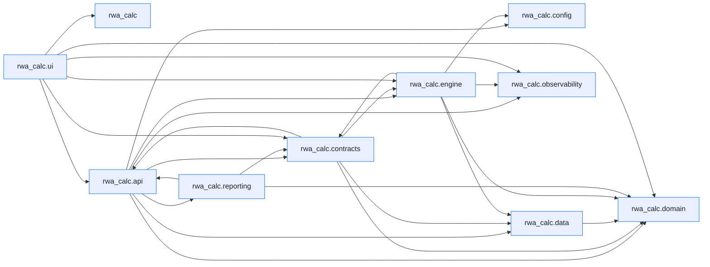

# Module Dependencies

This page is generated by ``scripts/generate_dependency_graph.py`` from the live
import graph of ``src/rwa_calc``, built with the [`curfew`](https://github.com/OpenAfterHours)
dependency tool. It is a snapshot of how the code actually imports itself — not a
hand-drawn design diagram.

Regenerate after structural refactors:

```bash
uv run python scripts/generate_dependency_graph.py
```

Inspect a single module's dependencies and dependents directly:

```bash
uv run curfew report rwa_calc.engine.classifier
```

Last generated: 2026-06-07.


## Package overview

Each node is a top-level subpackage of `rwa_calc`; an arrow `A --> B` means some module in `A` imports some module in `B`. Module-level imports are collapsed to their package here for readability.



## Full module graph

The complete graph, one node per module, exactly as `curfew show --mermaid` emits it.

??? note "Full module-level graph (147 modules)"

    ```mermaid
    flowchart LR
        n0["rwa_calc"]
        n1["rwa_calc.api"]
        n2["rwa_calc.api.errors"]
        n3["rwa_calc.api.export"]
        n4["rwa_calc.api.formatters"]
        n5["rwa_calc.api.models"]
        n6["rwa_calc.api.reconciliation"]
        n7["rwa_calc.api.rest"]
        n8["rwa_calc.api.results_cache"]
        n9["rwa_calc.api.service"]
        n10["rwa_calc.api.validation"]
        n11["rwa_calc.config"]
        n12["rwa_calc.config.data_sources"]
        n13["rwa_calc.config.fx_rates"]
        n14["rwa_calc.contracts"]
        n15["rwa_calc.contracts.bundles"]
        n16["rwa_calc.contracts.config"]
        n17["rwa_calc.contracts.errors"]
        n18["rwa_calc.contracts.protocols"]
        n19["rwa_calc.contracts.validation"]
        n20["rwa_calc.data"]
        n21["rwa_calc.data.column_spec"]
        n22["rwa_calc.data.schemas"]
        n23["rwa_calc.data.tables"]
        n24["rwa_calc.data.tables.airb_floors"]
        n25["rwa_calc.data.tables.b31_equity_rw"]
        n26["rwa_calc.data.tables.b31_risk_weights"]
        n27["rwa_calc.data.tables.b31_slotting"]
        n28["rwa_calc.data.tables.ccf"]
        n29["rwa_calc.data.tables.crm_supervisory"]
        n30["rwa_calc.data.tables.crr_equity_pd_lgd"]
        n31["rwa_calc.data.tables.crr_equity_rw"]
        n32["rwa_calc.data.tables.crr_risk_weights"]
        n33["rwa_calc.data.tables.crr_simple_method"]
        n34["rwa_calc.data.tables.crr_slotting"]
        n35["rwa_calc.data.tables.entity_class_mapping"]
        n36["rwa_calc.data.tables.eu_sovereign"]
        n37["rwa_calc.data.tables.failed_trades_multipliers"]
        n38["rwa_calc.data.tables.firb_lgd"]
        n39["rwa_calc.data.tables.haircuts"]
        n40["rwa_calc.data.tables.output_floor"]
        n41["rwa_calc.data.tables.re_split_parameters"]
        n42["rwa_calc.data.tables.sa_ccr_factors"]
        n43["rwa_calc.domain"]
        n44["rwa_calc.domain.enums"]
        n45["rwa_calc.engine"]
        n46["rwa_calc.engine.aggregator"]
        n47["rwa_calc.engine.aggregator._collapse"]
        n48["rwa_calc.engine.aggregator._crm_reporting"]
        n49["rwa_calc.engine.aggregator._el_summary"]
        n50["rwa_calc.engine.aggregator._equity_prep"]
        n51["rwa_calc.engine.aggregator._floor"]
        n52["rwa_calc.engine.aggregator._schemas"]
        n53["rwa_calc.engine.aggregator._securitisation"]
        n54["rwa_calc.engine.aggregator._summaries"]
        n55["rwa_calc.engine.aggregator._supporting_factors"]
        n56["rwa_calc.engine.aggregator._utils"]
        n57["rwa_calc.engine.aggregator.aggregator"]
        n58["rwa_calc.engine.ccf"]
        n59["rwa_calc.engine.ccr"]
        n60["rwa_calc.engine.ccr.adjusted_notional"]
        n61["rwa_calc.engine.ccr.ccp"]
        n62["rwa_calc.engine.ccr.failed_trades"]
        n63["rwa_calc.engine.ccr.hedging_sets"]
        n64["rwa_calc.engine.ccr.maturity_factor"]
        n65["rwa_calc.engine.ccr.namespace"]
        n66["rwa_calc.engine.ccr.pfe"]
        n67["rwa_calc.engine.ccr.pipeline_adapter"]
        n68["rwa_calc.engine.ccr.rc"]
        n69["rwa_calc.engine.ccr.sa_ccr"]
        n70["rwa_calc.engine.ccr.sft_fccm"]
        n71["rwa_calc.engine.ccr.supervisory_delta"]
        n72["rwa_calc.engine.ccr.wwr"]
        n73["rwa_calc.engine.classifier"]
        n74["rwa_calc.engine.comparison"]
        n75["rwa_calc.engine.crm"]
        n76["rwa_calc.engine.crm.collateral"]
        n77["rwa_calc.engine.crm.expressions"]
        n78["rwa_calc.engine.crm.guarantees"]
        n79["rwa_calc.engine.crm.haircuts"]
        n80["rwa_calc.engine.crm.life_insurance"]
        n81["rwa_calc.engine.crm.link_allocation"]
        n82["rwa_calc.engine.crm.look_through"]
        n83["rwa_calc.engine.crm.processor"]
        n84["rwa_calc.engine.crm.provisions"]
        n85["rwa_calc.engine.crm.simple_method"]
        n86["rwa_calc.engine.equity"]
        n87["rwa_calc.engine.equity.calculator"]
        n88["rwa_calc.engine.fx_converter"]
        n89["rwa_calc.engine.fx_rate_sync"]
        n90["rwa_calc.engine.hierarchy"]
        n91["rwa_calc.engine.irb"]
        n92["rwa_calc.engine.irb.adjustments"]
        n93["rwa_calc.engine.irb.calculator"]
        n94["rwa_calc.engine.irb.formulas"]
        n95["rwa_calc.engine.irb.guarantee"]
        n96["rwa_calc.engine.irb.namespace"]
        n97["rwa_calc.engine.irb.stats_backend"]
        n98["rwa_calc.engine.loader"]
        n99["rwa_calc.engine.materialise"]
        n100["rwa_calc.engine.pipeline"]
        n101["rwa_calc.engine.re_splitter"]
        n102["rwa_calc.engine.reconciliation"]
        n103["rwa_calc.engine.sa"]
        n104["rwa_calc.engine.sa.calculator"]
        n105["rwa_calc.engine.sa.namespace"]
        n106["rwa_calc.engine.securitisation"]
        n107["rwa_calc.engine.securitisation.allocator"]
        n108["rwa_calc.engine.slotting"]
        n109["rwa_calc.engine.slotting.calculator"]
        n110["rwa_calc.engine.slotting.namespace"]
        n111["rwa_calc.engine.supporting_factors"]
        n112["rwa_calc.engine.utils"]
        n113["rwa_calc.observability"]
        n114["rwa_calc.observability.context"]
        n115["rwa_calc.observability.formatters"]
        n116["rwa_calc.observability.logging_setup"]
        n117["rwa_calc.reporting"]
        n118["rwa_calc.reporting.corep"]
        n119["rwa_calc.reporting.corep.generator"]
        n120["rwa_calc.reporting.corep.templates"]
        n121["rwa_calc.reporting.pillar3"]
        n122["rwa_calc.reporting.pillar3.generator"]
        n123["rwa_calc.reporting.pillar3.templates"]
        n124["rwa_calc.ui"]
        n125["rwa_calc.ui.app"]
        n126["rwa_calc.ui.app.main"]
        n127["rwa_calc.ui.marimo"]
        n128["rwa_calc.ui.marimo.shared"]
        n129["rwa_calc.ui.marimo.shared.sidebar"]
        n130["rwa_calc.ui.marimo.workspaces"]
        n131["rwa_calc.ui.marimo.workspaces.local"]
        n132["rwa_calc.ui.marimo.workspaces.local.book_1"]
        n133["rwa_calc.ui.marimo.workspaces.local.df"]
        n134["rwa_calc.ui.marimo.workspaces.local.my_workbook"]
        n135["rwa_calc.ui.marimo.workspaces.local.my_workbook_1"]
        n136["rwa_calc.ui.marimo.workspaces.local.my_workbook_2"]
        n137["rwa_calc.ui.marimo.workspaces.local.new_folder"]
        n138["rwa_calc.ui.marimo.workspaces.local.new_folder.my_workbook"]
        n139["rwa_calc.ui.marimo.workspaces.local.test_book"]
        n140["rwa_calc.ui.marimo.workspaces.local.tests"]
        n141["rwa_calc.ui.marimo.workspaces.templates"]
        n142["rwa_calc.ui.marimo.workspaces.templates.starter"]
        n143["rwa_calc.ui.views"]
        n144["rwa_calc.ui.views.charts"]
        n145["rwa_calc.ui.views.comparison"]
        n146["rwa_calc.ui.views.reconciliation"]
        n1 --> n3
        n1 --> n5
        n1 --> n6
        n1 --> n7
        n1 --> n8
        n1 --> n9
        n1 --> n10
        n1 --> n16
        n2 --> n5
        n2 --> n17
        n3 --> n5
        n3 --> n16
        n3 --> n119
        n3 --> n122
        n4 --> n2
        n4 --> n5
        n4 --> n8
        n4 --> n15
        n5 --> n2
        n5 --> n3
        n5 --> n15
        n6 --> n16
        n6 --> n22
        n7 --> n5
        n7 --> n6
        n7 --> n9
        n7 --> n10
        n9 --> n2
        n9 --> n4
        n9 --> n5
        n9 --> n6
        n9 --> n8
        n9 --> n10
        n9 --> n16
        n9 --> n18
        n9 --> n44
        n9 --> n98
        n9 --> n100
        n9 --> n102
        n9 --> n113
        n10 --> n2
        n10 --> n5
        n10 --> n12
        n11 --> n13
        n14 --> n15
        n14 --> n16
        n14 --> n17
        n14 --> n18
        n14 --> n19
        n14 --> n44
        n15 --> n17
        n15 --> n44
        n16 --> n22
        n16 --> n44
        n17 --> n44
        n18 --> n3
        n18 --> n5
        n18 --> n15
        n18 --> n16
        n18 --> n17
        n18 --> n81
        n19 --> n15
        n19 --> n17
        n19 --> n21
        n19 --> n22
        n22 --> n21
        n23 --> n25
        n23 --> n26
        n23 --> n27
        n23 --> n31
        n23 --> n32
        n23 --> n34
        n23 --> n35
        n23 --> n36
        n23 --> n38
        n23 --> n39
        n23 --> n41
        n25 --> n44
        n26 --> n32
        n26 --> n44
        n27 --> n44
        n28 --> n22
        n29 --> n38
        n31 --> n44
        n32 --> n26
        n32 --> n44
        n34 --> n44
        n35 --> n44
        n41 --> n44
        n43 --> n44
        n45 --> n74
        n45 --> n90
        n45 --> n98
        n45 --> n100
        n46 --> n57
        n47 --> n22
        n48 --> n52
        n48 --> n56
        n49 --> n15
        n49 --> n52
        n49 --> n56
        n50 --> n44
        n51 --> n15
        n51 --> n40
        n51 --> n52
        n51 --> n56
        n55 --> n52
        n55 --> n56
        n57 --> n15
        n57 --> n16
        n57 --> n48
        n57 --> n49
        n57 --> n50
        n57 --> n51
        n57 --> n52
        n57 --> n53
        n57 --> n54
        n57 --> n55
        n58 --> n16
        n58 --> n24
        n58 --> n28
        n58 --> n44
        n59 --> n60
        n59 --> n63
        n59 --> n64
        n59 --> n65
        n59 --> n66
        n59 --> n67
        n59 --> n68
        n59 --> n69
        n59 --> n71
        n60 --> n42
        n61 --> n32
        n62 --> n16
        n62 --> n37
        n63 --> n22
        n64 --> n42
        n65 --> n60
        n65 --> n64
        n65 --> n68
        n65 --> n69
        n65 --> n71
        n66 --> n16
        n66 --> n21
        n66 --> n22
        n66 --> n42
        n66 --> n68
        n67 --> n15
        n67 --> n16
        n67 --> n60
        n67 --> n63
        n67 --> n64
        n67 --> n66
        n67 --> n68
        n67 --> n70
        n67 --> n71
        n69 --> n15
        n69 --> n16
        n69 --> n17
        n69 --> n44
        n70 --> n15
        n70 --> n39
        n71 --> n42
        n71 --> n97
        n72 --> n15
        n72 --> n17
        n72 --> n21
        n72 --> n22
        n72 --> n42
        n72 --> n44
        n73 --> n15
        n73 --> n16
        n73 --> n17
        n73 --> n21
        n73 --> n22
        n73 --> n26
        n73 --> n35
        n73 --> n36
        n73 --> n44
        n73 --> n99
        n73 --> n112
        n74 --> n15
        n74 --> n16
        n74 --> n38
        n74 --> n44
        n74 --> n100
        n75 --> n79
        n75 --> n80
        n75 --> n83
        n76 --> n16
        n76 --> n22
        n76 --> n29
        n76 --> n44
        n76 --> n77
        n76 --> n79
        n76 --> n99
        n77 --> n22
        n77 --> n29
        n78 --> n16
        n78 --> n21
        n78 --> n22
        n78 --> n35
        n78 --> n36
        n78 --> n39
        n78 --> n44
        n78 --> n58
        n78 --> n112
        n79 --> n16
        n79 --> n21
        n79 --> n22
        n79 --> n29
        n79 --> n39
        n80 --> n16
        n80 --> n22
        n81 --> n16
        n81 --> n17
        n81 --> n77
        n82 --> n17
        n82 --> n21
        n83 --> n15
        n83 --> n16
        n83 --> n17
        n83 --> n22
        n83 --> n44
        n83 --> n58
        n83 --> n76
        n83 --> n77
        n83 --> n78
        n83 --> n79
        n83 --> n80
        n83 --> n81
        n83 --> n82
        n83 --> n84
        n83 --> n85
        n83 --> n99
        n83 --> n105
        n83 --> n112
        n84 --> n16
        n84 --> n22
        n84 --> n44
        n84 --> n58
        n85 --> n16
        n85 --> n26
        n85 --> n32
        n85 --> n33
        n85 --> n44
        n86 --> n87
        n87 --> n15
        n87 --> n16
        n87 --> n17
        n87 --> n21
        n87 --> n25
        n87 --> n26
        n87 --> n30
        n87 --> n31
        n87 --> n32
        n87 --> n44
        n87 --> n94
        n88 --> n16
        n90 --> n15
        n90 --> n16
        n90 --> n17
        n90 --> n21
        n90 --> n22
        n90 --> n32
        n90 --> n35
        n90 --> n44
        n90 --> n58
        n90 --> n88
        n90 --> n112
        n91 --> n93
        n91 --> n94
        n91 --> n96
        n92 --> n16
        n92 --> n17
        n93 --> n15
        n93 --> n16
        n93 --> n17
        n93 --> n96
        n93 --> n111
        n94 --> n16
        n94 --> n44
        n94 --> n92
        n94 --> n97
        n95 --> n16
        n95 --> n32
        n95 --> n35
        n95 --> n36
        n95 --> n38
        n95 --> n78
        n95 --> n94
        n96 --> n16
        n96 --> n21
        n96 --> n38
        n96 --> n44
        n96 --> n92
        n96 --> n94
        n96 --> n95
        n96 --> n112
        n98 --> n12
        n98 --> n15
        n98 --> n17
        n98 --> n18
        n98 --> n19
        n98 --> n21
        n98 --> n22
        n98 --> n112
        n99 --> n16
        n99 --> n114
        n100 --> n15
        n100 --> n16
        n100 --> n17
        n100 --> n18
        n100 --> n44
        n100 --> n46
        n100 --> n59
        n100 --> n73
        n100 --> n83
        n100 --> n87
        n100 --> n89
        n100 --> n90
        n100 --> n93
        n100 --> n98
        n100 --> n99
        n100 --> n101
        n100 --> n104
        n100 --> n107
        n100 --> n109
        n100 --> n111
        n100 --> n113
        n101 --> n15
        n101 --> n16
        n101 --> n17
        n101 --> n41
        n101 --> n44
        n102 --> n15
        n102 --> n16
        n102 --> n17
        n102 --> n22
        n102 --> n47
        n103 --> n104
        n103 --> n105
        n104 --> n15
        n104 --> n16
        n104 --> n17
        n104 --> n44
        n104 --> n105
        n105 --> n16
        n105 --> n17
        n105 --> n21
        n105 --> n22
        n105 --> n25
        n105 --> n26
        n105 --> n31
        n105 --> n32
        n105 --> n35
        n105 --> n36
        n105 --> n44
        n105 --> n78
        n105 --> n111
        n106 --> n107
        n107 --> n15
        n107 --> n16
        n107 --> n17
        n107 --> n44
        n108 --> n109
        n108 --> n110
        n109 --> n15
        n109 --> n16
        n109 --> n17
        n109 --> n21
        n109 --> n111
        n110 --> n16
        n110 --> n17
        n110 --> n27
        n110 --> n34
        n110 --> n44
        n110 --> n112
        n111 --> n16
        n111 --> n17
        n111 --> n44
        n113 --> n114
        n113 --> n115
        n113 --> n116
        n116 --> n114
        n116 --> n115
        n117 --> n119
        n117 --> n122
        n118 --> n119
        n118 --> n120
        n119 --> n3
        n119 --> n5
        n119 --> n15
        n119 --> n16
        n119 --> n44
        n119 --> n120
        n121 --> n122
        n122 --> n3
        n122 --> n9
        n122 --> n15
        n122 --> n16
        n122 --> n123
        n126 --> n5
        n126 --> n6
        n126 --> n7
        n126 --> n9
        n126 --> n10
        n126 --> n16
        n126 --> n44
        n126 --> n74
        n126 --> n98
        n126 --> n113
        n126 --> n144
        n126 --> n145
        n126 --> n146
        n129 --> n0
        n133 --> n129
        n134 --> n129
        n135 --> n129
        n136 --> n129
        n140 --> n129
        n142 --> n129
        n145 --> n15
        n146 --> n5
        n146 --> n102
        classDef first_party fill:#e8f0fe,stroke:#1a73e8,color:#202124
        class n0,n1,n2,n3,n4,n5,n6,n7,n8,n9,n10,n11,n12,n13,n14,n15,n16,n17,n18,n19,n20,n21,n22,n23,n24,n25,n26,n27,n28,n29,n30,n31,n32,n33,n34,n35,n36,n37,n38,n39,n40,n41,n42,n43,n44,n45,n46,n47,n48,n49,n50,n51,n52,n53,n54,n55,n56,n57,n58,n59,n60,n61,n62,n63,n64,n65,n66,n67,n68,n69,n70,n71,n72,n73,n74,n75,n76,n77,n78,n79,n80,n81,n82,n83,n84,n85,n86,n87,n88,n89,n90,n91,n92,n93,n94,n95,n96,n97,n98,n99,n100,n101,n102,n103,n104,n105,n106,n107,n108,n109,n110,n111,n112,n113,n114,n115,n116,n117,n118,n119,n120,n121,n122,n123,n124,n125,n126,n127,n128,n129,n130,n131,n132,n133,n134,n135,n136,n137,n138,n139,n140,n141,n142,n143,n144,n145,n146 first_party
    ```

