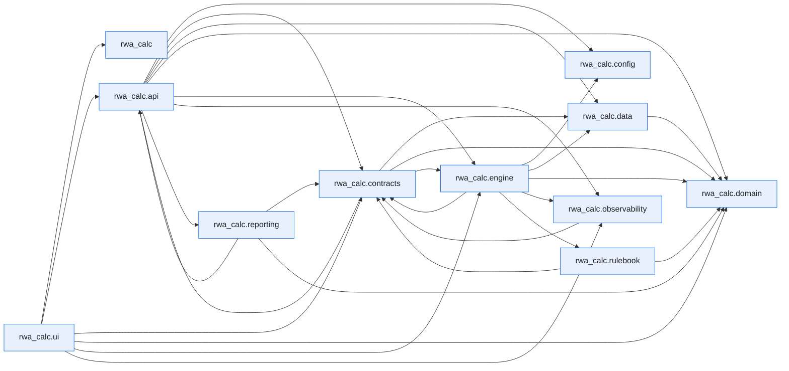

# Module Dependencies

This page is generated by ``scripts/generate_dependency_graph.py`` from the live
import graph of ``src/rwa_calc``, built with the [`curfew`](https://github.com/OpenAfterHours)
dependency tool. It is a snapshot of how the code actually imports itself — not a
hand-drawn design diagram.

Regenerate after structural refactors:

```bash
uv run python scripts/generate_dependency_graph.py
```

Inspect a single module's dependencies and dependents directly:

```bash
uv run curfew report rwa_calc.engine.classifier
```

Last generated: 2026-06-13.


## Package overview

Each node is a top-level subpackage of `rwa_calc`; an arrow `A --> B` means some module in `A` imports some module in `B`. Module-level imports are collapsed to their package here for readability.



## Full module graph

The complete graph, one node per module, exactly as `curfew show --mermaid` emits it.

??? note "Full module-level graph (194 modules)"

    ```mermaid
    flowchart LR
        n0["rwa_calc"]
        n1["rwa_calc.api"]
        n2["rwa_calc.api.errors"]
        n3["rwa_calc.api.export"]
        n4["rwa_calc.api.formatters"]
        n5["rwa_calc.api.models"]
        n6["rwa_calc.api.reconciliation"]
        n7["rwa_calc.api.rest"]
        n8["rwa_calc.api.results_cache"]
        n9["rwa_calc.api.service"]
        n10["rwa_calc.api.validation"]
        n11["rwa_calc.config"]
        n12["rwa_calc.config.data_sources"]
        n13["rwa_calc.contracts"]
        n14["rwa_calc.contracts.bundles"]
        n15["rwa_calc.contracts.config"]
        n16["rwa_calc.contracts.context"]
        n17["rwa_calc.contracts.edges"]
        n18["rwa_calc.contracts.errors"]
        n19["rwa_calc.contracts.protocols"]
        n20["rwa_calc.contracts.results"]
        n21["rwa_calc.contracts.validation"]
        n22["rwa_calc.data"]
        n23["rwa_calc.data.column_spec"]
        n24["rwa_calc.data.schemas"]
        n25["rwa_calc.data.tables"]
        n26["rwa_calc.data.tables.airb_floors"]
        n27["rwa_calc.data.tables.b31_equity_rw"]
        n28["rwa_calc.data.tables.b31_risk_weights"]
        n29["rwa_calc.data.tables.b31_slotting"]
        n30["rwa_calc.data.tables.ccf"]
        n31["rwa_calc.data.tables.crm_supervisory"]
        n32["rwa_calc.data.tables.crr_equity_pd_lgd"]
        n33["rwa_calc.data.tables.crr_equity_rw"]
        n34["rwa_calc.data.tables.crr_risk_weights"]
        n35["rwa_calc.data.tables.crr_simple_method"]
        n36["rwa_calc.data.tables.crr_slotting"]
        n37["rwa_calc.data.tables.entity_class_mapping"]
        n38["rwa_calc.data.tables.eu_sovereign"]
        n39["rwa_calc.data.tables.failed_trades_multipliers"]
        n40["rwa_calc.data.tables.firb_lgd"]
        n41["rwa_calc.data.tables.guarantor_rw"]
        n42["rwa_calc.data.tables.haircuts"]
        n43["rwa_calc.data.tables.output_floor"]
        n44["rwa_calc.data.tables.re_split_parameters"]
        n45["rwa_calc.data.tables.sa_ccr_factors"]
        n46["rwa_calc.domain"]
        n47["rwa_calc.domain.enums"]
        n48["rwa_calc.engine"]
        n49["rwa_calc.engine.aggregator"]
        n50["rwa_calc.engine.aggregator._collapse"]
        n51["rwa_calc.engine.aggregator._crm_reporting"]
        n52["rwa_calc.engine.aggregator._el_summary"]
        n53["rwa_calc.engine.aggregator._equity_prep"]
        n54["rwa_calc.engine.aggregator._floor"]
        n55["rwa_calc.engine.aggregator._schemas"]
        n56["rwa_calc.engine.aggregator._securitisation"]
        n57["rwa_calc.engine.aggregator._summaries"]
        n58["rwa_calc.engine.aggregator._supporting_factors"]
        n59["rwa_calc.engine.aggregator._utils"]
        n60["rwa_calc.engine.aggregator.aggregator"]
        n61["rwa_calc.engine.ccf"]
        n62["rwa_calc.engine.ccr"]
        n63["rwa_calc.engine.ccr.adjusted_notional"]
        n64["rwa_calc.engine.ccr.ccp"]
        n65["rwa_calc.engine.ccr.failed_trades"]
        n66["rwa_calc.engine.ccr.hedging_sets"]
        n67["rwa_calc.engine.ccr.maturity_factor"]
        n68["rwa_calc.engine.ccr.pfe"]
        n69["rwa_calc.engine.ccr.pipeline_adapter"]
        n70["rwa_calc.engine.ccr.rc"]
        n71["rwa_calc.engine.ccr.sa_ccr"]
        n72["rwa_calc.engine.ccr.sft_fccm"]
        n73["rwa_calc.engine.ccr.supervisory_delta"]
        n74["rwa_calc.engine.ccr.wwr"]
        n75["rwa_calc.engine.classifier"]
        n76["rwa_calc.engine.comparison"]
        n77["rwa_calc.engine.crm"]
        n78["rwa_calc.engine.crm.collateral"]
        n79["rwa_calc.engine.crm.expressions"]
        n80["rwa_calc.engine.crm.guarantees"]
        n81["rwa_calc.engine.crm.haircuts"]
        n82["rwa_calc.engine.crm.life_insurance"]
        n83["rwa_calc.engine.crm.link_allocation"]
        n84["rwa_calc.engine.crm.look_through"]
        n85["rwa_calc.engine.crm.processor"]
        n86["rwa_calc.engine.crm.provisions"]
        n87["rwa_calc.engine.crm.simple_method"]
        n88["rwa_calc.engine.equity"]
        n89["rwa_calc.engine.equity.calculator"]
        n90["rwa_calc.engine.fx_converter"]
        n91["rwa_calc.engine.fx_rate_sync"]
        n92["rwa_calc.engine.hierarchy"]
        n93["rwa_calc.engine.irb"]
        n94["rwa_calc.engine.irb.adjustments"]
        n95["rwa_calc.engine.irb.calculator"]
        n96["rwa_calc.engine.irb.formulas"]
        n97["rwa_calc.engine.irb.guarantee"]
        n98["rwa_calc.engine.irb.stats_backend"]
        n99["rwa_calc.engine.irb.transforms"]
        n100["rwa_calc.engine.kernels"]
        n101["rwa_calc.engine.kernels.allocation"]
        n102["rwa_calc.engine.loader"]
        n103["rwa_calc.engine.materialise"]
        n104["rwa_calc.engine.orchestrator"]
        n105["rwa_calc.engine.pipeline"]
        n106["rwa_calc.engine.re_splitter"]
        n107["rwa_calc.engine.reconciliation"]
        n108["rwa_calc.engine.registry"]
        n109["rwa_calc.engine.sa"]
        n110["rwa_calc.engine.sa.calculator"]
        n111["rwa_calc.engine.sa.factors_output"]
        n112["rwa_calc.engine.sa.risk_weights"]
        n113["rwa_calc.engine.sa.rw_adjustments"]
        n114["rwa_calc.engine.securitisation"]
        n115["rwa_calc.engine.securitisation.allocator"]
        n116["rwa_calc.engine.slotting"]
        n117["rwa_calc.engine.slotting.calculator"]
        n118["rwa_calc.engine.slotting.transforms"]
        n119["rwa_calc.engine.stages"]
        n120["rwa_calc.engine.stages.aggregate"]
        n121["rwa_calc.engine.stages.calc"]
        n122["rwa_calc.engine.stages.ccr"]
        n123["rwa_calc.engine.stages.classify"]
        n124["rwa_calc.engine.stages.classify.approach"]
        n125["rwa_calc.engine.stages.classify.attributes"]
        n126["rwa_calc.engine.stages.classify.audit"]
        n127["rwa_calc.engine.stages.classify.classifier"]
        n128["rwa_calc.engine.stages.classify.permissions"]
        n129["rwa_calc.engine.stages.classify.stage"]
        n130["rwa_calc.engine.stages.classify.subtypes"]
        n131["rwa_calc.engine.stages.crm"]
        n132["rwa_calc.engine.stages.equity"]
        n133["rwa_calc.engine.stages.fx"]
        n134["rwa_calc.engine.stages.fx.conversion"]
        n135["rwa_calc.engine.stages.fx.converter"]
        n136["rwa_calc.engine.stages.hierarchy"]
        n137["rwa_calc.engine.stages.hierarchy.enrich"]
        n138["rwa_calc.engine.stages.hierarchy.facility_undrawn"]
        n139["rwa_calc.engine.stages.hierarchy.graph"]
        n140["rwa_calc.engine.stages.hierarchy.ratings"]
        n141["rwa_calc.engine.stages.hierarchy.resolver"]
        n142["rwa_calc.engine.stages.hierarchy.stage"]
        n143["rwa_calc.engine.stages.hierarchy.unify"]
        n144["rwa_calc.engine.stages.re_split"]
        n145["rwa_calc.engine.stages.re_split.flagging"]
        n146["rwa_calc.engine.stages.re_split.splitter"]
        n147["rwa_calc.engine.stages.re_split.stage"]
        n148["rwa_calc.engine.stages.securitisation"]
        n149["rwa_calc.engine.supporting_factors"]
        n150["rwa_calc.engine.utils"]
        n151["rwa_calc.observability"]
        n152["rwa_calc.observability.audit_cache"]
        n153["rwa_calc.observability.context"]
        n154["rwa_calc.observability.formatters"]
        n155["rwa_calc.observability.logging_setup"]
        n156["rwa_calc.reporting"]
        n157["rwa_calc.reporting.corep"]
        n158["rwa_calc.reporting.corep.generator"]
        n159["rwa_calc.reporting.corep.templates"]
        n160["rwa_calc.reporting.kernel"]
        n161["rwa_calc.reporting.kernel.columns"]
        n162["rwa_calc.reporting.kernel.filters"]
        n163["rwa_calc.reporting.kernel.rows"]
        n164["rwa_calc.reporting.kernel.sums"]
        n165["rwa_calc.reporting.pillar3"]
        n166["rwa_calc.reporting.pillar3.generator"]
        n167["rwa_calc.reporting.pillar3.templates"]
        n168["rwa_calc.rulebook"]
        n169["rwa_calc.rulebook.v0"]
        n170["rwa_calc.ui"]
        n171["rwa_calc.ui.app"]
        n172["rwa_calc.ui.app.main"]
        n173["rwa_calc.ui.app.recon_state"]
        n174["rwa_calc.ui.marimo"]
        n175["rwa_calc.ui.marimo.shared"]
        n176["rwa_calc.ui.marimo.shared.sidebar"]
        n177["rwa_calc.ui.marimo.workspaces"]
        n178["rwa_calc.ui.marimo.workspaces.local"]
        n179["rwa_calc.ui.marimo.workspaces.local.book_1"]
        n180["rwa_calc.ui.marimo.workspaces.local.df"]
        n181["rwa_calc.ui.marimo.workspaces.local.my_workbook"]
        n182["rwa_calc.ui.marimo.workspaces.local.my_workbook_1"]
        n183["rwa_calc.ui.marimo.workspaces.local.my_workbook_2"]
        n184["rwa_calc.ui.marimo.workspaces.local.new_folder"]
        n185["rwa_calc.ui.marimo.workspaces.local.new_folder.my_workbook"]
        n186["rwa_calc.ui.marimo.workspaces.local.test_book"]
        n187["rwa_calc.ui.marimo.workspaces.local.tests"]
        n188["rwa_calc.ui.marimo.workspaces.templates"]
        n189["rwa_calc.ui.marimo.workspaces.templates.starter"]
        n190["rwa_calc.ui.views"]
        n191["rwa_calc.ui.views.charts"]
        n192["rwa_calc.ui.views.comparison"]
        n193["rwa_calc.ui.views.reconciliation"]
        n1 --> n3
        n1 --> n5
        n1 --> n6
        n1 --> n7
        n1 --> n8
        n1 --> n9
        n1 --> n10
        n1 --> n15
        n2 --> n5
        n2 --> n18
        n3 --> n5
        n3 --> n15
        n3 --> n20
        n3 --> n158
        n3 --> n166
        n4 --> n2
        n4 --> n5
        n4 --> n8
        n4 --> n14
        n5 --> n2
        n5 --> n3
        n5 --> n14
        n6 --> n15
        n6 --> n24
        n7 --> n5
        n7 --> n6
        n7 --> n9
        n7 --> n10
        n9 --> n2
        n9 --> n4
        n9 --> n5
        n9 --> n6
        n9 --> n8
        n9 --> n10
        n9 --> n15
        n9 --> n19
        n9 --> n47
        n9 --> n102
        n9 --> n105
        n9 --> n107
        n9 --> n151
        n10 --> n2
        n10 --> n5
        n10 --> n12
        n13 --> n14
        n13 --> n15
        n13 --> n17
        n13 --> n18
        n13 --> n19
        n13 --> n21
        n13 --> n47
        n14 --> n17
        n14 --> n18
        n14 --> n47
        n15 --> n24
        n15 --> n47
        n17 --> n23
        n17 --> n24
        n18 --> n47
        n19 --> n5
        n19 --> n14
        n19 --> n15
        n19 --> n18
        n19 --> n20
        n19 --> n83
        n21 --> n14
        n21 --> n18
        n21 --> n23
        n21 --> n24
        n24 --> n23
        n25 --> n27
        n25 --> n28
        n25 --> n29
        n25 --> n33
        n25 --> n34
        n25 --> n36
        n25 --> n37
        n25 --> n38
        n25 --> n40
        n25 --> n42
        n25 --> n44
        n27 --> n47
        n28 --> n34
        n28 --> n47
        n29 --> n47
        n30 --> n24
        n31 --> n40
        n33 --> n47
        n34 --> n28
        n34 --> n47
        n36 --> n47
        n37 --> n47
        n41 --> n34
        n41 --> n37
        n41 --> n47
        n44 --> n47
        n46 --> n47
        n48 --> n76
        n48 --> n92
        n48 --> n102
        n48 --> n105
        n49 --> n60
        n50 --> n24
        n51 --> n55
        n51 --> n59
        n52 --> n14
        n52 --> n55
        n52 --> n59
        n53 --> n47
        n54 --> n14
        n54 --> n43
        n54 --> n55
        n54 --> n59
        n58 --> n55
        n58 --> n59
        n60 --> n14
        n60 --> n15
        n60 --> n17
        n60 --> n51
        n60 --> n52
        n60 --> n53
        n60 --> n54
        n60 --> n55
        n60 --> n56
        n60 --> n57
        n60 --> n58
        n61 --> n15
        n61 --> n26
        n61 --> n30
        n61 --> n47
        n62 --> n63
        n62 --> n66
        n62 --> n67
        n62 --> n68
        n62 --> n69
        n62 --> n70
        n62 --> n71
        n62 --> n73
        n62 --> n74
        n63 --> n45
        n64 --> n34
        n65 --> n15
        n65 --> n39
        n66 --> n24
        n67 --> n45
        n68 --> n15
        n68 --> n23
        n68 --> n24
        n68 --> n45
        n68 --> n70
        n69 --> n14
        n69 --> n15
        n69 --> n23
        n69 --> n24
        n69 --> n45
        n69 --> n63
        n69 --> n66
        n69 --> n67
        n69 --> n68
        n69 --> n70
        n69 --> n72
        n69 --> n73
        n71 --> n14
        n71 --> n15
        n71 --> n18
        n71 --> n47
        n72 --> n14
        n72 --> n42
        n73 --> n45
        n73 --> n98
        n74 --> n14
        n74 --> n18
        n74 --> n23
        n74 --> n24
        n74 --> n45
        n74 --> n47
        n75 --> n123
        n76 --> n14
        n76 --> n15
        n76 --> n40
        n76 --> n47
        n76 --> n105
        n77 --> n81
        n77 --> n82
        n77 --> n85
        n78 --> n15
        n78 --> n24
        n78 --> n31
        n78 --> n47
        n78 --> n79
        n78 --> n81
        n78 --> n152
        n79 --> n24
        n79 --> n31
        n79 --> n101
        n80 --> n15
        n80 --> n23
        n80 --> n24
        n80 --> n37
        n80 --> n38
        n80 --> n42
        n80 --> n47
        n80 --> n61
        n80 --> n101
        n80 --> n150
        n81 --> n15
        n81 --> n23
        n81 --> n24
        n81 --> n31
        n81 --> n42
        n82 --> n15
        n82 --> n24
        n83 --> n15
        n83 --> n18
        n83 --> n79
        n83 --> n101
        n84 --> n18
        n84 --> n23
        n85 --> n14
        n85 --> n15
        n85 --> n17
        n85 --> n18
        n85 --> n47
        n85 --> n61
        n85 --> n78
        n85 --> n79
        n85 --> n80
        n85 --> n81
        n85 --> n82
        n85 --> n83
        n85 --> n84
        n85 --> n86
        n85 --> n87
        n85 --> n101
        n85 --> n103
        n85 --> n112
        n85 --> n150
        n85 --> n152
        n86 --> n15
        n86 --> n47
        n86 --> n61
        n86 --> n101
        n87 --> n15
        n87 --> n28
        n87 --> n34
        n87 --> n35
        n87 --> n47
        n88 --> n89
        n89 --> n14
        n89 --> n15
        n89 --> n18
        n89 --> n23
        n89 --> n27
        n89 --> n28
        n89 --> n32
        n89 --> n33
        n89 --> n34
        n89 --> n47
        n89 --> n96
        n90 --> n135
        n92 --> n136
        n93 --> n95
        n93 --> n96
        n94 --> n15
        n94 --> n18
        n95 --> n15
        n95 --> n18
        n95 --> n99
        n95 --> n149
        n96 --> n15
        n96 --> n47
        n96 --> n94
        n96 --> n98
        n97 --> n15
        n97 --> n37
        n97 --> n38
        n97 --> n40
        n97 --> n41
        n97 --> n80
        n97 --> n96
        n99 --> n15
        n99 --> n18
        n99 --> n23
        n99 --> n40
        n99 --> n47
        n99 --> n94
        n99 --> n96
        n99 --> n97
        n99 --> n150
        n100 --> n101
        n101 --> n24
        n101 --> n150
        n102 --> n12
        n102 --> n14
        n102 --> n17
        n102 --> n18
        n102 --> n19
        n102 --> n21
        n102 --> n23
        n102 --> n24
        n102 --> n150
        n103 --> n15
        n103 --> n17
        n104 --> n14
        n104 --> n15
        n104 --> n16
        n104 --> n17
        n104 --> n18
        n104 --> n19
        n104 --> n49
        n104 --> n85
        n104 --> n89
        n104 --> n95
        n104 --> n110
        n104 --> n115
        n104 --> n117
        n104 --> n123
        n104 --> n136
        n104 --> n144
        n104 --> n151
        n104 --> n168
        n105 --> n14
        n105 --> n15
        n105 --> n16
        n105 --> n19
        n105 --> n47
        n105 --> n91
        n105 --> n102
        n105 --> n103
        n105 --> n104
        n105 --> n108
        n105 --> n151
        n105 --> n152
        n105 --> n168
        n106 --> n144
        n107 --> n14
        n107 --> n15
        n107 --> n18
        n107 --> n24
        n107 --> n50
        n108 --> n104
        n108 --> n120
        n108 --> n121
        n108 --> n122
        n108 --> n123
        n108 --> n131
        n108 --> n132
        n108 --> n136
        n108 --> n144
        n108 --> n148
        n109 --> n110
        n110 --> n15
        n110 --> n18
        n110 --> n47
        n110 --> n111
        n110 --> n112
        n110 --> n113
        n111 --> n15
        n111 --> n18
        n111 --> n23
        n111 --> n149
        n112 --> n15
        n112 --> n23
        n112 --> n24
        n112 --> n27
        n112 --> n28
        n112 --> n33
        n112 --> n34
        n112 --> n38
        n112 --> n47
        n113 --> n15
        n113 --> n18
        n113 --> n28
        n113 --> n37
        n113 --> n38
        n113 --> n41
        n113 --> n47
        n113 --> n80
        n113 --> n112
        n114 --> n115
        n115 --> n14
        n115 --> n15
        n115 --> n18
        n115 --> n47
        n116 --> n117
        n117 --> n15
        n117 --> n18
        n117 --> n118
        n117 --> n149
        n118 --> n15
        n118 --> n18
        n118 --> n29
        n118 --> n36
        n118 --> n47
        n118 --> n150
        n120 --> n15
        n120 --> n16
        n120 --> n104
        n120 --> n168
        n121 --> n15
        n121 --> n16
        n121 --> n17
        n121 --> n18
        n121 --> n47
        n121 --> n103
        n121 --> n104
        n121 --> n149
        n121 --> n168
        n122 --> n14
        n122 --> n15
        n122 --> n16
        n122 --> n17
        n122 --> n62
        n122 --> n103
        n122 --> n104
        n122 --> n168
        n123 --> n127
        n123 --> n129
        n124 --> n15
        n124 --> n24
        n124 --> n38
        n124 --> n47
        n124 --> n128
        n125 --> n15
        n125 --> n28
        n125 --> n37
        n125 --> n47
        n125 --> n150
        n126 --> n14
        n126 --> n15
        n126 --> n18
        n127 --> n14
        n127 --> n15
        n127 --> n17
        n127 --> n18
        n127 --> n103
        n127 --> n124
        n127 --> n125
        n127 --> n126
        n127 --> n128
        n127 --> n130
        n127 --> n145
        n128 --> n15
        n128 --> n18
        n128 --> n47
        n129 --> n15
        n129 --> n16
        n129 --> n104
        n129 --> n152
        n129 --> n168
        n130 --> n15
        n130 --> n24
        n130 --> n47
        n130 --> n125
        n130 --> n150
        n131 --> n15
        n131 --> n16
        n131 --> n104
        n131 --> n168
        n132 --> n15
        n132 --> n16
        n132 --> n104
        n132 --> n152
        n132 --> n168
        n133 --> n134
        n133 --> n135
        n134 --> n15
        n134 --> n135
        n135 --> n15
        n136 --> n141
        n136 --> n142
        n137 --> n14
        n137 --> n101
        n137 --> n150
        n138 --> n14
        n138 --> n15
        n138 --> n41
        n138 --> n61
        n138 --> n139
        n138 --> n150
        n139 --> n14
        n139 --> n17
        n139 --> n18
        n139 --> n47
        n139 --> n140
        n139 --> n150
        n141 --> n14
        n141 --> n15
        n141 --> n17
        n141 --> n18
        n141 --> n133
        n141 --> n137
        n141 --> n138
        n141 --> n139
        n141 --> n140
        n141 --> n143
        n142 --> n15
        n142 --> n16
        n142 --> n17
        n142 --> n103
        n142 --> n104
        n142 --> n115
        n142 --> n152
        n142 --> n168
        n143 --> n14
        n143 --> n15
        n143 --> n18
        n143 --> n137
        n143 --> n138
        n143 --> n139
        n144 --> n145
        n144 --> n146
        n144 --> n147
        n145 --> n15
        n145 --> n47
        n146 --> n14
        n146 --> n15
        n146 --> n17
        n146 --> n18
        n146 --> n44
        n146 --> n47
        n147 --> n15
        n147 --> n16
        n147 --> n17
        n147 --> n103
        n147 --> n104
        n147 --> n152
        n147 --> n168
        n148 --> n15
        n148 --> n16
        n148 --> n104
        n148 --> n168
        n149 --> n15
        n149 --> n18
        n149 --> n47
        n151 --> n152
        n151 --> n153
        n151 --> n154
        n151 --> n155
        n152 --> n15
        n152 --> n153
        n155 --> n153
        n155 --> n154
        n156 --> n158
        n156 --> n166
        n157 --> n158
        n157 --> n159
        n158 --> n5
        n158 --> n14
        n158 --> n15
        n158 --> n20
        n158 --> n47
        n158 --> n159
        n158 --> n160
        n160 --> n161
        n160 --> n162
        n160 --> n163
        n160 --> n164
        n162 --> n161
        n165 --> n166
        n166 --> n9
        n166 --> n14
        n166 --> n15
        n166 --> n20
        n166 --> n160
        n166 --> n167
        n168 --> n169
        n169 --> n15
        n169 --> n47
        n172 --> n5
        n172 --> n6
        n172 --> n7
        n172 --> n9
        n172 --> n10
        n172 --> n15
        n172 --> n47
        n172 --> n76
        n172 --> n102
        n172 --> n151
        n172 --> n173
        n172 --> n191
        n172 --> n192
        n172 --> n193
        n176 --> n0
        n180 --> n176
        n181 --> n176
        n182 --> n176
        n183 --> n176
        n187 --> n176
        n189 --> n176
        n192 --> n14
        n193 --> n5
        n193 --> n107
        classDef first_party fill:#e8f0fe,stroke:#1a73e8,color:#202124
        class n0,n1,n2,n3,n4,n5,n6,n7,n8,n9,n10,n11,n12,n13,n14,n15,n16,n17,n18,n19,n20,n21,n22,n23,n24,n25,n26,n27,n28,n29,n30,n31,n32,n33,n34,n35,n36,n37,n38,n39,n40,n41,n42,n43,n44,n45,n46,n47,n48,n49,n50,n51,n52,n53,n54,n55,n56,n57,n58,n59,n60,n61,n62,n63,n64,n65,n66,n67,n68,n69,n70,n71,n72,n73,n74,n75,n76,n77,n78,n79,n80,n81,n82,n83,n84,n85,n86,n87,n88,n89,n90,n91,n92,n93,n94,n95,n96,n97,n98,n99,n100,n101,n102,n103,n104,n105,n106,n107,n108,n109,n110,n111,n112,n113,n114,n115,n116,n117,n118,n119,n120,n121,n122,n123,n124,n125,n126,n127,n128,n129,n130,n131,n132,n133,n134,n135,n136,n137,n138,n139,n140,n141,n142,n143,n144,n145,n146,n147,n148,n149,n150,n151,n152,n153,n154,n155,n156,n157,n158,n159,n160,n161,n162,n163,n164,n165,n166,n167,n168,n169,n170,n171,n172,n173,n174,n175,n176,n177,n178,n179,n180,n181,n182,n183,n184,n185,n186,n187,n188,n189,n190,n191,n192,n193 first_party
    ```

