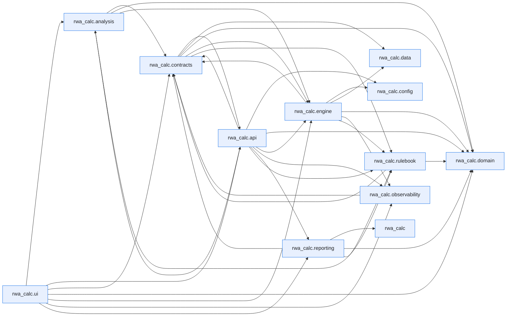

# Module Dependencies

This page is generated by ``scripts/generate_dependency_graph.py`` from the live
import graph of ``src/rwa_calc``, built with the [`curfew`](https://github.com/OpenAfterHours)
dependency tool. It is a snapshot of how the code actually imports itself — not a
hand-drawn design diagram.

Regenerate after structural refactors:

```bash
uv run python scripts/generate_dependency_graph.py
```

Inspect a single module's dependencies and dependents directly:

```bash
uv run curfew report rwa_calc.engine.stages.classify
```

Last generated: 2026-08-09.


## Package overview

Each node is a top-level subpackage of `rwa_calc`; an arrow `A --> B` means some module in `A` imports some module in `B`. Module-level imports are collapsed to their package here for readability.


```mermaid
flowchart LR
    p0["rwa_calc"]
    p1["rwa_calc.analysis"]
    p2["rwa_calc.api"]
    p3["rwa_calc.config"]
    p4["rwa_calc.contracts"]
    p5["rwa_calc.data"]
    p6["rwa_calc.domain"]
    p7["rwa_calc.engine"]
    p8["rwa_calc.observability"]
    p9["rwa_calc.reporting"]
    p10["rwa_calc.rulebook"]
    p11["rwa_calc.ui"]
    p1 --> p4
    p1 --> p6
    p1 --> p7
    p1 --> p10
    p2 --> p1
    p2 --> p3
    p2 --> p4
    p2 --> p6
    p2 --> p7
    p2 --> p8
    p2 --> p9
    p2 --> p10
    p4 --> p2
    p4 --> p5
    p4 --> p6
    p4 --> p7
    p4 --> p10
    p7 --> p3
    p7 --> p4
    p7 --> p5
    p7 --> p6
    p7 --> p8
    p7 --> p10
    p8 --> p4
    p9 --> p0
    p9 --> p4
    p9 --> p6
    p9 --> p10
    p10 --> p4
    p10 --> p6
    p11 --> p1
    p11 --> p2
    p11 --> p4
    p11 --> p6
    p11 --> p7
    p11 --> p8
    p11 --> p9
    classDef first_party fill:#e8f0fe,stroke:#1a73e8,color:#202124
    class p0,p1,p2,p3,p4,p5,p6,p7,p8,p9,p10,p11 first_party
```

## Full module graph

The complete graph, one node per module, exactly as `curfew show --mermaid` emits it.

??? note "Full module-level graph (240 modules)"

    ```mermaid
    flowchart LR
        n0["rwa_calc"]
        n1["rwa_calc.analysis"]
        n2["rwa_calc.analysis.attribution"]
        n3["rwa_calc.analysis.comparison"]
        n4["rwa_calc.analysis.recon_registry"]
        n5["rwa_calc.analysis.reconciliation"]
        n6["rwa_calc.analysis.transition"]
        n7["rwa_calc.api"]
        n8["rwa_calc.api.errors"]
        n9["rwa_calc.api.export"]
        n10["rwa_calc.api.formatters"]
        n11["rwa_calc.api.models"]
        n12["rwa_calc.api.reconciliation"]
        n13["rwa_calc.api.rest"]
        n14["rwa_calc.api.results_cache"]
        n15["rwa_calc.api.run_index"]
        n16["rwa_calc.api.service"]
        n17["rwa_calc.api.validation"]
        n18["rwa_calc.config"]
        n19["rwa_calc.config.data_sources"]
        n20["rwa_calc.contracts"]
        n21["rwa_calc.contracts.bundles"]
        n22["rwa_calc.contracts.config"]
        n23["rwa_calc.contracts.context"]
        n24["rwa_calc.contracts.edges"]
        n25["rwa_calc.contracts.errors"]
        n26["rwa_calc.contracts.protocols"]
        n27["rwa_calc.contracts.results"]
        n28["rwa_calc.contracts.validation"]
        n29["rwa_calc.data"]
        n30["rwa_calc.data.column_spec"]
        n31["rwa_calc.data.schemas"]
        n32["rwa_calc.domain"]
        n33["rwa_calc.domain.enums"]
        n34["rwa_calc.engine"]
        n35["rwa_calc.engine.aggregator"]
        n36["rwa_calc.engine.aggregator._collapse"]
        n37["rwa_calc.engine.aggregator._el_summary"]
        n38["rwa_calc.engine.aggregator._equity_prep"]
        n39["rwa_calc.engine.aggregator._floor"]
        n40["rwa_calc.engine.aggregator._lgd_floor_check"]
        n41["rwa_calc.engine.aggregator._schemas"]
        n42["rwa_calc.engine.aggregator._securitisation"]
        n43["rwa_calc.engine.aggregator._summaries"]
        n44["rwa_calc.engine.aggregator._supporting_factors"]
        n45["rwa_calc.engine.aggregator._utils"]
        n46["rwa_calc.engine.aggregator.aggregator"]
        n47["rwa_calc.engine.ccf"]
        n48["rwa_calc.engine.ccr"]
        n49["rwa_calc.engine.ccr.adjusted_notional"]
        n50["rwa_calc.engine.ccr.ccp"]
        n51["rwa_calc.engine.ccr.default_fund"]
        n52["rwa_calc.engine.ccr.failed_trades"]
        n53["rwa_calc.engine.ccr.hedging_sets"]
        n54["rwa_calc.engine.ccr.maturity_factor"]
        n55["rwa_calc.engine.ccr.pfe"]
        n56["rwa_calc.engine.ccr.pipeline_adapter"]
        n57["rwa_calc.engine.ccr.rc"]
        n58["rwa_calc.engine.ccr.sa_ccr"]
        n59["rwa_calc.engine.ccr.supervisory_delta"]
        n60["rwa_calc.engine.ccr.wwr"]
        n61["rwa_calc.engine.crm"]
        n62["rwa_calc.engine.crm.collateral"]
        n63["rwa_calc.engine.crm.collateral_type_check"]
        n64["rwa_calc.engine.crm.expressions"]
        n65["rwa_calc.engine.crm.guarantees"]
        n66["rwa_calc.engine.crm.haircut_tables"]
        n67["rwa_calc.engine.crm.haircuts"]
        n68["rwa_calc.engine.crm.life_insurance"]
        n69["rwa_calc.engine.crm.link_allocation"]
        n70["rwa_calc.engine.crm.look_through"]
        n71["rwa_calc.engine.crm.ofcp_routing"]
        n72["rwa_calc.engine.crm.processor"]
        n73["rwa_calc.engine.crm.provisions"]
        n74["rwa_calc.engine.crm.simple_method"]
        n75["rwa_calc.engine.crm.third_party_deposit"]
        n76["rwa_calc.engine.cva"]
        n77["rwa_calc.engine.cva.ba_cva"]
        n78["rwa_calc.engine.entity_class_maps"]
        n79["rwa_calc.engine.equity"]
        n80["rwa_calc.engine.equity.calculator"]
        n81["rwa_calc.engine.eu_sovereign"]
        n82["rwa_calc.engine.fx_rate_sync"]
        n83["rwa_calc.engine.irb"]
        n84["rwa_calc.engine.irb.adjustments"]
        n85["rwa_calc.engine.irb.calculator"]
        n86["rwa_calc.engine.irb.formulas"]
        n87["rwa_calc.engine.irb.guarantee"]
        n88["rwa_calc.engine.irb.stats_backend"]
        n89["rwa_calc.engine.irb.transforms"]
        n90["rwa_calc.engine.kernels"]
        n91["rwa_calc.engine.kernels.allocation"]
        n92["rwa_calc.engine.loader"]
        n93["rwa_calc.engine.materialise"]
        n94["rwa_calc.engine.orchestrator"]
        n95["rwa_calc.engine.pipeline"]
        n96["rwa_calc.engine.registry"]
        n97["rwa_calc.engine.sa"]
        n98["rwa_calc.engine.sa.b31_risk_weight_tables"]
        n99["rwa_calc.engine.sa.calculator"]
        n100["rwa_calc.engine.sa.central_bank"]
        n101["rwa_calc.engine.sa.covered_bond"]
        n102["rwa_calc.engine.sa.cqs_lift"]
        n103["rwa_calc.engine.sa.crr_risk_weight_tables"]
        n104["rwa_calc.engine.sa.factors_output"]
        n105["rwa_calc.engine.sa.guarantor_rw"]
        n106["rwa_calc.engine.sa.jurisdiction"]
        n107["rwa_calc.engine.sa.rgla"]
        n108["rwa_calc.engine.sa.risk_weights"]
        n109["rwa_calc.engine.sa.rw_adjustments"]
        n110["rwa_calc.engine.securitisation"]
        n111["rwa_calc.engine.securitisation.allocator"]
        n112["rwa_calc.engine.sft"]
        n113["rwa_calc.engine.sft.fccm"]
        n114["rwa_calc.engine.slotting"]
        n115["rwa_calc.engine.slotting.calculator"]
        n116["rwa_calc.engine.slotting.transforms"]
        n117["rwa_calc.engine.stages"]
        n118["rwa_calc.engine.stages._ccr_shared"]
        n119["rwa_calc.engine.stages.aggregate"]
        n120["rwa_calc.engine.stages.calc"]
        n121["rwa_calc.engine.stages.ccr"]
        n122["rwa_calc.engine.stages.classify"]
        n123["rwa_calc.engine.stages.classify.approach"]
        n124["rwa_calc.engine.stages.classify.attributes"]
        n125["rwa_calc.engine.stages.classify.audit"]
        n126["rwa_calc.engine.stages.classify.classifier"]
        n127["rwa_calc.engine.stages.classify.permissions"]
        n128["rwa_calc.engine.stages.classify.stage"]
        n129["rwa_calc.engine.stages.classify.subtypes"]
        n130["rwa_calc.engine.stages.crm"]
        n131["rwa_calc.engine.stages.equity"]
        n132["rwa_calc.engine.stages.fx"]
        n133["rwa_calc.engine.stages.fx.conversion"]
        n134["rwa_calc.engine.stages.fx.converter"]
        n135["rwa_calc.engine.stages.hierarchy"]
        n136["rwa_calc.engine.stages.hierarchy.enrich"]
        n137["rwa_calc.engine.stages.hierarchy.facility_undrawn"]
        n138["rwa_calc.engine.stages.hierarchy.graph"]
        n139["rwa_calc.engine.stages.hierarchy.ratings"]
        n140["rwa_calc.engine.stages.hierarchy.resolver"]
        n141["rwa_calc.engine.stages.hierarchy.stage"]
        n142["rwa_calc.engine.stages.hierarchy.unify"]
        n143["rwa_calc.engine.stages.re_split"]
        n144["rwa_calc.engine.stages.re_split.carriers"]
        n145["rwa_calc.engine.stages.re_split.flagging"]
        n146["rwa_calc.engine.stages.re_split.params"]
        n147["rwa_calc.engine.stages.re_split.splitter"]
        n148["rwa_calc.engine.stages.re_split.stage"]
        n149["rwa_calc.engine.stages.scope"]
        n150["rwa_calc.engine.stages.scope.resolver"]
        n151["rwa_calc.engine.stages.scope.stage"]
        n152["rwa_calc.engine.stages.securitisation"]
        n153["rwa_calc.engine.stages.sft"]
        n154["rwa_calc.engine.supporting_factors"]
        n155["rwa_calc.engine.thresholds"]
        n156["rwa_calc.engine.utils"]
        n157["rwa_calc.observability"]
        n158["rwa_calc.observability.audit_cache"]
        n159["rwa_calc.observability.context"]
        n160["rwa_calc.observability.formatters"]
        n161["rwa_calc.observability.logging_setup"]
        n162["rwa_calc.reporting"]
        n163["rwa_calc.reporting.catalog"]
        n164["rwa_calc.reporting.cellspec"]
        n165["rwa_calc.reporting.corep"]
        n166["rwa_calc.reporting.corep.c02"]
        n167["rwa_calc.reporting.corep.c07"]
        n168["rwa_calc.reporting.corep.c08"]
        n169["rwa_calc.reporting.corep.c08_07"]
        n170["rwa_calc.reporting.corep.c09"]
        n171["rwa_calc.reporting.corep.c34"]
        n172["rwa_calc.reporting.corep.crm_substitution"]
        n173["rwa_calc.reporting.corep.generator"]
        n174["rwa_calc.reporting.corep.of02"]
        n175["rwa_calc.reporting.corep.pd_scale"]
        n176["rwa_calc.reporting.corep.postpass"]
        n177["rwa_calc.reporting.corep.templates"]
        n178["rwa_calc.reporting.facts"]
        n179["rwa_calc.reporting.kernel"]
        n180["rwa_calc.reporting.kernel.bases"]
        n181["rwa_calc.reporting.kernel.columns"]
        n182["rwa_calc.reporting.kernel.excel"]
        n183["rwa_calc.reporting.kernel.filters"]
        n184["rwa_calc.reporting.kernel.rows"]
        n185["rwa_calc.reporting.kernel.sums"]
        n186["rwa_calc.reporting.lineage"]
        n187["rwa_calc.reporting.metadata"]
        n188["rwa_calc.reporting.pillar3"]
        n189["rwa_calc.reporting.pillar3.ccr"]
        n190["rwa_calc.reporting.pillar3.cms1"]
        n191["rwa_calc.reporting.pillar3.cms2"]
        n192["rwa_calc.reporting.pillar3.cr10"]
        n193["rwa_calc.reporting.pillar3.cr4"]
        n194["rwa_calc.reporting.pillar3.cr5"]
        n195["rwa_calc.reporting.pillar3.cr6"]
        n196["rwa_calc.reporting.pillar3.cr6a"]
        n197["rwa_calc.reporting.pillar3.cr7"]
        n198["rwa_calc.reporting.pillar3.cr7a"]
        n199["rwa_calc.reporting.pillar3.cr8"]
        n200["rwa_calc.reporting.pillar3.cr9"]
        n201["rwa_calc.reporting.pillar3.generator"]
        n202["rwa_calc.reporting.pillar3.irb_scope"]
        n203["rwa_calc.reporting.pillar3.ov1"]
        n204["rwa_calc.reporting.pillar3.sa_scope"]
        n205["rwa_calc.reporting.pillar3.templates"]
        n206["rwa_calc.reporting.plans"]
        n207["rwa_calc.reporting.tieouts"]
        n208["rwa_calc.reporting.validations"]
        n209["rwa_calc.reporting.validations.checker"]
        n210["rwa_calc.reporting.validations.evaluate"]
        n211["rwa_calc.reporting.validations.rules"]
        n212["rwa_calc.reporting.validations.scope"]
        n213["rwa_calc.rulebook"]
        n214["rwa_calc.rulebook.audit"]
        n215["rwa_calc.rulebook.compile"]
        n216["rwa_calc.rulebook.model"]
        n217["rwa_calc.rulebook.packs"]
        n218["rwa_calc.rulebook.packs.b31"]
        n219["rwa_calc.rulebook.packs.common"]
        n220["rwa_calc.rulebook.packs.crr"]
        n221["rwa_calc.rulebook.registry"]
        n222["rwa_calc.rulebook.resolve"]
        n223["rwa_calc.rulebook.v0"]
        n224["rwa_calc.ui"]
        n225["rwa_calc.ui.app"]
        n226["rwa_calc.ui.app.calculator_state"]
        n227["rwa_calc.ui.app.main"]
        n228["rwa_calc.ui.app.output_writer"]
        n229["rwa_calc.ui.app.progress"]
        n230["rwa_calc.ui.app.recon_signoff"]
        n231["rwa_calc.ui.app.recon_state"]
        n232["rwa_calc.ui.views"]
        n233["rwa_calc.ui.views.charts"]
        n234["rwa_calc.ui.views.comparison"]
        n235["rwa_calc.ui.views.hierarchy"]
        n236["rwa_calc.ui.views.lineage"]
        n237["rwa_calc.ui.views.method_split"]
        n238["rwa_calc.ui.views.reconciliation"]
        n239["rwa_calc.ui.views.report_templates"]
        n2 --> n21
        n3 --> n2
        n3 --> n21
        n3 --> n22
        n3 --> n95
        n3 --> n213
        n3 --> n222
        n5 --> n4
        n5 --> n21
        n5 --> n25
        n5 --> n36
        n5 --> n43
        n6 --> n21
        n6 --> n22
        n6 --> n33
        n6 --> n95
        n7 --> n4
        n7 --> n9
        n7 --> n11
        n7 --> n12
        n7 --> n13
        n7 --> n14
        n7 --> n16
        n7 --> n17
        n8 --> n11
        n8 --> n25
        n9 --> n11
        n9 --> n21
        n9 --> n22
        n9 --> n25
        n9 --> n27
        n9 --> n173
        n9 --> n178
        n9 --> n201
        n9 --> n208
        n10 --> n8
        n10 --> n11
        n10 --> n14
        n10 --> n21
        n11 --> n5
        n11 --> n8
        n11 --> n9
        n11 --> n21
        n12 --> n4
        n13 --> n9
        n13 --> n11
        n13 --> n12
        n13 --> n15
        n13 --> n16
        n13 --> n17
        n13 --> n33
        n13 --> n163
        n13 --> n173
        n13 --> n178
        n13 --> n186
        n13 --> n201
        n13 --> n208
        n15 --> n11
        n15 --> n21
        n16 --> n5
        n16 --> n8
        n16 --> n10
        n16 --> n11
        n16 --> n12
        n16 --> n14
        n16 --> n17
        n16 --> n21
        n16 --> n22
        n16 --> n26
        n16 --> n33
        n16 --> n92
        n16 --> n95
        n16 --> n157
        n16 --> n213
        n17 --> n8
        n17 --> n11
        n17 --> n19
        n20 --> n21
        n20 --> n22
        n20 --> n24
        n20 --> n25
        n20 --> n26
        n20 --> n28
        n20 --> n33
        n21 --> n24
        n21 --> n25
        n21 --> n33
        n22 --> n33
        n24 --> n30
        n24 --> n31
        n25 --> n33
        n26 --> n11
        n26 --> n21
        n26 --> n22
        n26 --> n25
        n26 --> n27
        n26 --> n69
        n26 --> n222
        n28 --> n21
        n28 --> n24
        n28 --> n25
        n28 --> n30
        n28 --> n31
        n31 --> n30
        n32 --> n33
        n34 --> n92
        n34 --> n95
        n34 --> n135
        n35 --> n46
        n36 --> n31
        n37 --> n21
        n37 --> n41
        n37 --> n45
        n38 --> n33
        n39 --> n21
        n39 --> n41
        n39 --> n45
        n39 --> n215
        n39 --> n222
        n40 --> n25
        n40 --> n33
        n40 --> n222
        n44 --> n41
        n44 --> n45
        n46 --> n21
        n46 --> n22
        n46 --> n24
        n46 --> n25
        n46 --> n33
        n46 --> n37
        n46 --> n38
        n46 --> n39
        n46 --> n40
        n46 --> n41
        n46 --> n42
        n46 --> n43
        n46 --> n44
        n46 --> n108
        n46 --> n213
        n46 --> n222
        n47 --> n22
        n47 --> n31
        n47 --> n33
        n47 --> n213
        n47 --> n215
        n47 --> n222
        n48 --> n49
        n48 --> n53
        n48 --> n54
        n48 --> n55
        n48 --> n56
        n48 --> n57
        n48 --> n58
        n48 --> n59
        n48 --> n60
        n49 --> n215
        n49 --> n222
        n50 --> n215
        n50 --> n222
        n51 --> n22
        n51 --> n215
        n51 --> n222
        n52 --> n22
        n52 --> n215
        n52 --> n222
        n53 --> n31
        n54 --> n215
        n54 --> n222
        n55 --> n22
        n55 --> n30
        n55 --> n31
        n55 --> n57
        n55 --> n215
        n55 --> n222
        n56 --> n21
        n56 --> n22
        n56 --> n25
        n56 --> n30
        n56 --> n31
        n56 --> n33
        n56 --> n49
        n56 --> n53
        n56 --> n54
        n56 --> n55
        n56 --> n57
        n56 --> n59
        n56 --> n215
        n56 --> n222
        n58 --> n21
        n58 --> n22
        n58 --> n25
        n58 --> n33
        n59 --> n88
        n59 --> n215
        n59 --> n222
        n60 --> n21
        n60 --> n25
        n60 --> n30
        n60 --> n31
        n60 --> n33
        n60 --> n215
        n60 --> n222
        n61 --> n67
        n61 --> n68
        n61 --> n72
        n62 --> n22
        n62 --> n25
        n62 --> n30
        n62 --> n31
        n62 --> n33
        n62 --> n64
        n62 --> n67
        n62 --> n158
        n62 --> n213
        n62 --> n215
        n62 --> n222
        n63 --> n25
        n63 --> n64
        n64 --> n31
        n64 --> n91
        n64 --> n215
        n64 --> n222
        n65 --> n22
        n65 --> n25
        n65 --> n30
        n65 --> n31
        n65 --> n33
        n65 --> n47
        n65 --> n64
        n65 --> n78
        n65 --> n81
        n65 --> n91
        n65 --> n156
        n65 --> n213
        n65 --> n215
        n65 --> n222
        n66 --> n222
        n67 --> n22
        n67 --> n30
        n67 --> n31
        n67 --> n66
        n67 --> n213
        n67 --> n215
        n67 --> n222
        n68 --> n22
        n68 --> n25
        n68 --> n31
        n68 --> n81
        n68 --> n156
        n68 --> n215
        n68 --> n222
        n69 --> n22
        n69 --> n25
        n69 --> n64
        n69 --> n91
        n70 --> n25
        n70 --> n30
        n71 --> n22
        n71 --> n30
        n71 --> n33
        n71 --> n62
        n71 --> n213
        n71 --> n222
        n72 --> n21
        n72 --> n22
        n72 --> n24
        n72 --> n25
        n72 --> n33
        n72 --> n47
        n72 --> n62
        n72 --> n63
        n72 --> n64
        n72 --> n65
        n72 --> n67
        n72 --> n68
        n72 --> n69
        n72 --> n70
        n72 --> n71
        n72 --> n73
        n72 --> n74
        n72 --> n75
        n72 --> n91
        n72 --> n93
        n72 --> n108
        n72 --> n156
        n72 --> n158
        n72 --> n213
        n72 --> n222
        n73 --> n22
        n73 --> n33
        n73 --> n47
        n73 --> n91
        n73 --> n213
        n73 --> n222
        n74 --> n22
        n74 --> n33
        n74 --> n98
        n74 --> n103
        n74 --> n213
        n74 --> n215
        n74 --> n222
        n75 --> n25
        n75 --> n31
        n75 --> n33
        n75 --> n105
        n76 --> n77
        n77 --> n215
        n77 --> n222
        n78 --> n222
        n79 --> n80
        n80 --> n21
        n80 --> n22
        n80 --> n25
        n80 --> n30
        n80 --> n33
        n80 --> n86
        n80 --> n98
        n80 --> n103
        n80 --> n213
        n80 --> n215
        n80 --> n222
        n81 --> n222
        n83 --> n85
        n83 --> n86
        n84 --> n22
        n84 --> n25
        n84 --> n33
        n84 --> n213
        n84 --> n222
        n85 --> n22
        n85 --> n25
        n85 --> n89
        n85 --> n154
        n85 --> n213
        n85 --> n222
        n86 --> n22
        n86 --> n33
        n86 --> n64
        n86 --> n84
        n86 --> n88
        n86 --> n155
        n86 --> n213
        n86 --> n215
        n86 --> n222
        n87 --> n22
        n87 --> n65
        n87 --> n78
        n87 --> n81
        n87 --> n86
        n87 --> n105
        n87 --> n155
        n87 --> n213
        n87 --> n215
        n87 --> n222
        n89 --> n22
        n89 --> n25
        n89 --> n30
        n89 --> n33
        n89 --> n84
        n89 --> n86
        n89 --> n87
        n89 --> n155
        n89 --> n156
        n89 --> n213
        n89 --> n215
        n89 --> n222
        n90 --> n91
        n91 --> n31
        n91 --> n156
        n92 --> n19
        n92 --> n21
        n92 --> n24
        n92 --> n25
        n92 --> n26
        n92 --> n28
        n92 --> n30
        n92 --> n31
        n92 --> n156
        n93 --> n22
        n93 --> n24
        n94 --> n21
        n94 --> n22
        n94 --> n23
        n94 --> n24
        n94 --> n25
        n94 --> n26
        n94 --> n35
        n94 --> n72
        n94 --> n80
        n94 --> n85
        n94 --> n99
        n94 --> n111
        n94 --> n115
        n94 --> n122
        n94 --> n135
        n94 --> n143
        n94 --> n157
        n94 --> n213
        n95 --> n21
        n95 --> n22
        n95 --> n23
        n95 --> n26
        n95 --> n28
        n95 --> n33
        n95 --> n82
        n95 --> n92
        n95 --> n93
        n95 --> n94
        n95 --> n96
        n95 --> n157
        n95 --> n158
        n95 --> n213
        n95 --> n214
        n96 --> n94
        n96 --> n119
        n96 --> n120
        n96 --> n121
        n96 --> n122
        n96 --> n130
        n96 --> n131
        n96 --> n135
        n96 --> n143
        n96 --> n149
        n96 --> n152
        n96 --> n153
        n97 --> n99
        n98 --> n33
        n98 --> n103
        n98 --> n222
        n99 --> n22
        n99 --> n25
        n99 --> n33
        n99 --> n104
        n99 --> n108
        n99 --> n109
        n99 --> n213
        n99 --> n222
        n100 --> n103
        n100 --> n222
        n101 --> n33
        n101 --> n98
        n101 --> n103
        n103 --> n33
        n103 --> n222
        n104 --> n22
        n104 --> n25
        n104 --> n30
        n104 --> n154
        n104 --> n222
        n105 --> n33
        n105 --> n78
        n105 --> n215
        n105 --> n222
        n107 --> n33
        n107 --> n103
        n108 --> n22
        n108 --> n30
        n108 --> n31
        n108 --> n33
        n108 --> n81
        n108 --> n98
        n108 --> n100
        n108 --> n101
        n108 --> n102
        n108 --> n103
        n108 --> n105
        n108 --> n106
        n108 --> n107
        n108 --> n213
        n108 --> n215
        n108 --> n222
        n109 --> n22
        n109 --> n25
        n109 --> n33
        n109 --> n65
        n109 --> n78
        n109 --> n81
        n109 --> n105
        n109 --> n108
        n109 --> n213
        n109 --> n215
        n109 --> n222
        n110 --> n111
        n111 --> n21
        n111 --> n22
        n111 --> n25
        n111 --> n33
        n112 --> n113
        n113 --> n21
        n113 --> n66
        n113 --> n222
        n114 --> n115
        n115 --> n22
        n115 --> n25
        n115 --> n116
        n115 --> n154
        n115 --> n213
        n115 --> n222
        n116 --> n22
        n116 --> n25
        n116 --> n109
        n116 --> n156
        n116 --> n213
        n116 --> n215
        n116 --> n216
        n116 --> n222
        n118 --> n21
        n119 --> n22
        n119 --> n23
        n119 --> n24
        n119 --> n76
        n119 --> n94
        n119 --> n213
        n120 --> n22
        n120 --> n23
        n120 --> n24
        n120 --> n25
        n120 --> n30
        n120 --> n33
        n120 --> n41
        n120 --> n93
        n120 --> n94
        n120 --> n154
        n120 --> n213
        n121 --> n22
        n121 --> n23
        n121 --> n24
        n121 --> n48
        n121 --> n51
        n121 --> n52
        n121 --> n93
        n121 --> n94
        n121 --> n118
        n121 --> n213
        n122 --> n126
        n122 --> n128
        n123 --> n22
        n123 --> n30
        n123 --> n31
        n123 --> n33
        n123 --> n81
        n123 --> n124
        n123 --> n127
        n123 --> n155
        n123 --> n213
        n123 --> n222
        n124 --> n22
        n124 --> n31
        n124 --> n33
        n124 --> n78
        n124 --> n155
        n124 --> n156
        n124 --> n213
        n124 --> n222
        n125 --> n21
        n125 --> n22
        n125 --> n25
        n125 --> n33
        n125 --> n124
        n125 --> n129
        n125 --> n155
        n125 --> n213
        n125 --> n222
        n126 --> n21
        n126 --> n22
        n126 --> n24
        n126 --> n25
        n126 --> n93
        n126 --> n123
        n126 --> n124
        n126 --> n125
        n126 --> n127
        n126 --> n129
        n126 --> n145
        n126 --> n213
        n126 --> n222
        n127 --> n22
        n127 --> n25
        n127 --> n33
        n128 --> n22
        n128 --> n23
        n128 --> n94
        n128 --> n158
        n128 --> n213
        n129 --> n22
        n129 --> n31
        n129 --> n33
        n129 --> n86
        n129 --> n124
        n129 --> n155
        n129 --> n156
        n129 --> n213
        n129 --> n222
        n130 --> n22
        n130 --> n23
        n130 --> n94
        n130 --> n213
        n131 --> n22
        n131 --> n23
        n131 --> n94
        n131 --> n158
        n131 --> n213
        n132 --> n133
        n132 --> n134
        n133 --> n22
        n133 --> n134
        n134 --> n22
        n135 --> n140
        n135 --> n141
        n136 --> n21
        n136 --> n25
        n136 --> n78
        n136 --> n91
        n136 --> n156
        n137 --> n21
        n137 --> n22
        n137 --> n47
        n137 --> n105
        n137 --> n138
        n137 --> n156
        n138 --> n21
        n138 --> n24
        n138 --> n25
        n138 --> n33
        n138 --> n139
        n138 --> n156
        n140 --> n21
        n140 --> n22
        n140 --> n24
        n140 --> n25
        n140 --> n132
        n140 --> n136
        n140 --> n137
        n140 --> n138
        n140 --> n139
        n140 --> n142
        n141 --> n22
        n141 --> n23
        n141 --> n24
        n141 --> n93
        n141 --> n94
        n141 --> n111
        n141 --> n158
        n141 --> n213
        n142 --> n21
        n142 --> n22
        n142 --> n25
        n142 --> n136
        n142 --> n137
        n142 --> n138
        n143 --> n145
        n143 --> n147
        n143 --> n148
        n145 --> n22
        n145 --> n33
        n145 --> n213
        n145 --> n222
        n146 --> n215
        n146 --> n222
        n147 --> n21
        n147 --> n22
        n147 --> n24
        n147 --> n25
        n147 --> n33
        n147 --> n144
        n147 --> n146
        n147 --> n213
        n147 --> n222
        n148 --> n22
        n148 --> n23
        n148 --> n24
        n148 --> n93
        n148 --> n94
        n148 --> n158
        n148 --> n213
        n149 --> n150
        n149 --> n151
        n150 --> n21
        n150 --> n22
        n150 --> n24
        n150 --> n25
        n150 --> n33
        n151 --> n22
        n151 --> n23
        n151 --> n94
        n151 --> n150
        n151 --> n213
        n152 --> n22
        n152 --> n23
        n152 --> n94
        n152 --> n213
        n153 --> n22
        n153 --> n23
        n153 --> n24
        n153 --> n93
        n153 --> n94
        n153 --> n113
        n153 --> n118
        n153 --> n213
        n154 --> n22
        n154 --> n25
        n154 --> n33
        n154 --> n155
        n154 --> n213
        n154 --> n215
        n154 --> n222
        n155 --> n222
        n157 --> n158
        n157 --> n159
        n157 --> n160
        n157 --> n161
        n158 --> n22
        n158 --> n159
        n161 --> n159
        n161 --> n160
        n162 --> n173
        n162 --> n201
        n162 --> n207
        n163 --> n173
        n163 --> n177
        n163 --> n201
        n163 --> n205
        n164 --> n179
        n164 --> n187
        n165 --> n173
        n165 --> n177
        n166 --> n21
        n166 --> n22
        n166 --> n177
        n166 --> n179
        n167 --> n33
        n167 --> n164
        n167 --> n172
        n167 --> n176
        n167 --> n177
        n167 --> n179
        n167 --> n180
        n167 --> n187
        n167 --> n206
        n168 --> n164
        n168 --> n172
        n168 --> n175
        n168 --> n176
        n168 --> n177
        n168 --> n179
        n168 --> n187
        n168 --> n206
        n169 --> n164
        n169 --> n177
        n169 --> n179
        n169 --> n187
        n169 --> n206
        n170 --> n164
        n170 --> n167
        n170 --> n176
        n170 --> n177
        n170 --> n179
        n170 --> n187
        n170 --> n206
        n171 --> n164
        n171 --> n177
        n171 --> n179
        n171 --> n187
        n171 --> n206
        n173 --> n21
        n173 --> n22
        n173 --> n27
        n173 --> n166
        n173 --> n167
        n173 --> n168
        n173 --> n169
        n173 --> n170
        n173 --> n171
        n173 --> n174
        n173 --> n177
        n173 --> n178
        n173 --> n179
        n173 --> n187
        n174 --> n22
        n174 --> n164
        n174 --> n177
        n174 --> n187
        n174 --> n206
        n175 --> n177
        n176 --> n164
        n176 --> n172
        n176 --> n179
        n178 --> n0
        n178 --> n163
        n178 --> n173
        n178 --> n201
        n179 --> n180
        n179 --> n181
        n179 --> n182
        n179 --> n183
        n179 --> n184
        n179 --> n185
        n183 --> n181
        n186 --> n164
        n186 --> n167
        n186 --> n168
        n186 --> n169
        n186 --> n170
        n186 --> n171
        n186 --> n174
        n186 --> n179
        n186 --> n187
        n186 --> n189
        n186 --> n190
        n186 --> n191
        n186 --> n192
        n186 --> n193
        n186 --> n194
        n186 --> n195
        n186 --> n196
        n186 --> n197
        n186 --> n198
        n186 --> n199
        n186 --> n200
        n186 --> n203
        n186 --> n206
        n187 --> n21
        n187 --> n216
        n188 --> n201
        n189 --> n164
        n189 --> n179
        n189 --> n187
        n189 --> n205
        n189 --> n206
        n190 --> n164
        n190 --> n187
        n190 --> n205
        n190 --> n206
        n191 --> n164
        n191 --> n187
        n191 --> n190
        n191 --> n205
        n191 --> n206
        n192 --> n33
        n192 --> n164
        n192 --> n187
        n192 --> n202
        n192 --> n205
        n192 --> n206
        n193 --> n164
        n193 --> n187
        n193 --> n204
        n193 --> n205
        n193 --> n206
        n194 --> n164
        n194 --> n187
        n194 --> n204
        n194 --> n205
        n194 --> n206
        n195 --> n164
        n195 --> n187
        n195 --> n202
        n195 --> n205
        n195 --> n206
        n196 --> n164
        n196 --> n187
        n196 --> n205
        n196 --> n206
        n197 --> n164
        n197 --> n187
        n197 --> n205
        n197 --> n206
        n198 --> n164
        n198 --> n187
        n198 --> n205
        n198 --> n206
        n199 --> n164
        n199 --> n179
        n199 --> n187
        n199 --> n205
        n199 --> n206
        n200 --> n164
        n200 --> n187
        n200 --> n205
        n200 --> n206
        n201 --> n21
        n201 --> n27
        n201 --> n178
        n201 --> n179
        n201 --> n187
        n201 --> n189
        n201 --> n190
        n201 --> n191
        n201 --> n192
        n201 --> n193
        n201 --> n194
        n201 --> n195
        n201 --> n196
        n201 --> n197
        n201 --> n198
        n201 --> n199
        n201 --> n200
        n201 --> n203
        n201 --> n205
        n203 --> n21
        n203 --> n164
        n203 --> n187
        n203 --> n205
        n203 --> n206
        n206 --> n164
        n206 --> n187
        n207 --> n25
        n207 --> n33
        n207 --> n173
        n207 --> n201
        n208 --> n209
        n208 --> n210
        n208 --> n211
        n208 --> n212
        n209 --> n25
        n209 --> n33
        n209 --> n173
        n209 --> n201
        n209 --> n210
        n209 --> n211
        n209 --> n212
        n210 --> n211
        n210 --> n212
        n212 --> n173
        n212 --> n201
        n212 --> n211
        n213 --> n223
        n214 --> n222
        n215 --> n216
        n218 --> n33
        n218 --> n216
        n219 --> n33
        n219 --> n216
        n220 --> n33
        n220 --> n216
        n221 --> n33
        n222 --> n216
        n222 --> n221
        n223 --> n22
        n223 --> n33
        n223 --> n221
        n223 --> n222
        n227 --> n3
        n227 --> n10
        n227 --> n11
        n227 --> n12
        n227 --> n13
        n227 --> n14
        n227 --> n15
        n227 --> n16
        n227 --> n17
        n227 --> n21
        n227 --> n22
        n227 --> n33
        n227 --> n92
        n227 --> n157
        n227 --> n163
        n227 --> n186
        n227 --> n226
        n227 --> n228
        n227 --> n229
        n227 --> n230
        n227 --> n231
        n227 --> n233
        n227 --> n234
        n227 --> n235
        n227 --> n236
        n227 --> n237
        n227 --> n238
        n227 --> n239
        n228 --> n11
        n228 --> n27
        n229 --> n96
        n234 --> n21
        n236 --> n186
        n236 --> n239
        n237 --> n233
        n238 --> n4
        n238 --> n5
        n238 --> n11
        n238 --> n230
        n238 --> n237
        n239 --> n163
        n239 --> n173
        n239 --> n186
        n239 --> n201
        classDef first_party fill:#e8f0fe,stroke:#1a73e8,color:#202124
        class n0,n1,n2,n3,n4,n5,n6,n7,n8,n9,n10,n11,n12,n13,n14,n15,n16,n17,n18,n19,n20,n21,n22,n23,n24,n25,n26,n27,n28,n29,n30,n31,n32,n33,n34,n35,n36,n37,n38,n39,n40,n41,n42,n43,n44,n45,n46,n47,n48,n49,n50,n51,n52,n53,n54,n55,n56,n57,n58,n59,n60,n61,n62,n63,n64,n65,n66,n67,n68,n69,n70,n71,n72,n73,n74,n75,n76,n77,n78,n79,n80,n81,n82,n83,n84,n85,n86,n87,n88,n89,n90,n91,n92,n93,n94,n95,n96,n97,n98,n99,n100,n101,n102,n103,n104,n105,n106,n107,n108,n109,n110,n111,n112,n113,n114,n115,n116,n117,n118,n119,n120,n121,n122,n123,n124,n125,n126,n127,n128,n129,n130,n131,n132,n133,n134,n135,n136,n137,n138,n139,n140,n141,n142,n143,n144,n145,n146,n147,n148,n149,n150,n151,n152,n153,n154,n155,n156,n157,n158,n159,n160,n161,n162,n163,n164,n165,n166,n167,n168,n169,n170,n171,n172,n173,n174,n175,n176,n177,n178,n179,n180,n181,n182,n183,n184,n185,n186,n187,n188,n189,n190,n191,n192,n193,n194,n195,n196,n197,n198,n199,n200,n201,n202,n203,n204,n205,n206,n207,n208,n209,n210,n211,n212,n213,n214,n215,n216,n217,n218,n219,n220,n221,n222,n223,n224,n225,n226,n227,n228,n229,n230,n231,n232,n233,n234,n235,n236,n237,n238,n239 first_party
    ```

