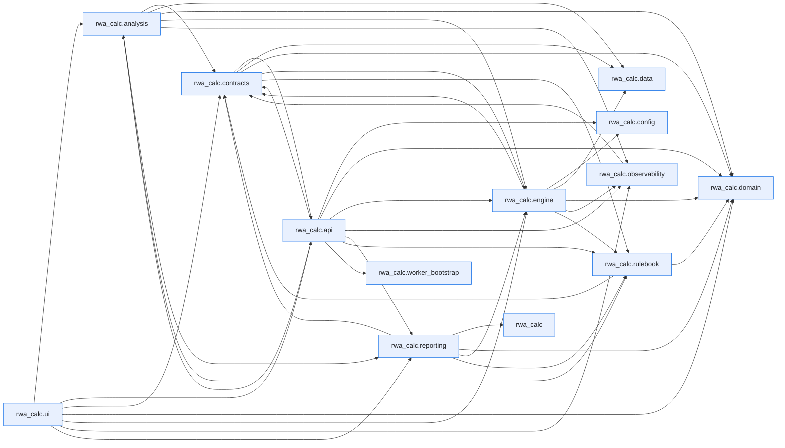

# Module Dependencies

This page is generated by ``scripts/generate_dependency_graph.py`` from the live
import graph of ``src/rwa_calc``, built with the [`curfew`](https://github.com/OpenAfterHours)
dependency tool. It is a snapshot of how the code actually imports itself — not a
hand-drawn design diagram.

Regenerate after structural refactors:

```bash
uv run python scripts/generate_dependency_graph.py
```

Inspect a single module's dependencies and dependents directly:

```bash
uv run curfew report rwa_calc.engine.classify
```

Last generated: 2026-08-31.


## Package overview

Each node is a top-level subpackage of `rwa_calc`; an arrow `A --> B` means some module in `A` imports some module in `B`. Module-level imports are collapsed to their package here for readability.


```mermaid
flowchart LR
    p0["rwa_calc"]
    p1["rwa_calc.analysis"]
    p2["rwa_calc.api"]
    p3["rwa_calc.config"]
    p4["rwa_calc.contracts"]
    p5["rwa_calc.data"]
    p6["rwa_calc.domain"]
    p7["rwa_calc.engine"]
    p8["rwa_calc.observability"]
    p9["rwa_calc.reporting"]
    p10["rwa_calc.rulebook"]
    p11["rwa_calc.ui"]
    p12["rwa_calc.worker_bootstrap"]
    p1 --> p4
    p1 --> p5
    p1 --> p6
    p1 --> p7
    p1 --> p8
    p1 --> p9
    p1 --> p10
    p2 --> p1
    p2 --> p3
    p2 --> p4
    p2 --> p6
    p2 --> p7
    p2 --> p8
    p2 --> p9
    p2 --> p10
    p2 --> p12
    p4 --> p2
    p4 --> p5
    p4 --> p6
    p4 --> p7
    p4 --> p10
    p7 --> p3
    p7 --> p4
    p7 --> p5
    p7 --> p6
    p7 --> p8
    p7 --> p10
    p8 --> p4
    p9 --> p0
    p9 --> p4
    p9 --> p6
    p9 --> p7
    p9 --> p10
    p10 --> p4
    p10 --> p6
    p11 --> p1
    p11 --> p2
    p11 --> p4
    p11 --> p6
    p11 --> p7
    p11 --> p8
    p11 --> p9
    classDef first_party fill:#e8f0fe,stroke:#1a73e8,color:#202124
    class p0,p1,p2,p3,p4,p5,p6,p7,p8,p9,p10,p11,p12 first_party
```

## Full module graph

The complete graph, one node per module, exactly as `curfew show --mermaid` emits it.

??? note "Full module-level graph (257 modules)"

    ```mermaid
    flowchart LR
        n0["rwa_calc"]
        n1["rwa_calc.analysis"]
        n2["rwa_calc.analysis.attribution"]
        n3["rwa_calc.analysis.comparison"]
        n4["rwa_calc.analysis.legacy_ledger"]
        n5["rwa_calc.analysis.recon_registry"]
        n6["rwa_calc.analysis.reconciliation"]
        n7["rwa_calc.analysis.return_recon"]
        n8["rwa_calc.analysis.transition"]
        n9["rwa_calc.api"]
        n10["rwa_calc.api.batch"]
        n11["rwa_calc.api.errors"]
        n12["rwa_calc.api.export"]
        n13["rwa_calc.api.formatters"]
        n14["rwa_calc.api.models"]
        n15["rwa_calc.api.reconciliation"]
        n16["rwa_calc.api.rest"]
        n17["rwa_calc.api.results_cache"]
        n18["rwa_calc.api.run_index"]
        n19["rwa_calc.api.service"]
        n20["rwa_calc.api.validation"]
        n21["rwa_calc.config"]
        n22["rwa_calc.config.data_sources"]
        n23["rwa_calc.contracts"]
        n24["rwa_calc.contracts.bundles"]
        n25["rwa_calc.contracts.config"]
        n26["rwa_calc.contracts.context"]
        n27["rwa_calc.contracts.edges"]
        n28["rwa_calc.contracts.errors"]
        n29["rwa_calc.contracts.protocols"]
        n30["rwa_calc.contracts.results"]
        n31["rwa_calc.contracts.validation"]
        n32["rwa_calc.data"]
        n33["rwa_calc.data.column_spec"]
        n34["rwa_calc.data.schemas"]
        n35["rwa_calc.domain"]
        n36["rwa_calc.domain.branch_reasons"]
        n37["rwa_calc.domain.enums"]
        n38["rwa_calc.engine"]
        n39["rwa_calc.engine.aggregator"]
        n40["rwa_calc.engine.aggregator._collapse"]
        n41["rwa_calc.engine.aggregator._el_summary"]
        n42["rwa_calc.engine.aggregator._equity_prep"]
        n43["rwa_calc.engine.aggregator._floor"]
        n44["rwa_calc.engine.aggregator._lgd_floor_check"]
        n45["rwa_calc.engine.aggregator._schemas"]
        n46["rwa_calc.engine.aggregator._securitisation"]
        n47["rwa_calc.engine.aggregator._summaries"]
        n48["rwa_calc.engine.aggregator._supporting_factors"]
        n49["rwa_calc.engine.aggregator._utils"]
        n50["rwa_calc.engine.aggregator.aggregator"]
        n51["rwa_calc.engine.branch_reason"]
        n52["rwa_calc.engine.branch_split"]
        n53["rwa_calc.engine.ccf"]
        n54["rwa_calc.engine.ccr"]
        n55["rwa_calc.engine.ccr.adjusted_notional"]
        n56["rwa_calc.engine.ccr.ccp"]
        n57["rwa_calc.engine.ccr.default_fund"]
        n58["rwa_calc.engine.ccr.failed_trades"]
        n59["rwa_calc.engine.ccr.hedging_sets"]
        n60["rwa_calc.engine.ccr.maturity_factor"]
        n61["rwa_calc.engine.ccr.pfe"]
        n62["rwa_calc.engine.ccr.pipeline_adapter"]
        n63["rwa_calc.engine.ccr.rc"]
        n64["rwa_calc.engine.ccr.sa_ccr"]
        n65["rwa_calc.engine.ccr.supervisory_delta"]
        n66["rwa_calc.engine.ccr.wwr"]
        n67["rwa_calc.engine.classify"]
        n68["rwa_calc.engine.classify.approach"]
        n69["rwa_calc.engine.classify.attributes"]
        n70["rwa_calc.engine.classify.audit"]
        n71["rwa_calc.engine.classify.classifier"]
        n72["rwa_calc.engine.classify.permissions"]
        n73["rwa_calc.engine.classify.subtypes"]
        n74["rwa_calc.engine.crm"]
        n75["rwa_calc.engine.crm.collateral"]
        n76["rwa_calc.engine.crm.collateral_type_check"]
        n77["rwa_calc.engine.crm.eligibility"]
        n78["rwa_calc.engine.crm.expressions"]
        n79["rwa_calc.engine.crm.guarantees"]
        n80["rwa_calc.engine.crm.haircut_tables"]
        n81["rwa_calc.engine.crm.haircuts"]
        n82["rwa_calc.engine.crm.life_insurance"]
        n83["rwa_calc.engine.crm.link_allocation"]
        n84["rwa_calc.engine.crm.look_through"]
        n85["rwa_calc.engine.crm.min_collateralisation"]
        n86["rwa_calc.engine.crm.ofcp_routing"]
        n87["rwa_calc.engine.crm.processor"]
        n88["rwa_calc.engine.crm.provisions"]
        n89["rwa_calc.engine.crm.simple_method"]
        n90["rwa_calc.engine.crm.third_party_deposit"]
        n91["rwa_calc.engine.cva"]
        n92["rwa_calc.engine.cva.ba_cva"]
        n93["rwa_calc.engine.entity_class_maps"]
        n94["rwa_calc.engine.equity"]
        n95["rwa_calc.engine.equity.calculator"]
        n96["rwa_calc.engine.eu_sovereign"]
        n97["rwa_calc.engine.fx"]
        n98["rwa_calc.engine.fx.conversion"]
        n99["rwa_calc.engine.fx.converter"]
        n100["rwa_calc.engine.fx_rate_sync"]
        n101["rwa_calc.engine.hierarchy"]
        n102["rwa_calc.engine.hierarchy.enrich"]
        n103["rwa_calc.engine.hierarchy.facility_undrawn"]
        n104["rwa_calc.engine.hierarchy.graph"]
        n105["rwa_calc.engine.hierarchy.ratings"]
        n106["rwa_calc.engine.hierarchy.resolver"]
        n107["rwa_calc.engine.hierarchy.unify"]
        n108["rwa_calc.engine.irb"]
        n109["rwa_calc.engine.irb.adjustments"]
        n110["rwa_calc.engine.irb.calculator"]
        n111["rwa_calc.engine.irb.formulas"]
        n112["rwa_calc.engine.irb.guarantee"]
        n113["rwa_calc.engine.irb.stats_backend"]
        n114["rwa_calc.engine.irb.transforms"]
        n115["rwa_calc.engine.kernels"]
        n116["rwa_calc.engine.kernels.allocation"]
        n117["rwa_calc.engine.loader"]
        n118["rwa_calc.engine.materialise"]
        n119["rwa_calc.engine.orchestrator"]
        n120["rwa_calc.engine.pipeline"]
        n121["rwa_calc.engine.re_split"]
        n122["rwa_calc.engine.re_split.carriers"]
        n123["rwa_calc.engine.re_split.flagging"]
        n124["rwa_calc.engine.re_split.params"]
        n125["rwa_calc.engine.re_split.splitter"]
        n126["rwa_calc.engine.registry"]
        n127["rwa_calc.engine.sa"]
        n128["rwa_calc.engine.sa.b31_risk_weight_tables"]
        n129["rwa_calc.engine.sa.calculator"]
        n130["rwa_calc.engine.sa.central_bank"]
        n131["rwa_calc.engine.sa.covered_bond"]
        n132["rwa_calc.engine.sa.cqs_lift"]
        n133["rwa_calc.engine.sa.crr_risk_weight_tables"]
        n134["rwa_calc.engine.sa.factors_output"]
        n135["rwa_calc.engine.sa.guarantor_rw"]
        n136["rwa_calc.engine.sa.jurisdiction"]
        n137["rwa_calc.engine.sa.re_residual_rw"]
        n138["rwa_calc.engine.sa.rgla"]
        n139["rwa_calc.engine.sa.risk_weights"]
        n140["rwa_calc.engine.sa.rw_adjustments"]
        n141["rwa_calc.engine.sa.sovereign_derived"]
        n142["rwa_calc.engine.sa.sovereign_floor"]
        n143["rwa_calc.engine.scope"]
        n144["rwa_calc.engine.scope.resolver"]
        n145["rwa_calc.engine.securitisation"]
        n146["rwa_calc.engine.securitisation.allocator"]
        n147["rwa_calc.engine.sft"]
        n148["rwa_calc.engine.sft.fccm"]
        n149["rwa_calc.engine.slotting"]
        n150["rwa_calc.engine.slotting.calculator"]
        n151["rwa_calc.engine.slotting.transforms"]
        n152["rwa_calc.engine.stages"]
        n153["rwa_calc.engine.stages._ccr_shared"]
        n154["rwa_calc.engine.stages.aggregate"]
        n155["rwa_calc.engine.stages.calc"]
        n156["rwa_calc.engine.stages.ccr"]
        n157["rwa_calc.engine.stages.classify"]
        n158["rwa_calc.engine.stages.crm"]
        n159["rwa_calc.engine.stages.equity"]
        n160["rwa_calc.engine.stages.hierarchy"]
        n161["rwa_calc.engine.stages.re_split"]
        n162["rwa_calc.engine.stages.scope"]
        n163["rwa_calc.engine.stages.securitisation"]
        n164["rwa_calc.engine.stages.sft"]
        n165["rwa_calc.engine.supporting_factors"]
        n166["rwa_calc.engine.thresholds"]
        n167["rwa_calc.engine.utils"]
        n168["rwa_calc.observability"]
        n169["rwa_calc.observability.audit_cache"]
        n170["rwa_calc.observability.context"]
        n171["rwa_calc.observability.formatters"]
        n172["rwa_calc.observability.logging_setup"]
        n173["rwa_calc.observability.safe_values"]
        n174["rwa_calc.reporting"]
        n175["rwa_calc.reporting.catalog"]
        n176["rwa_calc.reporting.cellspec"]
        n177["rwa_calc.reporting.corep"]
        n178["rwa_calc.reporting.corep.c02"]
        n179["rwa_calc.reporting.corep.c07"]
        n180["rwa_calc.reporting.corep.c08"]
        n181["rwa_calc.reporting.corep.c08_03_cells"]
        n182["rwa_calc.reporting.corep.c08_06_cells"]
        n183["rwa_calc.reporting.corep.c08_07"]
        n184["rwa_calc.reporting.corep.c09"]
        n185["rwa_calc.reporting.corep.c34"]
        n186["rwa_calc.reporting.corep.crm_substitution"]
        n187["rwa_calc.reporting.corep.generator"]
        n188["rwa_calc.reporting.corep.of02"]
        n189["rwa_calc.reporting.corep.pd_scale"]
        n190["rwa_calc.reporting.corep.postpass"]
        n191["rwa_calc.reporting.corep.templates"]
        n192["rwa_calc.reporting.facts"]
        n193["rwa_calc.reporting.kernel"]
        n194["rwa_calc.reporting.kernel.bases"]
        n195["rwa_calc.reporting.kernel.columns"]
        n196["rwa_calc.reporting.kernel.excel"]
        n197["rwa_calc.reporting.kernel.filters"]
        n198["rwa_calc.reporting.kernel.rows"]
        n199["rwa_calc.reporting.kernel.sums"]
        n200["rwa_calc.reporting.lineage"]
        n201["rwa_calc.reporting.membership"]
        n202["rwa_calc.reporting.metadata"]
        n203["rwa_calc.reporting.pillar3"]
        n204["rwa_calc.reporting.pillar3.ccr"]
        n205["rwa_calc.reporting.pillar3.cms1"]
        n206["rwa_calc.reporting.pillar3.cms2"]
        n207["rwa_calc.reporting.pillar3.cr10"]
        n208["rwa_calc.reporting.pillar3.cr4"]
        n209["rwa_calc.reporting.pillar3.cr5"]
        n210["rwa_calc.reporting.pillar3.cr6"]
        n211["rwa_calc.reporting.pillar3.cr6a"]
        n212["rwa_calc.reporting.pillar3.cr7"]
        n213["rwa_calc.reporting.pillar3.cr7a"]
        n214["rwa_calc.reporting.pillar3.cr8"]
        n215["rwa_calc.reporting.pillar3.cr9"]
        n216["rwa_calc.reporting.pillar3.generator"]
        n217["rwa_calc.reporting.pillar3.irb_scope"]
        n218["rwa_calc.reporting.pillar3.ov1"]
        n219["rwa_calc.reporting.pillar3.sa_scope"]
        n220["rwa_calc.reporting.pillar3.templates"]
        n221["rwa_calc.reporting.plans"]
        n222["rwa_calc.reporting.tieouts"]
        n223["rwa_calc.reporting.validations"]
        n224["rwa_calc.reporting.validations.checker"]
        n225["rwa_calc.reporting.validations.evaluate"]
        n226["rwa_calc.reporting.validations.rules"]
        n227["rwa_calc.reporting.validations.scope"]
        n228["rwa_calc.rulebook"]
        n229["rwa_calc.rulebook.audit"]
        n230["rwa_calc.rulebook.compile"]
        n231["rwa_calc.rulebook.model"]
        n232["rwa_calc.rulebook.packs"]
        n233["rwa_calc.rulebook.packs.b31"]
        n234["rwa_calc.rulebook.packs.common"]
        n235["rwa_calc.rulebook.packs.crr"]
        n236["rwa_calc.rulebook.registry"]
        n237["rwa_calc.rulebook.resolve"]
        n238["rwa_calc.rulebook.v0"]
        n239["rwa_calc.ui"]
        n240["rwa_calc.ui.app"]
        n241["rwa_calc.ui.app.calculator_state"]
        n242["rwa_calc.ui.app.main"]
        n243["rwa_calc.ui.app.output_writer"]
        n244["rwa_calc.ui.app.progress"]
        n245["rwa_calc.ui.app.recon_signoff"]
        n246["rwa_calc.ui.app.recon_state"]
        n247["rwa_calc.ui.views"]
        n248["rwa_calc.ui.views.charts"]
        n249["rwa_calc.ui.views.comparison"]
        n250["rwa_calc.ui.views.hierarchy"]
        n251["rwa_calc.ui.views.lineage"]
        n252["rwa_calc.ui.views.method_split"]
        n253["rwa_calc.ui.views.reconciliation"]
        n254["rwa_calc.ui.views.report_templates"]
        n255["rwa_calc.ui.views.return_recon"]
        n256["rwa_calc.worker_bootstrap"]
        n2 --> n24
        n3 --> n2
        n3 --> n24
        n3 --> n25
        n3 --> n120
        n3 --> n228
        n3 --> n237
        n4 --> n5
        n4 --> n34
        n4 --> n37
        n4 --> n191
        n6 --> n5
        n6 --> n24
        n6 --> n28
        n6 --> n40
        n6 --> n47
        n7 --> n4
        n7 --> n168
        n7 --> n176
        n7 --> n187
        n7 --> n193
        n7 --> n200
        n7 --> n201
        n7 --> n202
        n7 --> n221
        n8 --> n24
        n8 --> n25
        n8 --> n37
        n8 --> n120
        n9 --> n5
        n9 --> n10
        n9 --> n12
        n9 --> n14
        n9 --> n15
        n9 --> n16
        n9 --> n17
        n9 --> n19
        n9 --> n20
        n10 --> n11
        n10 --> n14
        n10 --> n18
        n10 --> n19
        n10 --> n37
        n10 --> n256
        n11 --> n14
        n11 --> n28
        n12 --> n14
        n12 --> n24
        n12 --> n25
        n12 --> n28
        n12 --> n30
        n12 --> n187
        n12 --> n192
        n12 --> n193
        n12 --> n216
        n12 --> n223
        n13 --> n11
        n13 --> n14
        n13 --> n17
        n13 --> n24
        n14 --> n4
        n14 --> n6
        n14 --> n11
        n14 --> n12
        n14 --> n24
        n15 --> n5
        n16 --> n12
        n16 --> n14
        n16 --> n15
        n16 --> n18
        n16 --> n19
        n16 --> n20
        n16 --> n37
        n16 --> n175
        n16 --> n187
        n16 --> n192
        n16 --> n193
        n16 --> n200
        n16 --> n216
        n16 --> n223
        n18 --> n14
        n18 --> n24
        n19 --> n4
        n19 --> n5
        n19 --> n6
        n19 --> n11
        n19 --> n13
        n19 --> n14
        n19 --> n15
        n19 --> n17
        n19 --> n20
        n19 --> n24
        n19 --> n25
        n19 --> n28
        n19 --> n29
        n19 --> n37
        n19 --> n117
        n19 --> n120
        n19 --> n168
        n19 --> n228
        n20 --> n11
        n20 --> n14
        n20 --> n22
        n23 --> n24
        n23 --> n25
        n23 --> n27
        n23 --> n28
        n23 --> n29
        n23 --> n31
        n23 --> n37
        n24 --> n27
        n24 --> n28
        n24 --> n37
        n25 --> n37
        n27 --> n33
        n27 --> n34
        n27 --> n36
        n28 --> n37
        n29 --> n14
        n29 --> n24
        n29 --> n25
        n29 --> n28
        n29 --> n30
        n29 --> n83
        n29 --> n237
        n31 --> n24
        n31 --> n27
        n31 --> n28
        n31 --> n33
        n31 --> n34
        n31 --> n36
        n34 --> n33
        n35 --> n37
        n38 --> n101
        n38 --> n117
        n38 --> n120
        n39 --> n50
        n40 --> n34
        n41 --> n24
        n41 --> n45
        n41 --> n49
        n42 --> n37
        n43 --> n24
        n43 --> n45
        n43 --> n49
        n43 --> n230
        n43 --> n237
        n44 --> n28
        n44 --> n37
        n44 --> n237
        n48 --> n45
        n48 --> n49
        n50 --> n24
        n50 --> n25
        n50 --> n27
        n50 --> n28
        n50 --> n37
        n50 --> n41
        n50 --> n42
        n50 --> n43
        n50 --> n44
        n50 --> n45
        n50 --> n46
        n50 --> n47
        n50 --> n48
        n50 --> n139
        n50 --> n228
        n50 --> n237
        n51 --> n36
        n52 --> n37
        n53 --> n25
        n53 --> n34
        n53 --> n37
        n53 --> n228
        n53 --> n230
        n53 --> n237
        n54 --> n55
        n54 --> n59
        n54 --> n60
        n54 --> n61
        n54 --> n62
        n54 --> n63
        n54 --> n64
        n54 --> n65
        n54 --> n66
        n55 --> n230
        n55 --> n237
        n56 --> n230
        n56 --> n237
        n57 --> n25
        n57 --> n230
        n57 --> n237
        n58 --> n25
        n58 --> n230
        n58 --> n237
        n59 --> n34
        n60 --> n230
        n60 --> n237
        n61 --> n25
        n61 --> n33
        n61 --> n34
        n61 --> n63
        n61 --> n230
        n61 --> n237
        n62 --> n24
        n62 --> n25
        n62 --> n28
        n62 --> n33
        n62 --> n34
        n62 --> n37
        n62 --> n55
        n62 --> n59
        n62 --> n60
        n62 --> n61
        n62 --> n63
        n62 --> n65
        n62 --> n230
        n62 --> n237
        n64 --> n24
        n64 --> n25
        n64 --> n28
        n64 --> n37
        n65 --> n113
        n65 --> n230
        n65 --> n237
        n66 --> n24
        n66 --> n28
        n66 --> n33
        n66 --> n34
        n66 --> n37
        n66 --> n230
        n66 --> n237
        n67 --> n71
        n68 --> n25
        n68 --> n33
        n68 --> n34
        n68 --> n37
        n68 --> n69
        n68 --> n72
        n68 --> n96
        n68 --> n166
        n68 --> n228
        n68 --> n237
        n69 --> n25
        n69 --> n34
        n69 --> n37
        n69 --> n93
        n69 --> n166
        n69 --> n167
        n69 --> n228
        n69 --> n237
        n70 --> n24
        n70 --> n25
        n70 --> n28
        n70 --> n37
        n70 --> n69
        n70 --> n73
        n70 --> n166
        n70 --> n228
        n70 --> n237
        n71 --> n24
        n71 --> n25
        n71 --> n27
        n71 --> n28
        n71 --> n68
        n71 --> n69
        n71 --> n70
        n71 --> n72
        n71 --> n73
        n71 --> n118
        n71 --> n123
        n71 --> n228
        n71 --> n237
        n72 --> n25
        n72 --> n28
        n72 --> n37
        n73 --> n25
        n73 --> n34
        n73 --> n37
        n73 --> n69
        n73 --> n111
        n73 --> n166
        n73 --> n167
        n73 --> n228
        n73 --> n237
        n74 --> n81
        n74 --> n82
        n74 --> n87
        n75 --> n25
        n75 --> n28
        n75 --> n33
        n75 --> n34
        n75 --> n37
        n75 --> n77
        n75 --> n78
        n75 --> n81
        n75 --> n85
        n75 --> n169
        n75 --> n228
        n75 --> n230
        n75 --> n237
        n76 --> n28
        n76 --> n78
        n77 --> n34
        n77 --> n37
        n78 --> n34
        n78 --> n116
        n78 --> n230
        n78 --> n237
        n79 --> n25
        n79 --> n28
        n79 --> n33
        n79 --> n34
        n79 --> n37
        n79 --> n53
        n79 --> n78
        n79 --> n93
        n79 --> n96
        n79 --> n116
        n79 --> n167
        n79 --> n228
        n79 --> n230
        n79 --> n237
        n80 --> n237
        n81 --> n25
        n81 --> n33
        n81 --> n34
        n81 --> n37
        n81 --> n77
        n81 --> n80
        n81 --> n228
        n81 --> n230
        n81 --> n237
        n82 --> n25
        n82 --> n28
        n82 --> n34
        n82 --> n96
        n82 --> n167
        n82 --> n230
        n82 --> n237
        n83 --> n25
        n83 --> n28
        n83 --> n78
        n83 --> n116
        n84 --> n28
        n84 --> n33
        n85 --> n25
        n85 --> n28
        n85 --> n37
        n85 --> n228
        n85 --> n230
        n85 --> n237
        n86 --> n25
        n86 --> n33
        n86 --> n37
        n86 --> n75
        n86 --> n228
        n86 --> n237
        n87 --> n24
        n87 --> n25
        n87 --> n27
        n87 --> n28
        n87 --> n37
        n87 --> n53
        n87 --> n75
        n87 --> n76
        n87 --> n78
        n87 --> n79
        n87 --> n81
        n87 --> n82
        n87 --> n83
        n87 --> n84
        n87 --> n85
        n87 --> n86
        n87 --> n88
        n87 --> n89
        n87 --> n90
        n87 --> n116
        n87 --> n118
        n87 --> n139
        n87 --> n167
        n87 --> n169
        n87 --> n228
        n87 --> n237
        n88 --> n25
        n88 --> n37
        n88 --> n53
        n88 --> n116
        n88 --> n228
        n88 --> n237
        n89 --> n25
        n89 --> n37
        n89 --> n77
        n89 --> n128
        n89 --> n133
        n89 --> n228
        n89 --> n230
        n89 --> n237
        n90 --> n28
        n90 --> n34
        n90 --> n37
        n90 --> n135
        n91 --> n92
        n92 --> n230
        n92 --> n237
        n93 --> n237
        n94 --> n95
        n95 --> n24
        n95 --> n25
        n95 --> n28
        n95 --> n33
        n95 --> n37
        n95 --> n111
        n95 --> n128
        n95 --> n133
        n95 --> n228
        n95 --> n230
        n95 --> n237
        n96 --> n237
        n97 --> n98
        n97 --> n99
        n98 --> n25
        n98 --> n99
        n99 --> n25
        n101 --> n106
        n102 --> n24
        n102 --> n28
        n102 --> n93
        n102 --> n116
        n102 --> n167
        n103 --> n24
        n103 --> n25
        n103 --> n53
        n103 --> n104
        n103 --> n135
        n103 --> n167
        n104 --> n24
        n104 --> n27
        n104 --> n28
        n104 --> n37
        n104 --> n105
        n104 --> n167
        n106 --> n24
        n106 --> n25
        n106 --> n27
        n106 --> n28
        n106 --> n97
        n106 --> n102
        n106 --> n103
        n106 --> n104
        n106 --> n105
        n106 --> n107
        n107 --> n24
        n107 --> n25
        n107 --> n28
        n107 --> n102
        n107 --> n103
        n107 --> n104
        n108 --> n110
        n108 --> n111
        n109 --> n25
        n109 --> n28
        n109 --> n37
        n109 --> n228
        n109 --> n237
        n110 --> n25
        n110 --> n28
        n110 --> n114
        n110 --> n165
        n110 --> n228
        n110 --> n237
        n111 --> n25
        n111 --> n37
        n111 --> n78
        n111 --> n109
        n111 --> n113
        n111 --> n166
        n111 --> n228
        n111 --> n230
        n111 --> n237
        n112 --> n25
        n112 --> n79
        n112 --> n93
        n112 --> n96
        n112 --> n111
        n112 --> n135
        n112 --> n166
        n112 --> n228
        n112 --> n230
        n112 --> n237
        n114 --> n25
        n114 --> n28
        n114 --> n33
        n114 --> n36
        n114 --> n37
        n114 --> n51
        n114 --> n109
        n114 --> n111
        n114 --> n112
        n114 --> n166
        n114 --> n167
        n114 --> n228
        n114 --> n230
        n114 --> n237
        n115 --> n116
        n116 --> n34
        n116 --> n167
        n117 --> n22
        n117 --> n24
        n117 --> n27
        n117 --> n28
        n117 --> n29
        n117 --> n31
        n117 --> n33
        n117 --> n34
        n117 --> n167
        n118 --> n25
        n118 --> n27
        n119 --> n24
        n119 --> n25
        n119 --> n26
        n119 --> n27
        n119 --> n28
        n119 --> n29
        n119 --> n39
        n119 --> n67
        n119 --> n87
        n119 --> n95
        n119 --> n101
        n119 --> n110
        n119 --> n121
        n119 --> n129
        n119 --> n146
        n119 --> n150
        n119 --> n168
        n119 --> n228
        n120 --> n24
        n120 --> n25
        n120 --> n26
        n120 --> n28
        n120 --> n29
        n120 --> n31
        n120 --> n37
        n120 --> n100
        n120 --> n117
        n120 --> n118
        n120 --> n119
        n120 --> n126
        n120 --> n168
        n120 --> n169
        n120 --> n228
        n120 --> n229
        n121 --> n123
        n121 --> n125
        n123 --> n25
        n123 --> n37
        n123 --> n228
        n123 --> n237
        n124 --> n230
        n124 --> n237
        n125 --> n24
        n125 --> n25
        n125 --> n27
        n125 --> n28
        n125 --> n37
        n125 --> n122
        n125 --> n124
        n125 --> n228
        n125 --> n237
        n126 --> n119
        n126 --> n154
        n126 --> n155
        n126 --> n156
        n126 --> n157
        n126 --> n158
        n126 --> n159
        n126 --> n160
        n126 --> n161
        n126 --> n162
        n126 --> n163
        n126 --> n164
        n127 --> n129
        n128 --> n37
        n128 --> n133
        n128 --> n237
        n129 --> n25
        n129 --> n28
        n129 --> n37
        n129 --> n52
        n129 --> n134
        n129 --> n139
        n129 --> n140
        n129 --> n228
        n129 --> n237
        n130 --> n133
        n130 --> n237
        n131 --> n37
        n131 --> n128
        n131 --> n133
        n133 --> n37
        n133 --> n237
        n134 --> n25
        n134 --> n28
        n134 --> n33
        n134 --> n165
        n134 --> n237
        n135 --> n37
        n135 --> n93
        n135 --> n130
        n135 --> n230
        n135 --> n237
        n137 --> n37
        n137 --> n133
        n137 --> n141
        n137 --> n230
        n137 --> n237
        n138 --> n37
        n138 --> n133
        n139 --> n25
        n139 --> n33
        n139 --> n34
        n139 --> n37
        n139 --> n96
        n139 --> n128
        n139 --> n130
        n139 --> n131
        n139 --> n132
        n139 --> n133
        n139 --> n135
        n139 --> n136
        n139 --> n137
        n139 --> n138
        n139 --> n141
        n139 --> n142
        n139 --> n228
        n139 --> n230
        n139 --> n237
        n140 --> n25
        n140 --> n28
        n140 --> n37
        n140 --> n79
        n140 --> n93
        n140 --> n96
        n140 --> n135
        n140 --> n139
        n140 --> n228
        n140 --> n230
        n140 --> n237
        n141 --> n37
        n142 --> n36
        n142 --> n37
        n142 --> n51
        n142 --> n133
        n142 --> n141
        n143 --> n144
        n144 --> n24
        n144 --> n25
        n144 --> n27
        n144 --> n28
        n144 --> n37
        n145 --> n146
        n146 --> n24
        n146 --> n25
        n146 --> n28
        n146 --> n37
        n147 --> n148
        n148 --> n24
        n148 --> n80
        n148 --> n237
        n149 --> n150
        n150 --> n25
        n150 --> n28
        n150 --> n151
        n150 --> n165
        n150 --> n228
        n150 --> n237
        n151 --> n25
        n151 --> n28
        n151 --> n140
        n151 --> n167
        n151 --> n228
        n151 --> n230
        n151 --> n231
        n151 --> n237
        n153 --> n24
        n154 --> n25
        n154 --> n26
        n154 --> n27
        n154 --> n91
        n154 --> n119
        n154 --> n228
        n155 --> n25
        n155 --> n26
        n155 --> n27
        n155 --> n28
        n155 --> n33
        n155 --> n37
        n155 --> n45
        n155 --> n52
        n155 --> n118
        n155 --> n119
        n155 --> n165
        n155 --> n228
        n156 --> n25
        n156 --> n26
        n156 --> n27
        n156 --> n54
        n156 --> n57
        n156 --> n58
        n156 --> n118
        n156 --> n119
        n156 --> n153
        n156 --> n228
        n157 --> n25
        n157 --> n26
        n157 --> n119
        n157 --> n169
        n157 --> n228
        n158 --> n25
        n158 --> n26
        n158 --> n119
        n158 --> n228
        n159 --> n25
        n159 --> n26
        n159 --> n119
        n159 --> n169
        n159 --> n228
        n160 --> n25
        n160 --> n26
        n160 --> n27
        n160 --> n118
        n160 --> n119
        n160 --> n146
        n160 --> n169
        n160 --> n228
        n161 --> n25
        n161 --> n26
        n161 --> n27
        n161 --> n118
        n161 --> n119
        n161 --> n169
        n161 --> n228
        n162 --> n25
        n162 --> n26
        n162 --> n119
        n162 --> n144
        n162 --> n228
        n163 --> n25
        n163 --> n26
        n163 --> n119
        n163 --> n228
        n164 --> n25
        n164 --> n26
        n164 --> n27
        n164 --> n118
        n164 --> n119
        n164 --> n148
        n164 --> n153
        n164 --> n228
        n165 --> n25
        n165 --> n28
        n165 --> n37
        n165 --> n166
        n165 --> n228
        n165 --> n230
        n165 --> n237
        n166 --> n237
        n168 --> n169
        n168 --> n170
        n168 --> n171
        n168 --> n172
        n168 --> n173
        n169 --> n25
        n169 --> n170
        n172 --> n170
        n172 --> n171
        n174 --> n187
        n174 --> n216
        n174 --> n222
        n175 --> n187
        n175 --> n191
        n175 --> n216
        n175 --> n220
        n176 --> n193
        n176 --> n202
        n177 --> n187
        n177 --> n191
        n178 --> n24
        n178 --> n25
        n178 --> n191
        n178 --> n193
        n179 --> n37
        n179 --> n176
        n179 --> n186
        n179 --> n190
        n179 --> n191
        n179 --> n193
        n179 --> n194
        n179 --> n202
        n179 --> n221
        n180 --> n176
        n180 --> n181
        n180 --> n182
        n180 --> n186
        n180 --> n189
        n180 --> n190
        n180 --> n191
        n180 --> n193
        n180 --> n202
        n180 --> n221
        n181 --> n176
        n182 --> n190
        n183 --> n176
        n183 --> n191
        n183 --> n193
        n183 --> n202
        n183 --> n221
        n184 --> n176
        n184 --> n179
        n184 --> n190
        n184 --> n191
        n184 --> n193
        n184 --> n202
        n184 --> n221
        n185 --> n176
        n185 --> n191
        n185 --> n193
        n185 --> n202
        n185 --> n221
        n187 --> n24
        n187 --> n25
        n187 --> n30
        n187 --> n178
        n187 --> n179
        n187 --> n180
        n187 --> n183
        n187 --> n184
        n187 --> n185
        n187 --> n188
        n187 --> n191
        n187 --> n192
        n187 --> n193
        n187 --> n202
        n188 --> n25
        n188 --> n176
        n188 --> n191
        n188 --> n202
        n188 --> n221
        n189 --> n191
        n189 --> n195
        n190 --> n176
        n190 --> n186
        n190 --> n193
        n192 --> n0
        n192 --> n175
        n192 --> n187
        n192 --> n216
        n193 --> n194
        n193 --> n195
        n193 --> n196
        n193 --> n197
        n193 --> n198
        n193 --> n199
        n195 --> n118
        n197 --> n195
        n200 --> n176
        n200 --> n179
        n200 --> n180
        n200 --> n183
        n200 --> n184
        n200 --> n185
        n200 --> n188
        n200 --> n193
        n200 --> n202
        n200 --> n204
        n200 --> n205
        n200 --> n206
        n200 --> n207
        n200 --> n208
        n200 --> n209
        n200 --> n210
        n200 --> n211
        n200 --> n212
        n200 --> n213
        n200 --> n214
        n200 --> n215
        n200 --> n218
        n200 --> n221
        n201 --> n176
        n201 --> n193
        n201 --> n200
        n201 --> n202
        n201 --> n221
        n202 --> n24
        n202 --> n231
        n203 --> n216
        n204 --> n176
        n204 --> n193
        n204 --> n202
        n204 --> n220
        n204 --> n221
        n205 --> n176
        n205 --> n202
        n205 --> n220
        n205 --> n221
        n206 --> n176
        n206 --> n202
        n206 --> n205
        n206 --> n220
        n206 --> n221
        n207 --> n37
        n207 --> n176
        n207 --> n202
        n207 --> n217
        n207 --> n220
        n207 --> n221
        n208 --> n176
        n208 --> n202
        n208 --> n219
        n208 --> n220
        n208 --> n221
        n209 --> n176
        n209 --> n202
        n209 --> n219
        n209 --> n220
        n209 --> n221
        n210 --> n176
        n210 --> n202
        n210 --> n217
        n210 --> n220
        n210 --> n221
        n211 --> n176
        n211 --> n202
        n211 --> n220
        n211 --> n221
        n212 --> n176
        n212 --> n202
        n212 --> n220
        n212 --> n221
        n213 --> n176
        n213 --> n202
        n213 --> n220
        n213 --> n221
        n214 --> n176
        n214 --> n193
        n214 --> n202
        n214 --> n220
        n214 --> n221
        n215 --> n176
        n215 --> n202
        n215 --> n220
        n215 --> n221
        n216 --> n24
        n216 --> n30
        n216 --> n192
        n216 --> n193
        n216 --> n202
        n216 --> n204
        n216 --> n205
        n216 --> n206
        n216 --> n207
        n216 --> n208
        n216 --> n209
        n216 --> n210
        n216 --> n211
        n216 --> n212
        n216 --> n213
        n216 --> n214
        n216 --> n215
        n216 --> n218
        n216 --> n220
        n218 --> n24
        n218 --> n37
        n218 --> n176
        n218 --> n202
        n218 --> n220
        n218 --> n221
        n221 --> n176
        n221 --> n202
        n222 --> n28
        n222 --> n37
        n222 --> n187
        n222 --> n216
        n223 --> n224
        n223 --> n225
        n223 --> n226
        n223 --> n227
        n224 --> n28
        n224 --> n37
        n224 --> n187
        n224 --> n216
        n224 --> n225
        n224 --> n226
        n224 --> n227
        n225 --> n226
        n225 --> n227
        n227 --> n187
        n227 --> n216
        n227 --> n226
        n228 --> n238
        n229 --> n237
        n230 --> n231
        n233 --> n37
        n233 --> n231
        n234 --> n37
        n234 --> n231
        n235 --> n37
        n235 --> n231
        n236 --> n37
        n237 --> n231
        n237 --> n236
        n238 --> n25
        n238 --> n37
        n238 --> n236
        n238 --> n237
        n242 --> n3
        n242 --> n13
        n242 --> n14
        n242 --> n15
        n242 --> n16
        n242 --> n17
        n242 --> n18
        n242 --> n19
        n242 --> n20
        n242 --> n24
        n242 --> n25
        n242 --> n37
        n242 --> n117
        n242 --> n168
        n242 --> n175
        n242 --> n200
        n242 --> n241
        n242 --> n243
        n242 --> n244
        n242 --> n245
        n242 --> n246
        n242 --> n248
        n242 --> n249
        n242 --> n250
        n242 --> n251
        n242 --> n252
        n242 --> n253
        n242 --> n254
        n242 --> n255
        n243 --> n14
        n243 --> n30
        n244 --> n126
        n249 --> n24
        n251 --> n200
        n251 --> n254
        n252 --> n248
        n253 --> n5
        n253 --> n6
        n253 --> n7
        n253 --> n14
        n253 --> n245
        n253 --> n252
        n253 --> n255
        n254 --> n175
        n254 --> n187
        n254 --> n200
        n254 --> n216
        n255 --> n4
        n255 --> n7
        n255 --> n14
        n255 --> n168
        n255 --> n175
        n255 --> n187
        n255 --> n202
        n255 --> n254
        classDef first_party fill:#e8f0fe,stroke:#1a73e8,color:#202124
        class n0,n1,n2,n3,n4,n5,n6,n7,n8,n9,n10,n11,n12,n13,n14,n15,n16,n17,n18,n19,n20,n21,n22,n23,n24,n25,n26,n27,n28,n29,n30,n31,n32,n33,n34,n35,n36,n37,n38,n39,n40,n41,n42,n43,n44,n45,n46,n47,n48,n49,n50,n51,n52,n53,n54,n55,n56,n57,n58,n59,n60,n61,n62,n63,n64,n65,n66,n67,n68,n69,n70,n71,n72,n73,n74,n75,n76,n77,n78,n79,n80,n81,n82,n83,n84,n85,n86,n87,n88,n89,n90,n91,n92,n93,n94,n95,n96,n97,n98,n99,n100,n101,n102,n103,n104,n105,n106,n107,n108,n109,n110,n111,n112,n113,n114,n115,n116,n117,n118,n119,n120,n121,n122,n123,n124,n125,n126,n127,n128,n129,n130,n131,n132,n133,n134,n135,n136,n137,n138,n139,n140,n141,n142,n143,n144,n145,n146,n147,n148,n149,n150,n151,n152,n153,n154,n155,n156,n157,n158,n159,n160,n161,n162,n163,n164,n165,n166,n167,n168,n169,n170,n171,n172,n173,n174,n175,n176,n177,n178,n179,n180,n181,n182,n183,n184,n185,n186,n187,n188,n189,n190,n191,n192,n193,n194,n195,n196,n197,n198,n199,n200,n201,n202,n203,n204,n205,n206,n207,n208,n209,n210,n211,n212,n213,n214,n215,n216,n217,n218,n219,n220,n221,n222,n223,n224,n225,n226,n227,n228,n229,n230,n231,n232,n233,n234,n235,n236,n237,n238,n239,n240,n241,n242,n243,n244,n245,n246,n247,n248,n249,n250,n251,n252,n253,n254,n255,n256 first_party
    ```

