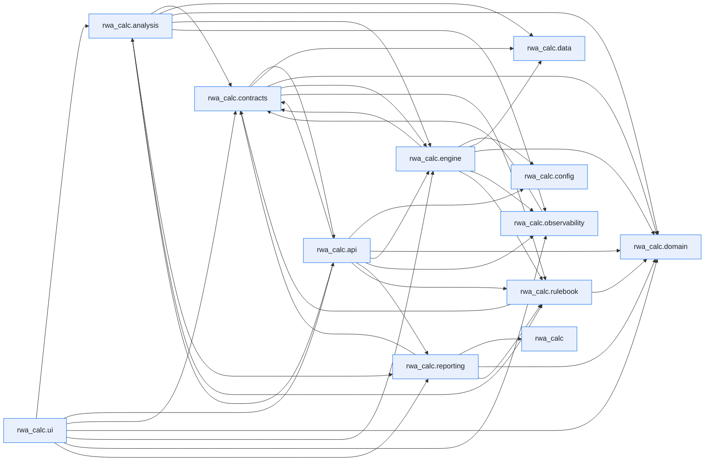

# Module Dependencies

This page is generated by ``scripts/generate_dependency_graph.py`` from the live
import graph of ``src/rwa_calc``, built with the [`curfew`](https://github.com/OpenAfterHours)
dependency tool. It is a snapshot of how the code actually imports itself — not a
hand-drawn design diagram.

Regenerate after structural refactors:

```bash
uv run python scripts/generate_dependency_graph.py
```

Inspect a single module's dependencies and dependents directly:

```bash
uv run curfew report rwa_calc.engine.stages.classify
```

Last generated: 2026-08-29.


## Package overview

Each node is a top-level subpackage of `rwa_calc`; an arrow `A --> B` means some module in `A` imports some module in `B`. Module-level imports are collapsed to their package here for readability.


```mermaid
flowchart LR
    p0["rwa_calc"]
    p1["rwa_calc.analysis"]
    p2["rwa_calc.api"]
    p3["rwa_calc.config"]
    p4["rwa_calc.contracts"]
    p5["rwa_calc.data"]
    p6["rwa_calc.domain"]
    p7["rwa_calc.engine"]
    p8["rwa_calc.observability"]
    p9["rwa_calc.reporting"]
    p10["rwa_calc.rulebook"]
    p11["rwa_calc.ui"]
    p1 --> p4
    p1 --> p5
    p1 --> p6
    p1 --> p7
    p1 --> p8
    p1 --> p9
    p1 --> p10
    p2 --> p1
    p2 --> p3
    p2 --> p4
    p2 --> p6
    p2 --> p7
    p2 --> p8
    p2 --> p9
    p2 --> p10
    p4 --> p2
    p4 --> p5
    p4 --> p6
    p4 --> p7
    p4 --> p10
    p7 --> p3
    p7 --> p4
    p7 --> p5
    p7 --> p6
    p7 --> p8
    p7 --> p10
    p8 --> p4
    p9 --> p0
    p9 --> p4
    p9 --> p6
    p9 --> p10
    p10 --> p4
    p10 --> p6
    p11 --> p1
    p11 --> p2
    p11 --> p4
    p11 --> p6
    p11 --> p7
    p11 --> p8
    p11 --> p9
    classDef first_party fill:#e8f0fe,stroke:#1a73e8,color:#202124
    class p0,p1,p2,p3,p4,p5,p6,p7,p8,p9,p10,p11 first_party
```

## Full module graph

The complete graph, one node per module, exactly as `curfew show --mermaid` emits it.

??? note "Full module-level graph (253 modules)"

    ```mermaid
    flowchart LR
        n0["rwa_calc"]
        n1["rwa_calc.analysis"]
        n2["rwa_calc.analysis.attribution"]
        n3["rwa_calc.analysis.comparison"]
        n4["rwa_calc.analysis.legacy_ledger"]
        n5["rwa_calc.analysis.recon_registry"]
        n6["rwa_calc.analysis.reconciliation"]
        n7["rwa_calc.analysis.return_recon"]
        n8["rwa_calc.analysis.transition"]
        n9["rwa_calc.api"]
        n10["rwa_calc.api.errors"]
        n11["rwa_calc.api.export"]
        n12["rwa_calc.api.formatters"]
        n13["rwa_calc.api.models"]
        n14["rwa_calc.api.reconciliation"]
        n15["rwa_calc.api.rest"]
        n16["rwa_calc.api.results_cache"]
        n17["rwa_calc.api.run_index"]
        n18["rwa_calc.api.service"]
        n19["rwa_calc.api.validation"]
        n20["rwa_calc.config"]
        n21["rwa_calc.config.data_sources"]
        n22["rwa_calc.contracts"]
        n23["rwa_calc.contracts.bundles"]
        n24["rwa_calc.contracts.config"]
        n25["rwa_calc.contracts.context"]
        n26["rwa_calc.contracts.edges"]
        n27["rwa_calc.contracts.errors"]
        n28["rwa_calc.contracts.protocols"]
        n29["rwa_calc.contracts.results"]
        n30["rwa_calc.contracts.validation"]
        n31["rwa_calc.data"]
        n32["rwa_calc.data.column_spec"]
        n33["rwa_calc.data.schemas"]
        n34["rwa_calc.domain"]
        n35["rwa_calc.domain.branch_reasons"]
        n36["rwa_calc.domain.enums"]
        n37["rwa_calc.engine"]
        n38["rwa_calc.engine.aggregator"]
        n39["rwa_calc.engine.aggregator._collapse"]
        n40["rwa_calc.engine.aggregator._el_summary"]
        n41["rwa_calc.engine.aggregator._equity_prep"]
        n42["rwa_calc.engine.aggregator._floor"]
        n43["rwa_calc.engine.aggregator._lgd_floor_check"]
        n44["rwa_calc.engine.aggregator._schemas"]
        n45["rwa_calc.engine.aggregator._securitisation"]
        n46["rwa_calc.engine.aggregator._summaries"]
        n47["rwa_calc.engine.aggregator._supporting_factors"]
        n48["rwa_calc.engine.aggregator._utils"]
        n49["rwa_calc.engine.aggregator.aggregator"]
        n50["rwa_calc.engine.branch_reason"]
        n51["rwa_calc.engine.branch_split"]
        n52["rwa_calc.engine.ccf"]
        n53["rwa_calc.engine.ccr"]
        n54["rwa_calc.engine.ccr.adjusted_notional"]
        n55["rwa_calc.engine.ccr.ccp"]
        n56["rwa_calc.engine.ccr.default_fund"]
        n57["rwa_calc.engine.ccr.failed_trades"]
        n58["rwa_calc.engine.ccr.hedging_sets"]
        n59["rwa_calc.engine.ccr.maturity_factor"]
        n60["rwa_calc.engine.ccr.pfe"]
        n61["rwa_calc.engine.ccr.pipeline_adapter"]
        n62["rwa_calc.engine.ccr.rc"]
        n63["rwa_calc.engine.ccr.sa_ccr"]
        n64["rwa_calc.engine.ccr.supervisory_delta"]
        n65["rwa_calc.engine.ccr.wwr"]
        n66["rwa_calc.engine.crm"]
        n67["rwa_calc.engine.crm.collateral"]
        n68["rwa_calc.engine.crm.collateral_type_check"]
        n69["rwa_calc.engine.crm.eligibility"]
        n70["rwa_calc.engine.crm.expressions"]
        n71["rwa_calc.engine.crm.guarantees"]
        n72["rwa_calc.engine.crm.haircut_tables"]
        n73["rwa_calc.engine.crm.haircuts"]
        n74["rwa_calc.engine.crm.life_insurance"]
        n75["rwa_calc.engine.crm.link_allocation"]
        n76["rwa_calc.engine.crm.look_through"]
        n77["rwa_calc.engine.crm.min_collateralisation"]
        n78["rwa_calc.engine.crm.ofcp_routing"]
        n79["rwa_calc.engine.crm.processor"]
        n80["rwa_calc.engine.crm.provisions"]
        n81["rwa_calc.engine.crm.simple_method"]
        n82["rwa_calc.engine.crm.third_party_deposit"]
        n83["rwa_calc.engine.cva"]
        n84["rwa_calc.engine.cva.ba_cva"]
        n85["rwa_calc.engine.entity_class_maps"]
        n86["rwa_calc.engine.equity"]
        n87["rwa_calc.engine.equity.calculator"]
        n88["rwa_calc.engine.eu_sovereign"]
        n89["rwa_calc.engine.fx_rate_sync"]
        n90["rwa_calc.engine.irb"]
        n91["rwa_calc.engine.irb.adjustments"]
        n92["rwa_calc.engine.irb.calculator"]
        n93["rwa_calc.engine.irb.formulas"]
        n94["rwa_calc.engine.irb.guarantee"]
        n95["rwa_calc.engine.irb.stats_backend"]
        n96["rwa_calc.engine.irb.transforms"]
        n97["rwa_calc.engine.kernels"]
        n98["rwa_calc.engine.kernels.allocation"]
        n99["rwa_calc.engine.loader"]
        n100["rwa_calc.engine.materialise"]
        n101["rwa_calc.engine.orchestrator"]
        n102["rwa_calc.engine.pipeline"]
        n103["rwa_calc.engine.registry"]
        n104["rwa_calc.engine.sa"]
        n105["rwa_calc.engine.sa.b31_risk_weight_tables"]
        n106["rwa_calc.engine.sa.calculator"]
        n107["rwa_calc.engine.sa.central_bank"]
        n108["rwa_calc.engine.sa.covered_bond"]
        n109["rwa_calc.engine.sa.cqs_lift"]
        n110["rwa_calc.engine.sa.crr_risk_weight_tables"]
        n111["rwa_calc.engine.sa.factors_output"]
        n112["rwa_calc.engine.sa.guarantor_rw"]
        n113["rwa_calc.engine.sa.jurisdiction"]
        n114["rwa_calc.engine.sa.re_residual_rw"]
        n115["rwa_calc.engine.sa.rgla"]
        n116["rwa_calc.engine.sa.risk_weights"]
        n117["rwa_calc.engine.sa.rw_adjustments"]
        n118["rwa_calc.engine.sa.sovereign_derived"]
        n119["rwa_calc.engine.sa.sovereign_floor"]
        n120["rwa_calc.engine.securitisation"]
        n121["rwa_calc.engine.securitisation.allocator"]
        n122["rwa_calc.engine.sft"]
        n123["rwa_calc.engine.sft.fccm"]
        n124["rwa_calc.engine.slotting"]
        n125["rwa_calc.engine.slotting.calculator"]
        n126["rwa_calc.engine.slotting.transforms"]
        n127["rwa_calc.engine.stages"]
        n128["rwa_calc.engine.stages._ccr_shared"]
        n129["rwa_calc.engine.stages.aggregate"]
        n130["rwa_calc.engine.stages.calc"]
        n131["rwa_calc.engine.stages.ccr"]
        n132["rwa_calc.engine.stages.classify"]
        n133["rwa_calc.engine.stages.classify.approach"]
        n134["rwa_calc.engine.stages.classify.attributes"]
        n135["rwa_calc.engine.stages.classify.audit"]
        n136["rwa_calc.engine.stages.classify.classifier"]
        n137["rwa_calc.engine.stages.classify.permissions"]
        n138["rwa_calc.engine.stages.classify.stage"]
        n139["rwa_calc.engine.stages.classify.subtypes"]
        n140["rwa_calc.engine.stages.crm"]
        n141["rwa_calc.engine.stages.equity"]
        n142["rwa_calc.engine.stages.fx"]
        n143["rwa_calc.engine.stages.fx.conversion"]
        n144["rwa_calc.engine.stages.fx.converter"]
        n145["rwa_calc.engine.stages.hierarchy"]
        n146["rwa_calc.engine.stages.hierarchy.enrich"]
        n147["rwa_calc.engine.stages.hierarchy.facility_undrawn"]
        n148["rwa_calc.engine.stages.hierarchy.graph"]
        n149["rwa_calc.engine.stages.hierarchy.ratings"]
        n150["rwa_calc.engine.stages.hierarchy.resolver"]
        n151["rwa_calc.engine.stages.hierarchy.stage"]
        n152["rwa_calc.engine.stages.hierarchy.unify"]
        n153["rwa_calc.engine.stages.re_split"]
        n154["rwa_calc.engine.stages.re_split.carriers"]
        n155["rwa_calc.engine.stages.re_split.flagging"]
        n156["rwa_calc.engine.stages.re_split.params"]
        n157["rwa_calc.engine.stages.re_split.splitter"]
        n158["rwa_calc.engine.stages.re_split.stage"]
        n159["rwa_calc.engine.stages.scope"]
        n160["rwa_calc.engine.stages.scope.resolver"]
        n161["rwa_calc.engine.stages.scope.stage"]
        n162["rwa_calc.engine.stages.securitisation"]
        n163["rwa_calc.engine.stages.sft"]
        n164["rwa_calc.engine.supporting_factors"]
        n165["rwa_calc.engine.thresholds"]
        n166["rwa_calc.engine.utils"]
        n167["rwa_calc.observability"]
        n168["rwa_calc.observability.audit_cache"]
        n169["rwa_calc.observability.context"]
        n170["rwa_calc.observability.formatters"]
        n171["rwa_calc.observability.logging_setup"]
        n172["rwa_calc.observability.safe_values"]
        n173["rwa_calc.reporting"]
        n174["rwa_calc.reporting.catalog"]
        n175["rwa_calc.reporting.cellspec"]
        n176["rwa_calc.reporting.corep"]
        n177["rwa_calc.reporting.corep.c02"]
        n178["rwa_calc.reporting.corep.c07"]
        n179["rwa_calc.reporting.corep.c08"]
        n180["rwa_calc.reporting.corep.c08_07"]
        n181["rwa_calc.reporting.corep.c09"]
        n182["rwa_calc.reporting.corep.c34"]
        n183["rwa_calc.reporting.corep.crm_substitution"]
        n184["rwa_calc.reporting.corep.generator"]
        n185["rwa_calc.reporting.corep.of02"]
        n186["rwa_calc.reporting.corep.pd_scale"]
        n187["rwa_calc.reporting.corep.postpass"]
        n188["rwa_calc.reporting.corep.templates"]
        n189["rwa_calc.reporting.facts"]
        n190["rwa_calc.reporting.kernel"]
        n191["rwa_calc.reporting.kernel.bases"]
        n192["rwa_calc.reporting.kernel.columns"]
        n193["rwa_calc.reporting.kernel.excel"]
        n194["rwa_calc.reporting.kernel.filters"]
        n195["rwa_calc.reporting.kernel.rows"]
        n196["rwa_calc.reporting.kernel.sums"]
        n197["rwa_calc.reporting.lineage"]
        n198["rwa_calc.reporting.membership"]
        n199["rwa_calc.reporting.metadata"]
        n200["rwa_calc.reporting.pillar3"]
        n201["rwa_calc.reporting.pillar3.ccr"]
        n202["rwa_calc.reporting.pillar3.cms1"]
        n203["rwa_calc.reporting.pillar3.cms2"]
        n204["rwa_calc.reporting.pillar3.cr10"]
        n205["rwa_calc.reporting.pillar3.cr4"]
        n206["rwa_calc.reporting.pillar3.cr5"]
        n207["rwa_calc.reporting.pillar3.cr6"]
        n208["rwa_calc.reporting.pillar3.cr6a"]
        n209["rwa_calc.reporting.pillar3.cr7"]
        n210["rwa_calc.reporting.pillar3.cr7a"]
        n211["rwa_calc.reporting.pillar3.cr8"]
        n212["rwa_calc.reporting.pillar3.cr9"]
        n213["rwa_calc.reporting.pillar3.generator"]
        n214["rwa_calc.reporting.pillar3.irb_scope"]
        n215["rwa_calc.reporting.pillar3.ov1"]
        n216["rwa_calc.reporting.pillar3.sa_scope"]
        n217["rwa_calc.reporting.pillar3.templates"]
        n218["rwa_calc.reporting.plans"]
        n219["rwa_calc.reporting.tieouts"]
        n220["rwa_calc.reporting.validations"]
        n221["rwa_calc.reporting.validations.checker"]
        n222["rwa_calc.reporting.validations.evaluate"]
        n223["rwa_calc.reporting.validations.rules"]
        n224["rwa_calc.reporting.validations.scope"]
        n225["rwa_calc.rulebook"]
        n226["rwa_calc.rulebook.audit"]
        n227["rwa_calc.rulebook.compile"]
        n228["rwa_calc.rulebook.model"]
        n229["rwa_calc.rulebook.packs"]
        n230["rwa_calc.rulebook.packs.b31"]
        n231["rwa_calc.rulebook.packs.common"]
        n232["rwa_calc.rulebook.packs.crr"]
        n233["rwa_calc.rulebook.registry"]
        n234["rwa_calc.rulebook.resolve"]
        n235["rwa_calc.rulebook.v0"]
        n236["rwa_calc.ui"]
        n237["rwa_calc.ui.app"]
        n238["rwa_calc.ui.app.calculator_state"]
        n239["rwa_calc.ui.app.main"]
        n240["rwa_calc.ui.app.output_writer"]
        n241["rwa_calc.ui.app.progress"]
        n242["rwa_calc.ui.app.recon_signoff"]
        n243["rwa_calc.ui.app.recon_state"]
        n244["rwa_calc.ui.views"]
        n245["rwa_calc.ui.views.charts"]
        n246["rwa_calc.ui.views.comparison"]
        n247["rwa_calc.ui.views.hierarchy"]
        n248["rwa_calc.ui.views.lineage"]
        n249["rwa_calc.ui.views.method_split"]
        n250["rwa_calc.ui.views.reconciliation"]
        n251["rwa_calc.ui.views.report_templates"]
        n252["rwa_calc.ui.views.return_recon"]
        n2 --> n23
        n3 --> n2
        n3 --> n23
        n3 --> n24
        n3 --> n102
        n3 --> n225
        n3 --> n234
        n4 --> n5
        n4 --> n33
        n4 --> n36
        n4 --> n188
        n6 --> n5
        n6 --> n23
        n6 --> n27
        n6 --> n39
        n6 --> n46
        n7 --> n4
        n7 --> n167
        n7 --> n175
        n7 --> n184
        n7 --> n190
        n7 --> n197
        n7 --> n198
        n7 --> n199
        n7 --> n218
        n8 --> n23
        n8 --> n24
        n8 --> n36
        n8 --> n102
        n9 --> n5
        n9 --> n11
        n9 --> n13
        n9 --> n14
        n9 --> n15
        n9 --> n16
        n9 --> n18
        n9 --> n19
        n10 --> n13
        n10 --> n27
        n11 --> n13
        n11 --> n23
        n11 --> n24
        n11 --> n27
        n11 --> n29
        n11 --> n184
        n11 --> n189
        n11 --> n213
        n11 --> n220
        n12 --> n10
        n12 --> n13
        n12 --> n16
        n12 --> n23
        n13 --> n4
        n13 --> n6
        n13 --> n10
        n13 --> n11
        n13 --> n23
        n14 --> n5
        n15 --> n11
        n15 --> n13
        n15 --> n14
        n15 --> n17
        n15 --> n18
        n15 --> n19
        n15 --> n36
        n15 --> n174
        n15 --> n184
        n15 --> n189
        n15 --> n197
        n15 --> n213
        n15 --> n220
        n17 --> n13
        n17 --> n23
        n18 --> n4
        n18 --> n5
        n18 --> n6
        n18 --> n10
        n18 --> n12
        n18 --> n13
        n18 --> n14
        n18 --> n16
        n18 --> n19
        n18 --> n23
        n18 --> n24
        n18 --> n27
        n18 --> n28
        n18 --> n36
        n18 --> n99
        n18 --> n102
        n18 --> n167
        n18 --> n225
        n19 --> n10
        n19 --> n13
        n19 --> n21
        n22 --> n23
        n22 --> n24
        n22 --> n26
        n22 --> n27
        n22 --> n28
        n22 --> n30
        n22 --> n36
        n23 --> n26
        n23 --> n27
        n23 --> n36
        n24 --> n36
        n26 --> n32
        n26 --> n33
        n26 --> n35
        n27 --> n36
        n28 --> n13
        n28 --> n23
        n28 --> n24
        n28 --> n27
        n28 --> n29
        n28 --> n75
        n28 --> n234
        n30 --> n23
        n30 --> n26
        n30 --> n27
        n30 --> n32
        n30 --> n33
        n30 --> n35
        n33 --> n32
        n34 --> n36
        n37 --> n99
        n37 --> n102
        n37 --> n145
        n38 --> n49
        n39 --> n33
        n40 --> n23
        n40 --> n44
        n40 --> n48
        n41 --> n36
        n42 --> n23
        n42 --> n44
        n42 --> n48
        n42 --> n227
        n42 --> n234
        n43 --> n27
        n43 --> n36
        n43 --> n234
        n47 --> n44
        n47 --> n48
        n49 --> n23
        n49 --> n24
        n49 --> n26
        n49 --> n27
        n49 --> n36
        n49 --> n40
        n49 --> n41
        n49 --> n42
        n49 --> n43
        n49 --> n44
        n49 --> n45
        n49 --> n46
        n49 --> n47
        n49 --> n116
        n49 --> n225
        n49 --> n234
        n50 --> n35
        n51 --> n36
        n52 --> n24
        n52 --> n33
        n52 --> n36
        n52 --> n225
        n52 --> n227
        n52 --> n234
        n53 --> n54
        n53 --> n58
        n53 --> n59
        n53 --> n60
        n53 --> n61
        n53 --> n62
        n53 --> n63
        n53 --> n64
        n53 --> n65
        n54 --> n227
        n54 --> n234
        n55 --> n227
        n55 --> n234
        n56 --> n24
        n56 --> n227
        n56 --> n234
        n57 --> n24
        n57 --> n227
        n57 --> n234
        n58 --> n33
        n59 --> n227
        n59 --> n234
        n60 --> n24
        n60 --> n32
        n60 --> n33
        n60 --> n62
        n60 --> n227
        n60 --> n234
        n61 --> n23
        n61 --> n24
        n61 --> n27
        n61 --> n32
        n61 --> n33
        n61 --> n36
        n61 --> n54
        n61 --> n58
        n61 --> n59
        n61 --> n60
        n61 --> n62
        n61 --> n64
        n61 --> n227
        n61 --> n234
        n63 --> n23
        n63 --> n24
        n63 --> n27
        n63 --> n36
        n64 --> n95
        n64 --> n227
        n64 --> n234
        n65 --> n23
        n65 --> n27
        n65 --> n32
        n65 --> n33
        n65 --> n36
        n65 --> n227
        n65 --> n234
        n66 --> n73
        n66 --> n74
        n66 --> n79
        n67 --> n24
        n67 --> n27
        n67 --> n32
        n67 --> n33
        n67 --> n36
        n67 --> n69
        n67 --> n70
        n67 --> n73
        n67 --> n77
        n67 --> n168
        n67 --> n225
        n67 --> n227
        n67 --> n234
        n68 --> n27
        n68 --> n70
        n69 --> n33
        n69 --> n36
        n70 --> n33
        n70 --> n98
        n70 --> n227
        n70 --> n234
        n71 --> n24
        n71 --> n27
        n71 --> n32
        n71 --> n33
        n71 --> n36
        n71 --> n52
        n71 --> n70
        n71 --> n85
        n71 --> n88
        n71 --> n98
        n71 --> n166
        n71 --> n225
        n71 --> n227
        n71 --> n234
        n72 --> n234
        n73 --> n24
        n73 --> n32
        n73 --> n33
        n73 --> n36
        n73 --> n69
        n73 --> n72
        n73 --> n225
        n73 --> n227
        n73 --> n234
        n74 --> n24
        n74 --> n27
        n74 --> n33
        n74 --> n88
        n74 --> n166
        n74 --> n227
        n74 --> n234
        n75 --> n24
        n75 --> n27
        n75 --> n70
        n75 --> n98
        n76 --> n27
        n76 --> n32
        n77 --> n24
        n77 --> n27
        n77 --> n36
        n77 --> n225
        n77 --> n227
        n77 --> n234
        n78 --> n24
        n78 --> n32
        n78 --> n36
        n78 --> n67
        n78 --> n225
        n78 --> n234
        n79 --> n23
        n79 --> n24
        n79 --> n26
        n79 --> n27
        n79 --> n36
        n79 --> n52
        n79 --> n67
        n79 --> n68
        n79 --> n70
        n79 --> n71
        n79 --> n73
        n79 --> n74
        n79 --> n75
        n79 --> n76
        n79 --> n77
        n79 --> n78
        n79 --> n80
        n79 --> n81
        n79 --> n82
        n79 --> n98
        n79 --> n100
        n79 --> n116
        n79 --> n166
        n79 --> n168
        n79 --> n225
        n79 --> n234
        n80 --> n24
        n80 --> n36
        n80 --> n52
        n80 --> n98
        n80 --> n225
        n80 --> n234
        n81 --> n24
        n81 --> n36
        n81 --> n69
        n81 --> n105
        n81 --> n110
        n81 --> n225
        n81 --> n227
        n81 --> n234
        n82 --> n27
        n82 --> n33
        n82 --> n36
        n82 --> n112
        n83 --> n84
        n84 --> n227
        n84 --> n234
        n85 --> n234
        n86 --> n87
        n87 --> n23
        n87 --> n24
        n87 --> n27
        n87 --> n32
        n87 --> n36
        n87 --> n93
        n87 --> n105
        n87 --> n110
        n87 --> n225
        n87 --> n227
        n87 --> n234
        n88 --> n234
        n90 --> n92
        n90 --> n93
        n91 --> n24
        n91 --> n27
        n91 --> n36
        n91 --> n225
        n91 --> n234
        n92 --> n24
        n92 --> n27
        n92 --> n96
        n92 --> n164
        n92 --> n225
        n92 --> n234
        n93 --> n24
        n93 --> n36
        n93 --> n70
        n93 --> n91
        n93 --> n95
        n93 --> n165
        n93 --> n225
        n93 --> n227
        n93 --> n234
        n94 --> n24
        n94 --> n71
        n94 --> n85
        n94 --> n88
        n94 --> n93
        n94 --> n112
        n94 --> n165
        n94 --> n225
        n94 --> n227
        n94 --> n234
        n96 --> n24
        n96 --> n27
        n96 --> n32
        n96 --> n35
        n96 --> n36
        n96 --> n50
        n96 --> n91
        n96 --> n93
        n96 --> n94
        n96 --> n165
        n96 --> n166
        n96 --> n225
        n96 --> n227
        n96 --> n234
        n97 --> n98
        n98 --> n33
        n98 --> n166
        n99 --> n21
        n99 --> n23
        n99 --> n26
        n99 --> n27
        n99 --> n28
        n99 --> n30
        n99 --> n32
        n99 --> n33
        n99 --> n166
        n100 --> n24
        n100 --> n26
        n101 --> n23
        n101 --> n24
        n101 --> n25
        n101 --> n26
        n101 --> n27
        n101 --> n28
        n101 --> n38
        n101 --> n79
        n101 --> n87
        n101 --> n92
        n101 --> n106
        n101 --> n121
        n101 --> n125
        n101 --> n132
        n101 --> n145
        n101 --> n153
        n101 --> n167
        n101 --> n225
        n102 --> n23
        n102 --> n24
        n102 --> n25
        n102 --> n27
        n102 --> n28
        n102 --> n30
        n102 --> n36
        n102 --> n89
        n102 --> n99
        n102 --> n100
        n102 --> n101
        n102 --> n103
        n102 --> n167
        n102 --> n168
        n102 --> n225
        n102 --> n226
        n103 --> n101
        n103 --> n129
        n103 --> n130
        n103 --> n131
        n103 --> n132
        n103 --> n140
        n103 --> n141
        n103 --> n145
        n103 --> n153
        n103 --> n159
        n103 --> n162
        n103 --> n163
        n104 --> n106
        n105 --> n36
        n105 --> n110
        n105 --> n234
        n106 --> n24
        n106 --> n27
        n106 --> n36
        n106 --> n51
        n106 --> n111
        n106 --> n116
        n106 --> n117
        n106 --> n225
        n106 --> n234
        n107 --> n110
        n107 --> n234
        n108 --> n36
        n108 --> n105
        n108 --> n110
        n110 --> n36
        n110 --> n234
        n111 --> n24
        n111 --> n27
        n111 --> n32
        n111 --> n164
        n111 --> n234
        n112 --> n36
        n112 --> n85
        n112 --> n107
        n112 --> n227
        n112 --> n234
        n114 --> n36
        n114 --> n110
        n114 --> n118
        n114 --> n227
        n114 --> n234
        n115 --> n36
        n115 --> n110
        n116 --> n24
        n116 --> n32
        n116 --> n33
        n116 --> n36
        n116 --> n88
        n116 --> n105
        n116 --> n107
        n116 --> n108
        n116 --> n109
        n116 --> n110
        n116 --> n112
        n116 --> n113
        n116 --> n114
        n116 --> n115
        n116 --> n118
        n116 --> n119
        n116 --> n225
        n116 --> n227
        n116 --> n234
        n117 --> n24
        n117 --> n27
        n117 --> n36
        n117 --> n71
        n117 --> n85
        n117 --> n88
        n117 --> n112
        n117 --> n116
        n117 --> n225
        n117 --> n227
        n117 --> n234
        n118 --> n36
        n119 --> n35
        n119 --> n36
        n119 --> n50
        n119 --> n110
        n119 --> n118
        n120 --> n121
        n121 --> n23
        n121 --> n24
        n121 --> n27
        n121 --> n36
        n122 --> n123
        n123 --> n23
        n123 --> n72
        n123 --> n234
        n124 --> n125
        n125 --> n24
        n125 --> n27
        n125 --> n126
        n125 --> n164
        n125 --> n225
        n125 --> n234
        n126 --> n24
        n126 --> n27
        n126 --> n117
        n126 --> n166
        n126 --> n225
        n126 --> n227
        n126 --> n228
        n126 --> n234
        n128 --> n23
        n129 --> n24
        n129 --> n25
        n129 --> n26
        n129 --> n83
        n129 --> n101
        n129 --> n225
        n130 --> n24
        n130 --> n25
        n130 --> n26
        n130 --> n27
        n130 --> n32
        n130 --> n36
        n130 --> n44
        n130 --> n51
        n130 --> n100
        n130 --> n101
        n130 --> n164
        n130 --> n225
        n131 --> n24
        n131 --> n25
        n131 --> n26
        n131 --> n53
        n131 --> n56
        n131 --> n57
        n131 --> n100
        n131 --> n101
        n131 --> n128
        n131 --> n225
        n132 --> n136
        n132 --> n138
        n133 --> n24
        n133 --> n32
        n133 --> n33
        n133 --> n36
        n133 --> n88
        n133 --> n134
        n133 --> n137
        n133 --> n165
        n133 --> n225
        n133 --> n234
        n134 --> n24
        n134 --> n33
        n134 --> n36
        n134 --> n85
        n134 --> n165
        n134 --> n166
        n134 --> n225
        n134 --> n234
        n135 --> n23
        n135 --> n24
        n135 --> n27
        n135 --> n36
        n135 --> n134
        n135 --> n139
        n135 --> n165
        n135 --> n225
        n135 --> n234
        n136 --> n23
        n136 --> n24
        n136 --> n26
        n136 --> n27
        n136 --> n100
        n136 --> n133
        n136 --> n134
        n136 --> n135
        n136 --> n137
        n136 --> n139
        n136 --> n155
        n136 --> n225
        n136 --> n234
        n137 --> n24
        n137 --> n27
        n137 --> n36
        n138 --> n24
        n138 --> n25
        n138 --> n101
        n138 --> n168
        n138 --> n225
        n139 --> n24
        n139 --> n33
        n139 --> n36
        n139 --> n93
        n139 --> n134
        n139 --> n165
        n139 --> n166
        n139 --> n225
        n139 --> n234
        n140 --> n24
        n140 --> n25
        n140 --> n101
        n140 --> n225
        n141 --> n24
        n141 --> n25
        n141 --> n101
        n141 --> n168
        n141 --> n225
        n142 --> n143
        n142 --> n144
        n143 --> n24
        n143 --> n144
        n144 --> n24
        n145 --> n150
        n145 --> n151
        n146 --> n23
        n146 --> n27
        n146 --> n85
        n146 --> n98
        n146 --> n166
        n147 --> n23
        n147 --> n24
        n147 --> n52
        n147 --> n112
        n147 --> n148
        n147 --> n166
        n148 --> n23
        n148 --> n26
        n148 --> n27
        n148 --> n36
        n148 --> n149
        n148 --> n166
        n150 --> n23
        n150 --> n24
        n150 --> n26
        n150 --> n27
        n150 --> n142
        n150 --> n146
        n150 --> n147
        n150 --> n148
        n150 --> n149
        n150 --> n152
        n151 --> n24
        n151 --> n25
        n151 --> n26
        n151 --> n100
        n151 --> n101
        n151 --> n121
        n151 --> n168
        n151 --> n225
        n152 --> n23
        n152 --> n24
        n152 --> n27
        n152 --> n146
        n152 --> n147
        n152 --> n148
        n153 --> n155
        n153 --> n157
        n153 --> n158
        n155 --> n24
        n155 --> n36
        n155 --> n225
        n155 --> n234
        n156 --> n227
        n156 --> n234
        n157 --> n23
        n157 --> n24
        n157 --> n26
        n157 --> n27
        n157 --> n36
        n157 --> n154
        n157 --> n156
        n157 --> n225
        n157 --> n234
        n158 --> n24
        n158 --> n25
        n158 --> n26
        n158 --> n100
        n158 --> n101
        n158 --> n168
        n158 --> n225
        n159 --> n160
        n159 --> n161
        n160 --> n23
        n160 --> n24
        n160 --> n26
        n160 --> n27
        n160 --> n36
        n161 --> n24
        n161 --> n25
        n161 --> n101
        n161 --> n160
        n161 --> n225
        n162 --> n24
        n162 --> n25
        n162 --> n101
        n162 --> n225
        n163 --> n24
        n163 --> n25
        n163 --> n26
        n163 --> n100
        n163 --> n101
        n163 --> n123
        n163 --> n128
        n163 --> n225
        n164 --> n24
        n164 --> n27
        n164 --> n36
        n164 --> n165
        n164 --> n225
        n164 --> n227
        n164 --> n234
        n165 --> n234
        n167 --> n168
        n167 --> n169
        n167 --> n170
        n167 --> n171
        n167 --> n172
        n168 --> n24
        n168 --> n169
        n171 --> n169
        n171 --> n170
        n173 --> n184
        n173 --> n213
        n173 --> n219
        n174 --> n184
        n174 --> n188
        n174 --> n213
        n174 --> n217
        n175 --> n190
        n175 --> n199
        n176 --> n184
        n176 --> n188
        n177 --> n23
        n177 --> n24
        n177 --> n188
        n177 --> n190
        n178 --> n36
        n178 --> n175
        n178 --> n183
        n178 --> n187
        n178 --> n188
        n178 --> n190
        n178 --> n191
        n178 --> n199
        n178 --> n218
        n179 --> n175
        n179 --> n183
        n179 --> n186
        n179 --> n187
        n179 --> n188
        n179 --> n190
        n179 --> n199
        n179 --> n218
        n180 --> n175
        n180 --> n188
        n180 --> n190
        n180 --> n199
        n180 --> n218
        n181 --> n175
        n181 --> n178
        n181 --> n187
        n181 --> n188
        n181 --> n190
        n181 --> n199
        n181 --> n218
        n182 --> n175
        n182 --> n188
        n182 --> n190
        n182 --> n199
        n182 --> n218
        n184 --> n23
        n184 --> n24
        n184 --> n29
        n184 --> n177
        n184 --> n178
        n184 --> n179
        n184 --> n180
        n184 --> n181
        n184 --> n182
        n184 --> n185
        n184 --> n188
        n184 --> n189
        n184 --> n190
        n184 --> n199
        n185 --> n24
        n185 --> n175
        n185 --> n188
        n185 --> n199
        n185 --> n218
        n186 --> n188
        n187 --> n175
        n187 --> n183
        n187 --> n190
        n189 --> n0
        n189 --> n174
        n189 --> n184
        n189 --> n213
        n190 --> n191
        n190 --> n192
        n190 --> n193
        n190 --> n194
        n190 --> n195
        n190 --> n196
        n194 --> n192
        n197 --> n175
        n197 --> n178
        n197 --> n179
        n197 --> n180
        n197 --> n181
        n197 --> n182
        n197 --> n185
        n197 --> n190
        n197 --> n199
        n197 --> n201
        n197 --> n202
        n197 --> n203
        n197 --> n204
        n197 --> n205
        n197 --> n206
        n197 --> n207
        n197 --> n208
        n197 --> n209
        n197 --> n210
        n197 --> n211
        n197 --> n212
        n197 --> n215
        n197 --> n218
        n198 --> n175
        n198 --> n190
        n198 --> n197
        n198 --> n199
        n198 --> n218
        n199 --> n23
        n199 --> n228
        n200 --> n213
        n201 --> n175
        n201 --> n190
        n201 --> n199
        n201 --> n217
        n201 --> n218
        n202 --> n175
        n202 --> n199
        n202 --> n217
        n202 --> n218
        n203 --> n175
        n203 --> n199
        n203 --> n202
        n203 --> n217
        n203 --> n218
        n204 --> n36
        n204 --> n175
        n204 --> n199
        n204 --> n214
        n204 --> n217
        n204 --> n218
        n205 --> n175
        n205 --> n199
        n205 --> n216
        n205 --> n217
        n205 --> n218
        n206 --> n175
        n206 --> n199
        n206 --> n216
        n206 --> n217
        n206 --> n218
        n207 --> n175
        n207 --> n199
        n207 --> n214
        n207 --> n217
        n207 --> n218
        n208 --> n175
        n208 --> n199
        n208 --> n217
        n208 --> n218
        n209 --> n175
        n209 --> n199
        n209 --> n217
        n209 --> n218
        n210 --> n175
        n210 --> n199
        n210 --> n217
        n210 --> n218
        n211 --> n175
        n211 --> n190
        n211 --> n199
        n211 --> n217
        n211 --> n218
        n212 --> n175
        n212 --> n199
        n212 --> n217
        n212 --> n218
        n213 --> n23
        n213 --> n29
        n213 --> n189
        n213 --> n190
        n213 --> n199
        n213 --> n201
        n213 --> n202
        n213 --> n203
        n213 --> n204
        n213 --> n205
        n213 --> n206
        n213 --> n207
        n213 --> n208
        n213 --> n209
        n213 --> n210
        n213 --> n211
        n213 --> n212
        n213 --> n215
        n213 --> n217
        n215 --> n23
        n215 --> n36
        n215 --> n175
        n215 --> n199
        n215 --> n217
        n215 --> n218
        n218 --> n175
        n218 --> n199
        n219 --> n27
        n219 --> n36
        n219 --> n184
        n219 --> n213
        n220 --> n221
        n220 --> n222
        n220 --> n223
        n220 --> n224
        n221 --> n27
        n221 --> n36
        n221 --> n184
        n221 --> n213
        n221 --> n222
        n221 --> n223
        n221 --> n224
        n222 --> n223
        n222 --> n224
        n224 --> n184
        n224 --> n213
        n224 --> n223
        n225 --> n235
        n226 --> n234
        n227 --> n228
        n230 --> n36
        n230 --> n228
        n231 --> n36
        n231 --> n228
        n232 --> n36
        n232 --> n228
        n233 --> n36
        n234 --> n228
        n234 --> n233
        n235 --> n24
        n235 --> n36
        n235 --> n233
        n235 --> n234
        n239 --> n3
        n239 --> n12
        n239 --> n13
        n239 --> n14
        n239 --> n15
        n239 --> n16
        n239 --> n17
        n239 --> n18
        n239 --> n19
        n239 --> n23
        n239 --> n24
        n239 --> n36
        n239 --> n99
        n239 --> n167
        n239 --> n174
        n239 --> n197
        n239 --> n238
        n239 --> n240
        n239 --> n241
        n239 --> n242
        n239 --> n243
        n239 --> n245
        n239 --> n246
        n239 --> n247
        n239 --> n248
        n239 --> n249
        n239 --> n250
        n239 --> n251
        n239 --> n252
        n240 --> n13
        n240 --> n29
        n241 --> n103
        n246 --> n23
        n248 --> n197
        n248 --> n251
        n249 --> n245
        n250 --> n5
        n250 --> n6
        n250 --> n13
        n250 --> n242
        n250 --> n249
        n251 --> n174
        n251 --> n184
        n251 --> n197
        n251 --> n213
        n252 --> n4
        n252 --> n7
        n252 --> n13
        n252 --> n167
        n252 --> n174
        n252 --> n184
        n252 --> n199
        n252 --> n251
        classDef first_party fill:#e8f0fe,stroke:#1a73e8,color:#202124
        class n0,n1,n2,n3,n4,n5,n6,n7,n8,n9,n10,n11,n12,n13,n14,n15,n16,n17,n18,n19,n20,n21,n22,n23,n24,n25,n26,n27,n28,n29,n30,n31,n32,n33,n34,n35,n36,n37,n38,n39,n40,n41,n42,n43,n44,n45,n46,n47,n48,n49,n50,n51,n52,n53,n54,n55,n56,n57,n58,n59,n60,n61,n62,n63,n64,n65,n66,n67,n68,n69,n70,n71,n72,n73,n74,n75,n76,n77,n78,n79,n80,n81,n82,n83,n84,n85,n86,n87,n88,n89,n90,n91,n92,n93,n94,n95,n96,n97,n98,n99,n100,n101,n102,n103,n104,n105,n106,n107,n108,n109,n110,n111,n112,n113,n114,n115,n116,n117,n118,n119,n120,n121,n122,n123,n124,n125,n126,n127,n128,n129,n130,n131,n132,n133,n134,n135,n136,n137,n138,n139,n140,n141,n142,n143,n144,n145,n146,n147,n148,n149,n150,n151,n152,n153,n154,n155,n156,n157,n158,n159,n160,n161,n162,n163,n164,n165,n166,n167,n168,n169,n170,n171,n172,n173,n174,n175,n176,n177,n178,n179,n180,n181,n182,n183,n184,n185,n186,n187,n188,n189,n190,n191,n192,n193,n194,n195,n196,n197,n198,n199,n200,n201,n202,n203,n204,n205,n206,n207,n208,n209,n210,n211,n212,n213,n214,n215,n216,n217,n218,n219,n220,n221,n222,n223,n224,n225,n226,n227,n228,n229,n230,n231,n232,n233,n234,n235,n236,n237,n238,n239,n240,n241,n242,n243,n244,n245,n246,n247,n248,n249,n250,n251,n252 first_party
    ```

