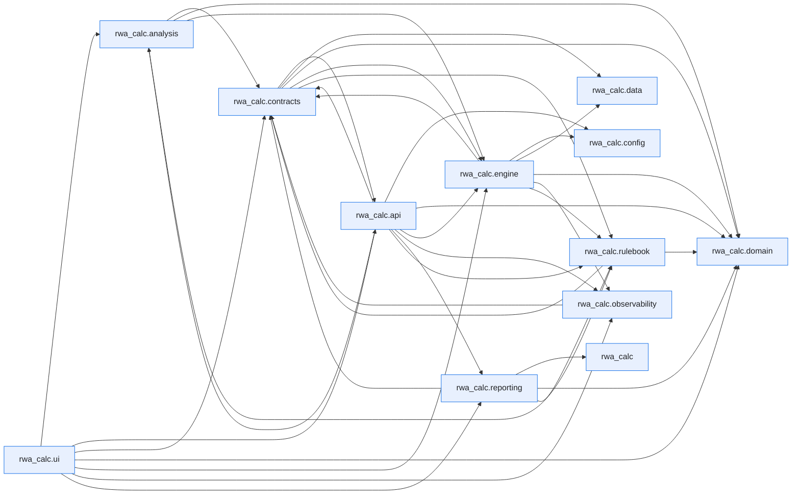

# Module Dependencies

This page is generated by ``scripts/generate_dependency_graph.py`` from the live
import graph of ``src/rwa_calc``, built with the [`curfew`](https://github.com/OpenAfterHours)
dependency tool. It is a snapshot of how the code actually imports itself — not a
hand-drawn design diagram.

Regenerate after structural refactors:

```bash
uv run python scripts/generate_dependency_graph.py
```

Inspect a single module's dependencies and dependents directly:

```bash
uv run curfew report rwa_calc.engine.stages.classify
```

Last generated: 2026-08-28.


## Package overview

Each node is a top-level subpackage of `rwa_calc`; an arrow `A --> B` means some module in `A` imports some module in `B`. Module-level imports are collapsed to their package here for readability.


```mermaid
flowchart LR
    p0["rwa_calc"]
    p1["rwa_calc.analysis"]
    p2["rwa_calc.api"]
    p3["rwa_calc.config"]
    p4["rwa_calc.contracts"]
    p5["rwa_calc.data"]
    p6["rwa_calc.domain"]
    p7["rwa_calc.engine"]
    p8["rwa_calc.observability"]
    p9["rwa_calc.reporting"]
    p10["rwa_calc.rulebook"]
    p11["rwa_calc.ui"]
    p1 --> p4
    p1 --> p6
    p1 --> p7
    p1 --> p10
    p2 --> p1
    p2 --> p3
    p2 --> p4
    p2 --> p6
    p2 --> p7
    p2 --> p8
    p2 --> p9
    p2 --> p10
    p4 --> p2
    p4 --> p5
    p4 --> p6
    p4 --> p7
    p4 --> p10
    p7 --> p3
    p7 --> p4
    p7 --> p5
    p7 --> p6
    p7 --> p8
    p7 --> p10
    p8 --> p4
    p9 --> p0
    p9 --> p4
    p9 --> p6
    p9 --> p10
    p10 --> p4
    p10 --> p6
    p11 --> p1
    p11 --> p2
    p11 --> p4
    p11 --> p6
    p11 --> p7
    p11 --> p8
    p11 --> p9
    classDef first_party fill:#e8f0fe,stroke:#1a73e8,color:#202124
    class p0,p1,p2,p3,p4,p5,p6,p7,p8,p9,p10,p11 first_party
```

## Full module graph

The complete graph, one node per module, exactly as `curfew show --mermaid` emits it.

??? note "Full module-level graph (248 modules)"

    ```mermaid
    flowchart LR
        n0["rwa_calc"]
        n1["rwa_calc.analysis"]
        n2["rwa_calc.analysis.attribution"]
        n3["rwa_calc.analysis.comparison"]
        n4["rwa_calc.analysis.recon_registry"]
        n5["rwa_calc.analysis.reconciliation"]
        n6["rwa_calc.analysis.transition"]
        n7["rwa_calc.api"]
        n8["rwa_calc.api.errors"]
        n9["rwa_calc.api.export"]
        n10["rwa_calc.api.formatters"]
        n11["rwa_calc.api.models"]
        n12["rwa_calc.api.reconciliation"]
        n13["rwa_calc.api.rest"]
        n14["rwa_calc.api.results_cache"]
        n15["rwa_calc.api.run_index"]
        n16["rwa_calc.api.service"]
        n17["rwa_calc.api.validation"]
        n18["rwa_calc.config"]
        n19["rwa_calc.config.data_sources"]
        n20["rwa_calc.contracts"]
        n21["rwa_calc.contracts.bundles"]
        n22["rwa_calc.contracts.config"]
        n23["rwa_calc.contracts.context"]
        n24["rwa_calc.contracts.edges"]
        n25["rwa_calc.contracts.errors"]
        n26["rwa_calc.contracts.protocols"]
        n27["rwa_calc.contracts.results"]
        n28["rwa_calc.contracts.validation"]
        n29["rwa_calc.data"]
        n30["rwa_calc.data.column_spec"]
        n31["rwa_calc.data.schemas"]
        n32["rwa_calc.domain"]
        n33["rwa_calc.domain.branch_reasons"]
        n34["rwa_calc.domain.enums"]
        n35["rwa_calc.engine"]
        n36["rwa_calc.engine.aggregator"]
        n37["rwa_calc.engine.aggregator._collapse"]
        n38["rwa_calc.engine.aggregator._el_summary"]
        n39["rwa_calc.engine.aggregator._equity_prep"]
        n40["rwa_calc.engine.aggregator._floor"]
        n41["rwa_calc.engine.aggregator._lgd_floor_check"]
        n42["rwa_calc.engine.aggregator._schemas"]
        n43["rwa_calc.engine.aggregator._securitisation"]
        n44["rwa_calc.engine.aggregator._summaries"]
        n45["rwa_calc.engine.aggregator._supporting_factors"]
        n46["rwa_calc.engine.aggregator._utils"]
        n47["rwa_calc.engine.aggregator.aggregator"]
        n48["rwa_calc.engine.branch_reason"]
        n49["rwa_calc.engine.branch_split"]
        n50["rwa_calc.engine.ccf"]
        n51["rwa_calc.engine.ccr"]
        n52["rwa_calc.engine.ccr.adjusted_notional"]
        n53["rwa_calc.engine.ccr.ccp"]
        n54["rwa_calc.engine.ccr.default_fund"]
        n55["rwa_calc.engine.ccr.failed_trades"]
        n56["rwa_calc.engine.ccr.hedging_sets"]
        n57["rwa_calc.engine.ccr.maturity_factor"]
        n58["rwa_calc.engine.ccr.pfe"]
        n59["rwa_calc.engine.ccr.pipeline_adapter"]
        n60["rwa_calc.engine.ccr.rc"]
        n61["rwa_calc.engine.ccr.sa_ccr"]
        n62["rwa_calc.engine.ccr.supervisory_delta"]
        n63["rwa_calc.engine.ccr.wwr"]
        n64["rwa_calc.engine.crm"]
        n65["rwa_calc.engine.crm.collateral"]
        n66["rwa_calc.engine.crm.collateral_type_check"]
        n67["rwa_calc.engine.crm.eligibility"]
        n68["rwa_calc.engine.crm.expressions"]
        n69["rwa_calc.engine.crm.guarantees"]
        n70["rwa_calc.engine.crm.haircut_tables"]
        n71["rwa_calc.engine.crm.haircuts"]
        n72["rwa_calc.engine.crm.life_insurance"]
        n73["rwa_calc.engine.crm.link_allocation"]
        n74["rwa_calc.engine.crm.look_through"]
        n75["rwa_calc.engine.crm.min_collateralisation"]
        n76["rwa_calc.engine.crm.ofcp_routing"]
        n77["rwa_calc.engine.crm.processor"]
        n78["rwa_calc.engine.crm.provisions"]
        n79["rwa_calc.engine.crm.simple_method"]
        n80["rwa_calc.engine.crm.third_party_deposit"]
        n81["rwa_calc.engine.cva"]
        n82["rwa_calc.engine.cva.ba_cva"]
        n83["rwa_calc.engine.entity_class_maps"]
        n84["rwa_calc.engine.equity"]
        n85["rwa_calc.engine.equity.calculator"]
        n86["rwa_calc.engine.eu_sovereign"]
        n87["rwa_calc.engine.fx_rate_sync"]
        n88["rwa_calc.engine.irb"]
        n89["rwa_calc.engine.irb.adjustments"]
        n90["rwa_calc.engine.irb.calculator"]
        n91["rwa_calc.engine.irb.formulas"]
        n92["rwa_calc.engine.irb.guarantee"]
        n93["rwa_calc.engine.irb.stats_backend"]
        n94["rwa_calc.engine.irb.transforms"]
        n95["rwa_calc.engine.kernels"]
        n96["rwa_calc.engine.kernels.allocation"]
        n97["rwa_calc.engine.loader"]
        n98["rwa_calc.engine.materialise"]
        n99["rwa_calc.engine.orchestrator"]
        n100["rwa_calc.engine.pipeline"]
        n101["rwa_calc.engine.registry"]
        n102["rwa_calc.engine.sa"]
        n103["rwa_calc.engine.sa.b31_risk_weight_tables"]
        n104["rwa_calc.engine.sa.calculator"]
        n105["rwa_calc.engine.sa.central_bank"]
        n106["rwa_calc.engine.sa.covered_bond"]
        n107["rwa_calc.engine.sa.cqs_lift"]
        n108["rwa_calc.engine.sa.crr_risk_weight_tables"]
        n109["rwa_calc.engine.sa.factors_output"]
        n110["rwa_calc.engine.sa.guarantor_rw"]
        n111["rwa_calc.engine.sa.jurisdiction"]
        n112["rwa_calc.engine.sa.re_residual_rw"]
        n113["rwa_calc.engine.sa.rgla"]
        n114["rwa_calc.engine.sa.risk_weights"]
        n115["rwa_calc.engine.sa.rw_adjustments"]
        n116["rwa_calc.engine.sa.sovereign_derived"]
        n117["rwa_calc.engine.sa.sovereign_floor"]
        n118["rwa_calc.engine.securitisation"]
        n119["rwa_calc.engine.securitisation.allocator"]
        n120["rwa_calc.engine.sft"]
        n121["rwa_calc.engine.sft.fccm"]
        n122["rwa_calc.engine.slotting"]
        n123["rwa_calc.engine.slotting.calculator"]
        n124["rwa_calc.engine.slotting.transforms"]
        n125["rwa_calc.engine.stages"]
        n126["rwa_calc.engine.stages._ccr_shared"]
        n127["rwa_calc.engine.stages.aggregate"]
        n128["rwa_calc.engine.stages.calc"]
        n129["rwa_calc.engine.stages.ccr"]
        n130["rwa_calc.engine.stages.classify"]
        n131["rwa_calc.engine.stages.classify.approach"]
        n132["rwa_calc.engine.stages.classify.attributes"]
        n133["rwa_calc.engine.stages.classify.audit"]
        n134["rwa_calc.engine.stages.classify.classifier"]
        n135["rwa_calc.engine.stages.classify.permissions"]
        n136["rwa_calc.engine.stages.classify.stage"]
        n137["rwa_calc.engine.stages.classify.subtypes"]
        n138["rwa_calc.engine.stages.crm"]
        n139["rwa_calc.engine.stages.equity"]
        n140["rwa_calc.engine.stages.fx"]
        n141["rwa_calc.engine.stages.fx.conversion"]
        n142["rwa_calc.engine.stages.fx.converter"]
        n143["rwa_calc.engine.stages.hierarchy"]
        n144["rwa_calc.engine.stages.hierarchy.enrich"]
        n145["rwa_calc.engine.stages.hierarchy.facility_undrawn"]
        n146["rwa_calc.engine.stages.hierarchy.graph"]
        n147["rwa_calc.engine.stages.hierarchy.ratings"]
        n148["rwa_calc.engine.stages.hierarchy.resolver"]
        n149["rwa_calc.engine.stages.hierarchy.stage"]
        n150["rwa_calc.engine.stages.hierarchy.unify"]
        n151["rwa_calc.engine.stages.re_split"]
        n152["rwa_calc.engine.stages.re_split.carriers"]
        n153["rwa_calc.engine.stages.re_split.flagging"]
        n154["rwa_calc.engine.stages.re_split.params"]
        n155["rwa_calc.engine.stages.re_split.splitter"]
        n156["rwa_calc.engine.stages.re_split.stage"]
        n157["rwa_calc.engine.stages.scope"]
        n158["rwa_calc.engine.stages.scope.resolver"]
        n159["rwa_calc.engine.stages.scope.stage"]
        n160["rwa_calc.engine.stages.securitisation"]
        n161["rwa_calc.engine.stages.sft"]
        n162["rwa_calc.engine.supporting_factors"]
        n163["rwa_calc.engine.thresholds"]
        n164["rwa_calc.engine.utils"]
        n165["rwa_calc.observability"]
        n166["rwa_calc.observability.audit_cache"]
        n167["rwa_calc.observability.context"]
        n168["rwa_calc.observability.formatters"]
        n169["rwa_calc.observability.logging_setup"]
        n170["rwa_calc.reporting"]
        n171["rwa_calc.reporting.catalog"]
        n172["rwa_calc.reporting.cellspec"]
        n173["rwa_calc.reporting.corep"]
        n174["rwa_calc.reporting.corep.c02"]
        n175["rwa_calc.reporting.corep.c07"]
        n176["rwa_calc.reporting.corep.c08"]
        n177["rwa_calc.reporting.corep.c08_07"]
        n178["rwa_calc.reporting.corep.c09"]
        n179["rwa_calc.reporting.corep.c34"]
        n180["rwa_calc.reporting.corep.crm_substitution"]
        n181["rwa_calc.reporting.corep.generator"]
        n182["rwa_calc.reporting.corep.of02"]
        n183["rwa_calc.reporting.corep.pd_scale"]
        n184["rwa_calc.reporting.corep.postpass"]
        n185["rwa_calc.reporting.corep.templates"]
        n186["rwa_calc.reporting.facts"]
        n187["rwa_calc.reporting.kernel"]
        n188["rwa_calc.reporting.kernel.bases"]
        n189["rwa_calc.reporting.kernel.columns"]
        n190["rwa_calc.reporting.kernel.excel"]
        n191["rwa_calc.reporting.kernel.filters"]
        n192["rwa_calc.reporting.kernel.rows"]
        n193["rwa_calc.reporting.kernel.sums"]
        n194["rwa_calc.reporting.lineage"]
        n195["rwa_calc.reporting.metadata"]
        n196["rwa_calc.reporting.pillar3"]
        n197["rwa_calc.reporting.pillar3.ccr"]
        n198["rwa_calc.reporting.pillar3.cms1"]
        n199["rwa_calc.reporting.pillar3.cms2"]
        n200["rwa_calc.reporting.pillar3.cr10"]
        n201["rwa_calc.reporting.pillar3.cr4"]
        n202["rwa_calc.reporting.pillar3.cr5"]
        n203["rwa_calc.reporting.pillar3.cr6"]
        n204["rwa_calc.reporting.pillar3.cr6a"]
        n205["rwa_calc.reporting.pillar3.cr7"]
        n206["rwa_calc.reporting.pillar3.cr7a"]
        n207["rwa_calc.reporting.pillar3.cr8"]
        n208["rwa_calc.reporting.pillar3.cr9"]
        n209["rwa_calc.reporting.pillar3.generator"]
        n210["rwa_calc.reporting.pillar3.irb_scope"]
        n211["rwa_calc.reporting.pillar3.ov1"]
        n212["rwa_calc.reporting.pillar3.sa_scope"]
        n213["rwa_calc.reporting.pillar3.templates"]
        n214["rwa_calc.reporting.plans"]
        n215["rwa_calc.reporting.tieouts"]
        n216["rwa_calc.reporting.validations"]
        n217["rwa_calc.reporting.validations.checker"]
        n218["rwa_calc.reporting.validations.evaluate"]
        n219["rwa_calc.reporting.validations.rules"]
        n220["rwa_calc.reporting.validations.scope"]
        n221["rwa_calc.rulebook"]
        n222["rwa_calc.rulebook.audit"]
        n223["rwa_calc.rulebook.compile"]
        n224["rwa_calc.rulebook.model"]
        n225["rwa_calc.rulebook.packs"]
        n226["rwa_calc.rulebook.packs.b31"]
        n227["rwa_calc.rulebook.packs.common"]
        n228["rwa_calc.rulebook.packs.crr"]
        n229["rwa_calc.rulebook.registry"]
        n230["rwa_calc.rulebook.resolve"]
        n231["rwa_calc.rulebook.v0"]
        n232["rwa_calc.ui"]
        n233["rwa_calc.ui.app"]
        n234["rwa_calc.ui.app.calculator_state"]
        n235["rwa_calc.ui.app.main"]
        n236["rwa_calc.ui.app.output_writer"]
        n237["rwa_calc.ui.app.progress"]
        n238["rwa_calc.ui.app.recon_signoff"]
        n239["rwa_calc.ui.app.recon_state"]
        n240["rwa_calc.ui.views"]
        n241["rwa_calc.ui.views.charts"]
        n242["rwa_calc.ui.views.comparison"]
        n243["rwa_calc.ui.views.hierarchy"]
        n244["rwa_calc.ui.views.lineage"]
        n245["rwa_calc.ui.views.method_split"]
        n246["rwa_calc.ui.views.reconciliation"]
        n247["rwa_calc.ui.views.report_templates"]
        n2 --> n21
        n3 --> n2
        n3 --> n21
        n3 --> n22
        n3 --> n100
        n3 --> n221
        n3 --> n230
        n5 --> n4
        n5 --> n21
        n5 --> n25
        n5 --> n37
        n5 --> n44
        n6 --> n21
        n6 --> n22
        n6 --> n34
        n6 --> n100
        n7 --> n4
        n7 --> n9
        n7 --> n11
        n7 --> n12
        n7 --> n13
        n7 --> n14
        n7 --> n16
        n7 --> n17
        n8 --> n11
        n8 --> n25
        n9 --> n11
        n9 --> n21
        n9 --> n22
        n9 --> n25
        n9 --> n27
        n9 --> n181
        n9 --> n186
        n9 --> n209
        n9 --> n216
        n10 --> n8
        n10 --> n11
        n10 --> n14
        n10 --> n21
        n11 --> n5
        n11 --> n8
        n11 --> n9
        n11 --> n21
        n12 --> n4
        n13 --> n9
        n13 --> n11
        n13 --> n12
        n13 --> n15
        n13 --> n16
        n13 --> n17
        n13 --> n34
        n13 --> n171
        n13 --> n181
        n13 --> n186
        n13 --> n194
        n13 --> n209
        n13 --> n216
        n15 --> n11
        n15 --> n21
        n16 --> n5
        n16 --> n8
        n16 --> n10
        n16 --> n11
        n16 --> n12
        n16 --> n14
        n16 --> n17
        n16 --> n21
        n16 --> n22
        n16 --> n26
        n16 --> n34
        n16 --> n97
        n16 --> n100
        n16 --> n165
        n16 --> n221
        n17 --> n8
        n17 --> n11
        n17 --> n19
        n20 --> n21
        n20 --> n22
        n20 --> n24
        n20 --> n25
        n20 --> n26
        n20 --> n28
        n20 --> n34
        n21 --> n24
        n21 --> n25
        n21 --> n34
        n22 --> n34
        n24 --> n30
        n24 --> n31
        n24 --> n33
        n25 --> n34
        n26 --> n11
        n26 --> n21
        n26 --> n22
        n26 --> n25
        n26 --> n27
        n26 --> n73
        n26 --> n230
        n28 --> n21
        n28 --> n24
        n28 --> n25
        n28 --> n30
        n28 --> n31
        n28 --> n33
        n31 --> n30
        n32 --> n34
        n35 --> n97
        n35 --> n100
        n35 --> n143
        n36 --> n47
        n37 --> n31
        n38 --> n21
        n38 --> n42
        n38 --> n46
        n39 --> n34
        n40 --> n21
        n40 --> n42
        n40 --> n46
        n40 --> n223
        n40 --> n230
        n41 --> n25
        n41 --> n34
        n41 --> n230
        n45 --> n42
        n45 --> n46
        n47 --> n21
        n47 --> n22
        n47 --> n24
        n47 --> n25
        n47 --> n34
        n47 --> n38
        n47 --> n39
        n47 --> n40
        n47 --> n41
        n47 --> n42
        n47 --> n43
        n47 --> n44
        n47 --> n45
        n47 --> n114
        n47 --> n221
        n47 --> n230
        n48 --> n33
        n49 --> n34
        n50 --> n22
        n50 --> n31
        n50 --> n34
        n50 --> n221
        n50 --> n223
        n50 --> n230
        n51 --> n52
        n51 --> n56
        n51 --> n57
        n51 --> n58
        n51 --> n59
        n51 --> n60
        n51 --> n61
        n51 --> n62
        n51 --> n63
        n52 --> n223
        n52 --> n230
        n53 --> n223
        n53 --> n230
        n54 --> n22
        n54 --> n223
        n54 --> n230
        n55 --> n22
        n55 --> n223
        n55 --> n230
        n56 --> n31
        n57 --> n223
        n57 --> n230
        n58 --> n22
        n58 --> n30
        n58 --> n31
        n58 --> n60
        n58 --> n223
        n58 --> n230
        n59 --> n21
        n59 --> n22
        n59 --> n25
        n59 --> n30
        n59 --> n31
        n59 --> n34
        n59 --> n52
        n59 --> n56
        n59 --> n57
        n59 --> n58
        n59 --> n60
        n59 --> n62
        n59 --> n223
        n59 --> n230
        n61 --> n21
        n61 --> n22
        n61 --> n25
        n61 --> n34
        n62 --> n93
        n62 --> n223
        n62 --> n230
        n63 --> n21
        n63 --> n25
        n63 --> n30
        n63 --> n31
        n63 --> n34
        n63 --> n223
        n63 --> n230
        n64 --> n71
        n64 --> n72
        n64 --> n77
        n65 --> n22
        n65 --> n25
        n65 --> n30
        n65 --> n31
        n65 --> n34
        n65 --> n67
        n65 --> n68
        n65 --> n71
        n65 --> n75
        n65 --> n166
        n65 --> n221
        n65 --> n223
        n65 --> n230
        n66 --> n25
        n66 --> n68
        n67 --> n31
        n67 --> n34
        n68 --> n31
        n68 --> n96
        n68 --> n223
        n68 --> n230
        n69 --> n22
        n69 --> n25
        n69 --> n30
        n69 --> n31
        n69 --> n34
        n69 --> n50
        n69 --> n68
        n69 --> n83
        n69 --> n86
        n69 --> n96
        n69 --> n164
        n69 --> n221
        n69 --> n223
        n69 --> n230
        n70 --> n230
        n71 --> n22
        n71 --> n30
        n71 --> n31
        n71 --> n34
        n71 --> n67
        n71 --> n70
        n71 --> n221
        n71 --> n223
        n71 --> n230
        n72 --> n22
        n72 --> n25
        n72 --> n31
        n72 --> n86
        n72 --> n164
        n72 --> n223
        n72 --> n230
        n73 --> n22
        n73 --> n25
        n73 --> n68
        n73 --> n96
        n74 --> n25
        n74 --> n30
        n75 --> n22
        n75 --> n25
        n75 --> n34
        n75 --> n221
        n75 --> n223
        n75 --> n230
        n76 --> n22
        n76 --> n30
        n76 --> n34
        n76 --> n65
        n76 --> n221
        n76 --> n230
        n77 --> n21
        n77 --> n22
        n77 --> n24
        n77 --> n25
        n77 --> n34
        n77 --> n50
        n77 --> n65
        n77 --> n66
        n77 --> n68
        n77 --> n69
        n77 --> n71
        n77 --> n72
        n77 --> n73
        n77 --> n74
        n77 --> n75
        n77 --> n76
        n77 --> n78
        n77 --> n79
        n77 --> n80
        n77 --> n96
        n77 --> n98
        n77 --> n114
        n77 --> n164
        n77 --> n166
        n77 --> n221
        n77 --> n230
        n78 --> n22
        n78 --> n34
        n78 --> n50
        n78 --> n96
        n78 --> n221
        n78 --> n230
        n79 --> n22
        n79 --> n34
        n79 --> n67
        n79 --> n103
        n79 --> n108
        n79 --> n221
        n79 --> n223
        n79 --> n230
        n80 --> n25
        n80 --> n31
        n80 --> n34
        n80 --> n110
        n81 --> n82
        n82 --> n223
        n82 --> n230
        n83 --> n230
        n84 --> n85
        n85 --> n21
        n85 --> n22
        n85 --> n25
        n85 --> n30
        n85 --> n34
        n85 --> n91
        n85 --> n103
        n85 --> n108
        n85 --> n221
        n85 --> n223
        n85 --> n230
        n86 --> n230
        n88 --> n90
        n88 --> n91
        n89 --> n22
        n89 --> n25
        n89 --> n34
        n89 --> n221
        n89 --> n230
        n90 --> n22
        n90 --> n25
        n90 --> n94
        n90 --> n162
        n90 --> n221
        n90 --> n230
        n91 --> n22
        n91 --> n34
        n91 --> n68
        n91 --> n89
        n91 --> n93
        n91 --> n163
        n91 --> n221
        n91 --> n223
        n91 --> n230
        n92 --> n22
        n92 --> n69
        n92 --> n83
        n92 --> n86
        n92 --> n91
        n92 --> n110
        n92 --> n163
        n92 --> n221
        n92 --> n223
        n92 --> n230
        n94 --> n22
        n94 --> n25
        n94 --> n30
        n94 --> n33
        n94 --> n34
        n94 --> n48
        n94 --> n89
        n94 --> n91
        n94 --> n92
        n94 --> n163
        n94 --> n164
        n94 --> n221
        n94 --> n223
        n94 --> n230
        n95 --> n96
        n96 --> n31
        n96 --> n164
        n97 --> n19
        n97 --> n21
        n97 --> n24
        n97 --> n25
        n97 --> n26
        n97 --> n28
        n97 --> n30
        n97 --> n31
        n97 --> n164
        n98 --> n22
        n98 --> n24
        n99 --> n21
        n99 --> n22
        n99 --> n23
        n99 --> n24
        n99 --> n25
        n99 --> n26
        n99 --> n36
        n99 --> n77
        n99 --> n85
        n99 --> n90
        n99 --> n104
        n99 --> n119
        n99 --> n123
        n99 --> n130
        n99 --> n143
        n99 --> n151
        n99 --> n165
        n99 --> n221
        n100 --> n21
        n100 --> n22
        n100 --> n23
        n100 --> n25
        n100 --> n26
        n100 --> n28
        n100 --> n34
        n100 --> n87
        n100 --> n97
        n100 --> n98
        n100 --> n99
        n100 --> n101
        n100 --> n165
        n100 --> n166
        n100 --> n221
        n100 --> n222
        n101 --> n99
        n101 --> n127
        n101 --> n128
        n101 --> n129
        n101 --> n130
        n101 --> n138
        n101 --> n139
        n101 --> n143
        n101 --> n151
        n101 --> n157
        n101 --> n160
        n101 --> n161
        n102 --> n104
        n103 --> n34
        n103 --> n108
        n103 --> n230
        n104 --> n22
        n104 --> n25
        n104 --> n34
        n104 --> n49
        n104 --> n109
        n104 --> n114
        n104 --> n115
        n104 --> n221
        n104 --> n230
        n105 --> n108
        n105 --> n230
        n106 --> n34
        n106 --> n103
        n106 --> n108
        n108 --> n34
        n108 --> n230
        n109 --> n22
        n109 --> n25
        n109 --> n30
        n109 --> n162
        n109 --> n230
        n110 --> n34
        n110 --> n83
        n110 --> n105
        n110 --> n223
        n110 --> n230
        n112 --> n34
        n112 --> n108
        n112 --> n116
        n112 --> n223
        n112 --> n230
        n113 --> n34
        n113 --> n108
        n114 --> n22
        n114 --> n30
        n114 --> n31
        n114 --> n34
        n114 --> n86
        n114 --> n103
        n114 --> n105
        n114 --> n106
        n114 --> n107
        n114 --> n108
        n114 --> n110
        n114 --> n111
        n114 --> n112
        n114 --> n113
        n114 --> n116
        n114 --> n117
        n114 --> n221
        n114 --> n223
        n114 --> n230
        n115 --> n22
        n115 --> n25
        n115 --> n34
        n115 --> n69
        n115 --> n83
        n115 --> n86
        n115 --> n110
        n115 --> n114
        n115 --> n221
        n115 --> n223
        n115 --> n230
        n116 --> n34
        n117 --> n33
        n117 --> n34
        n117 --> n48
        n117 --> n108
        n117 --> n116
        n118 --> n119
        n119 --> n21
        n119 --> n22
        n119 --> n25
        n119 --> n34
        n120 --> n121
        n121 --> n21
        n121 --> n70
        n121 --> n230
        n122 --> n123
        n123 --> n22
        n123 --> n25
        n123 --> n124
        n123 --> n162
        n123 --> n221
        n123 --> n230
        n124 --> n22
        n124 --> n25
        n124 --> n115
        n124 --> n164
        n124 --> n221
        n124 --> n223
        n124 --> n224
        n124 --> n230
        n126 --> n21
        n127 --> n22
        n127 --> n23
        n127 --> n24
        n127 --> n81
        n127 --> n99
        n127 --> n221
        n128 --> n22
        n128 --> n23
        n128 --> n24
        n128 --> n25
        n128 --> n30
        n128 --> n34
        n128 --> n42
        n128 --> n49
        n128 --> n98
        n128 --> n99
        n128 --> n162
        n128 --> n221
        n129 --> n22
        n129 --> n23
        n129 --> n24
        n129 --> n51
        n129 --> n54
        n129 --> n55
        n129 --> n98
        n129 --> n99
        n129 --> n126
        n129 --> n221
        n130 --> n134
        n130 --> n136
        n131 --> n22
        n131 --> n30
        n131 --> n31
        n131 --> n34
        n131 --> n86
        n131 --> n132
        n131 --> n135
        n131 --> n163
        n131 --> n221
        n131 --> n230
        n132 --> n22
        n132 --> n31
        n132 --> n34
        n132 --> n83
        n132 --> n163
        n132 --> n164
        n132 --> n221
        n132 --> n230
        n133 --> n21
        n133 --> n22
        n133 --> n25
        n133 --> n34
        n133 --> n132
        n133 --> n137
        n133 --> n163
        n133 --> n221
        n133 --> n230
        n134 --> n21
        n134 --> n22
        n134 --> n24
        n134 --> n25
        n134 --> n98
        n134 --> n131
        n134 --> n132
        n134 --> n133
        n134 --> n135
        n134 --> n137
        n134 --> n153
        n134 --> n221
        n134 --> n230
        n135 --> n22
        n135 --> n25
        n135 --> n34
        n136 --> n22
        n136 --> n23
        n136 --> n99
        n136 --> n166
        n136 --> n221
        n137 --> n22
        n137 --> n31
        n137 --> n34
        n137 --> n91
        n137 --> n132
        n137 --> n163
        n137 --> n164
        n137 --> n221
        n137 --> n230
        n138 --> n22
        n138 --> n23
        n138 --> n99
        n138 --> n221
        n139 --> n22
        n139 --> n23
        n139 --> n99
        n139 --> n166
        n139 --> n221
        n140 --> n141
        n140 --> n142
        n141 --> n22
        n141 --> n142
        n142 --> n22
        n143 --> n148
        n143 --> n149
        n144 --> n21
        n144 --> n25
        n144 --> n83
        n144 --> n96
        n144 --> n164
        n145 --> n21
        n145 --> n22
        n145 --> n50
        n145 --> n110
        n145 --> n146
        n145 --> n164
        n146 --> n21
        n146 --> n24
        n146 --> n25
        n146 --> n34
        n146 --> n147
        n146 --> n164
        n148 --> n21
        n148 --> n22
        n148 --> n24
        n148 --> n25
        n148 --> n140
        n148 --> n144
        n148 --> n145
        n148 --> n146
        n148 --> n147
        n148 --> n150
        n149 --> n22
        n149 --> n23
        n149 --> n24
        n149 --> n98
        n149 --> n99
        n149 --> n119
        n149 --> n166
        n149 --> n221
        n150 --> n21
        n150 --> n22
        n150 --> n25
        n150 --> n144
        n150 --> n145
        n150 --> n146
        n151 --> n153
        n151 --> n155
        n151 --> n156
        n153 --> n22
        n153 --> n34
        n153 --> n221
        n153 --> n230
        n154 --> n223
        n154 --> n230
        n155 --> n21
        n155 --> n22
        n155 --> n24
        n155 --> n25
        n155 --> n34
        n155 --> n152
        n155 --> n154
        n155 --> n221
        n155 --> n230
        n156 --> n22
        n156 --> n23
        n156 --> n24
        n156 --> n98
        n156 --> n99
        n156 --> n166
        n156 --> n221
        n157 --> n158
        n157 --> n159
        n158 --> n21
        n158 --> n22
        n158 --> n24
        n158 --> n25
        n158 --> n34
        n159 --> n22
        n159 --> n23
        n159 --> n99
        n159 --> n158
        n159 --> n221
        n160 --> n22
        n160 --> n23
        n160 --> n99
        n160 --> n221
        n161 --> n22
        n161 --> n23
        n161 --> n24
        n161 --> n98
        n161 --> n99
        n161 --> n121
        n161 --> n126
        n161 --> n221
        n162 --> n22
        n162 --> n25
        n162 --> n34
        n162 --> n163
        n162 --> n221
        n162 --> n223
        n162 --> n230
        n163 --> n230
        n165 --> n166
        n165 --> n167
        n165 --> n168
        n165 --> n169
        n166 --> n22
        n166 --> n167
        n169 --> n167
        n169 --> n168
        n170 --> n181
        n170 --> n209
        n170 --> n215
        n171 --> n181
        n171 --> n185
        n171 --> n209
        n171 --> n213
        n172 --> n187
        n172 --> n195
        n173 --> n181
        n173 --> n185
        n174 --> n21
        n174 --> n22
        n174 --> n185
        n174 --> n187
        n175 --> n34
        n175 --> n172
        n175 --> n180
        n175 --> n184
        n175 --> n185
        n175 --> n187
        n175 --> n188
        n175 --> n195
        n175 --> n214
        n176 --> n172
        n176 --> n180
        n176 --> n183
        n176 --> n184
        n176 --> n185
        n176 --> n187
        n176 --> n195
        n176 --> n214
        n177 --> n172
        n177 --> n185
        n177 --> n187
        n177 --> n195
        n177 --> n214
        n178 --> n172
        n178 --> n175
        n178 --> n184
        n178 --> n185
        n178 --> n187
        n178 --> n195
        n178 --> n214
        n179 --> n172
        n179 --> n185
        n179 --> n187
        n179 --> n195
        n179 --> n214
        n181 --> n21
        n181 --> n22
        n181 --> n27
        n181 --> n174
        n181 --> n175
        n181 --> n176
        n181 --> n177
        n181 --> n178
        n181 --> n179
        n181 --> n182
        n181 --> n185
        n181 --> n186
        n181 --> n187
        n181 --> n195
        n182 --> n22
        n182 --> n172
        n182 --> n185
        n182 --> n195
        n182 --> n214
        n183 --> n185
        n184 --> n172
        n184 --> n180
        n184 --> n187
        n186 --> n0
        n186 --> n171
        n186 --> n181
        n186 --> n209
        n187 --> n188
        n187 --> n189
        n187 --> n190
        n187 --> n191
        n187 --> n192
        n187 --> n193
        n191 --> n189
        n194 --> n172
        n194 --> n175
        n194 --> n176
        n194 --> n177
        n194 --> n178
        n194 --> n179
        n194 --> n182
        n194 --> n187
        n194 --> n195
        n194 --> n197
        n194 --> n198
        n194 --> n199
        n194 --> n200
        n194 --> n201
        n194 --> n202
        n194 --> n203
        n194 --> n204
        n194 --> n205
        n194 --> n206
        n194 --> n207
        n194 --> n208
        n194 --> n211
        n194 --> n214
        n195 --> n21
        n195 --> n224
        n196 --> n209
        n197 --> n172
        n197 --> n187
        n197 --> n195
        n197 --> n213
        n197 --> n214
        n198 --> n172
        n198 --> n195
        n198 --> n213
        n198 --> n214
        n199 --> n172
        n199 --> n195
        n199 --> n198
        n199 --> n213
        n199 --> n214
        n200 --> n34
        n200 --> n172
        n200 --> n195
        n200 --> n210
        n200 --> n213
        n200 --> n214
        n201 --> n172
        n201 --> n195
        n201 --> n212
        n201 --> n213
        n201 --> n214
        n202 --> n172
        n202 --> n195
        n202 --> n212
        n202 --> n213
        n202 --> n214
        n203 --> n172
        n203 --> n195
        n203 --> n210
        n203 --> n213
        n203 --> n214
        n204 --> n172
        n204 --> n195
        n204 --> n213
        n204 --> n214
        n205 --> n172
        n205 --> n195
        n205 --> n213
        n205 --> n214
        n206 --> n172
        n206 --> n195
        n206 --> n213
        n206 --> n214
        n207 --> n172
        n207 --> n187
        n207 --> n195
        n207 --> n213
        n207 --> n214
        n208 --> n172
        n208 --> n195
        n208 --> n213
        n208 --> n214
        n209 --> n21
        n209 --> n27
        n209 --> n186
        n209 --> n187
        n209 --> n195
        n209 --> n197
        n209 --> n198
        n209 --> n199
        n209 --> n200
        n209 --> n201
        n209 --> n202
        n209 --> n203
        n209 --> n204
        n209 --> n205
        n209 --> n206
        n209 --> n207
        n209 --> n208
        n209 --> n211
        n209 --> n213
        n211 --> n21
        n211 --> n34
        n211 --> n172
        n211 --> n195
        n211 --> n213
        n211 --> n214
        n214 --> n172
        n214 --> n195
        n215 --> n25
        n215 --> n34
        n215 --> n181
        n215 --> n209
        n216 --> n217
        n216 --> n218
        n216 --> n219
        n216 --> n220
        n217 --> n25
        n217 --> n34
        n217 --> n181
        n217 --> n209
        n217 --> n218
        n217 --> n219
        n217 --> n220
        n218 --> n219
        n218 --> n220
        n220 --> n181
        n220 --> n209
        n220 --> n219
        n221 --> n231
        n222 --> n230
        n223 --> n224
        n226 --> n34
        n226 --> n224
        n227 --> n34
        n227 --> n224
        n228 --> n34
        n228 --> n224
        n229 --> n34
        n230 --> n224
        n230 --> n229
        n231 --> n22
        n231 --> n34
        n231 --> n229
        n231 --> n230
        n235 --> n3
        n235 --> n10
        n235 --> n11
        n235 --> n12
        n235 --> n13
        n235 --> n14
        n235 --> n15
        n235 --> n16
        n235 --> n17
        n235 --> n21
        n235 --> n22
        n235 --> n34
        n235 --> n97
        n235 --> n165
        n235 --> n171
        n235 --> n194
        n235 --> n234
        n235 --> n236
        n235 --> n237
        n235 --> n238
        n235 --> n239
        n235 --> n241
        n235 --> n242
        n235 --> n243
        n235 --> n244
        n235 --> n245
        n235 --> n246
        n235 --> n247
        n236 --> n11
        n236 --> n27
        n237 --> n101
        n242 --> n21
        n244 --> n194
        n244 --> n247
        n245 --> n241
        n246 --> n4
        n246 --> n5
        n246 --> n11
        n246 --> n238
        n246 --> n245
        n247 --> n171
        n247 --> n181
        n247 --> n194
        n247 --> n209
        classDef first_party fill:#e8f0fe,stroke:#1a73e8,color:#202124
        class n0,n1,n2,n3,n4,n5,n6,n7,n8,n9,n10,n11,n12,n13,n14,n15,n16,n17,n18,n19,n20,n21,n22,n23,n24,n25,n26,n27,n28,n29,n30,n31,n32,n33,n34,n35,n36,n37,n38,n39,n40,n41,n42,n43,n44,n45,n46,n47,n48,n49,n50,n51,n52,n53,n54,n55,n56,n57,n58,n59,n60,n61,n62,n63,n64,n65,n66,n67,n68,n69,n70,n71,n72,n73,n74,n75,n76,n77,n78,n79,n80,n81,n82,n83,n84,n85,n86,n87,n88,n89,n90,n91,n92,n93,n94,n95,n96,n97,n98,n99,n100,n101,n102,n103,n104,n105,n106,n107,n108,n109,n110,n111,n112,n113,n114,n115,n116,n117,n118,n119,n120,n121,n122,n123,n124,n125,n126,n127,n128,n129,n130,n131,n132,n133,n134,n135,n136,n137,n138,n139,n140,n141,n142,n143,n144,n145,n146,n147,n148,n149,n150,n151,n152,n153,n154,n155,n156,n157,n158,n159,n160,n161,n162,n163,n164,n165,n166,n167,n168,n169,n170,n171,n172,n173,n174,n175,n176,n177,n178,n179,n180,n181,n182,n183,n184,n185,n186,n187,n188,n189,n190,n191,n192,n193,n194,n195,n196,n197,n198,n199,n200,n201,n202,n203,n204,n205,n206,n207,n208,n209,n210,n211,n212,n213,n214,n215,n216,n217,n218,n219,n220,n221,n222,n223,n224,n225,n226,n227,n228,n229,n230,n231,n232,n233,n234,n235,n236,n237,n238,n239,n240,n241,n242,n243,n244,n245,n246,n247 first_party
    ```

