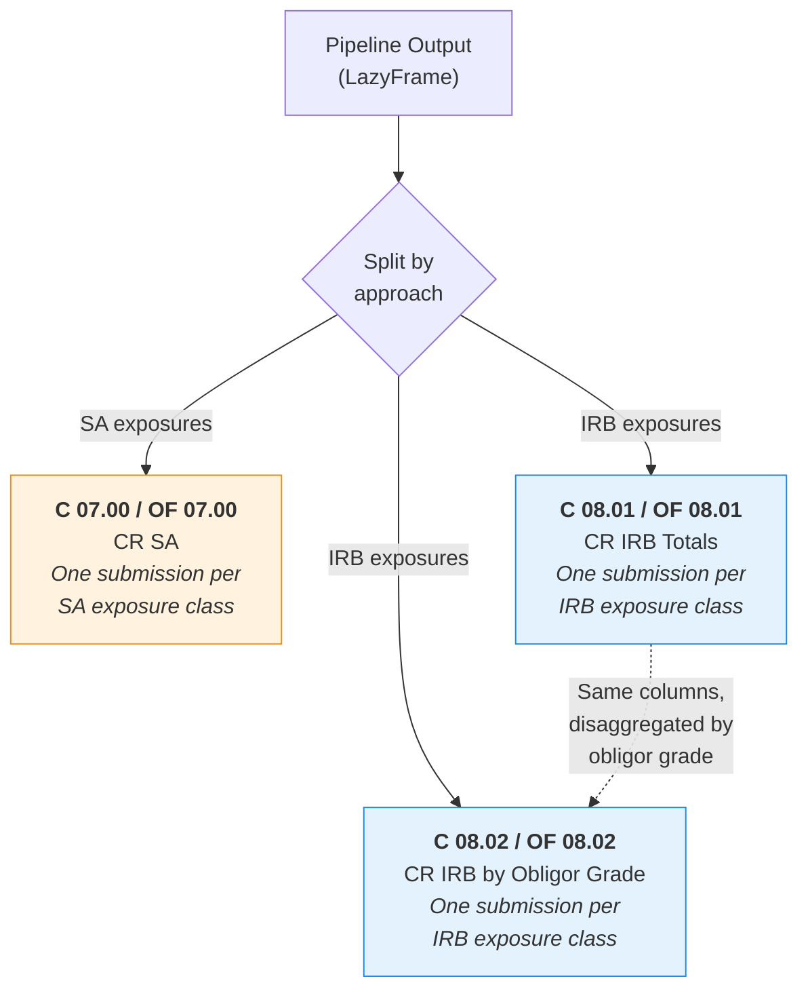
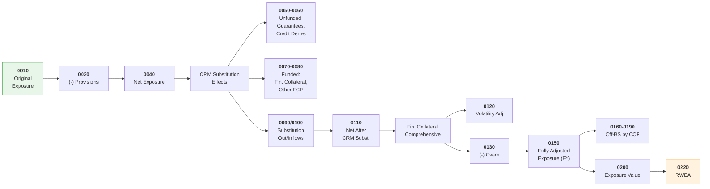
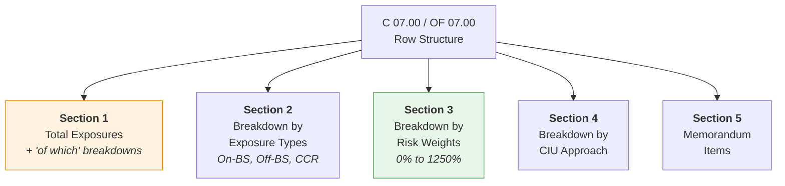

# COREP Reporting

The RWA Calculator generates COREP (COmmon REPorting) credit risk templates for regulatory
submissions. These templates follow the EBA DPM taxonomy as defined in Regulation (EU) 2021/451.

## Why COREP Matters

UK-regulated banks submit quarterly COREP returns to the PRA as part of ongoing supervisory
reporting. The credit risk templates require firms to aggregate their exposure-level RWA
calculations into standardised row/column formats by exposure class. Manual aggregation is
error-prone and audit-unfriendly — generating templates directly from calculation results
ensures consistency between the RWA engine output and the reported figures.

## Template Overview

The calculator produces three credit risk template families. Each template is reported
**once per SA or IRB exposure class** — the exposure class acts as a filter, not a row dimension.



| Template | CRR Name | Basel 3.1 Name | Purpose |
|----------|----------|----------------|---------|
| **C 07.00** | CR SA | OF CR SA | SA credit risk — totals, exposure type breakdown, risk weight breakdown, memorandum items |
| **C 08.01** | CR IRB 1 | OF CR IRB 1 | IRB totals — exposure value, CRM, RWEA, expected loss, obligor count |
| **C 08.02** | CR IRB 2 | OF CR IRB 2 | IRB breakdown by obligor grade/pool — same columns as C 08.01, one row per internal rating grade |

!!! info "Template Naming"
    Under CRR the templates are prefixed **C** (e.g., C 07.00). Under Basel 3.1 (PRA PS1/26)
    they are prefixed **OF** (Own Funds, e.g., OF 07.00). The structure and purpose are
    equivalent but columns and rows differ as detailed below.

---

## C 07.00 / OF 07.00 — CR SA

### Column Structure

The SA template has a wide column layout covering the full credit risk waterfall from original
exposure through CRM to final RWEA. The column derivation flows left to right:



#### Full Column Reference

=== "CRR (C 07.00)"

    | Ref | Column | Group |
    |-----|--------|-------|
    | 0010 | Original exposure pre conversion factors | Exposure |
    | 0030 | (-) Value adjustments and provisions | Exposure |
    | 0040 | Exposure net of value adjustments and provisions | Exposure |
    | 0050 | (-) Guarantees | CRM Substitution: Unfunded |
    | 0060 | (-) Credit derivatives | CRM Substitution: Unfunded |
    | 0070 | (-) Financial collateral: Simple method | CRM Substitution: Funded |
    | 0080 | (-) Other funded credit protection | CRM Substitution: Funded |
    | 0090 | (-) Substitution outflows | CRM Substitution |
    | 0100 | Substitution inflows (+) | CRM Substitution |
    | 0110 | Net exposure after CRM substitution effects pre CCFs | Post-CRM |
    | 0120 | Volatility adjustment to the exposure | Fin. Collateral Comprehensive |
    | 0130 | (-) Financial collateral: adjusted value (Cvam) | Fin. Collateral Comprehensive |
    | 0140 | (-) Of which: volatility and maturity adjustments | Fin. Collateral Comprehensive |
    | 0150 | Fully adjusted exposure value (E*) | Post-CRM |
    | 0160 | Off-BS by CCF: 0% | CCF Breakdown |
    | 0170 | Off-BS by CCF: 20% | CCF Breakdown |
    | 0180 | Off-BS by CCF: 50% | CCF Breakdown |
    | 0190 | Off-BS by CCF: 100% | CCF Breakdown |
    | 0200 | Exposure value | Final |
    | 0210 | Of which: arising from CCR | Final |
    | 0211 | Of which: CCR excl. CCP | Final |
    | 0215 | RWEA pre supporting factors | RWEA |
    | 0216 | (-) SME supporting factor adjustment | RWEA |
    | 0217 | (-) Infrastructure supporting factor adjustment | RWEA |
    | 0220 | RWEA after supporting factors | RWEA |
    | 0230 | Of which: with ECAI credit assessment | RWEA |
    | 0240 | Of which: credit assessment derived from central govt | RWEA |

=== "Basel 3.1 (OF 07.00)"

    | Ref | Column | Group | vs CRR |
    |-----|--------|-------|--------|
    | 0010 | Original exposure pre conversion factors | Exposure | |
    | 0030 | (-) Value adjustments and provisions | Exposure | |
    | ==0035== | ==(-) Adjustment due to on-balance sheet netting== | ==Exposure== | ==**New**== |
    | 0040 | Exposure net of adjustments, provisions, and netting | Exposure | Changed |
    | 0050 | (-) Guarantees (adjusted values) | CRM Substitution: Unfunded | |
    | 0060 | (-) Credit derivatives | CRM Substitution: Unfunded | |
    | 0070 | (-) Financial collateral: Simple method | CRM Substitution: Funded | |
    | 0080 | (-) Other funded credit protection | CRM Substitution: Funded | |
    | 0090 | (-) Substitution outflows | CRM Substitution | |
    | 0100 | Substitution inflows (+) | CRM Substitution | |
    | 0110 | Net exposure after CRM substitution effects pre CCFs | Post-CRM | |
    | 0120 | Volatility adjustment to the exposure | Fin. Collateral Comprehensive | |
    | 0130 | (-) Financial collateral: adjusted value (Cvam) | Fin. Collateral Comprehensive | |
    | 0140 | (-) Of which: volatility and maturity adjustments | Fin. Collateral Comprehensive | |
    | 0150 | Fully adjusted exposure value (E*) | Post-CRM | |
    | ==0160== | ==Off-BS by CCF: 10%== | ==CCF Breakdown== | ==**Changed** (was 0%)== |
    | 0170 | Off-BS by CCF: 20% | CCF Breakdown | |
    | ==0171== | ==Off-BS by CCF: 40%== | ==CCF Breakdown== | ==**New**== |
    | 0180 | Off-BS by CCF: 50% | CCF Breakdown | |
    | 0190 | Off-BS by CCF: 100% | CCF Breakdown | |
    | 0200 | Exposure value | Final | |
    | 0210 | Of which: arising from CCR | Final | |
    | 0211 | Of which: CCR excl. CCP | Final | |
    | ~~0215~~ | ~~RWEA pre supporting factors~~ | | **Removed** |
    | ~~0216~~ | ~~(-) SME supporting factor adjustment~~ | | **Removed** |
    | ~~0217~~ | ~~(-) Infrastructure supporting factor adjustment~~ | | **Removed** |
    | 0220 | Risk-weighted exposure amount | RWEA | Changed |
    | 0230 | Of which: with ECAI credit assessment | RWEA | |
    | ==0235== | ==Of which: without ECAI credit assessment== | ==RWEA== | ==**New**== |
    | 0240 | Of which: credit assessment derived from central govt | RWEA | |

=== "Differences"

    | Change | Ref(s) | Description |
    |--------|--------|-------------|
    | **Added** | 0035 | On-balance sheet netting — separated from original exposure |
    | **Added** | 0171 | 40% CCF bucket — new Basel 3.1 conversion factor |
    | **Added** | 0235 | Unrated RWEA — separate reporting of exposures without ECAI |
    | **Changed** | 0160 | CCF 0% bucket becomes **10%** (minimum 10% CCF for unconditionally cancellable) |
    | **Changed** | 0040 | Now also nets on-balance sheet netting (col 0035) |
    | **Changed** | 0220 | No longer "after supporting factors" — factors removed |
    | **Removed** | 0215 | RWEA pre supporting factors |
    | **Removed** | 0216 | SME supporting factor adjustment |
    | **Removed** | 0217 | Infrastructure supporting factor adjustment |

### Row Structure

Each SA template submission (per exposure class) contains five row sections:



=== "CRR (C 07.00)"

    **Section 1 — Total Exposures**

    | Ref | Row |
    |-----|-----|
    | 0010 | **TOTAL EXPOSURES** |
    | 0015 | of which: Defaulted exposures |
    | 0020 | of which: SME |
    | 0030 | of which: Exposures subject to SME-supporting factor |
    | 0035 | of which: Exposures subject to infrastructure supporting factor |
    | 0040 | of which: Secured by mortgages on immovable property — Residential |
    | 0050 | of which: Exposures under permanent partial use of SA |
    | 0060 | of which: Exposures under sequential IRB implementation |

    **Section 2 — Breakdown by Exposure Types**

    | Ref | Row |
    |-----|-----|
    | 0070 | On balance sheet exposures subject to credit risk |
    | 0080 | Off balance sheet exposures subject to credit risk |
    | 0090 | SFT netting sets |
    | 0100 | &emsp;of which: centrally cleared through a QCCP |
    | 0110 | Derivatives & Long Settlement Transactions netting sets |
    | 0120 | &emsp;of which: centrally cleared through a QCCP |
    | 0130 | From Contractual Cross Product netting sets |

    **Section 3 — Breakdown by Risk Weights**

    | Ref | Risk Weight |
    |-----|-------------|
    | 0140 | 0% |
    | 0150 | 2% |
    | 0160 | 4% |
    | 0170 | 10% |
    | 0180 | 20% |
    | 0190 | 35% |
    | 0200 | 50% |
    | 0210 | 70% |
    | 0220 | 75% |
    | 0230 | 100% |
    | 0240 | 150% |
    | 0250 | 250% |
    | 0260 | 370% |
    | 0270 | 1,250% |
    | 0280 | Other risk weights |

    **Section 4 — Breakdown by CIU Approach**

    | Ref | Row |
    |-----|-----|
    | 0281 | Look-through approach |
    | 0282 | Mandate-based approach |
    | 0283 | Fall-back approach |

    **Section 5 — Memorandum Items**

    | Ref | Row |
    |-----|-----|
    | 0290 | Exposures secured by mortgages on commercial immovable property |
    | 0300 | Exposures in default subject to RW of 100% |
    | 0310 | Exposures secured by mortgages on residential immovable property |
    | 0320 | Exposures in default subject to RW of 150% |

=== "Basel 3.1 (OF 07.00)"

    **Section 1 — Total Exposures**

    | Ref | Row | vs CRR |
    |-----|-----|--------|
    | 0010 | **TOTAL EXPOSURES** | |
    | 0015 | of which: Defaulted exposures | |
    | 0020 | of which: SME | |
    | ==0021== | ==of which: Specialised lending — Object finance== | ==**New**== |
    | ==0022== | ==of which: Specialised lending — Commodities finance== | ==**New**== |
    | ==0023== | ==of which: Specialised lending — Project finance== | ==**New**== |
    | ==0024== | ==&emsp;of which: pre-operational phase== | ==**New**== |
    | ==0025== | ==&emsp;of which: operational phase== | ==**New**== |
    | ==0026== | ==&emsp;of which: high quality operational phase== | ==**New**== |
    | ==0330== | ==of which: Regulatory residential RE== | ==**New**== |
    | ==0331== | ==&emsp;of which: not materially dependent on property cash flows== | ==**New**== |
    | ==0332== | ==&emsp;of which: materially dependent on property cash flows== | ==**New**== |
    | ==0340== | ==of which: Regulatory commercial RE== | ==**New**== |
    | ==0341== | ==&emsp;of which: not materially dependent (non-SME)== | ==**New**== |
    | ==0343== | ==&emsp;of which: SME (non-materially dependent)== | ==**New**== |
    | ==0342== | ==&emsp;of which: materially dependent== | ==**New**== |
    | ==0344== | ==&emsp;of which: SME (materially dependent)== | ==**New**== |
    | ==0350== | ==of which: Other real estate== | ==**New**== |
    | ==0351-0354== | ==&emsp;Residential/Commercial x cash-flow dependency splits== | ==**New**== |
    | ==0360== | ==of which: Land ADC exposures== | ==**New**== |
    | 0050 | of which: Exposures under permanent partial use of SA | |
    | 0060 | of which: Exposures under sequential IRB implementation | |

    !!! warning "Removed Rows"
        Rows **0030** (SME supporting factor) and **0035** (infrastructure supporting factor) are
        removed — these factors no longer exist under Basel 3.1. Row **0040** (secured by
        residential mortgages) is replaced by the detailed 0330-0360 real estate structure.

    **Section 2 — Breakdown by Exposure Types**

    Identical to CRR (rows 0070-0130).

    **Section 3 — Breakdown by Risk Weights**

    | Ref | Risk Weight | vs CRR |
    |-----|-------------|--------|
    | 0140 | 0% | |
    | 0150 | 2% | |
    | 0160 | 4% | |
    | 0170 | 10% | |
    | ==0171== | ==15%== | ==**New**== |
    | 0180 | 20% | |
    | ==0181== | ==25%== | ==**New**== |
    | ==0182== | ==30%== | ==**New**== |
    | 0190 | 35% | |
    | ==0191== | ==40%== | ==**New**== |
    | ==0192== | ==45%== | ==**New**== |
    | 0200 | 50% | |
    | ==0201== | ==60%== | ==**New**== |
    | ==0202== | ==65%== | ==**New**== |
    | 0210 | 70% | |
    | 0220 | 75% | |
    | ==0221== | ==80%== | ==**New**== |
    | ==0222== | ==85%== | ==**New**== |
    | 0230 | 100% | |
    | ==0231== | ==105%== | ==**New**== |
    | ==0232== | ==110%== | ==**New**== |
    | ==0233== | ==130%== | ==**New**== |
    | ==0234== | ==135%== | ==**New**== |
    | 0240 | 150% | |
    | 0250 | 250% | |
    | ==0261== | ==400%== | ==**New** (replaces 370%)== |
    | 0270 | 1,250% | |
    | 0280 | Other risk weights | |

    **Section 4 — Breakdown by CIU Approach**

    | Ref | Row | vs CRR |
    |-----|-----|--------|
    | 0281 | Look-through approach | |
    | ==0284== | ==&emsp;of which: exposures to relevant CIUs== | ==**New**== |
    | 0282 | Mandate-based approach | |
    | ==0285== | ==&emsp;of which: exposures to relevant CIUs== | ==**New**== |
    | 0283 | Fall-back approach | |

    **Section 5 — Memorandum Items**

    | Ref | Row | vs CRR |
    |-----|-----|--------|
    | 0300 | Exposures in default subject to RW of 100% | |
    | 0320 | Exposures in default subject to RW of 150% | |
    | ==0371== | ==Equity transitional: SA higher risk== | ==**New**== |
    | ==0372== | ==Equity transitional: SA other equity== | ==**New**== |
    | ==0373== | ==Equity transitional: IRB higher risk== | ==**New**== |
    | ==0374== | ==Equity transitional: IRB other equity== | ==**New**== |
    | ==0380== | ==Retail and RE: subject to currency mismatch multiplier== | ==**New**== |

    !!! warning "Removed Memorandum Rows"
        Rows **0290** (secured by commercial RE) and **0310** (secured by residential RE) are
        removed — replaced by the detailed real estate breakdown in Section 1 (rows 0330-0360).

=== "Differences Summary"

    | Area | CRR | Basel 3.1 |
    |------|-----|-----------|
    | **"Of which" rows** | 8 rows (0015-0060) | 26+ rows — adds specialised lending (0021-0026), detailed RE breakdown (0330-0360) |
    | **Risk weight rows** | 15 rows (0%-1250% + Other) | 29 rows — adds 15 new granular weights, removes 370% |
    | **CIU approach** | 3 rows | 5 rows — adds "relevant CIUs" sub-rows |
    | **Memorandum items** | 4 rows | 7 rows — adds equity transitional, currency mismatch; removes RE mortgage rows |
    | **Removed rows** | — | 0030 (SME factor), 0035 (infra factor), 0040 (residential mortgages), 0290, 0310 |

???+ example "Row Mapping — Source Code"
    The SA exposure class to row mapping used by the calculator's COREP generator:

    ```python
    --8<-- "src/rwa_calc/reporting/corep/templates.py:52:66"
    ```

??? example "Column Definitions — Source Code"
    ```python
    --8<-- "src/rwa_calc/reporting/corep/templates.py:69:79"
    ```

??? example "Risk Weight Band Definitions — Source Code"
    ```python
    --8<-- "src/rwa_calc/reporting/corep/templates.py:83:98"
    ```

---

## C 08.01 / OF 08.01 — CR IRB Totals

The IRB totals template is filtered by **IRB exposure class** and by **own estimates of
LGD/CCF** (Foundation vs Advanced IRB). It covers the full IRB waterfall: original exposure,
CRM substitution effects, CRM in LGD estimates (with detailed collateral breakdown), exposure
value, LGD, maturity, RWEA, and memorandum items (expected loss, provisions, obligor count).

### Column Structure

=== "CRR (C 08.01)"

    | Ref | Column | Group |
    |-----|--------|-------|
    | 0010 | PD assigned to obligor grade or pool (%) | Internal Rating |
    | 0020 | Original exposure pre conversion factors | Exposure |
    | 0030 | &emsp;Of which: large financial sector entities | Exposure |
    | 0040 | (-) Guarantees | CRM Substitution: Unfunded |
    | 0050 | (-) Credit derivatives | CRM Substitution: Unfunded |
    | 0060 | (-) Other funded credit protection | CRM Substitution: Funded |
    | 0070 | (-) Substitution outflows | CRM Substitution |
    | 0080 | Substitution inflows (+) | CRM Substitution |
    | 0090 | Exposure after CRM substitution pre CCFs | Post-CRM |
    | 0100 | &emsp;Of which: off balance sheet | Post-CRM |
    | 0110 | Exposure value | Exposure Value |
    | 0120 | &emsp;Of which: off balance sheet | Exposure Value |
    | 0130 | &emsp;Of which: arising from CCR | Exposure Value |
    | 0140 | &emsp;Of which: large financial sector entities | Exposure Value |
    | 0150 | Guarantees (own LGD estimates) | CRM in LGD: Unfunded |
    | 0160 | Credit derivatives (own LGD estimates) | CRM in LGD: Unfunded |
    | 0170 | Other funded credit protection (own LGD estimates) | CRM in LGD: Funded |
    | 0171 | &emsp;Cash on deposit | CRM in LGD: Funded |
    | 0172 | &emsp;Life insurance policies | CRM in LGD: Funded |
    | 0173 | &emsp;Instruments held by a third party | CRM in LGD: Funded |
    | 0180 | Eligible financial collateral | CRM in LGD: Funded |
    | 0190 | &emsp;Other eligible collateral: Real estate | CRM in LGD: Funded |
    | 0200 | &emsp;Other eligible collateral: Other physical | CRM in LGD: Funded |
    | 0210 | &emsp;Other eligible collateral: Receivables | CRM in LGD: Funded |
    | 0220 | Subject to double default treatment: Unfunded | Double Default |
    | 0230 | Exposure-weighted average LGD (%) | Parameters |
    | 0240 | &emsp;For large financial sector entities | Parameters |
    | 0250 | Exposure-weighted average maturity (days) | Parameters |
    | 0255 | RWEA pre supporting factors | RWEA |
    | 0256 | (-) SME supporting factor adjustment | RWEA |
    | 0257 | (-) Infrastructure supporting factor adjustment | RWEA |
    | 0260 | RWEA after supporting factors | RWEA |
    | 0270 | &emsp;Of which: large financial sector entities | RWEA |
    | 0280 | Expected loss amount | Memorandum |
    | 0290 | (-) Value adjustments and provisions | Memorandum |
    | 0300 | Number of obligors | Memorandum |
    | 0310 | Pre-credit derivatives RWEA | Memorandum |

=== "Basel 3.1 (OF 08.01)"

    | Ref | Column | Group | vs CRR |
    |-----|--------|-------|--------|
    | ~~0010~~ | ~~PD assigned to obligor grade or pool~~ | | **Removed** (PD only in OF 08.02) |
    | 0020 | Original exposure pre conversion factors | Exposure | |
    | 0030 | &emsp;Of which: large financial sector entities | Exposure | |
    | ==0035== | ==(-) Adjustment due to on-balance sheet netting== | ==Exposure== | ==**New**== |
    | 0040 | (-) Guarantees | CRM Substitution: Unfunded | |
    | 0050 | (-) Credit derivatives | CRM Substitution: Unfunded | |
    | 0060 | (-) Other funded credit protection | CRM Substitution: Funded | |
    | 0070 | (-) Substitution outflows | CRM Substitution | |
    | 0080 | Substitution inflows (+) | CRM Substitution | |
    | 0090 | Exposure after CRM substitution pre CCFs | Post-CRM | |
    | 0100 | &emsp;Of which: off balance sheet | Post-CRM | |
    | ==0101== | ==Volatility adjustment to the exposure (Slotting)== | ==Fin. Collateral Comprehensive== | ==**New**== |
    | ==0102== | ==(-) Financial collateral adjusted value Cvam (Slotting)== | ==Fin. Collateral Comprehensive== | ==**New**== |
    | ==0103== | ==(-) Of which: volatility and maturity adj (Slotting)== | ==Fin. Collateral Comprehensive== | ==**New**== |
    | ==0104== | ==Exposure after all CRM pre CCFs (Slotting)== | ==Fin. Collateral Comprehensive== | ==**New**== |
    | 0110 | Exposure value | Exposure Value | |
    | 0120 | &emsp;Of which: off balance sheet | Exposure Value | |
    | ==0125== | ==&emsp;Of which: defaulted== | ==Exposure Value== | ==**New**== |
    | 0130 | &emsp;Of which: arising from CCR | Exposure Value | |
    | 0140 | &emsp;Of which: large financial sector entities | Exposure Value | |
    | 0150 | Guarantees | CRM in LGD: Unfunded | |
    | 0160 | Credit derivatives | CRM in LGD: Unfunded | |
    | 0170 | Other funded credit protection | CRM in LGD: Funded | |
    | 0171 | &emsp;Cash on deposit | CRM in LGD: Funded | |
    | 0172 | &emsp;Life insurance policies | CRM in LGD: Funded | |
    | 0173 | &emsp;Instruments held by a third party | CRM in LGD: Funded | |
    | 0180 | Eligible financial collateral | CRM in LGD: Funded | |
    | 0190 | &emsp;Other eligible collateral: Real estate | CRM in LGD: Funded | |
    | 0200 | &emsp;Other eligible collateral: Other physical | CRM in LGD: Funded | |
    | 0210 | &emsp;Other eligible collateral: Receivables | CRM in LGD: Funded | |
    | ~~0220~~ | ~~Subject to double default treatment~~ | | **Removed** |
    | 0230 | Exposure-weighted average LGD (%) | Parameters | |
    | 0240 | &emsp;For large financial sector entities | Parameters | |
    | 0250 | Exposure-weighted average maturity (days) | Parameters | |
    | ==0251== | ==RWEA pre adjustments== | ==RWEA== | ==**New**== |
    | ==0252== | ==Adjustment due to post-model adjustments== | ==RWEA== | ==**New**== |
    | ==0253== | ==Adjustment due to mortgage RW floor== | ==RWEA== | ==**New**== |
    | ==0254== | ==Unrecognised exposure adjustments== | ==RWEA== | ==**New**== |
    | ~~0255~~ | ~~RWEA pre supporting factors~~ | | **Removed** |
    | ~~0256~~ | ~~(-) SME supporting factor adjustment~~ | | **Removed** |
    | ~~0257~~ | ~~(-) Infrastructure supporting factor adjustment~~ | | **Removed** |
    | 0260 | RWEA after adjustments | RWEA | Changed |
    | ==0265== | ==&emsp;Of which: defaulted== | ==RWEA== | ==**New**== |
    | 0270 | &emsp;Of which: large financial sector entities | RWEA | |
    | ==0275== | ==Non-modelled approaches: exposure value== | ==Output Floor== | ==**New**== |
    | ==0276== | ==Non-modelled approaches: RWEA== | ==Output Floor== | ==**New**== |
    | 0280 | Expected loss amount (pre post-model adj) | Memorandum | Changed |
    | ==0281== | ==Adjustment to EL due to post-model adjustments== | ==Memorandum== | ==**New**== |
    | ==0282== | ==Expected loss amount after post-model adjustments== | ==Memorandum== | ==**New**== |
    | 0290 | (-) Value adjustments and provisions | Memorandum | |
    | 0300 | Number of obligors | Memorandum | |
    | 0310 | Pre-credit derivatives RWEA | Memorandum | |

=== "Differences Summary"

    | Change | Ref(s) | Description |
    |--------|--------|-------------|
    | **Added** | 0035 | On-balance sheet netting (same as OF 07.00) |
    | **Added** | 0101-0104 | Financial Collateral Comprehensive Method columns for slotting approach |
    | **Added** | 0125, 0265 | "Of which: defaulted" for exposure value and RWEA |
    | **Added** | 0251-0254 | Post-model adjustment columns (pre-adj RWEA, post-model adj, mortgage RW floor, unrecognised exposure adj) |
    | **Added** | 0275-0276 | Output floor columns (SA-equivalent exposure value and RWEA) |
    | **Added** | 0281-0282 | Post-model adjustments to expected loss |
    | **Removed** | 0010 | PD column — moved to OF 08.02 only |
    | **Removed** | 0220 | Double default treatment (removed in Basel 3.1) |
    | **Removed** | 0255-0257 | Supporting factor columns (SME and infrastructure factors removed) |

### Row Structure

=== "CRR (C 08.01)"

    | Ref | Row |
    |-----|-----|
    | 0010 | **TOTAL EXPOSURES** |
    | 0015 | of which: Exposures subject to SME-supporting factor |
    | 0016 | of which: Exposures subject to infrastructure supporting factor |
    | | **BREAKDOWN BY EXPOSURE TYPES** |
    | 0020 | On balance sheet items subject to credit risk |
    | 0030 | Off balance sheet items subject to credit risk |
    | 0040 | SFT netting sets |
    | 0050 | Derivatives & Long Settlement Transactions netting sets |
    | 0060 | From Contractual Cross Product netting sets |
    | | **CALCULATION APPROACHES** |
    | 0070 | Exposures assigned to obligor grades or pools: Total |
    | 0080 | Specialised lending slotting approach: Total |
    | 0160 | Alternative treatment: Secured by real estate |
    | 0170 | Exposures from free deliveries (alternative RW treatment or 100%) |
    | 0180 | Dilution risk: Total purchased receivables |

=== "Basel 3.1 (OF 08.01)"

    | Ref | Row | vs CRR |
    |-----|-----|--------|
    | 0010 | **TOTAL EXPOSURES** | |
    | ==0017== | ==of which: revolving loan commitments== | ==**New**== |
    | | **BREAKDOWN BY EXPOSURE TYPES** | |
    | 0020 | On balance sheet items subject to credit risk | |
    | 0030 | Off balance sheet items subject to credit risk | |
    | ==0031-0035== | ==Breakdown of off-BS by CCF buckets== | ==**New**== |
    | 0040 | SFT netting sets | |
    | 0050 | Derivatives & Long Settlement Transactions netting sets | |
    | 0060 | From Contractual Cross Product netting sets | |
    | | **CALCULATION APPROACHES** | |
    | 0070 | Exposures assigned to obligor grades or pools: Total | |
    | 0080 | Specialised lending slotting approach: Total | |
    | ~~0160~~ | ~~Alternative treatment: Secured by real estate~~ | **Removed** |
    | 0170 | Exposures from free deliveries | |
    | ==0175== | ==Purchased receivables== | ==**New**== |
    | 0180 | Dilution risk: Total purchased receivables | |
    | ==0190== | ==Corporates without ECAI== | ==**New**== |
    | ==0200== | ==&emsp;of which: investment grade== | ==**New**== |

    !!! warning "Removed Rows"
        Rows **0015** (SME factor), **0016** (infrastructure factor), and **0160** (alternative
        RE treatment) are removed under Basel 3.1.

=== "Differences Summary"

    | Change | Ref(s) | Description |
    |--------|--------|-------------|
    | **Added** | 0017 | Revolving loan commitments breakdown |
    | **Added** | 0031-0035 | Off-balance sheet CCF bucket breakdown rows |
    | **Added** | 0175 | Purchased receivables (explicit row) |
    | **Added** | 0190, 0200 | Corporates without ECAI / investment grade (output floor) |
    | **Removed** | 0015 | SME supporting factor |
    | **Removed** | 0016 | Infrastructure supporting factor |
    | **Removed** | 0160 | Alternative treatment: Secured by real estate |

???+ example "IRB Row Mapping — Source Code"
    ```python
    --8<-- "src/rwa_calc/reporting/corep/templates.py:107:116"
    ```

??? example "Column Definitions — Source Code"
    ```python
    --8<-- "src/rwa_calc/reporting/corep/templates.py:119:131"
    ```

---

## C 08.02 / OF 08.02 — CR IRB by Obligor Grade

C 08.02 disaggregates C 08.01 by **individual obligor grade or pool** from the firm's
internal rating system. It uses the same column structure as C 08.01 with the addition of
an obligor grade identifier column.

!!! info "Dynamic Rows"
    Unlike C 07.00 and C 08.01, this template has **no pre-defined data rows**. Each row
    represents one PD grade or pool from the firm's internal rating system. Rows are ordered
    from best to worst credit quality, with defaulted obligors last. The number of rows varies
    by firm and exposure class.

### Structure

=== "CRR (C 08.02)"

    - **Column 0005**: Obligor grade row identifier
    - **Columns 0010-0310**: Identical to C 08.01 (including PD in column 0010)
    - Rows ordered by PD: best credit quality first, defaulted (PD = 100%) last
    - Excludes exposures subject to the alternative RE collateral treatment

=== "Basel 3.1 (OF 08.02)"

    - **Column 0005**: Obligor grade row identifier
    - **Columns 0020-0310**: Identical to OF 08.01 (PD column 0010 is retained here, unlike OF 08.01)
    - ==**New columns 0001, 0101-0105**==: Off-balance sheet CCF breakdown columns per obligor grade
    - PD ordering uses PDs **without** input floor adjustments
    - Excludes slotting approach exposures (slotting has its own template OF 08.03)

=== "Differences Summary"

    | Change | Description |
    |--------|-------------|
    | **PD column** | Retained in OF 08.02 (removed from OF 08.01 totals only) |
    | **CCF breakdown** | New columns 0001, 0101-0105 for off-BS items by CCF bucket |
    | **PD ordering** | Basel 3.1 uses PDs without input floor adjustments |
    | **Slotting excluded** | Slotting exposures reported separately (new OF 08.03) |
    | **Alt RE removed** | CRR exclusion for alternative RE treatment no longer applies |
    | **Double default** | Column 0220 removed (same as OF 08.01) |
    | **Supporting factors** | Columns 0255-0257 removed (same as OF 08.01) |
    | **Post-model adj** | New columns 0251-0254, 0281-0282 (same as OF 08.01) |
    | **Output floor** | New columns 0275-0276 (same as OF 08.01) |

??? example "PD Band Definitions — Source Code"
    The calculator groups obligor grades into standardised PD bands for aggregation:

    ```python
    --8<-- "src/rwa_calc/reporting/corep/templates.py:140:149"
    ```

---

## Overall CRR vs Basel 3.1 Template Comparison

| Area | CRR (C templates) | Basel 3.1 (OF templates) |
|------|-------------------|--------------------------|
| **Template prefix** | C (e.g., C 07.00) | OF (e.g., OF 07.00) |
| **SA columns** | 24 columns (0010-0240) | 22 columns — adds 0035, 0171, 0235; removes 0215-0217 |
| **SA risk weight rows** | 15 (0%-1250% + Other) | 29 — adds 15 new granular weights, removes 370% |
| **SA "of which" rows** | 8 | 26+ — adds specialised lending and detailed RE breakdowns |
| **IRB columns** | 33 columns (0010-0310) | 40+ columns — adds netting, slotting CRM, defaults, post-model adj, output floor; removes PD (totals), double default, supporting factors |
| **IRB approach filter** | Binary (Foundation / Advanced) | Three-way (FIRB / AIRB / Slotting) |
| **Supporting factors** | SME (Art 501) + Infrastructure (Art 501a) | **Removed** |
| **Double default** | Column 0220 | **Removed** |
| **Output floor** | Not applicable | Columns 0275-0276 (SA-equivalent for floor calculation) |
| **Post-model adjustments** | Not applicable | Columns 0251-0254 (RWEA), 0281-0282 (EL) |
| **CCF buckets (SA)** | 0%, 20%, 50%, 100% | 10%, 20%, 40%, 50%, 100% |

## Usage

### Generate from Pipeline Results

```python
from rwa_calc.reporting import COREPGenerator

generator = COREPGenerator()

# From a LazyFrame of calculation results
bundle = generator.generate_from_lazyframe(results, framework="CRR")

# From a CalculationResponse (uses cached Parquet)
bundle = generator.generate(response)

# Access templates as DataFrames
print(bundle.c07_00)      # C 07.00 SA credit risk
print(bundle.c08_01)      # C 08.01 IRB totals
print(bundle.c08_02)      # C 08.02 IRB by PD grade
print(bundle.c07_rw_breakdown)  # C 07.00 risk weight breakdown
```

### Export to Excel

```python
from pathlib import Path
from rwa_calc.reporting import COREPGenerator

generator = COREPGenerator()
bundle = generator.generate_from_lazyframe(results)

# Export multi-sheet Excel workbook
result = generator.export_to_excel(bundle, Path("corep_templates.xlsx"))
# Creates sheets: "C 07.00", "C 07.00 RW Breakdown", "C 08.01", "C 08.02"

print(result.format)      # "corep_excel"
print(result.row_count)   # Total rows across all sheets
```

!!! note "Excel dependency"
    Excel export requires `xlsxwriter`. Install via `uv add xlsxwriter`.

## Regulatory References

| Reference | Topic |
|-----------|-------|
| Regulation (EU) 2021/451, Annex I | CRR COREP template layouts |
| Regulation (EU) 2021/451, Annex II | CRR COREP reporting instructions |
| CRR Art. 112-134 | SA exposure classes and risk weights |
| CRR Art. 142-191 | IRB exposure classes and capital requirements |
| PRA PS1/26 | Basel 3.1 final rules |
| PRA PS1/26 Annex I | Basel 3.1 OF template layouts |
| PRA PS1/26 Annex II | Basel 3.1 OF reporting instructions |
