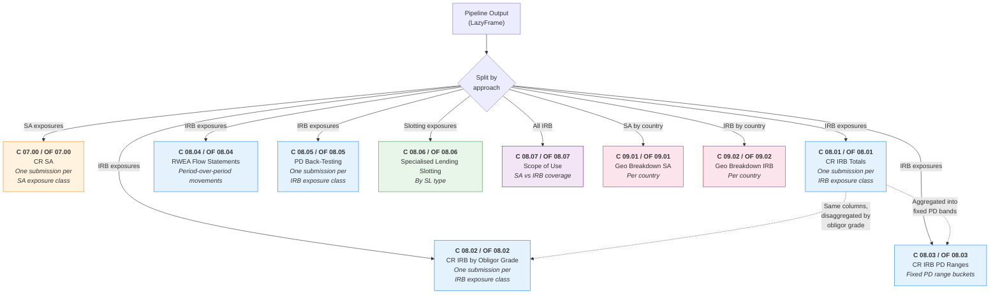
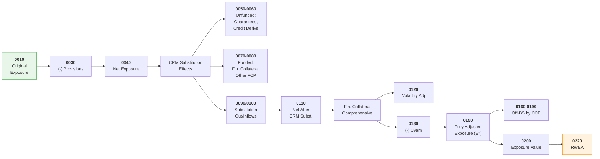
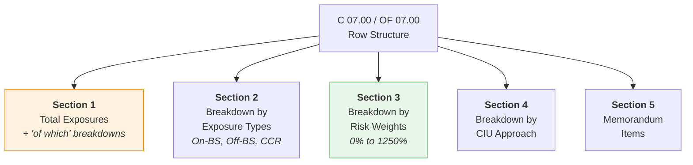

# COREP Reporting

The RWA Calculator generates COREP (COmmon REPorting) credit risk templates for regulatory
submissions. These templates follow the EBA DPM taxonomy as defined in Regulation (EU) 2021/451.

## Why COREP Matters

UK-regulated banks submit quarterly COREP returns to the PRA as part of ongoing supervisory
reporting. The credit risk templates require firms to aggregate their exposure-level RWA
calculations into standardised row/column formats by exposure class. Manual aggregation is
error-prone and audit-unfriendly — generating templates directly from calculation results
ensures consistency between the RWA engine output and the reported figures.

## Template Overview

The calculator covers nine credit risk template families across SA, IRB, and geographical
breakdowns. Each template is reported **once per SA or IRB exposure class** (or per country
for geographical templates) — the exposure class acts as a filter, not a row dimension.



| Template | CRR Name | Basel 3.1 Name | Purpose |
|----------|----------|----------------|---------|
| **C 07.00** | CR SA | OF CR SA | SA credit risk — totals, exposure type breakdown, risk weight breakdown, memorandum items |
| **C 08.01** | CR IRB 1 | OF CR IRB 1 | IRB totals — exposure value, CRM, RWEA, expected loss, obligor count |
| **C 08.02** | CR IRB 2 | OF CR IRB 2 | IRB breakdown by obligor grade/pool — same columns as C 08.01, one row per internal rating grade |
| **C 08.03** | CR IRB 3 | OF CR IRB 3 | IRB breakdown by fixed PD ranges — key parameters (PD, LGD, CCF, RWEA, EL) per PD bucket |
| **C 08.04** | CR IRB 4 | OF CR IRB 4 | RWEA flow statements — period-over-period movement decomposition |
| **C 08.05** | CR IRB 5 | OF CR IRB 5 | PD back-testing — average PD vs realised default rates per fixed PD range bucket |
| **C 08.06** | CR IRB 6 | OF CR IRB 6 | Specialised lending slotting — by category and maturity |
| **C 08.07** | CR IRB 7 | OF CR IRB 7 | Scope of use of IRB and SA approaches — coverage percentages and RWEA attribution |
| **C 09.01** | CR GB 1 | OF CR GB 1 | Geographical breakdown of SA exposures by country of obligor residence |
| **C 09.02** | CR GB 2 | OF CR GB 2 | Geographical breakdown of IRB exposures by country of obligor residence |

!!! info "Template Naming"
    Under CRR the templates are prefixed **C** (e.g., C 07.00). Under Basel 3.1 (PRA PS1/26)
    they are prefixed **OF** (Own Funds, e.g., OF 07.00). The structure and purpose are
    equivalent but columns and rows differ as detailed below.

---

## C 02.00 / OF 02.00 — Own Funds Requirements

C 02.00 / OF 02.00 is the **master capital template** — the single point at which RWEA
across every risk type (credit, CCR, market, operational, CVA, securitisation, settlement)
is aggregated into the firm's Total Risk Exposure Amount (TREA) and Total Own Funds
Requirements. This calculator only populates the credit risk section (rows 0050–0420);
all other risk-type rows are null because those risk types are outside its scope.

**This is where the Basel 3.1 output floor is actually applied.** The floor formula

```
TREA = max(U-TREA, x · S-TREA + OF-ADJ)
```

is evaluated row 0010 of OF 02.00, with col 0010 carrying the U-TREA components, col 0020
carrying the S-TREA components fed in from [OF 02.01](#of-0201-output-floor-comparison-basel-31-only),
and col 0030 carrying the floored result after the multiplier `x` and OF-ADJ are applied.
See `output-floor.md` for the floor mechanics in detail.

**Reference:** CRR Art. 92 (own funds requirements); PRA PS1/26 Art. 92 para 2A / 3A / 5
(output floor); Regulation (EU) 2021/451 Annex I (CRR layout); PRA PS1/26 Annex I
(OF 02.00 layout).

!!! warning "Row 0050 **includes** counterparty credit risk — and the SA row foots"
    Annex II names row 0050 **"RISK WEIGHTED EXPOSURE AMOUNTS FOR CREDIT, COUNTERPARTY CREDIT
    AND DILUTION RISKS AND FREE DELIVERIES"** (Art. 92(3)(a),(f)). CCR is *inside* that row —
    C 02.00 has no sibling "Counterparty credit risk" row to hold it, unlike
    [OF 02.01](#of-0201-output-floor-comparison-basel-31-only) and Pillar 3 OV1, whose row
    labels legitimately read "Credit risk (excluding CCR)".

    Row 0050 was mislabelled "Credit risk (excluding CCR)" until the 2026-07 fix — a row that
    carried CCR while claiming to exclude it. Its **"Of which: Standardised Approach"** child
    (row 0060) and the Art. 112 class rows (0070–0211) now cover SA **and** SA-CCR, because
    Annex II defines the SA child as the "CR SA and SEC SA templates at the level of total
    exposures" — the SA row **is** the C 07.00 total, and C 07.00 reports CCR business. Before
    the fix, the Basel 3.1 template did not foot: the SA row reported 2,500,000 against a
    4,060,296.72 credit-risk total, the gap being exactly the SA-CCR derivative RWEA.

### Column Structure

=== "CRR (C 02.00)"

    | Column | Label | Description |
    |--------|-------|-------------|
    | **0010** | Amount | Own Funds Requirements — single column, all approaches RWEA |

=== "Basel 3.1 (OF 02.00)"

    | Column | Label | Description |
    |--------|-------|-------------|
    | **0010** | All approaches (U-TREA components) | RWEA using internal models where permitted (the U-TREA inputs from Art. 92 para 3) |
    | **0020** | Standardised approaches only (S-TREA components) | RWEA recalculated under standardised approaches per Art. 92 para 3A — pre-multiplier |
    | **0030** | Output floor (after floor multiplier and OF-ADJ) | Floored RWEA: `x · S-TREA + OF-ADJ` per row, used in the row 0010 TREA comparison |

=== "Differences"

    | Change | Ref | Description |
    |--------|-----|-------------|
    | **Added** | Col 0020 | Standardised re-run column (S-TREA components) — required for output floor comparison |
    | **Added** | Col 0030 | Post-floor RWEA column — populated only for risk types in scope of the floor |
    | **Changed** | Col 0010 | Now explicitly the U-TREA components (was simply "Amount" under CRR) |

!!! info "OF 02.01 vs OF 02.00 col 0030 — Same number, different meaning"
    OF 02.01 col 0030 is **U-TREA** (un-floored), while OF 02.00 col 0030 is the
    **floor-adjusted** RWEA (post-multiplier, post-OF-ADJ). Same column number, distinct
    semantics — see `output-reporting.md` §1.3 for the disambiguation.

### Row Structure

The row layout is significantly restructured under Basel 3.1 (PRA PS1/26 Annex II §1.3):
F-IRB / A-IRB / Slotting are split into separate sub-sections, corporate and retail
sub-class breakdowns are added, slotting is broken out by 5 SL types, and three new
output-floor indicator rows are inserted.

=== "CRR (C 02.00) — section overview"

    | Section | Rows | Notes |
    |---------|------|-------|
    | Total and Credit Risk | 0010, 0040; 0050–0211 | TREA (0010), Total Own Funds (0040), credit risk SA exposure-class breakdown (0050–0211) |
    | IRB Approach | 0220–0420 | F-IRB (0240–0260), A-IRB (0300–0410), supervisory slotting (0410), Equity IRB (0420) |
    | Other Risk Types | 0430–0680 | Settlement, securitisation, market, CVA, operational, fixed overheads — **all null** (out of scope) |

=== "Basel 3.1 (OF 02.00) — section overview"

    | Section | Rows | Notes |
    |---------|------|-------|
    | Total and Output Floor | 0010, ==0034==, ==0035==, ==0036==, 0040 | TREA (0010), output-floor indicators (==new==), Total Own Funds (0040) |
    | Credit Risk — SA | 0050–0211 (incl. ==0131==) | SA exposure-class breakdown; ==0131== "of which: specialised lending" added |
    | Credit Risk — F-IRB | 0220, 0240, 0250, ==0271==, 0260, ==0290==, ==0295==, ==0296==, ==0297== | Adds SL-excl-slotting and corporate SME / non-SME / financial-and-large splits |
    | Credit Risk — A-IRB | 0300–0410 (incl. ==0350==, ==0355==, ==0356==, ==0382–0385==, ==0410==) | Adds SL-excl-slotting, corporate SME splits, retail residential/commercial SME splits |
    | Slotting and Equity | ==0411–0416==, 0420 | Slotting broken out by PF / OF / CF / IPRE / HVCRE; Equity IRB retained |
    | Other Risk Types | 0430–0680 | Same as CRR — **all null** (out of scope) |

!!! info "New Basel 3.1 output-floor indicator rows"
    Three rows are inserted in the "Total and Output Floor" section:

    | Row | Label | Content |
    |-----|-------|---------|
    | **0034** | Output floor activated | Yes/No indicator (not RWEA) |
    | **0035** | Output floor multiplier | Percentage `x` from the transitional schedule (60%, 65%, 70%, 72.5%) |
    | **0036** | Output floor adjustment (OF-ADJ) | Monetary value of the IRB-EL vs SA-CRA reconciliation |

    These rows are gated on entity-type floor applicability (Art. 92 para 2A) and are
    populated by `_generate_c_02_00()` when an `OutputFloorConfig` is supplied.

!!! warning "Null Rows — Risk Types Out of Scope"
    Rows **0430** (settlement), **0440** (securitisation), **0460** (market / FX /
    commodities), **0590** (CVA), **0640** (operational), and **0680** (fixed overheads)
    are always null. The credit risk pipeline does not produce these risk-type RWEAs.

!!! note "Full row listing"
    Per-row labels and the complete row catalogue (including all `==new==` Basel 3.1 sub-rows)
    live in `src/rwa_calc/reporting/corep/templates.py` (`CRR_C02_00_ROW_SECTIONS` and
    `B31_C02_00_ROW_SECTIONS`). See [`output-reporting.md` §COREP Templates](../specifications/output-reporting.md#templates)
    for the spec-level catalogue and [§Missing Row IDs](../specifications/output-reporting.md#missing-row-ids)
    for the full enumeration of B31-only rows (0271, 0290, 0295–0297, 0355–0356, 0382–0385,
    0411–0416, 0034–0036).

### CRR vs Basel 3.1 — Output Floor Delta

!!! warning "Pre-2027 C 02.00 had no output-floor row"
    Under CRR, C 02.00 has a single column (0010) and contains no output-floor mechanism —
    TREA in row 0010 is simply the arithmetic sum of all risk-type RWEAs. PRA PS1/26
    introduces:

    1. **Two new columns** (0020 S-TREA components, 0030 post-floor RWEA);
    2. **Three new indicator rows** (0034 / 0035 / 0036) carrying the floor activation
       flag, multiplier, and OF-ADJ;
    3. **The TREA in row 0010 col 0010 is recomputed** via `max(U-TREA, x·S-TREA + OF-ADJ)`
       once the floor is activated — this is the only place in the COREP suite where the
       floor is *applied* (OF 02.01 only *reports* the inputs).

### Implementation

| Item | Detail |
|------|--------|
| Generator method | `COREPGenerator._generate_c_02_00()` |
| Bundle field | `COREPTemplateBundle.c_02_00` |
| Row section definitions | `CRR_C02_00_ROW_SECTIONS` / `B31_C02_00_ROW_SECTIONS` in `src/rwa_calc/reporting/corep/templates.py` |
| Column refs | `CRR_C02_00_COLUMN_REFS` / `B31_C02_00_COLUMN_REFS` |
| SA class → row map | `C02_00_SA_CLASS_MAP` (templates.py) |
| Framework | Both CRR (1 column) and Basel 3.1 (3 columns) |
| Output floor inputs | Optional `OutputFloorSummary` and `OutputFloorConfig` parameters drive cols 0020/0030 and rows 0034–0036 |
| Status | **Complete** — credit risk rows populated; non-credit risk-type rows null (out of scope) |

---

## OF 02.01 — Output Floor Comparison (Basel 3.1 only)

OF 02.01 is a Basel 3.1-only template with no CRR equivalent. It provides a dedicated output
floor comparison for internal-model firms, showing modelled versus standardised total risk
exposure amounts side by side by risk type. The template supplies the raw comparison data
consumed by [C 02.00 / OF 02.00](#c-0200-of-0200-own-funds-requirements) to apply the floor multiplier.

**Reference:** PRA PS1/26 Art. 92 para 2A / 3A

### Column Structure

| Column | Label | Description |
|--------|-------|-------------|
| **0010** | Modelled RWA | RWEA of the portfolios calculated under **modelled** approaches only — F-IRB, A-IRB and supervisory slotting (Art. 153(5) is an IRB-chapter approach) |
| **0020** | Standardised RWA | RWEA of the portfolios calculated under **standardised** approaches only — the **complement** of col 0010, so SA, SA-CCR and equity all land here |
| **0030** | U-TREA | Un-floored Total Risk Exposure Amount (Art. 92 para 3) = **col 0010 + col 0020** |
| **0040** | S-TREA | Standardised Total Risk Exposure Amount (Art. 92 para 3A) — the SA re-computation of the row's **whole** population (modelled and standardised alike), calculated without IRB, SFT VaR, SEC-IRBA, IAA, IMM, or IMA |

!!! warning "Cols 0010 and 0020 **partition** the book — they do not overlap"
    Annex II defines col 0030 as "a sum of 0010 and 0020, i.e. the complete current
    portfolio". That identity only holds because the two columns partition the portfolio:
    each exposure is counted in exactly one of them. Col 0020 is therefore the
    **complement** of the modelled set — not an allow-list of approach labels — so an
    approach the template does not recognise falls into the standardised side rather than
    into neither column.

    Both columns sum the **pre-floor own-approach RWA** (`rwa_pre_floor`). Only col 0040
    sums the SA-equivalent (`sa_rwa`), and it does so over the row's whole population —
    that is what S-TREA *is*. Equity legs bypass the SA calculator, so the aggregator
    populates their `sa_rwa` as their own pre-floor RWA (Basel 3.1 equity is
    standardised-only, Art. 147A); without this, col 0040 (and the equivalent
    C 02.00 col 0020 / CMS1/CMS2 col d) would silently drop equity's
    standardised-equivalent RWA.

    Until the 2026-07 fix, cols 0010 and 0020 were each summed over the **whole**
    portfolio, so col 0030 reported U-TREA + S-TREA rather than U-TREA. See the
    [changelog](../appendix/changelog.md) for the measured impact.

### Row Structure

| Row | Risk Type | Current Scope |
|-----|-----------|---------------|
| **0010** | Credit risk (excluding CCR) | Populated — the SA and IRB credit book, CCR excluded |
| **0020** | Counterparty credit risk (CCR) | Populated — SA-CCR derivative netting sets, FCCM SFT legs, CCP default-fund contributions |
| **0030** | CVA | Null — CVA out of scope |
| **0040** | Securitisation | Null — securitisation out of scope |
| **0050** | Market risk | Null — market risk out of scope |
| **0060** | Operational risk | Null — operational risk out of scope |
| **0070** | Other risk | Null — no other risk types in scope |
| **0080** | Total | Populated — the whole book, and therefore the sum of rows 0010 and 0020 |

!!! note "Scope"
    Rows 0010 (credit risk excl. CCR), 0020 (CCR) and 0080 (Total) are populated. Rows 0010
    and 0020 **partition** the credit-risk book by `risk_type`, so row 0080 is their sum.
    Row 0020 is bound, not hard-coded — on a book with no derivatives, SFTs or default-fund
    contributions it reports `0.0`, which is a claim this calculator can actually make.

    The remaining rows (CVA, securitisation, market risk, operational risk, other) are
    **null**, not zero: those risk types are genuinely outside a credit-risk calculator's
    scope, and null is not the same claim as 0.0.

### Implementation

| Item | Detail |
|------|--------|
| Generator | `reporting/corep/of02.py::generate_of_02_01` (declarative — one `TemplateSpec` through `reporting/cellspec.py`) |
| Bundle field | `COREPTemplateBundle.of_02_01` |
| Framework | Basel 3.1 only — not generated for CRR frameworks |
| CCR membership | Keyed by `risk_type` (`CCR_DERIVATIVE`, `CCR_SFT`, `CCR_DEFAULT_FUND`), never by the approach label — under CRR the CCR legs carry `standardised` and under Basel 3.1 `standardised_ccr` (the output-floor relabel), so an approach-based rule would no-op exactly where it matters |
| Output floor summary | Deliberately **not** read: `OutputFloorSummary.u_trea` / `.s_trea` are modelled-subset quantities, not the Art. 92 aggregates |
| Status | **Complete** |

---

## C 07.00 / OF 07.00 — CR SA

### Column Structure

The SA template has a wide column layout covering the full credit risk waterfall from original
exposure through CRM to final RWEA. The column derivation flows left to right:



#### Full Column Reference

=== "CRR (C 07.00)"

    | Ref | Column | Group |
    |-----|--------|-------|
    | 0010 | Original exposure pre conversion factors | Exposure |
    | 0030 | (-) Value adjustments and provisions | Exposure |
    | 0040 | Exposure net of value adjustments and provisions | Exposure |
    | 0050 | (-) Guarantees | CRM Substitution: Unfunded |
    | 0060 | (-) Credit derivatives | CRM Substitution: Unfunded |
    | 0070 | (-) Financial collateral: Simple method | CRM Substitution: Funded |
    | 0080 | (-) Other funded credit protection | CRM Substitution: Funded |
    | 0090 | (-) Substitution outflows | CRM Substitution |
    | 0100 | Substitution inflows (+) | CRM Substitution |
    | 0110 | Net exposure after CRM substitution effects pre CCFs | Post-CRM |
    | 0120 | Volatility adjustment to the exposure | Fin. Collateral Comprehensive |
    | 0130 | (-) Financial collateral: adjusted value (Cvam) | Fin. Collateral Comprehensive |
    | 0140 | (-) Of which: volatility and maturity adjustments | Fin. Collateral Comprehensive |
    | 0150 | Fully adjusted exposure value (E*) | Post-CRM |
    | 0160 | Off-BS by CCF: 0% | CCF Breakdown |
    | 0170 | Off-BS by CCF: 20% | CCF Breakdown |
    | 0180 | Off-BS by CCF: 50% | CCF Breakdown |
    | 0190 | Off-BS by CCF: 100% | CCF Breakdown |
    | 0200 | Exposure value | Final |
    | 0210 | Of which: arising from CCR | Final |
    | 0211 | Of which: CCR excl. CCP | Final |

    !!! info "Columns 0210 / 0211 — the CCR exposure value (populated)"
        Column **0210** ("Of which: Arising from Counterparty Credit Risk") is the row's exposure
        value narrowed to its CCR legs — SA-CCR derivative netting sets, FCCM SFT legs and CCP
        default-fund contributions. Column **0211** narrows it further by excluding the contracts
        and transactions listed in **Art. 301(1)** (i.e. the CCP-cleared ones). Column 0200 is
        anchored to them: *"Exposure values for CCR business shall be the same as reported in
        column 0210."*

        Both columns were hard-coded null until the 2026-07 fix. They are populated by
        `risk_type` — never by the approach label, which the output floor relabels to
        `standardised_ccr` under Basel 3.1.

    | 0215 | RWEA pre supporting factors | RWEA |
    | 0216 | (-) SME supporting factor adjustment | RWEA |
    | 0217 | (-) Infrastructure supporting factor adjustment | RWEA |
    | 0220 | RWEA after supporting factors | RWEA |
    | 0230 | Of which: with ECAI credit assessment | RWEA |
    | 0240 | Of which: credit assessment derived from central govt | RWEA |

=== "Basel 3.1 (OF 07.00)"

    | Ref | Column | Group | vs CRR |
    |-----|--------|-------|--------|
    | 0010 | Original exposure pre conversion factors | Exposure | |
    | 0030 | (-) Value adjustments and provisions | Exposure | |
    | ==0035== | ==(-) Adjustment due to on-balance sheet netting== | ==Exposure== | ==**New**== |
    | 0040 | Exposure net of adjustments, provisions, and netting | Exposure | Changed |
    | 0050 | (-) Guarantees (adjusted values) | CRM Substitution: Unfunded | |
    | 0060 | (-) Credit derivatives | CRM Substitution: Unfunded | |
    | 0070 | (-) Financial collateral: Simple method | CRM Substitution: Funded | |
    | 0080 | (-) Other funded credit protection | CRM Substitution: Funded | |
    | 0090 | (-) Substitution outflows | CRM Substitution | |
    | 0100 | Substitution inflows (+) | CRM Substitution | |
    | 0110 | Net exposure after CRM substitution effects pre CCFs | Post-CRM | |
    | 0120 | Volatility adjustment to the exposure | Fin. Collateral Comprehensive | |
    | 0130 | (-) Financial collateral: adjusted value (Cvam) | Fin. Collateral Comprehensive | |
    | 0140 | (-) Of which: volatility and maturity adjustments | Fin. Collateral Comprehensive | |
    | 0150 | Fully adjusted exposure value (E*) | Post-CRM | |
    | ==0160== | ==Off-BS by CCF: 10%== | ==CCF Breakdown== | ==**Changed** (was 0%)== |
    | 0170 | Off-BS by CCF: 20% | CCF Breakdown | |
    | ==0171== | ==Off-BS by CCF: 40%== | ==CCF Breakdown== | ==**New**== |
    | 0180 | Off-BS by CCF: 50% | CCF Breakdown | |
    | 0190 | Off-BS by CCF: 100% | CCF Breakdown | |
    | 0200 | Exposure value | Final | |
    | 0210 | Of which: arising from CCR | Final | |
    | 0211 | Of which: CCR excl. CCP | Final | |

    !!! info "Columns 0210 / 0211 — the CCR exposure value (populated)"
        Same as CRR — see the CRR tab. Under Basel 3.1 the CCR legs carry the
        `standardised_ccr` approach label (the output-floor relabel), which is precisely why
        the population is keyed by `risk_type`: before the 2026-07 fix that relabel dropped
        SA-CCR derivatives out of OF 07.00 **entirely**, understating SA exposure value and RWEA.

    | ~~0215~~ | ~~RWEA pre supporting factors~~ | | **Removed** |
    | ~~0216~~ | ~~(-) SME supporting factor adjustment~~ | | **Removed** |
    | ~~0217~~ | ~~(-) Infrastructure supporting factor adjustment~~ | | **Removed** |
    | 0220 | Risk-weighted exposure amount | RWEA | Changed |
    | 0230 | Of which: with ECAI credit assessment | RWEA | |
    | ==0235== | ==Of which: without ECAI credit assessment== | ==RWEA== | ==**New**== |
    | 0240 | Of which: credit assessment derived from central govt | RWEA | |

=== "Differences"

    | Change | Ref(s) | Description |
    |--------|--------|-------------|
    | **Added** | 0035 | On-balance sheet netting — separated from original exposure |
    | **Added** | 0171 | 40% CCF bucket — new Basel 3.1 conversion factor |
    | **Added** | 0235 | Unrated RWEA — separate reporting of exposures without ECAI |
    | **Changed** | 0160 | CCF 0% bucket becomes **10%** (minimum 10% CCF for unconditionally cancellable) |
    | **Changed** | 0040 | Now also nets on-balance sheet netting (col 0035) |
    | **Changed** | 0220 | No longer "after supporting factors" — factors removed |
    | **Removed** | 0215 | RWEA pre supporting factors |
    | **Removed** | 0216 | SME supporting factor adjustment |
    | **Removed** | 0217 | Infrastructure supporting factor adjustment |

### Row Structure

Each SA template submission (per exposure class) contains five row sections:



=== "CRR (C 07.00)"

    **Section 1 — Total Exposures**

    | Ref | Row |
    |-----|-----|
    | 0010 | **TOTAL EXPOSURES** |
    | 0015 | of which: Defaulted exposures |
    | 0020 | of which: SME |
    | 0030 | of which: Exposures subject to SME-supporting factor |
    | 0035 | of which: Exposures subject to infrastructure supporting factor |
    | 0040 | of which: Secured by mortgages on immovable property — Residential |
    | 0050 | of which: Exposures under permanent partial use of SA |
    | 0060 | of which: Exposures under sequential IRB implementation |

    **Section 2 — Breakdown by Exposure Types**

    | Ref | Row |
    |-----|-----|
    | 0070 | On balance sheet exposures subject to credit risk |
    | 0080 | Off balance sheet exposures subject to credit risk |
    | 0090 | SFT netting sets |
    | 0100 | &emsp;of which: centrally cleared through a QCCP |
    | 0110 | Derivatives & Long Settlement Transactions netting sets |
    | 0120 | &emsp;of which: centrally cleared through a QCCP |
    | 0130 | From Contractual Cross Product netting sets |

    !!! info "Rows 0090–0130 — counterparty credit risk (C 07.00 **does** cover CCR)"
        Annex II is explicit that CCR belongs here. Rows 0070 / 0080 carry the instruction:
        *"Exposures that are subject to counterparty credit risk shall be reported in
        **rows 0090 – 0130**, and therefore shall not be reported in this row."*

        | Row | Population |
        |-----|------------|
        | 0090 | SFT netting sets — the FCCM SFT legs |
        | 0100 | &emsp;of which: cleared through a QCCP — the "of which" **subset of row 0090** |
        | 0110 | Derivatives & long settlement transaction netting sets — the **additive parent**: every derivative netting set, **including** the QCCP-cleared ones |
        | 0120 | &emsp;of which: cleared through a QCCP — the "of which" subset of row 0110 |
        | 0130 | Contractual cross-product netting sets (Art. 295(c)) — **null: not modelled**. There is no input carrier for a cross-product netting agreement. This is a scope limitation, not "we checked and found none" |

        Rows 0110 / 0120 were inert until the 2026-07 fix, and under Basel 3.1 derivatives were
        dropped from C 07.00 altogether. Row 0110 is deliberately **not** written as "derivative
        AND NOT QCCP": that would make 0120 a sibling rather than an "of which", and the
        breakdown would stop footing to row 0010.

    !!! note "C 07.00 and C 34 are not alternatives"
        C 34 analyses counterparty credit risk **by CCR approach** (SA-CCR / IMM); C 07.00
        risk-weights those same exposures **under the SA**. A derivative belongs in **both**, and
        no roll-up sums the two — C 02.00, OF 02.01 and Pillar 3 OV1 each read the calculation
        ledger directly. The earlier claim that "SA-CCR derivatives report under C 34, not
        C 07.00" was not a scope decision; it rationalised a defect.

    **Section 3 — Breakdown by Risk Weights**

    | Ref | Risk Weight |
    |-----|-------------|
    | 0140 | 0% |
    | 0150 | 2% |
    | 0160 | 4% |
    | 0170 | 10% |
    | 0180 | 20% |
    | 0190 | 35% |
    | 0200 | 50% |
    | 0210 | 70% |
    | 0220 | 75% |
    | 0230 | 100% |
    | 0240 | 150% |
    | 0250 | 250% |
    | 0260 | 370% |
    | 0270 | 1,250% |
    | 0280 | Other risk weights |

    **Section 4 — Breakdown by CIU Approach**

    | Ref | Row |
    |-----|-----|
    | 0281 | Look-through approach |
    | 0282 | Mandate-based approach |
    | 0283 | Fall-back approach |

    **Section 5 — Memorandum Items**

    | Ref | Row |
    |-----|-----|
    | 0290 | Exposures secured by mortgages on commercial immovable property |
    | 0300 | Exposures in default subject to RW of 100% |
    | 0310 | Exposures secured by mortgages on residential immovable property |
    | 0320 | Exposures in default subject to RW of 150% |

=== "Basel 3.1 (OF 07.00)"

    **Section 1 — Total Exposures**

    | Ref | Row | vs CRR |
    |-----|-----|--------|
    | 0010 | **TOTAL EXPOSURES** | |
    | 0015 | of which: Defaulted exposures | |
    | 0020 | of which: SME | |
    | ==0021== | ==of which: Specialised lending — Object finance== | ==**New**== |
    | ==0022== | ==of which: Specialised lending — Commodities finance== | ==**New**== |
    | ==0023== | ==of which: Specialised lending — Project finance== | ==**New**== |
    | ==0024== | ==&emsp;of which: pre-operational phase== | ==**New**== |
    | ==0025== | ==&emsp;of which: operational phase== | ==**New**== |
    | ==0026== | ==&emsp;of which: high quality operational phase== | ==**New**== |
    | ==0330== | ==of which: Regulatory residential RE== | ==**New**== |
    | ==0331== | ==&emsp;of which: not materially dependent on property cash flows== | ==**New**== |
    | ==0332== | ==&emsp;of which: materially dependent on property cash flows== | ==**New**== |
    | ==0340== | ==of which: Regulatory commercial RE== | ==**New**== |
    | ==0341== | ==&emsp;of which: not materially dependent (non-SME)== | ==**New**== |
    | ==0343== | ==&emsp;of which: SME (non-materially dependent)== | ==**New**== |
    | ==0342== | ==&emsp;of which: materially dependent== | ==**New**== |
    | ==0344== | ==&emsp;of which: SME (materially dependent)== | ==**New**== |
    | ==0350== | ==of which: Other real estate== | ==**New**== |
    | ==0351-0354== | ==&emsp;Residential/Commercial x cash-flow dependency splits== | ==**New**== |
    | ==0360== | ==of which: Land ADC exposures== | ==**New**== |
    | 0050 | of which: Exposures under permanent partial use of SA | |
    | 0060 | of which: Exposures under sequential IRB implementation | |

    !!! warning "Removed Rows"
        Rows **0030** (SME supporting factor) and **0035** (infrastructure supporting factor) are
        removed — these factors no longer exist under Basel 3.1. Row **0040** (secured by
        residential mortgages) is replaced by the detailed 0330-0360 real estate structure.

    **Section 2 — Breakdown by Exposure Types**

    Identical to CRR (rows 0070-0130), and populated identically — rows 0090/0100 (SFT netting
    sets and their QCCP subset) and 0110/0120 (derivative netting sets and their QCCP subset)
    carry the CCR book; row 0130 (cross-product netting) is null because it is not modelled.
    See the CRR tab.

    !!! warning "Basel 3.1 was the material case"
        Under Basel 3.1 the CCR legs are relabelled `standardised_ccr` so the output floor can
        route them, and OF 07.00 used to filter on the `standardised` label — so derivatives
        fell out of the template **entirely**, understating SA exposure value and RWEA. They are
        now admitted by `risk_type`, which is regime-independent. Under CRR the legs already
        carried `standardised` and reached the total row incidentally; what was missing there
        was only the 0110 / 0120 exposure-type breakdown.

    **Section 3 — Breakdown by Risk Weights**

    | Ref | Risk Weight | vs CRR |
    |-----|-------------|--------|
    | 0140 | 0% | |
    | 0150 | 2% | |
    | 0160 | 4% | |
    | 0170 | 10% | |
    | ==0171== | ==15%== | ==**New**== |
    | 0180 | 20% | |
    | ==0181== | ==25%== | ==**New**== |
    | ==0182== | ==30%== | ==**New**== |
    | 0190 | 35% | |
    | ==0191== | ==40%== | ==**New**== |
    | ==0192== | ==45%== | ==**New**== |
    | 0200 | 50% | |
    | ==0201== | ==60%== | ==**New**== |
    | ==0202== | ==65%== | ==**New**== |
    | 0210 | 70% | |
    | 0220 | 75% | |
    | ==0221== | ==80%== | ==**New**== |
    | ==0222== | ==85%== | ==**New**== |
    | 0230 | 100% | |
    | ==0231== | ==105%== | ==**New**== |
    | ==0232== | ==110%== | ==**New**== |
    | ==0233== | ==130%== | ==**New**== |
    | ==0234== | ==135%== | ==**New**== |
    | 0240 | 150% | |
    | 0250 | 250% | |
    | ==0261== | ==400%== | ==**New** (replaces 370%)== |
    | 0270 | 1,250% | |
    | 0280 | Other risk weights | |

    **Section 4 — Breakdown by CIU Approach**

    | Ref | Row | vs CRR |
    |-----|-----|--------|
    | 0281 | Look-through approach | |
    | ==0284== | ==&emsp;of which: exposures to relevant CIUs== | ==**New**== |
    | 0282 | Mandate-based approach | |
    | ==0285== | ==&emsp;of which: exposures to relevant CIUs== | ==**New**== |
    | 0283 | Fall-back approach | |

    **Section 5 — Memorandum Items**

    | Ref | Row | vs CRR |
    |-----|-----|--------|
    | 0300 | Exposures in default subject to RW of 100% | |
    | 0320 | Exposures in default subject to RW of 150% | |
    | ==0371== | ==Equity transitional: SA higher risk== | ==**New**== |
    | ==0372== | ==Equity transitional: SA other equity== | ==**New**== |
    | ==0373== | ==Equity transitional: IRB higher risk== | ==**New**== |
    | ==0374== | ==Equity transitional: IRB other equity== | ==**New**== |
    | ==0380== | ==Retail and RE: subject to currency mismatch multiplier== | ==**New**== |

    !!! warning "Removed Memorandum Rows"
        Rows **0290** (secured by commercial RE) and **0310** (secured by residential RE) are
        removed — replaced by the detailed real estate breakdown in Section 1 (rows 0330-0360).

=== "Differences Summary"

    | Area | CRR | Basel 3.1 |
    |------|-----|-----------|
    | **"Of which" rows** | 8 rows (0015-0060) | 26+ rows — adds specialised lending (0021-0026), detailed RE breakdown (0330-0360) |
    | **Risk weight rows** | 15 rows (0%-1250% + Other) | 29 rows — adds 15 new granular weights, removes 370% |
    | **CIU approach** | 3 rows | 5 rows — adds "relevant CIUs" sub-rows |
    | **Memorandum items** | 4 rows | 7 rows — adds equity transitional, currency mismatch; removes RE mortgage rows |
    | **Removed rows** | — | 0030 (SME factor), 0035 (infra factor), 0040 (residential mortgages), 0290, 0310 |

???+ example "Row Mapping — Source Code"
    The SA exposure class to row mapping used by the calculator's COREP generator:

    ```python
    --8<-- "src/rwa_calc/reporting/corep/templates.py:72:87"
    ```

??? example "Column Definitions — Source Code"
    ```python
    --8<-- "src/rwa_calc/reporting/corep/templates.py:109:138"
    ```

??? example "Risk Weight Band Definitions — Source Code"
    ```python
    --8<-- "src/rwa_calc/reporting/corep/templates.py:376:392"
    ```

---

## C 08.01 / OF 08.01 — CR IRB Totals

The IRB totals template is filtered by **IRB exposure class** and by **own estimates of
LGD/CCF** (Foundation vs Advanced IRB). It covers the full IRB waterfall: original exposure,
CRM substitution effects, CRM in LGD estimates (with detailed collateral breakdown), exposure
value, LGD, maturity, RWEA, and memorandum items (expected loss, provisions, obligor count).

### Column Structure

=== "CRR (C 08.01)"

    | Ref | Column | Group |
    |-----|--------|-------|
    | 0010 | PD assigned to obligor grade or pool (%) | Internal Rating |
    | 0020 | Original exposure pre conversion factors | Exposure |
    | 0030 | &emsp;Of which: large financial sector entities | Exposure |
    | 0040 | (-) Guarantees | CRM Substitution: Unfunded |
    | 0050 | (-) Credit derivatives | CRM Substitution: Unfunded |
    | 0060 | (-) Other funded credit protection | CRM Substitution: Funded |
    | 0070 | (-) Substitution outflows | CRM Substitution |
    | 0080 | Substitution inflows (+) | CRM Substitution |
    | 0090 | Exposure after CRM substitution pre CCFs | Post-CRM |
    | 0100 | &emsp;Of which: off balance sheet | Post-CRM |
    | 0110 | Exposure value | Exposure Value |
    | 0120 | &emsp;Of which: off balance sheet | Exposure Value |
    | 0130 | &emsp;Of which: arising from CCR | Exposure Value |
    | 0140 | &emsp;Of which: large financial sector entities | Exposure Value |

    !!! warning "Null Columns — CCR and Off-BS Breakdown"
        Column **0130** ("Of which: arising from CCR") is always null. **Not because CCR is out
        of scope** — the engine computes counterparty credit risk and reports it in
        [C 07.00 rows 0090–0130](#c-0700-of-0700-cr-sa) — but because the engine risk-weights CCR
        under **SA**-CCR, so no CCR exposure value reaches an IRB template. The column carries no
        binding: an IRB-routed CCR exposure (an IRB-permissioned counterparty, whose derivative
        takes the SA-CCR EAD into the IRB risk-weight function) would not be broken out here.
        Column **0120** ("Of which: off balance sheet" under Exposure Value) is also null
        (implementation Phase 2B). Column **0030** ("Of which: large financial sector entities")
        is null (Phase 2F).

    | 0150 | Guarantees (own LGD estimates) | CRM in LGD: Unfunded |
    | 0160 | Credit derivatives (own LGD estimates) | CRM in LGD: Unfunded |
    | 0170 | Other funded credit protection (own LGD estimates) | CRM in LGD: Funded |
    | 0171 | &emsp;Cash on deposit | CRM in LGD: Funded |
    | 0172 | &emsp;Life insurance policies | CRM in LGD: Funded |
    | 0173 | &emsp;Instruments held by a third party | CRM in LGD: Funded |
    | 0180 | Eligible financial collateral | CRM in LGD: Funded |
    | 0190 | &emsp;Other eligible collateral: Real estate | CRM in LGD: Funded |
    | 0200 | &emsp;Other eligible collateral: Other physical | CRM in LGD: Funded |
    | 0210 | &emsp;Other eligible collateral: Receivables | CRM in LGD: Funded |
    | 0220 | Subject to double default treatment: Unfunded | Double Default |
    | 0230 | Exposure-weighted average LGD (%) | Parameters |
    | 0240 | &emsp;For large financial sector entities | Parameters |
    | 0250 | Exposure-weighted average maturity (days) | Parameters |
    | 0255 | RWEA pre supporting factors | RWEA |
    | 0256 | (-) SME supporting factor adjustment | RWEA |
    | 0257 | (-) Infrastructure supporting factor adjustment | RWEA |
    | 0260 | RWEA after supporting factors | RWEA |
    | 0270 | &emsp;Of which: large financial sector entities | RWEA |
    | 0280 | Expected loss amount | Memorandum |
    | 0290 | (-) Value adjustments and provisions | Memorandum |
    | 0300 | Number of obligors | Memorandum |
    | 0310 | Pre-credit derivatives RWEA | Memorandum |

=== "Basel 3.1 (OF 08.01)"

    | Ref | Column | Group | vs CRR |
    |-----|--------|-------|--------|
    | ~~0010~~ | ~~PD assigned to obligor grade or pool~~ | | **Removed** (PD only in OF 08.02) |
    | 0020 | Original exposure pre conversion factors | Exposure | |
    | 0030 | &emsp;Of which: large financial sector entities | Exposure | |
    | ==0035== | ==(-) Adjustment due to on-balance sheet netting== | ==Exposure== | ==**New**== |
    | 0040 | (-) Guarantees | CRM Substitution: Unfunded | |
    | 0050 | (-) Credit derivatives | CRM Substitution: Unfunded | |
    | 0060 | (-) Other funded credit protection | CRM Substitution: Funded | |
    | 0070 | (-) Substitution outflows | CRM Substitution | |
    | 0080 | Substitution inflows (+) | CRM Substitution | |
    | 0090 | Exposure after CRM substitution pre CCFs | Post-CRM | |
    | 0100 | &emsp;Of which: off balance sheet | Post-CRM | |
    | ==0101== | ==Volatility adjustment to the exposure (Slotting)== | ==Fin. Collateral Comprehensive== | ==**New**== |
    | ==0102== | ==(-) Financial collateral adjusted value Cvam (Slotting)== | ==Fin. Collateral Comprehensive== | ==**New**== |
    | ==0103== | ==(-) Of which: volatility and maturity adj (Slotting)== | ==Fin. Collateral Comprehensive== | ==**New**== |
    | ==0104== | ==Exposure after all CRM pre CCFs (Slotting)== | ==Fin. Collateral Comprehensive== | ==**New**== |
    | 0110 | Exposure value | Exposure Value | |
    | 0120 | &emsp;Of which: off balance sheet | Exposure Value | |
    | ==0125== | ==&emsp;Of which: defaulted== | ==Exposure Value== | ==**New**== |
    | 0130 | &emsp;Of which: arising from CCR | Exposure Value | |
    | 0140 | &emsp;Of which: large financial sector entities | Exposure Value | |

    !!! warning "Null Columns — CCR and Off-BS Breakdown"
        Columns **0120** (off-BS EAD), **0130** (CCR EAD), and **0030** (LFSE) are always null —
        same as CRR, and for the same reason: the CCR book is SA-risk-weighted and reports in
        OF 07.00, not in an IRB template. See CRR tab. Additionally, B31-only columns
        **0101–0104** (slotting FCCM) and **0275–0276** (output floor SA-equivalent) are null
        (Phase 3A/2D).

    | 0150 | Guarantees | CRM in LGD: Unfunded | |
    | 0160 | Credit derivatives | CRM in LGD: Unfunded | |
    | 0170 | Other funded credit protection | CRM in LGD: Funded | |
    | 0171 | &emsp;Cash on deposit | CRM in LGD: Funded | |
    | 0172 | &emsp;Life insurance policies | CRM in LGD: Funded | |
    | 0173 | &emsp;Instruments held by a third party | CRM in LGD: Funded | |
    | 0180 | Eligible financial collateral | CRM in LGD: Funded | |
    | 0190 | &emsp;Other eligible collateral: Real estate | CRM in LGD: Funded | |
    | 0200 | &emsp;Other eligible collateral: Other physical | CRM in LGD: Funded | |
    | 0210 | &emsp;Other eligible collateral: Receivables | CRM in LGD: Funded | |
    | ~~0220~~ | ~~Subject to double default treatment~~ | | **Removed** |
    | 0230 | Exposure-weighted average LGD (%) | Parameters | |
    | 0240 | &emsp;For large financial sector entities | Parameters | |
    | 0250 | Exposure-weighted average maturity (days) | Parameters | |
    | ==0251== | ==RWEA pre adjustments== | ==RWEA== | ==**New**== |
    | ==0252== | ==Adjustment due to post-model adjustments== | ==RWEA== | ==**New**== |
    | ==0253== | ==Adjustment due to mortgage RW floor== | ==RWEA== | ==**New**== |
    | ==0254== | ==Unrecognised exposure adjustments== | ==RWEA== | ==**New**== |
    | ~~0255~~ | ~~RWEA pre supporting factors~~ | | **Removed** |
    | ~~0256~~ | ~~(-) SME supporting factor adjustment~~ | | **Removed** |
    | ~~0257~~ | ~~(-) Infrastructure supporting factor adjustment~~ | | **Removed** |
    | 0260 | RWEA after adjustments | RWEA | Changed |
    | ==0265== | ==&emsp;Of which: defaulted== | ==RWEA== | ==**New**== |
    | 0270 | &emsp;Of which: large financial sector entities | RWEA | |
    | ==0275== | ==Non-modelled approaches: exposure value== | ==Output Floor== | ==**New**== |
    | ==0276== | ==Non-modelled approaches: RWEA== | ==Output Floor== | ==**New**== |
    | 0280 | Expected loss amount (pre post-model adj) | Memorandum | Changed |
    | ==0281== | ==Adjustment to EL due to post-model adjustments== | ==Memorandum== | ==**New**== |
    | ==0282== | ==Expected loss amount after post-model adjustments== | ==Memorandum== | ==**New**== |
    | 0290 | (-) Value adjustments and provisions | Memorandum | |
    | 0300 | Number of obligors | Memorandum | |
    | 0310 | Pre-credit derivatives RWEA | Memorandum | |

=== "Differences Summary"

    | Change | Ref(s) | Description |
    |--------|--------|-------------|
    | **Added** | 0035 | On-balance sheet netting (same as OF 07.00) |
    | **Added** | 0101-0104 | Financial Collateral Comprehensive Method columns for slotting approach |
    | **Added** | 0125, 0265 | "Of which: defaulted" for exposure value and RWEA |
    | **Added** | 0251-0254 | Post-model adjustment columns (pre-adj RWEA, post-model adj, mortgage RW floor, unrecognised exposure adj) |
    | **Added** | 0275-0276 | Output floor columns (SA-equivalent exposure value and RWEA) |
    | **Added** | 0281-0282 | Post-model adjustments to expected loss |
    | **Removed** | 0010 | PD column — moved to OF 08.02 only |
    | **Removed** | 0220 | Double default treatment (removed in Basel 3.1) |
    | **Removed** | 0255-0257 | Supporting factor columns (SME and infrastructure factors removed) |

### Row Structure

=== "CRR (C 08.01)"

    | Ref | Row |
    |-----|-----|
    | 0010 | **TOTAL EXPOSURES** |
    | 0015 | of which: Exposures subject to SME-supporting factor |
    | 0016 | of which: Exposures subject to infrastructure supporting factor |
    | | **BREAKDOWN BY EXPOSURE TYPES** |
    | 0020 | On balance sheet items subject to credit risk |
    | 0030 | Off balance sheet items subject to credit risk |
    | 0040 | SFT netting sets |
    | 0050 | Derivatives & Long Settlement Transactions netting sets |
    | 0060 | From Contractual Cross Product netting sets |

    !!! warning "Null Rows — CCR reports under C 07.00, not here"
        Rows **0040–0060** (SFT netting sets, derivatives and long settlement transactions,
        cross-product netting) are always null. The pipeline **does** produce counterparty credit
        risk exposure data — it risk-weights it under **SA**-CCR, so it lands in
        [C 07.00 rows 0090–0130](#c-0700-of-0700-cr-sa), the SA template. Only rows 0020 (on-BS)
        and 0030 (off-BS) are populated here. These three rows carry no binding, so an IRB-routed
        CCR exposure would not be broken out; IRB CCR would also be reported in OF 34.07, which
        is not yet implemented.

    | | **CALCULATION APPROACHES** |
    | 0070 | Exposures assigned to obligor grades or pools: Total |
    | 0080 | Specialised lending slotting approach: Total |
    | 0160 | Alternative treatment: Secured by real estate |
    | 0170 | Exposures from free deliveries (alternative RW treatment or 100%) |
    | 0180 | Dilution risk: Total purchased receivables |

=== "Basel 3.1 (OF 08.01)"

    | Ref | Row | vs CRR |
    |-----|-----|--------|
    | 0010 | **TOTAL EXPOSURES** | |
    | ==0017== | ==of which: revolving loan commitments== | ==**New**== |
    | | **BREAKDOWN BY EXPOSURE TYPES** | |
    | 0020 | On balance sheet items subject to credit risk | |
    | 0030 | Off balance sheet items subject to credit risk | |
    | ==0031-0035== | ==Breakdown of off-BS by CCF buckets== | ==**New**== |
    | 0040 | SFT netting sets | |
    | 0050 | Derivatives & Long Settlement Transactions netting sets | |
    | 0060 | From Contractual Cross Product netting sets | |

    !!! warning "Null Rows — CCR and CCF Buckets"
        Rows **0040–0060** are null — the CCR book is SA-risk-weighted and reports in OF 07.00
        rows 0090–0130 (see CRR tab). Additionally, rows **0031–0035** (off-BS breakdown by CCF
        buckets) are null — CCF bucket data exists in the pipeline but is not yet disaggregated
        for C 08.01 (available in C 07.00 only).

    | | **CALCULATION APPROACHES** | |
    | 0070 | Exposures assigned to obligor grades or pools: Total | |
    | 0080 | Specialised lending slotting approach: Total | |
    | ~~0160~~ | ~~Alternative treatment: Secured by real estate~~ | **Removed** |
    | 0170 | Exposures from free deliveries | |
    | ==0175== | ==Purchased receivables== | ==**New**== |
    | 0180 | Dilution risk: Total purchased receivables | |
    | ==0190== | ==Corporates without ECAI== | ==**New**== |
    | ==0200== | ==&emsp;of which: investment grade== | ==**New**== |

    !!! info "Why rows 0190 / 0200 exist — output floor only (Art. 122(6)–(8))"
        These rows are **not** a general SA reporting requirement. They exist solely to
        enable the **output-floor S-TREA leg** for IRB firms that have unrated exposures
        in the *financial corporates and large corporates* exposure subclass (Art. 147(2)(c)(ii),
        cross-ref Art. 147A(1)(e); the "large corporate" definition is annual revenue above
        GBP 440 million per Art. 147(4C)(b)(ii)).

        Under PRA PS1/26 Art. 122(8), an IRB firm computing the output floor must, for IRB
        exposures within the corporate exposure class without an ECAI assessment, **either**:

        - **(a)** assign a flat **100%** SA risk weight (the Art. 122(5) default), or
        - **(b)** apply the Art. 122(6) split — provided the firm has the prior PRA permission
          required by Art. 122(6) and gives notice to the PRA before electing this option:
            - **65%** for exposures the firm has assessed as *investment grade*
              (Art. 122(6)(a), conditions in Art. 122(9)–(10))
            - **135%** for exposures assessed as *not investment grade* (Art. 122(6)(b))

        Row **0190** captures the total IRB carrying value of unrated corporates routed
        into the SA leg of the floor; row **0200** ("of which: investment grade") isolates
        the 65%-weighted subset so supervisors can verify the `0.65 × IG + 1.35 × non-IG`
        split versus the flat-100% alternative.

        These rows feed the S-TREA term in the output floor formula
        `max(U-TREA, x · S-TREA + OF-ADJ)` (see
        [OF 02.01 — Output Floor Comparison](#of-0201-output-floor-comparison-basel-31-only)),
        where `x` phases from 60% in 2027 to 72.5% from 2030 per Art. 92(5).

        > **Details:** Risk-weight values are sourced from the canonical
        > [SA risk weights — additional Basel 3.1 corporate treatments](../specifications/crr/sa-risk-weights.md#additional-basel-31-corporate-treatments).
        > Do not duplicate the table here.

    !!! warning "Removed Rows"
        Rows **0015** (SME factor), **0016** (infrastructure factor), and **0160** (alternative
        RE treatment) are removed under Basel 3.1.

=== "Differences Summary"

    | Change | Ref(s) | Description |
    |--------|--------|-------------|
    | **Added** | 0017 | Revolving loan commitments breakdown |
    | **Added** | 0031-0035 | Off-balance sheet CCF bucket breakdown rows |
    | **Added** | 0175 | Purchased receivables (explicit row) |
    | **Added** | 0190, 0200 | Corporates without ECAI / investment grade (output floor) |
    | **Removed** | 0015 | SME supporting factor |
    | **Removed** | 0016 | Infrastructure supporting factor |
    | **Removed** | 0160 | Alternative treatment: Secured by real estate |

???+ example "IRB Row Mapping — Source Code"
    ```python
    --8<-- "src/rwa_calc/reporting/corep/templates.py:91:101"
    ```

??? example "Column Definitions — Source Code"
    ```python
    --8<-- "src/rwa_calc/reporting/corep/templates.py:676:689"
    ```

---

## C 08.02 / OF 08.02 — CR IRB by Obligor Grade

C 08.02 disaggregates C 08.01 by **individual obligor grade or pool** from the firm's
internal rating system. It uses the same column structure as C 08.01 with the addition of
an obligor grade identifier column.

!!! info "Dynamic Rows"
    Unlike C 07.00 and C 08.01, this template has **no pre-defined data rows**. Each row
    represents one PD grade or pool from the firm's internal rating system. Rows are ordered
    from best to worst credit quality, with defaulted obligors last. The number of rows varies
    by firm and exposure class.

### Structure

=== "CRR (C 08.02)"

    - **Column 0005**: Obligor grade row identifier
    - **Columns 0010-0310**: Identical to C 08.01 (including PD in column 0010)
    - Rows ordered by PD: best credit quality first, defaulted (PD = 100%) last
    - Excludes exposures subject to the alternative RE collateral treatment

=== "Basel 3.1 (OF 08.02)"

    - **Column 0005**: Obligor grade row identifier
    - **Columns 0020-0310**: Identical to OF 08.01 (PD column 0010 is retained here, unlike OF 08.01)
    - ==**New columns 0001, 0101-0105**==: Off-balance sheet CCF breakdown columns per obligor grade
    - PD ordering uses PDs **without** input floor adjustments
    - Excludes slotting approach exposures (slotting has its own template OF 08.03)

=== "Differences Summary"

    | Change | Description |
    |--------|-------------|
    | **PD column** | Retained in OF 08.02 (removed from OF 08.01 totals only) |
    | **CCF breakdown** | New columns 0001, 0101-0105 for off-BS items by CCF bucket |
    | **PD ordering** | Basel 3.1 uses PDs without input floor adjustments |
    | **Slotting excluded** | Slotting exposures reported separately (new OF 08.03) |
    | **Alt RE removed** | CRR exclusion for alternative RE treatment no longer applies |
    | **Double default** | Column 0220 removed (same as OF 08.01) |
    | **Supporting factors** | Columns 0255-0257 removed (same as OF 08.01) |
    | **Post-model adj** | New columns 0251-0254, 0281-0282 (same as OF 08.01) |
    | **Output floor** | New columns 0275-0276 (same as OF 08.01) |

??? example "PD Band Definitions — Source Code"
    The calculator groups obligor grades into standardised PD bands for aggregation:

    ```python
    --8<-- "src/rwa_calc/reporting/corep/templates.py:630:641"
    ```

---

## C 08.03 / OF 08.03 — CR IRB PD Ranges

C 08.03 aggregates IRB exposures into fixed PD range buckets for disclosure under
Article 452(g). It provides a standardised view of key risk parameters (PD, LGD, CCF,
RWEA, EL) across comparable PD bands. This template excludes slotting exposures
(reported in C 08.06) and CCR exposures.

### Column Structure

=== "CRR (C 08.03)"

    | Ref | Column | Group |
    |-----|--------|-------|
    | 0010 | On-balance sheet exposures | Exposure |
    | 0020 | Off-balance sheet exposures pre conversion factors | Exposure |
    | 0030 | Exposure weighted average conversion factors | Parameters |
    | 0040 | Exposure value post conversion factors and post CRM | Exposure Value |
    | 0050 | Exposure weighted average PD (%) | Parameters |
    | 0060 | Number of obligors | Parameters |
    | 0070 | Exposure weighted average LGD (%) | Parameters |
    | 0080 | Exposure-weighted average maturity (years) | Parameters |
    | 0090 | Risk-weighted exposure amount after supporting factors | RWEA |
    | 0100 | Expected loss amount | Memorandum |
    | 0110 | Value adjustments and provisions | Memorandum |

=== "Basel 3.1 (OF 08.03)"

    | Ref | Column | Group | vs CRR |
    |-----|--------|-------|--------|
    | 0010 | On-balance sheet exposures | Exposure | |
    | 0020 | Off-balance sheet exposures pre conversion factors | Exposure | |
    | 0030 | Exposure weighted average conversion factors | Parameters | |
    | 0040 | Exposure value post conversion factors and post CRM | Exposure Value | |
    | ==0050== | ==Exposure weighted average PD (post input floor) (%)== | ==Parameters== | ==**Changed**== |
    | 0060 | Number of obligors | Parameters | |
    | ==0070== | ==Exposure weighted average LGD (%)== | ==Parameters== | ==**Changed** (includes input floors, downturn)== |
    | 0080 | Exposure-weighted average maturity (years) | Parameters | |
    | ==0090== | ==Risk-weighted exposure amount== | ==RWEA== | ==**Changed** (no supporting factors)== |
    | 0100 | Expected loss amount | Memorandum | |
    | 0110 | Value adjustments and provisions | Memorandum | |

=== "Differences"

    | Change | Ref(s) | Description |
    |--------|--------|-------------|
    | **Changed** | 0050 | PD now explicitly labelled "post input floor" — reflects new PD floors (Art 160(1), 163(1)) |
    | **Changed** | 0070 | LGD explicitly includes CRM effects, input floors, and downturn conditions |
    | **Changed** | 0090 | "RWEA" — no longer "after supporting factors" (Art 501/501a removed) |

### Row Structure

=== "CRR (C 08.03)"

    | Ref | PD Range |
    |-----|----------|
    | 0010 | 0.00 to < 0.15 |
    | 0020 | &emsp;0.00 to < 0.10 |
    | 0030 | &emsp;0.10 to < 0.15 |
    | 0040 | 0.15 to < 0.25 |
    | 0050 | 0.25 to < 0.50 |
    | 0060 | 0.50 to < 0.75 |
    | 0070 | 0.75 to < 2.50 |
    | 0080 | &emsp;0.75 to < 1.75 |
    | 0090 | &emsp;1.75 to < 2.50 |
    | 0100 | 2.50 to < 10.00 |
    | 0110 | &emsp;2.50 to < 5.00 |
    | 0120 | &emsp;5.00 to < 10.00 |
    | 0130 | 10.00 to < 100.00 |
    | 0140 | &emsp;10.00 to < 20.00 |
    | 0150 | &emsp;20.00 to < 30.00 |
    | 0160 | &emsp;30.00 to < 100.00 |
    | 0170 | 100.00 (Default) |

=== "Basel 3.1 (OF 08.03)"

    | Ref | PD Range | vs CRR |
    |-----|----------|--------|
    | 0010 | 0.00 to < 0.15 | |
    | 0020 | &emsp;0.00 to < 0.10 | |
    | 0030 | &emsp;0.10 to < 0.15 | |
    | 0040 | 0.15 to < 0.25 | |
    | 0050 | 0.25 to < 0.50 | |
    | 0060 | 0.50 to < 0.75 | |
    | 0070 | 0.75 to < 2.50 | |
    | 0080 | &emsp;0.75 to < 1.75 | |
    | 0090 | &emsp;1.75 to < 2.50 | |
    | 0100 | 2.50 to < 10.00 | |
    | 0110 | &emsp;2.50 to < 5.00 | |
    | 0120 | &emsp;5.00 to < 10.00 | |
    | 0130 | 10.00 to < 100.00 | |
    | 0140 | &emsp;10.00 to < 20.00 | |
    | 0150 | &emsp;20.00 to < 30.00 | |
    | 0160 | &emsp;30.00 to < 100.00 | |
    | 0170 | 100.00 (Default) | |

    !!! info "PD Range Allocation"
        In Basel 3.1, exposures are allocated to PD range buckets using the PD estimate
        **without** input floor adjustments (pre-floor PD). The weighted average PD reported
        in column 0050 uses the **post-floor** PD. Slotting exposures are excluded from this
        template and reported in OF 08.06.

=== "Differences Summary"

    | Area | CRR | Basel 3.1 |
    |------|-----|-----------|
    | **PD column** | "Average PD" | "Average PD (post input floor)" — explicitly reflects PD floors |
    | **LGD column** | Final LGD after CRM and downturn | Same, plus explicitly includes input floors |
    | **RWEA** | "After supporting factors" | "RWEA" — supporting factors removed |
    | **PD allocation** | PD-based bucket assignment | Uses pre-input-floor PD for bucket allocation |
    | **Slotting** | Excluded (in C 08.06) | Excluded (in OF 08.06) |

---

## C 08.04 / OF 08.04 — CR IRB RWEA Flow Statements

C 08.04 reports quarter-over-quarter movements in IRB RWEA, decomposed into seven
standardised driver categories. This template excludes CCR exposures. It is submitted
once per IRB exposure class.

### Column Structure

=== "CRR (C 08.04)"

    | Ref | Column |
    |-----|--------|
    | 0010 | Risk-weighted exposure amount (after supporting factors) |

=== "Basel 3.1 (OF 08.04)"

    | Ref | Column | vs CRR |
    |-----|--------|--------|
    | ==0010== | ==Risk-weighted exposure amount== | ==**Changed** (no supporting factors)== |

=== "Differences"

    | Change | Ref(s) | Description |
    |--------|--------|-------------|
    | **Changed** | 0010 | "RWEA" — no longer references supporting factors (Art 501/501a removed) |

### Row Structure

=== "CRR (C 08.04)"

    | Ref | Row |
    |-----|-----|
    | 0010 | RWEA at the end of the previous reporting period |
    | 0020 | Asset size (+/-) |
    | 0030 | Asset quality (+/-) |
    | 0040 | Model updates (+/-) |
    | 0050 | Methodology and policy (+/-) |
    | 0060 | Acquisitions and disposals (+/-) |
    | 0070 | Foreign exchange movements (+/-) |
    | 0080 | Other (+/-) |
    | 0090 | RWEA at the end of the reporting period |

=== "Basel 3.1 (OF 08.04)"

    Identical row structure to CRR. All 9 rows (0010–0090) are unchanged.

    | Ref | Row |
    |-----|-----|
    | 0010 | RWEA at the end of the previous reporting period |
    | 0020 | Asset size (+/-) |
    | 0030 | Asset quality (+/-) |
    | 0040 | Model updates (+/-) |
    | 0050 | Methodology and policy (+/-) |
    | 0060 | Acquisitions and disposals (+/-) |
    | 0070 | Foreign exchange movements (+/-) |
    | 0080 | Other (+/-) |
    | 0090 | RWEA at the end of the reporting period |

    !!! info "Transitional Arrangements"
        Any RWEA changes arising from transitional arrangements (Chapter 4 of the Credit
        Risk: General Provisions (CRR) Part) are reported in row 0050 (Methodology and policy).

=== "Differences Summary"

    | Area | CRR | Basel 3.1 |
    |------|-----|-----------|
    | **RWEA column** | "After supporting factors" | "RWEA" — supporting factors removed |
    | **Rows** | 9 rows (0010–0090) | Identical — no changes |
    | **Overall** | Virtually identical between frameworks |  |

### Implementation Notes

C 08.04 / OF 08.04 is implemented in v0.1.169. The pipeline provides current-period
data only, so:

- **Row 0090** (closing RWEA) is populated from `rwa_final` per exposure class
- **Row 0010** (opening RWEA) and **rows 0020–0080** (movement drivers) are null —
  they require prior-period comparison data that a single pipeline run cannot produce
- Slotting exposures are excluded (C 08.06 covers specialised lending separately)
- Template definitions: `CRR_C08_04_COLUMNS`, `B31_C08_04_COLUMNS`, `C08_04_ROWS`
- Generator: `_generate_all_c08_04()`, `_generate_c08_04_for_class()`
- Bundle field: `COREPTemplateBundle.c08_04: dict[str, pl.DataFrame]`

To populate the full flow statement, callers can supply prior-period RWEA externally
and merge it with the generated template.

---

## C 08.05 / OF 08.05 — CR IRB PD Back-Testing

C 08.05 reports **PD model back-testing** per IRB exposure class — comparing
model-assigned PDs against realised one-year default rates across the same 17 fixed
PD range buckets used in C 08.03. This template is the supervisory back-testing view
that supports IRB model validation under CRR Art. 180. One submission is filed per
IRB exposure class. Slotting and CCR exposures are excluded.

The B31 column 0010 label is explicit that the reported average PD is **after** the
PD input floors (Art. 160(1) / 163(1)) and any exposure-level risk weight floors
(Art. 161(3) / 164(5)). PD-bucket *allocation*, however, uses the **pre-input-floor**
PD — the same convention as OF 08.03.

!!! note "Pillar III equivalent"
    UKB CR9 is the public-disclosure counterpart of C 08.05 / OF 08.05. They cover
    the same back-testing concept but are **not column-for-column equivalent**:
    UKB CR9 has 8 columns (a–h) including a PD-range column, an external rating
    equivalent column, an obligor-weighted PD-at-disclosure-date column, and the
    exposure-class designator; C 08.05 / OF 08.05 has 5 columns (0010–0050).
    See [Disclosure Differences — CR9](../framework-comparison/disclosure-differences.md#cr9-irb-back-testing-of-pd-per-exposure-class)
    for the full UKB CR9 column structure and the CR9 vs C 08.05 mapping.

### Column Structure

=== "CRR (C 08.05)"

    | Ref | Column | Group |
    |-----|--------|-------|
    | 0010 | Arithmetic average PD (%) | PD |
    | 0020 | Number of obligors at end of previous year | Obligors |
    | 0030 | Of which: defaulted during the year | Defaults |
    | 0040 | Observed average default rate (%) | Default Rate |
    | 0050 | Average historical annual default rate (%) | Historical Rate |

=== "Basel 3.1 (OF 08.05)"

    | Ref | Column | Group | vs CRR |
    |-----|--------|-------|--------|
    | ==0010== | ==Arithmetic average PD (post-input floor) (%)== | ==PD== | ==**Renamed** — explicit "post-input floor"== |
    | 0020 | Number of obligors at end of previous year | Obligors | |
    | 0030 | Of which: defaulted during the year | Defaults | |
    | 0040 | Observed average default rate (%) | Default Rate | |
    | 0050 | Average historical annual default rate (%) | Historical Rate | |

=== "Differences"

    | Change | Ref(s) | Description |
    |--------|--------|-------------|
    | **Renamed** | 0010 | "Arithmetic average PD (post-input floor) (%)" — Basel 3.1 explicitly clarifies the average uses PD **after** Art. 160(1) / 163(1) input floors and Art. 161(3) / 164(5) RW floors |
    | **Allocation rule** | rows | Basel 3.1 allocates exposures to PD-range rows using **pre-input-floor** PD (matches OF 08.03); CRR uses the floored PD |

=== "Column Definitions (PRA PS1/26 Annex II §3.3.7)"

    - **0010 Arithmetic average PD (%)** — arithmetic average (weighted by number of
      obligors) of the PD at the beginning of the reporting period for obligors falling
      within the bucket. Basel 3.1: post-input floor; CRR: pre any floor description.
    - **0020 Number of obligors at end of previous year** — count of obligors with any
      credit obligation. Joint-obligor treatment matches PD calibration; obligor count
      method matches OF 08.01 col 0300.
    - **0030 Of which: defaulted during the year** — count of obligors that defaulted
      (per Art. 178) during the one-year observation period. Each defaulted obligor is
      counted only once even if multiple defaults occurred.
    - **0040 Observed average default rate (%)** — Art. 4(1)(78) one-year default rate.
      Denominator: non-defaulted obligors with any credit obligation at the start of the
      observation period. Numerator: those obligors that had at least one default event
      during the period.
    - **0050 Average historical annual default rate (%)** — simple average of the
      five most recent annual default rates (or a longer period consistent with the
      institution's risk-management practice).

### Row Structure

The 17 PD range buckets are **identical** to C 08.03 / OF 08.03. Defaulted exposures
are assigned to the 100% bucket (row 0170).

=== "CRR (C 08.05)"

    | Ref | PD Range |
    |-----|----------|
    | 0010 | 0.00 to < 0.15 |
    | 0020 | &emsp;0.00 to < 0.10 |
    | 0030 | &emsp;0.10 to < 0.15 |
    | 0040 | 0.15 to < 0.25 |
    | 0050 | 0.25 to < 0.50 |
    | 0060 | 0.50 to < 0.75 |
    | 0070 | 0.75 to < 2.50 |
    | 0080 | &emsp;0.75 to < 1.75 |
    | 0090 | &emsp;1.75 to < 2.50 |
    | 0100 | 2.50 to < 10.00 |
    | 0110 | &emsp;2.50 to < 5.00 |
    | 0120 | &emsp;5.00 to < 10.00 |
    | 0130 | 10.00 to < 100.00 |
    | 0140 | &emsp;10.00 to < 20.00 |
    | 0150 | &emsp;20.00 to < 30.00 |
    | 0160 | &emsp;30.00 to < 100.00 |
    | 0170 | 100.00 (Default) |

=== "Basel 3.1 (OF 08.05)"

    Identical row structure (17 PD range buckets, 0010–0170). Allocation uses
    **pre-input-floor** PD — see [PRA PS1/26 Annex II §3.3.7](https://www.bankofengland.co.uk/-/media/boe/files/prudential-regulation/policy-statement/2026/january/ps126app1.pdf)
    "PD RANGE (PRE-INPUT FLOOR) (%)".

    !!! info "Floor convention asymmetry"
        Row allocation: **pre-input-floor** PD. Column 0010 reported value: **post-input-floor**
        average PD. This asymmetry is deliberate: it lets supervisors back-test the model's
        unfloored predictions while still showing the floored PD that drives capital.

=== "Differences Summary"

    | Area | CRR | Basel 3.1 |
    |------|-----|-----------|
    | **Columns** | 5 (0010–0050) | 5 (0010–0050) — col 0010 renamed |
    | **PD column** | "Arithmetic average PD" | "Arithmetic average PD (post-input floor)" |
    | **Bucket allocation** | Floored PD | Pre-input-floor PD (matches OF 08.03) |
    | **Rows** | 17 PD range buckets | Identical |
    | **Scope** | F-IRB and A-IRB; excludes slotting and CCR | Identical |

### Implementation Notes

C 08.05 / OF 08.05 is implemented in the generator. The template requires
multi-year historical data that a single pipeline run cannot produce, so two columns
fall back to current-period approximations when historical inputs are absent:

- **Col 0010** (arithmetic average PD): populated from `irb_pd_floored` per PD bucket.
  CRR uses the floored PD for both reporting and allocation; Basel 3.1 uses
  `irb_pd_original` for allocation and `irb_pd_floored` for the col 0010 value.
- **Col 0020** (prior-year obligor count): falls back to current-period obligor count
  (`counterparty_reference.n_unique()`) when `prior_year_obligor_count` is not provided.
- **Col 0030** (defaulted during year): obligor-level count from `is_defaulted`, falling
  back to PD ≥ 1.0 when the default flag is absent.
- **Col 0040** (observed default rate): col 0030 / col 0020.
- **Col 0050** (historical annual default rate): falls back to col 0040 (current-period
  observed rate) when `historical_annual_default_rate` is not provided.
- Slotting exposures excluded (covered by C 08.06); CCR exposures excluded
  (covered by C 34.07 / OF 34.07).
- Template definitions: `CRR_C08_05_COLUMNS`, `B31_C08_05_COLUMNS` in
  `src/rwa_calc/reporting/corep/templates.py`.
- Generator: `_generate_all_c08_05()`, `_generate_c08_05_for_class()`,
  `_compute_c08_05_values()` in `src/rwa_calc/reporting/corep/generator.py`.
- Bundle field: `COREPTemplateBundle.c08_05: dict[str, pl.DataFrame]` (one entry per
  IRB exposure class).
- Excel sheet prefix: `C 08.05` (CRR) / `OF 08.05` (Basel 3.1), one sheet per exposure
  class.

To populate cols 0020 and 0050 with true multi-year data, callers can supply the
optional `prior_year_obligor_count` and `historical_annual_default_rate` columns
on the input LazyFrame; the generator will use them in preference to the
single-period fallbacks.

!!! warning "OF 08.05.1 (ECAI variant) not implemented"
    PRA PS1/26 Annex II §3.3.8 defines a **second** back-testing template, OF 08.05.1
    (CR IRB 5B), required where Art. 180(1)(f) ECAI-based PD estimation is used. It
    extends OF 08.05 with col 0005 (firm-defined PD ranges instead of fixed buckets)
    and col 0006 (one column per ECAI considered). This calculator does not currently
    generate OF 08.05.1 — see [output-reporting.md](../specifications/output-reporting.md#missing-templates-not-yet-documented)
    for the missing-templates list.

---

## C 08.06 / OF 08.06 — CR IRB Specialised Lending Slotting

C 08.06 reports specialised lending exposures subject to the supervisory slotting
criteria under Article 153(5). Exposures are broken down by slotting category (1–5) and
remaining maturity (< 2.5 years / ≥ 2.5 years). One submission covers all SL types; the
SL type (project finance, object finance, etc.) acts as a filter dimension.

### Column Structure

=== "CRR (C 08.06)"

    | Ref | Column | Group |
    |-----|--------|-------|
    | 0010 | Original exposure pre conversion factors | Exposure |
    | 0020 | Exposure after CRM substitution effects pre conversion factors | Post-CRM |
    | 0030 | Of which: off-balance sheet items (original) | Exposure |
    | 0040 | Exposure value | Exposure Value |
    | 0050 | Of which: off-balance sheet items (exposure value) | Exposure Value |
    | 0060 | Of which: arising from counterparty credit risk | Exposure Value |
    | 0070 | Risk weight | Parameters |
    | 0080 | Risk-weighted exposure amount after supporting factors | RWEA |
    | 0090 | Expected loss amount | Memorandum |
    | 0100 | (-) Value adjustments and provisions | Memorandum |

=== "Basel 3.1 (OF 08.06)"

    | Ref | Column | Group | vs CRR |
    |-----|--------|-------|--------|
    | 0010 | Original exposure pre conversion factors | Exposure | |
    | 0020 | Exposure after CRM substitution effects pre conversion factors | Post-CRM | |
    | 0030 | Of which: off-balance sheet items (original) | Exposure | |
    | ==0031== | ==(-) Change in exposure due to FCCM== | ==Fin. Collateral Comprehensive== | ==**New**== |
    | 0040 | Exposure value | Exposure Value | |
    | 0050 | Of which: off-balance sheet items (exposure value) | Exposure Value | |
    | 0060 | Of which: arising from counterparty credit risk | Exposure Value | |
    | 0070 | Risk weight | Parameters | |
    | ==0080== | ==Risk-weighted exposure amount== | ==RWEA== | ==**Changed** (no supporting factors)== |
    | 0090 | Expected loss amount | Memorandum | |
    | 0100 | (-) Value adjustments and provisions | Memorandum | |

=== "Differences"

    | Change | Ref(s) | Description |
    |--------|--------|-------------|
    | **Added** | 0031 | (-) Change in exposure due to FCCM — Financial Collateral Comprehensive Method adjustment for slotting |
    | **Changed** | 0080 | "RWEA" — no longer "after supporting factors" (Art 501/501a removed) |

### Row Structure

=== "CRR (C 08.06)"

    SL types: Project finance, IPRE and HVCRE (combined), Object finance, Commodities finance.

    | Ref | Category | Maturity | Risk Weight |
    |-----|----------|----------|-------------|
    | 0010 | Category 1 (Strong) | < 2.5 years | 50% |
    | 0020 | Category 1 (Strong) | ≥ 2.5 years | 70% |
    | 0030 | Category 2 (Good) | < 2.5 years | 70% |
    | 0040 | Category 2 (Good) | ≥ 2.5 years | 90% |
    | 0050 | Category 3 (Satisfactory) | < 2.5 years | 115% |
    | 0060 | Category 3 (Satisfactory) | ≥ 2.5 years | 115% |
    | 0070 | Category 4 (Weak) | < 2.5 years | 250% |
    | 0080 | Category 4 (Weak) | ≥ 2.5 years | 250% |
    | 0090 | Category 5 (Default) | < 2.5 years | Deducted |
    | 0100 | Category 5 (Default) | ≥ 2.5 years | Deducted |
    | 0110 | **Total** | < 2.5 years | |
    | 0120 | **Total** | ≥ 2.5 years | |

=== "Basel 3.1 (OF 08.06)"

    SL types expanded to 5: Object finance, Project finance, Commodities finance, IPRE, HVCRE
    (HVCRE separated from IPRE).

    | Ref | Category | Maturity | Risk Weight | vs CRR |
    |-----|----------|----------|-------------|--------|
    | 0010 | Category 1 (Strong) | < 2.5 years | 50% | |
    | ==0015== | ==Category 1 (Strong) — substantially stronger== | ==≥ 2.5 years== | ==50%== | ==**New**== |
    | 0020 | Category 1 (Strong) | ≥ 2.5 years | 70% | |
    | 0030 | Category 2 (Good) | < 2.5 years | 70% | |
    | ==0025== | ==Category 2 (Good) — substantially stronger== | ==≥ 2.5 years== | ==70%== | ==**New**== |
    | 0040 | Category 2 (Good) | ≥ 2.5 years | 90% | |
    | 0050 | Category 3 (Satisfactory) | < 2.5 years | 115% | |
    | 0060 | Category 3 (Satisfactory) | ≥ 2.5 years | 115% | |
    | 0070 | Category 4 (Weak) | < 2.5 years | 250% | |
    | 0080 | Category 4 (Weak) | ≥ 2.5 years | 250% | |
    | 0090 | Category 5 (Default) | < 2.5 years | Deducted | |
    | 0100 | Category 5 (Default) | ≥ 2.5 years | Deducted | |
    | 0110 | **Total** | < 2.5 years | | |
    | 0120 | **Total** | ≥ 2.5 years | | |

    !!! info "Substantially Stronger"
        Exposures in the "strong" category meeting both the "substantially stronger" criteria
        and the 2.5 years maturity condition are reported in **both** row 0015 (or 0025) **and**
        the parent category row.

=== "Differences Summary"

    | Area | CRR | Basel 3.1 |
    |------|-----|-----------|
    | **Columns** | 10 (0010–0100) | 11 — adds 0031 (FCCM adjustment) |
    | **RWEA** | "After supporting factors" | "RWEA" — supporting factors removed |
    | **SL types** | 4 (PF, IPRE/HVCRE combined, OF, CF) | 5 — HVCRE separated from IPRE |
    | **Rows** | 12 (categories 1–5 × 2 maturities + totals) | 14 — adds "substantially stronger" sub-rows (0015, 0025) |

---

## C 08.07 / OF 08.07 — CR IRB Scope of Use

C 08.07 reports the split of a firm's exposures between SA and IRB approaches, showing
what proportion of each exposure class (CRR) or roll-out class (Basel 3.1) is subject to
each approach. **Significantly expanded in Basel 3.1** with detailed RWEA attribution
by reason for SA use and materiality thresholds.

### Column Structure

=== "CRR (C 08.07)"

    | Ref | Column | Group |
    |-----|--------|-------|
    | 0010 | Total exposure value subject to IRB (Art 166) | Exposure |
    | 0020 | Total exposure value subject to SA and IRB | Exposure |
    | 0030 | % of total exposure value subject to permanent partial use of SA (%) | Coverage |
    | 0040 | % of total exposure value subject to a roll-out plan (%) | Coverage |
    | 0050 | % of total exposure value subject to IRB approach (%) | Coverage |

=== "Basel 3.1 (OF 08.07)"

    | Ref | Column | Group | vs CRR |
    |-----|--------|-------|--------|
    | 0010 | Total exposure value subject to IRB (Art 166A–166D) | Exposure | |
    | 0020 | Total exposure value subject to SA and IRB | Exposure | |
    | 0030 | % subject to permanent partial use of SA (%) | Coverage | |
    | 0040 | % subject to a roll-out plan (%) | Coverage | |
    | 0050 | % subject to IRB approach (%) | Coverage | |
    | ==0060== | ==Total RWEA for exposures subject to SA or IRB== | ==RWEA== | ==**New**== |
    | ==0070== | ==RWEA for SA: connected counterparties (Art 150(1)(e))== | ==RWEA: SA Breakdown== | ==**New**== |
    | ==0080== | ==RWEA for SA: all exposures in roll-out classes — SA does not result in significantly lower capital== | ==RWEA: SA Breakdown== | ==**New**== |
    | ==0090== | ==RWEA for SA: all exposures in roll-out classes — cannot reasonably model== | ==RWEA: SA Breakdown== | ==**New**== |
    | ==0100== | ==RWEA for SA: all exposures in roll-out classes — immaterial== | ==RWEA: SA Breakdown== | ==**New**== |
    | ==0110== | ==RWEA for SA: all exposures in types — cannot reasonably model== | ==RWEA: SA Breakdown== | ==**New**== |
    | ==0120== | ==RWEA for SA: all exposures in types — immaterial in aggregate== | ==RWEA: SA Breakdown== | ==**New**== |
    | ==0130== | ==RWEA for SA: due to roll-out plan== | ==RWEA: SA Breakdown== | ==**New**== |
    | ==0140== | ==RWEA for SA: other== | ==RWEA: SA Breakdown== | ==**New**== |
    | ==0150== | ==RWEA for exposures subject to IRB== | ==RWEA== | ==**New**== |
    | ==0160== | ==Materiality of roll-out class (Art 150(1A)(c))== | ==Materiality== | ==**New**== |
    | ==0170== | ==% subject to permanent partial use (type of exposures) (%)== | ==Materiality== | ==**New**== |
    | ==0180== | ==% subject to permanent partial use (immaterial in aggregate) (%)== | ==Materiality== | ==**New**== |

=== "Differences"

    | Change | Ref(s) | Description |
    |--------|--------|-------------|
    | **Added** | 0060 | Total RWEA for all exposures (SA + IRB) |
    | **Added** | 0070–0140 | RWEA breakdown for SA exposures by reason: connected counterparties, roll-out class reasons (3 sub-categories), type reasons (2 sub-categories), roll-out plan, other |
    | **Added** | 0150 | RWEA for IRB exposures |
    | **Added** | 0160–0180 | Materiality thresholds for permanent partial use permissions |
    | **Overall** | — | Expanded from 5 columns (CRR) to 18 columns (Basel 3.1) |

### Row Structure

=== "CRR (C 08.07)"

    | Ref | Row |
    |-----|-----|
    | 0010 | Central governments or central banks |
    | 0020 | Of which: regional governments or local authorities |
    | 0030 | Of which: public sector entities |
    | 0040 | Institutions |
    | 0050 | Corporates |
    | 0060 | Of which: corporates — specialised lending, excluding slotting |
    | 0070 | Of which: corporates — specialised lending, including slotting |
    | 0080 | Of which: corporates — SMEs |
    | 0090 | Retail |
    | 0100 | Of which: retail — secured by RE SMEs |
    | 0110 | Of which: retail — secured by RE non-SMEs |
    | 0120 | Of which: retail — qualifying revolving |
    | 0130 | Of which: retail — other SMEs |
    | 0140 | Of which: retail — other non-SMEs |
    | 0150 | Equity |
    | 0160 | Other non-credit obligation assets |
    | 0170 | **Total** |

=== "Basel 3.1 (OF 08.07)"

    Rows restructured from **exposure classes** (Art 147(2)) to **roll-out classes**
    (Art 147B).

    | Ref | Row | vs CRR |
    |-----|-----|--------|
    | ==0180–0250== | ==Roll-out classes (per Art 147B)== | ==**Restructured**== |
    | ==0260== | ==**Total**== | ==**New**== |
    | ==0270== | ==% subject to permanent partial use (immateriality in aggregate)== | ==**New**== |

    !!! warning "Structural Change"
        The CRR rows (0010–0170) by exposure class are replaced by roll-out class rows
        (0180–0250) in Basel 3.1. Roll-out classes are defined in Art 147B and broadly
        correspond to exposure classes but have a different regulatory basis. The CRM
        substitution effects do not change the roll-out class assignment.

=== "Differences Summary"

    | Area | CRR | Basel 3.1 |
    |------|-----|-----------|
    | **Columns** | 5 (0010–0050) | 18 — adds total RWEA, SA RWEA breakdown by reason, IRB RWEA, materiality thresholds |
    | **Row basis** | 17 rows by exposure class (Art 147(2)) | Roll-out classes (Art 147B) with total and materiality rows |
    | **RWEA detail** | No RWEA columns | Full RWEA decomposition (cols 0060–0150) |
    | **Materiality** | Not reported | Cols 0160–0180 report materiality thresholds for SA permissions |

---

## C 09.01 / OF 09.01 — CR GB 1 (Geographical Breakdown SA)

C 09.01 provides a geographical breakdown of SA exposures by country of obligor
residence. It is submitted once at total level and once per material country (threshold
defined in Art 5(5) of the Reporting (CRR) Part).

Original exposure pre-conversion factors is reported by country of the **immediate** obligor.
Exposure value and RWEA are reported by country of the **ultimate** obligor (after CRM
substitution effects).

!!! info "C 09.01 shares C 07.00's population — CCR included"
    The geographical breakdown of the SA book is taken over the *same* population as
    [C 07.00](#c-0700-of-0700-cr-sa): the standardised book **plus** both counterparty-credit-risk
    populations, admitted by `risk_type`. So an SA-CCR derivative appears in its counterparty's
    country sheet, under the counterparty's Art. 112 class row (a bank counterparty under row 0060,
    Institutions). That shared population is why the Basel 3.1 institution row now populates: the
    derivative netting sets used to be dropped by the `standardised_ccr` output-floor relabel and
    reached neither template.

### Column Structure

=== "CRR (C 09.01)"

    | Ref | Column | Group |
    |-----|--------|-------|
    | 0010 | Original exposure pre conversion factors | Exposure |
    | 0020 | Defaulted exposures | Exposure |
    | 0040 | Observed new defaults for the period | Defaults |
    | 0050 | General credit risk adjustments | Provisions |
    | 0055 | Specific credit risk adjustments | Provisions |
    | 0060 | Write-offs | Provisions |
    | 0061 | Additional value adjustments and other own funds reductions | Provisions |
    | 0070 | Credit risk adjustments/write-offs for observed new defaults | Provisions |
    | 0075 | Exposure value | Exposure Value |
    | 0080 | RWEA pre supporting factors | RWEA |
    | 0081 | (-) SME supporting factor adjustment | RWEA |
    | 0082 | (-) Infrastructure supporting factor adjustment | RWEA |
    | 0090 | RWEA after supporting factors | RWEA |

=== "Basel 3.1 (OF 09.01)"

    | Ref | Column | Group | vs CRR |
    |-----|--------|-------|--------|
    | 0010 | Original exposure pre conversion factors | Exposure | |
    | 0020 | Defaulted exposures | Exposure | |
    | 0040 | Observed new defaults for the period | Defaults | |
    | 0050 | General credit risk adjustments | Provisions | |
    | 0055 | Specific credit risk adjustments | Provisions | |
    | 0060 | Write-offs | Provisions | |
    | 0061 | Additional value adjustments and other own funds reductions | Provisions | |
    | 0070 | Credit risk adjustments/write-offs for observed new defaults | Provisions | |
    | 0075 | Exposure value | Exposure Value | |
    | ~~0080~~ | ~~RWEA pre supporting factors~~ | | **Removed** |
    | ~~0081~~ | ~~(-) SME supporting factor adjustment~~ | | **Removed** |
    | ~~0082~~ | ~~(-) Infrastructure supporting factor adjustment~~ | | **Removed** |
    | ==0090== | ==Risk-weighted exposure amount== | ==RWEA== | ==**Changed** (no supporting factors)== |

=== "Differences"

    | Change | Ref(s) | Description |
    |--------|--------|-------------|
    | **Removed** | 0080 | RWEA pre supporting factors |
    | **Removed** | 0081 | (-) SME supporting factor adjustment |
    | **Removed** | 0082 | (-) Infrastructure supporting factor adjustment |
    | **Changed** | 0090 | "RWEA" — no longer "after supporting factors" |

### Row Structure

=== "CRR (C 09.01)"

    | Ref | Row |
    |-----|-----|
    | 0010 | Central governments or central banks |
    | 0020 | Regional governments or local authorities |
    | 0030 | Public sector entities |
    | 0040 | Multilateral development banks |
    | 0050 | International organisations |
    | 0060 | Institutions |
    | 0070 | Corporates |
    | 0075 | &emsp;of which: SME |
    | 0080 | Retail |
    | 0085 | &emsp;of which: SME |
    | 0090 | Secured by mortgages on immovable property |
    | 0095 | &emsp;of which: SME |
    | 0100 | Exposures in default |
    | 0110 | Items associated with particularly high risk |
    | 0120 | Covered bonds |
    | 0130 | Claims on institutions and corporates with a short-term credit assessment |
    | 0140 | Collective investment undertakings (CIU) |
    | 0141 | &emsp;Look-through approach |
    | 0142 | &emsp;Mandate-based approach |
    | 0143 | &emsp;Fall-back approach |
    | 0150 | Equity exposures |
    | 0160 | Other exposures |
    | 0170 | **Total exposures** |

=== "Basel 3.1 (OF 09.01)"

    | Ref | Row | vs CRR |
    |-----|-----|--------|
    | 0010 | Central governments or central banks | |
    | 0020 | Regional governments or local authorities | |
    | 0030 | Public sector entities | |
    | 0040 | Multilateral development banks | |
    | 0050 | International organisations | |
    | 0060 | Institutions | |
    | 0070 | Corporates | |
    | 0075 | &emsp;of which: SME | |
    | ==0071== | ==&emsp;of which: specialised lending — object finance== | ==**New**== |
    | ==0072== | ==&emsp;of which: specialised lending — commodities finance== | ==**New**== |
    | ==0073== | ==&emsp;of which: specialised lending — project finance== | ==**New**== |
    | 0080 | Retail | |
    | 0085 | &emsp;of which: SME | |
    | ==0090== | ==Real estate exposures== | ==**Changed** (was "Secured by mortgages")== |
    | 0095 | &emsp;of which: SME | |
    | ==0091== | ==&emsp;of which: regulatory residential real estate== | ==**New**== |
    | ==0092== | ==&emsp;of which: regulatory commercial real estate== | ==**New**== |
    | ==0093== | ==&emsp;of which: other real estate== | ==**New**== |
    | ==0094== | ==&emsp;of which: land acquisition, development and construction== | ==**New**== |
    | 0100 | Exposures in default | |
    | 0110 | Exposures associated with particularly high risk | |
    | 0120 | Eligible covered bonds | |
    | ~~0130~~ | ~~Claims on institutions and corporates with a short-term credit assessment~~ | **Removed** |
    | 0140 | Collective investment undertakings (CIU) | |
    | 0141 | &emsp;Look-through approach | |
    | 0142 | &emsp;Mandate-based approach | |
    | 0143 | &emsp;Fall-back approach | |
    | ==0150== | ==Subordinated debt, equity and other own funds instruments== | ==**Changed** (was "Equity exposures")== |
    | 0160 | Other items | |
    | 0170 | **Total exposures** | |

=== "Differences Summary"

    | Area | CRR | Basel 3.1 |
    |------|-----|-----------|
    | **Columns** | 13 (0010–0090) | 10 — removes 3 supporting factor columns (0080–0082) |
    | **RWEA** | Pre/post supporting factors | Single RWEA column (no factors) |
    | **Corporate sub-rows** | SME only | Adds specialised lending sub-rows (0071–0073) |
    | **RE rows** | "Secured by mortgages" (1 row + SME) | "Real estate exposures" with 4 sub-rows (0091–0094) |
    | **Removed rows** | — | 0130 (short-term credit assessment) |
    | **Renamed rows** | — | 0090 (RE), 0150 (subordinated debt/equity) |

!!! info "How the Basel 3.1 real-estate and SL rows are keyed"
    Row **0090 (Real estate exposures)** and its of-which sub-rows key the
    Basel 3.1 real-estate reporting classes — `retail_mortgage` (retail
    residential RE) plus the SA loan-splitter's `residential_mortgage` /
    `commercial_mortgage` secured legs — so RE exposure lands in a class row
    rather than surviving only in the country Total. The sub-rows split that
    class: **0091/0092** (regulatory residential / commercial RE) by
    `property_type` and the qualifying-RE flag, **0093** (other RE) for
    non-qualifying exposures, **0094** (land ADC) by the ADC flag, and **0095**
    the SME of-which. Income-producing commercial RE that classifies as
    `corporate` stays in the corporate parent row 0070 (as it does under CRR),
    keeping row 0090 a clean class partition. The specialised-lending rows
    **0071–0073** split the corporate parent row 0070 by `sl_type` (object /
    commodities / project finance) — SL remains a corporate sub-type under SA
    (Art. 112(1)(g)), so this adds granularity only. **CRR C 09.01 is
    unaffected** — its rows key `retail_mortgage` / `corporate` directly and
    never reach the RE/SL branch.

---

## C 09.02 / OF 09.02 — CR GB 2 (Geographical Breakdown IRB)

C 09.02 provides a geographical breakdown of IRB exposures by country of obligor
residence, including PD, LGD, and expected loss parameters. Submitted once at total level
and once per material country.

### Column Structure

=== "CRR (C 09.02)"

    | Ref | Column | Group |
    |-----|--------|-------|
    | 0010 | Original exposure pre conversion factors | Exposure |
    | 0030 | Of which: defaulted | Exposure |
    | 0040 | Observed new defaults for the period | Defaults |
    | 0050 | General credit risk adjustments | Provisions |
    | 0055 | Specific credit risk adjustments | Provisions |
    | 0060 | Write-offs | Provisions |
    | 0070 | Credit risk adjustments/write-offs for observed new defaults | Provisions |
    | 0080 | PD assigned to the obligor grade or pool (%) | Parameters |
    | 0090 | Exposure weighted average LGD (%) | Parameters |
    | 0100 | Of which: defaulted (LGD) | Parameters |
    | 0105 | Exposure value | Exposure Value |
    | 0110 | RWEA pre supporting factors | RWEA |
    | 0120 | Of which: defaulted (RWEA) | RWEA |
    | 0121 | (-) SME supporting factor adjustment | RWEA |
    | 0122 | (-) Infrastructure supporting factor adjustment | RWEA |
    | 0125 | RWEA after supporting factors | RWEA |
    | 0130 | Expected loss amount | Memorandum |

=== "Basel 3.1 (OF 09.02)"

    | Ref | Column | Group | vs CRR |
    |-----|--------|-------|--------|
    | 0010 | Original exposure pre conversion factors | Exposure | |
    | 0030 | Of which: defaulted | Exposure | |
    | 0040 | Observed new defaults for the period | Defaults | |
    | 0050 | General credit risk adjustments | Provisions | |
    | 0055 | Specific credit risk adjustments | Provisions | |
    | 0060 | Write-offs | Provisions | |
    | 0070 | Credit risk adjustments/write-offs for observed new defaults | Provisions | |
    | 0080 | PD assigned to the obligor grade or pool (%) | Parameters | |
    | 0090 | Exposure weighted average LGD (%) | Parameters | |
    | 0100 | Of which: defaulted (LGD) | Parameters | |
    | 0105 | Exposure value | Exposure Value | |
    | ==0107== | ==Of which: defaulted (exposure value)== | ==Exposure Value== | ==**New**== |
    | ~~0110~~ | ~~RWEA pre supporting factors~~ | | **Removed** |
    | 0120 | Of which: defaulted (RWEA) | RWEA | |
    | ~~0121~~ | ~~(-) SME supporting factor adjustment~~ | | **Removed** |
    | ~~0122~~ | ~~(-) Infrastructure supporting factor adjustment~~ | | **Removed** |
    | ==0125== | ==Risk-weighted exposure amount== | ==RWEA== | ==**Changed** (no supporting factors)== |
    | 0130 | Expected loss amount | Memorandum | |

=== "Differences"

    | Change | Ref(s) | Description |
    |--------|--------|-------------|
    | **Added** | 0107 | Of which: defaulted — defaulted exposure value (complements existing LGD and RWEA defaulted columns) |
    | **Removed** | 0110 | RWEA pre supporting factors |
    | **Removed** | 0121 | (-) SME supporting factor adjustment |
    | **Removed** | 0122 | (-) Infrastructure supporting factor adjustment |
    | **Changed** | 0125 | "RWEA" — no longer "after supporting factors" |

### Row Structure

=== "CRR (C 09.02)"

    | Ref | Row |
    |-----|-----|
    | 0010 | Central governments or central banks |
    | 0020 | Institutions |
    | 0030 | Corporates |
    | 0042 | &emsp;Of which: specialised lending (excl. slotting approach) |
    | 0045 | &emsp;Of which: specialised lending under the slotting approach |
    | 0050 | &emsp;Of which: SME |
    | 0060 | Retail |
    | 0070 | &emsp;Secured by immovable property |
    | 0080 | &emsp;&emsp;SME |
    | 0090 | &emsp;&emsp;Non-SME |
    | 0100 | &emsp;Qualifying revolving |
    | 0110 | &emsp;Other retail |
    | 0120 | &emsp;&emsp;SME |
    | 0130 | &emsp;&emsp;Non-SME |
    | 0140 | Equity |
    | 0150 | **Total exposures** |

=== "Basel 3.1 (OF 09.02)"

    | Ref | Row | vs CRR |
    |-----|-----|--------|
    | 0010 | Central governments or central banks | |
    | 0020 | Institutions | |
    | 0030 | Corporates | |
    | 0042 | &emsp;Of which: specialised lending (excl. slotting approach) | |
    | 0045 | &emsp;Of which: specialised lending under the slotting approach | |
    | ==0048== | ==&emsp;Of which: financial corporates and large corporates (Art 147(4C))== | ==**New**== |
    | ==0049== | ==&emsp;Of which: purchased receivables (Art 157)== | ==**New**== |
    | ==0050== | ==&emsp;Of which: other general corporates — SME (Art 147(4E)(c))== | ==**Changed** (was "Of which: SME")== |
    | ==0055== | ==&emsp;Of which: other general corporates — non-SME (Art 147(4E))== | ==**New**== |
    | 0060 | Retail | |
    | ==0071== | ==&emsp;Secured by residential immovable property — SME== | ==**New** (replaces 0070/0080)== |
    | ==0072== | ==&emsp;Secured by residential immovable property — non-SME== | ==**New**== |
    | ==0073== | ==&emsp;Secured by commercial immovable property — SME== | ==**New**== |
    | ==0074== | ==&emsp;Secured by commercial immovable property — non-SME== | ==**New**== |
    | 0100 | &emsp;Qualifying revolving | |
    | ==0105== | ==&emsp;Purchased receivables (Art 157)== | ==**New**== |
    | 0120 | &emsp;Other retail — SME | |
    | 0130 | &emsp;Other retail — non-SME | |
    | ~~0140~~ | ~~Equity~~ | **Removed** |
    | 0150 | **Total exposures** | |

    !!! warning "Removed Row"
        Row **0140** (Equity) is removed — equity is no longer an IRB exposure class under
        Basel 3.1. Total exposures (0150) equals the sum of rows 0020, 0030, and 0060.

=== "Differences Summary"

    | Area | CRR | Basel 3.1 |
    |------|-----|-----------|
    | **Columns** | 17 (0010–0130) | 15 — removes 3 supporting factor columns, adds 0107 (defaulted exp value) |
    | **Corporate sub-rows** | SL excl. slotting, SL slotting, SME | Adds financial/large corporates (0048), purchased receivables (0049), non-SME (0055); renames SME to "other general corporates — SME" |
    | **Retail RE rows** | Single "secured by immovable property" with SME/non-SME | Split into residential RE (0071/0072) and commercial RE (0073/0074), each with SME/non-SME |
    | **Retail other rows** | Adds purchased receivables (0105) | |
    | **Equity** | Row 0140 | Removed — no longer an IRB exposure class |

---

## Overall CRR vs Basel 3.1 Template Comparison

| Area | CRR (C templates) | Basel 3.1 (OF templates) |
|------|-------------------|--------------------------|
| **Template prefix** | C (e.g., C 07.00) | OF (e.g., OF 07.00) |
| **SA columns** | 24 columns (0010-0240) | 22 columns — adds 0035, 0171, 0235; removes 0215-0217 |
| **SA risk weight rows** | 15 (0%-1250% + Other) | 29 — adds 15 new granular weights, removes 370% |
| **SA "of which" rows** | 8 | 26+ — adds specialised lending and detailed RE breakdowns |
| **IRB columns** | 33 columns (0010-0310) | 40+ columns — adds netting, slotting CRM, defaults, post-model adj, output floor; removes PD (totals), double default, supporting factors |
| **IRB approach filter** | Binary (Foundation / Advanced) | Three-way (FIRB / AIRB / Slotting) |
| **Supporting factors** | SME (Art 501) + Infrastructure (Art 501a) | **Removed** |
| **Double default** | Column 0220 | **Removed** |
| **Output floor** | Not applicable | Columns 0275-0276 (SA-equivalent for floor calculation) |
| **Post-model adjustments** | Not applicable | Columns 0251-0254 (RWEA), 0281-0282 (EL) |
| **CCF buckets (SA)** | 0%, 20%, 50%, 100% | 10%, 20%, 40%, 50%, 100% |
| **PD ranges (08.03)** | 11 columns, PD/LGD/RWEA after factors | Same structure, PD post input floor, RWEA without factors |
| **RWEA flow (08.04)** | 1 column (RWEA after factors), 9 rows | Virtually identical — supporting factors removed |
| **Slotting (08.06)** | 10 columns, 4 SL types, 12 rows | 11 columns (adds FCCM), 5 SL types (HVCRE split), 14 rows |
| **Scope of use (08.07)** | 5 columns, 17 rows by exposure class | 18 columns (adds RWEA breakdown + materiality), roll-out classes |
| **Geo SA (09.01)** | 13 columns (incl. supporting factors) | 10 columns (factors removed), adds SL and RE sub-rows |
| **Geo IRB (09.02)** | 17 columns (incl. supporting factors) | 15 columns (factors removed), adds corporate/retail sub-rows, removes equity |

## Usage

### Generate from Pipeline Results

```python
from rwa_calc.reporting import COREPGenerator

generator = COREPGenerator()

# From a LazyFrame of calculation results
bundle = generator.generate_from_lazyframe(results, framework="CRR")

# From a CalculationResponse (uses cached Parquet)
bundle = generator.generate(response)

# Access templates as DataFrames
print(bundle.c07_00)      # C 07.00 SA credit risk
print(bundle.c08_01)      # C 08.01 IRB totals
print(bundle.c08_02)      # C 08.02 IRB by PD grade
print(bundle.c08_05)      # C 08.05 IRB PD back-testing (per exposure class)
print(bundle.c07_rw_breakdown)  # C 07.00 risk weight breakdown
```

### Export to Excel

```python
from pathlib import Path
from rwa_calc.reporting import COREPGenerator

generator = COREPGenerator()
bundle = generator.generate_from_lazyframe(results)

# Export multi-sheet Excel workbook
result = generator.export_to_excel(bundle, Path("corep_templates.xlsx"))
# Creates sheets: "C 07.00", "C 07.00 RW Breakdown", "C 08.01", "C 08.02"

print(result.format)      # "corep_excel"
print(result.row_count)   # Total rows across all sheets
```

!!! note "Excel dependency"
    Excel export requires `xlsxwriter`. Install via `uv add xlsxwriter`.

!!! tip "Readable column-name header band"
    Each sheet carries a **two-row header band**: the top row is a readable
    column-name banner ("Row code" / "Row name", then each column's name —
    e.g. *Original exposure pre conversion factors* over `0010`), and the row
    beneath it is the regulatory 4-digit COREP ref codes that the cells are
    keyed by. The top two rows are frozen so both stay visible while scrolling.
    The banner is a presentation layer only — the underlying template data is
    still keyed by ref, so machine-readable consumers are unaffected.

## Regulatory References

| Reference | Topic |
|-----------|-------|
| Regulation (EU) 2021/451, Annex I | CRR COREP template layouts |
| Regulation (EU) 2021/451, Annex II | CRR COREP reporting instructions |
| CRR Art. 112-134 | SA exposure classes and risk weights |
| CRR Art. 142-191 | IRB exposure classes and capital requirements |
| PRA PS1/26 | Basel 3.1 final rules |
| PRA PS1/26 Annex I | Basel 3.1 OF template layouts |
| PRA PS1/26 Annex II | Basel 3.1 OF reporting instructions |
