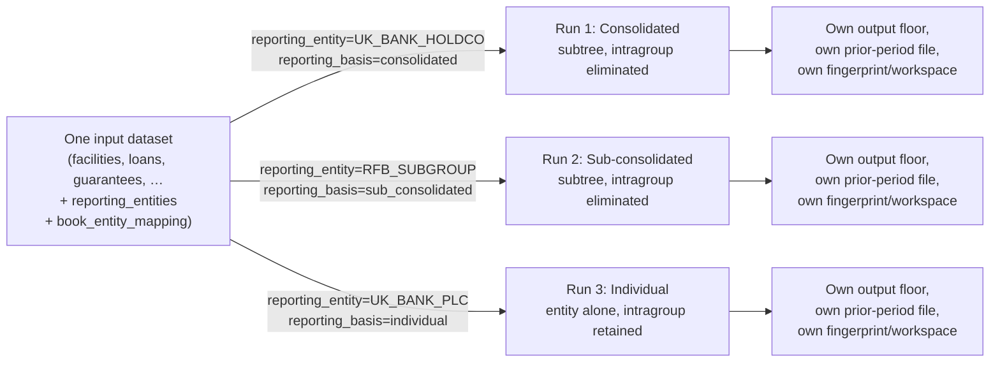

# Multi-Entity Reporting — Group, Sub-Consolidated and Solo Submissions

One institution rarely files a single regulatory return. A UK group typically owes the PRA an
**individual** return for each in-scope legal entity, a **sub-consolidated** return for each
ring-fenced body sub-group, and a **consolidated** return at the group apex — the same COREP /
Pillar 3 template estate at every level, but a different population, a different scope of
consolidation, and (for the output floor) a different applicability test.

Multi-entity reporting lets the calculator produce any of those submissions from **one input
dataset**, by declaring a reporting-entity hierarchy and tagging bookings and intragroup
positions against it.

## Regulatory basis

- **CRR Part One Title II** sets the levels of application: individual (Art. 6),
  sub-consolidated and consolidated (Art. 11-18). The same credit-risk methodology and the
  same COREP/Pillar 3 templates apply at each level — what changes is the population and the
  reporting entity.
- **Consolidation eliminates intragroup exposures.** A consolidated or sub-consolidated return
  looks through the group as a single economic unit, so claims and guarantees between members
  of that scope are eliminated rather than risk-weighted. A solo (individual) return sees only
  the one legal entity, so intragroup exposures to the rest of the group are **retained** —
  they are third-party exposures from that entity's own perspective.

!!! success "Art. 113(6) core-UK-group 0% risk weight is applied on solo runs"
    CRR Art. 113(6) lets firms in a qualifying "core UK group" apply a **0% risk weight** to
    retained intragroup exposures on an individual (solo) return, subject to PRA permission —
    a treatment retained under PS1/26. The calculator applies it when both the reporting entity
    and the tagged intragroup counterparty carry `core_uk_group=True` in the registry. See
    [Art. 113(6) core UK group 0% risk weight](#art-1136-core-uk-group-0-risk-weight) for the
    exact eligibility conditions and scope.

## The run-per-scope model

Each submission is a **full, independent pipeline run** over that scope's resolved population —
never a filter applied after the fact to another run's output. The reporting layer (the cellspec
executor, the per-template COREP/Pillar 3 modules, the cell-fact export) needs no scope-specific
logic: it is a pure function of whatever sealed ledger the run produced.



Because each scope is a distinct run, each one carries its **own** output-floor calculation,
its **own** prior-period file for COREP C 08.04 / Pillar 3 CR8 flow rows, and its own
[run-index](../reconciliation/index.md#2-run-it-from-python) fingerprint and reconciliation
workspace — a consolidated and an individual run over the same underlying data are never
conflated with each other, and the reuse pool (calculator/comparison/reconciliation) will not
offer one scope's cached run in place of another's.

!!! info "Unscoped behaviour is untouched"
    Everything above is opt-in. Leave `reporting_entity` / `reporting_basis` unset (the
    default) and the pipeline runs exactly as it always has — no new stage cost, no new
    columns in behaviour-relevant places. The scope resolver stage is a provable no-op when no
    entity is requested.

## Data model

Two new **optional** input tables declare the hierarchy and attribute bookings to it; a small
set of new **optional, nullable** columns on existing exposure/guarantee tables tag individual
rows as intragroup or booked to a particular unit. Full column-level reference (types, defaults,
examples) lives in [Input Schemas](../data-model/input-schemas.md#multi-entity-reporting-schemas)
— summarised here:

| Table | File | Purpose |
|-------|------|---------|
| Reporting Entity registry | `config/reporting_entities.parquet` | One row per legal/reporting entity, linked into a single-rooted tree by `parent_entity_reference`. Carries `entity_name`, `lei`, `institution_type`, and the future-use `core_uk_group` flag. |
| Book-Entity Mapping | `mapping/book_entity_mapping.parquet` | Maps each booking `book_code` to the `reporting_entity_reference` that owns it — how the resolver attributes an exposure row to a scope. |

| Column | Added to | Meaning |
|--------|----------|---------|
| `intragroup_entity_reference` | Facility, Loan, Contingent, Equity Exposure, CCR netting sets, SFT trades | Non-null = this exposure is to the named group entity. Null (default) = external counterparty — unchanged behaviour. |
| `guarantor_entity_reference` | Guarantee | Non-null = the guarantor is the named group entity (internal protection). |
| `book_code` | Equity Exposure, CCR netting sets, SFT trades (new — mirrors the existing Facility/Loan/Contingent column) | The booking unit, joined to the mapping table above to resolve the owning entity. |

Deliberately **not** tagged in this wave: collateral issued by group entities and CIU holdings
(which follow their parent equity row's scope instead). Reference frames — ratings, provisions,
collateral, mapping tables, specialised-lending data — are never filtered directly; when an
exposure is dropped from scope it simply stops joining to them.

## Scope semantics

| `reporting_basis` | Population | Intragroup exposures | Intragroup guarantees |
|--------------------|------------|----------------------|------------------------|
| `consolidated` | The requested entity's full subtree (inclusive) | **Eliminated** — dropped before calculation | **Eliminated** — internal protection is not CRM at this level |
| `sub_consolidated` | The requested entity's subtree (inclusive) — mechanically identical to `consolidated`; only the filing label differs | **Eliminated** | **Eliminated** |
| `individual` | The requested entity alone | **Retained** — normally risk-weighted, or **0%** under the [Art. 113(6) core-UK-group treatment](#art-1136-core-uk-group-0-risk-weight) when eligible | **Retained** |

Every exposure-bearing row is first attributed to a reporting entity by joining its `book_code`
against the book-entity mapping, then kept only if that entity falls within the resolved
population. A row whose `book_code` is blank or absent from the mapping cannot be attributed to
any entity and is **excluded** (with an `SCP001` warning below) — it is never silently assigned
to the requesting scope by default.

## Art. 113(6) core UK group 0% risk weight

On an **individual**-basis run, an intragroup exposure to a fellow "core UK group" member is
assigned a **0% risk weight** (CRR Art. 113(6), retained under PS1/26). The scope resolver marks
a row eligible only when **all three** conditions hold:

1. The run is **individual** basis. (On `consolidated` / `sub_consolidated` runs the intragroup
   rows are eliminated before weighting, so the 0% never applies.)
2. The **reporting entity** carries `core_uk_group=True` in the registry.
3. The row's `intragroup_entity_reference` names a registry entity that also carries
   `core_uk_group=True`.

The 0% is a **final risk-weight override**, applied after the standard risk-weight assignment and
all credit-risk-mitigation adjustments. It is keyed on the row's **own** intragroup tag:

- A guarantee-split leg of an eligible intragroup loan **inherits** the 0% (splits copy the row's
  columns).
- An **external** loan that merely happens to be *guaranteed by* a group member is **not** given
  the 0% — Art. 113(6) covers direct exposures *to* members, not protection *from* them.

**Scope (this treatment).** SA-routed lending exposures only (facilities, loans, contingents,
and their undrawn commitments). Deliberately excluded:

- **IRB exposures** — the IRB route to a 0% intragroup exposure is Art. 150(1)(e) permanent
  partial use, which reclassifies the exposure to the Standardised Approach upstream; it then
  picks up this override as an SA row.
- **Equity holdings** in group entities (participations regime), and **CCR / SFT** netting sets
  (a solo intragroup position at its normal risk weight is conservative).

With `core_uk_group=False` (the default) no row is ever eligible, so the flag is a pure opt-in:
an individual run over a non-core-UK-group registry keeps every intragroup exposure at its normal
risk weight.

## Launching a scoped run

A scope is two values: `reporting_entity` (an `entity_reference` from the registry) and
`reporting_basis` (`individual` / `sub_consolidated` / `consolidated`). Setting one without the
other is a configuration error — `reporting_entity` is meaningless without a basis to
consolidate on.

=== "Python"

    ```python
    from datetime import date
    from rwa_calc.api import CreditRiskCalc

    calc = CreditRiskCalc(
        data_path="/path/to/data",
        framework="CRR",
        reporting_date=date(2026, 12, 31),
        reporting_entity="UK_BANK_HOLDCO",
        reporting_basis="consolidated",   # or an already-imported ReportingBasis member
    )
    response = calc.calculate()
    print(response.reporting_entity, response.reporting_basis)
    ```

    The factories accept the same pair directly:

    ```python
    from rwa_calc.contracts.config import CalculationConfig

    config = CalculationConfig.crr(
        reporting_date=date(2026, 12, 31),
        reporting_entity="UK_BANK_PLC",
        reporting_basis="individual",
    )
    ```

=== "REST"

    `POST /api/calculate`, `POST /api/comparison` and `POST /api/reconcile` all accept the same
    optional pair on the request body:

    ```bash
    curl -X POST http://localhost:8000/api/calculate \
      -H 'content-type: application/json' \
      -d '{
        "data_path": "/path/to/data",
        "framework": "CRR",
        "reporting_date": "2026-12-31",
        "reporting_entity": "RFB_SUBGROUP",
        "reporting_basis": "sub_consolidated"
      }'
    ```

    A `reporting_entity` supplied without `reporting_basis` is rejected as a `422` (a friendly
    validation error, not a config-layer exception).

=== "Interactive UI"

    The Calculator, Comparison and Reconciliation forms each carry an optional
    **Reporting entity** text field and a **Reporting basis** select (blank / Individual /
    Sub-consolidated / Consolidated), remembered between runs the same way the other form
    fields are. Leaving both blank runs the whole book, unscoped, exactly as before.

Once resolved, the scope threads all the way through: `CalculationResponse.reporting_entity` /
`.reporting_basis` are stamped on the result, the run-index fingerprint used for calculation
reuse folds in both values (so a consolidated and an individual run over identical data never
collide or get confused for each other), and exported filings pick it up too — `FilingMetadata`
gains a `consolidation_basis` field, which appears on the workbook metadata sheet and is folded
into the downloaded filename (`..._<entity>_<basis>.xlsx`).

## The hierarchy page

`GET /hierarchy?data_path=...` renders the `config/reporting_entities` registry as a tree —
name, LEI, institution type, and which scopes each node can head (an apex can head
`consolidated`, any other node with children can head `sub_consolidated`, and every node can
head `individual`). The calculator form links to it ("View reporting hierarchy") so an operator
can look up the right `entity_reference` before submitting a scoped run. A malformed registry
(duplicate reference, unknown parent, a cycle) is never a 500 — the offending rows render in a
clearly-labelled "unattached" section instead. The same rows back `GET /api/entities`, which
returns an empty list when the registry file is absent (the table is optional).

## Reporting-scope data-quality codes

The scope resolver never raises on a malformed registry or an unattributable exposure — issues
are recorded as non-fatal `CalculationError`s (category `SCOPE`) so they are visible on the
result rather than aborting the run:

| Code | Severity | Meaning |
|------|----------|---------|
| `SCP001` | ERROR | An exposure's `book_code` is blank or absent from the book-entity mapping, so it cannot be attributed to any reporting entity — the row is excluded. |
| `SCP002` | ERROR | The book-entity mapping references a `reporting_entity_reference` not present in the registry — that mapping row is ignored. |
| `SCP003` | ERROR | An `intragroup_entity_reference` / `guarantor_entity_reference` tag names an entity absent from the registry — the row is kept and treated as external. |
| `SCP004` | ERROR | The registry is not a valid single-rooted tree (duplicate `entity_reference`, unknown parent, more than one root, or a cycle) — no scope can be resolved, so every exposure is excluded. |
| `SCP005` | WARNING | A counterparty carries a mix of intragroup-tagged and untagged exposures — inconsistent tagging worth reviewing. |
| `SCP006` | ERROR | The requested `reporting_entity` is not present in the registry — every exposure is excluded. |

`SCP004` and `SCP006` are the two "no scope could be resolved" cases; both empty the run's
exposure population entirely (loudly, via the error channel) rather than silently falling back
to an unscoped run.

## Related

- [Input Schemas — Multi-Entity Reporting Schemas](../data-model/input-schemas.md#multi-entity-reporting-schemas) — full column reference for the two new tables and the new tag columns.
- [Interactive UI](../user-guide/interactive-ui.md) — the Calculator/Comparison/Reconciliation form fields and the `/hierarchy` page.
- [Parallel-Run Reconciliation](../reconciliation/index.md) — how a reporting scope folds into a reconciliation workspace's identity.
- [Configuration API](../api/configuration.md) — `CalculationConfig` reference.
