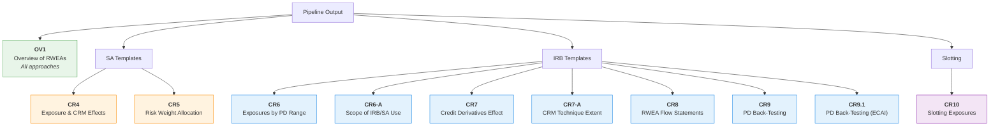

# Pillar III Disclosures

Pillar III requires banks to publish quantitative credit risk data to the market, complementing
the confidential COREP returns submitted to the PRA. While both draw on the same underlying
RWA calculations, Pillar III templates are structured for public consumption and comparability
across firms.

## COREP vs Pillar III

| Aspect | COREP (Pillar I Reporting) | Pillar III (Public Disclosure) |
|--------|---------------------------|-------------------------------|
| **Audience** | PRA (confidential) | Market participants (public) |
| **Purpose** | Supervisory monitoring | Market discipline and transparency |
| **Frequency** | Quarterly | Quarterly, semi-annual, or annual (by firm size) |
| **CRR prefix** | C (e.g., C 07.00) | UK (e.g., UK OV1) |
| **Basel 3.1 prefix** | OF (e.g., OF 07.00) | UKB (e.g., UKB OV1) |
| **Granularity** | Exposure-class level submissions | Cross-approach summaries and PD-range breakdowns |
| **Legal basis** | Regulation (EU) 2021/451 | CRR Part 8 / Disclosure (CRR) Part |

!!! info "Template Naming"
    Under CRR, disclosure templates use the **UK** prefix (e.g., UK CR6).
    Under Basel 3.1 (PRA PS1/26), they use the **UKB** prefix (e.g., UKB CR6).
    The structure and purpose are equivalent but columns, rows, and exposure class
    breakdowns differ as detailed below.

## Template Overview

The calculator's outputs can populate the following credit risk disclosure templates. Templates
are grouped by the approach they cover.



| Template | CRR Name | Basel 3.1 Name | Purpose | Format | CRR Article |
|----------|----------|----------------|---------|--------|-------------|
| **OV1** | UK OV1 | UKB OV1 | Overview of risk-weighted exposure amounts | Fixed | Art. 438(d) |
| **CR4** | UK CR4 | UKB CR4 | SA exposure and CRM effects | Fixed | Art. 444(e), 453(g-i) |
| **CR5** | UK CR5 | UKB CR5 | SA risk weight allocation | Fixed | Art. 444(e) |
| **CR6** | UK CR6 | UKB CR6 | IRB exposures by exposure class and PD range | Fixed | Art. 452(g) |
| **CR6-A** | UK CR6-A | UKB CR6-A | Scope of IRB and SA use | Fixed | Art. 452(b) |
| **CR7** | UK CR7 | UKB CR7 | Credit derivatives effect on RWEA | Fixed | Art. 453(j) |
| **CR7-A** | UK CR7-A | UKB CR7-A | Extent of CRM techniques (IRB) | Fixed | Art. 453(g) |
| **CR8** | UK CR8 | UKB CR8 | RWEA flow statements (IRB) | Fixed | Art. 438(h) |
| **CR9** | --- | UKB CR9 | IRB PD back-testing per exposure class | Fixed | Art. 452(h) |
| **CR9.1** | --- | UKB CR9.1 | IRB PD back-testing for ECAI mapping | Fixed | Art. 452(h), Art. 180(1)(f) |
| **CR10** | UK CR10 | UKB CR10 | Slotting approach exposures | Fixed | Art. 438(e) |

---

## OV1 — Overview of Risk-Weighted Exposure Amounts

The OV1 template provides a high-level summary of RWEAs and own funds requirements
across all risk categories. It is the top-level disclosure from which credit risk rows
(1-5) link to the detailed CR templates.

### Column Structure

=== "CRR (UK OV1)"

    | Col | Column | Description |
    |-----|--------|-------------|
    | a | RWEAs | Risk-weighted exposure amounts at reporting date |
    | b | RWEAs (T-1) | RWEAs as disclosed in the previous period |
    | c | Total own funds requirements | Own funds requirements corresponding to RWEAs |

=== "Basel 3.1 (UKB OV1)"

    | Col | Column | Description |
    |-----|--------|-------------|
    | a | RWEAs (T) | Risk-weighted exposure amounts at reporting date |
    | b | RWEAs (T-1) | RWEAs as disclosed in the previous period |
    | c | Total own funds requirements | Own funds requirements corresponding to RWEAs |

    No column changes — structure is identical.

### Row Structure (Credit Risk Rows)

=== "CRR (UK OV1)"

    | Row | Description |
    |-----|-------------|
    | 1 | Credit risk (excluding CCR) — total |
    | 2 | Of which: standardised approach |
    | 3 | Of which: foundation IRB (FIRB) approach |
    | 4 | Of which: slotting approach |
    | UK 4a | Of which: equities under the simple risk-weighted approach |
    | 5 | Of which: advanced IRB (AIRB) approach |
    | 24 | Amounts below deduction thresholds (250% RW) — memo |
    | 29 | **Total** |

=== "Basel 3.1 (UKB OV1)"

    | Row | Description |
    |-----|-------------|
    | 1 | Credit risk (excluding CCR) — total (excludes equity rows 11-14) |
    | 2 | Of which: standardised approach (SA) |
    | 3 | Of which: FIRB approach |
    | 4 | Of which: slotting approach |
    | **4a** | **Total RWEAs (pre-floor)** — all risk categories before the output floor adjustment |
    | 5 | Of which: AIRB approach |
    | **5a** | **CET1 capital ratio (%)** |
    | **5b** | **CET1 capital ratio pre-floor (%)** |
    | **6a** | **Tier 1 capital ratio (%)** |
    | **6b** | **Tier 1 capital ratio pre-floor (%)** |
    | **7a** | **Total capital ratio (%)** |
    | **7b** | **Total capital ratio pre-floor (%)** |
    | **11** | **Equity positions under the IRB Transitional Approach** |
    | **12** | **Equity investments in funds — look-through approach** |
    | **13** | **Equity investments in funds — mandate-based approach** |
    | **14** | **Equity investments in funds — fall-back approach** |
    | 24 | Amounts below deduction thresholds (250% RW) — memo |
    | **26** | **Output floor multiplier** |
    | **27** | **Output floor adjustment** |
    | 29 | **Total** |

    Key Basel 3.1 additions (bold): pre-floor RWEA and capital ratio rows
    (4a, 5a-b, 6a-b, 7a-b), equity transitional rows (11-14), output floor rows
    (26-27). Row UK 4a (equities under simple RW) is removed — equity goes to
    rows 11-14 or SA (row 2).

    See [Disclosure Differences — OV1 row changes](../framework-comparison/disclosure-differences.md#ov1-overview-of-rweas)
    for the complete CRR-vs-Basel 3.1 row delta (lines 31, 33, 63-64).

!!! warning "Mandatory for output-floor-active institutions"
    The pre-floor rows (4a, 5a-b, 6a-b, 7a-b) are mandatory under PRA PS1/26
    Annex XX (Disclosure (CRR) Part, Art. 2 / Art. 438(d)) for institutions whose
    actual RWEA total reflects the output floor adjustment (Art. 92(5)). They
    allow market participants to see the firm's pre-floor capital position
    alongside the post-floor figures, making the magnitude of the output floor
    constraint transparent. See [Output floor mechanics](../framework-comparison/key-differences.md#output-floor)
    for how the floor adjustment in row 27 feeds into the post-floor ratios in
    rows 5a, 6a, 7a.

!!! note "Scope"
    OV1 covers all risk categories (credit, CCR, CVA, market, operational).
    Only the credit risk rows (1-5, 11-14, 24) are directly populated from the
    RWA calculator output. Rows 4a and 5a-b/6a-b/7a-b require own funds figures
    and post-floor RWA totals from upstream capital-summary processes — the
    calculator surfaces the credit-risk pre-floor RWEA component (col `pre_floor_rwa`
    in the OF 02.01 / UKB CMS1 outputs) but does not compute consolidated
    capital ratios.

### Reference Documents

- CRR: `docs/assets/crr-pillar3-risk-weighted-exposure-instructions-leverage-ratio.pdf` (Annex II)
- Basel 3.1: `docs/assets/ps1-26-annex-ii-output-floor-and-capital-summaries-disclosure-instructions.pdf`

---

## CR4 — SA Exposure and CRM Effects

CR4 shows SA exposures before and after the application of credit conversion factors (CCFs)
and credit risk mitigation (CRM), by exposure class. It demonstrates the net effect of CRM
on the firm's SA credit risk.

**Population.** CR4 and CR5 cover SA *credit risk only* (Art. 444(e)): counterparty credit
risk legs (SA-CCR derivative netting sets, FCCM SFTs), CCP default-fund contributions and
settlement failed trades are excluded from every cell — they are disclosed in the CCR-series
templates instead (mirroring OV1's "credit risk excluding CCR" row 1, and deliberately the
opposite of COREP C 07.00, which includes CCR by risk type). Synthetic `facility_undrawn`
legs are genuine undrawn commitments and are reported off-balance-sheet. Every column of a
row therefore reads the same population, so RWEA and the on/off-balance-sheet splits
internally reconcile.

### Column Structure

=== "CRR (UK CR4)"

    | Col | Column | Description |
    |-----|--------|-------------|
    | a | On-BS exposures before CCF and CRM | Gross on-balance sheet per Art. 111, after provisions |
    | b | Off-BS exposures before CCF and CRM | Gross off-balance sheet, before CCFs and CRM |
    | c | On-BS amount post CCF and post CRM | Net on-BS after all CRM and CCFs applied |
    | d | Off-BS amount post CCF and post CRM | Net off-BS after all CRM and CCFs applied |
    | e | RWEAs | Risk-weighted exposure amounts |
    | f | RWEA density | Ratio: col e / (col c + col d) |

=== "Basel 3.1 (UKB CR4)"

    | Col | Column | Description |
    |-----|--------|-------------|
    | a | On-BS exposures before CF and CRM | Gross on-balance sheet per Art. 111, after provisions |
    | b | Off-BS exposures before CF and CRM | Gross off-balance sheet, before CFs and CRM |
    | c | On-BS amount post CF and post CRM | Net on-BS after all CRM and CFs applied |
    | d | Off-BS amount post CF and post CRM | Net off-BS after all CRM and CFs applied |
    | e | RWEAs | Risk-weighted exposure amounts |
    | f | RWEA density | Ratio: col e / (col c + col d) |

    Column structure is unchanged. The key difference is in the row breakdowns.

### Row Structure

=== "CRR (UK CR4)"

    Rows 1-16 by exposure class per Article 112 CRR (excluding securitisation).
    Row 16 is "Other items" (Art. 134 assets, items below deduction thresholds).

=== "Basel 3.1 (UKB CR4)"

    Rows 1-16 by exposure class per Article 112 of the Credit Risk: SA (CRR) Part,
    with additional "of which" breakdowns:

    - **Specialised lending** (under corporates, Art. 122A-122B)
    - **Residential RE — not materially dependent** on cash flows (Art. 124F, 124J(2))
    - **Residential RE — materially dependent** on cash flows (Art. 124G, 124J(1))
    - **Commercial RE — not materially dependent** on cash flows (Art. 124H, 124J(3))
    - **Commercial RE — materially dependent** on cash flows (Art. 124I, 124J(1))
    - **Land acquisition, development and construction** (Art. 124K)

### Reference Documents

- CRR: `docs/assets/crr-annex-xx-instructions-regarding-disclosure.PDF` (Annex XX)
- Basel 3.1: `docs/assets/ps1-26-annex-xx-credit-risk-sa-disclosure-instructions.pdf`

---

## CR5 — SA Risk Weight Allocation

CR5 shows the allocation of post-CRM SA exposure values across risk weight buckets, by
exposure class. It reveals the distribution of risk across the portfolio.

### Column Structure

=== "CRR (UK CR5)"

    | Col | Column | Description |
    |-----|--------|-------------|
    | a-o | Risk weights 0%-1250% | Exposure value allocated to each risk weight (15 buckets) |
    | p | Total | Total exposure value post CRM and post CCF |
    | q | Of which: unrated | Exposures without ECAI credit assessment |

=== "Basel 3.1 (UKB CR5)"

    | Col | Column | Description |
    |-----|--------|-------------|
    | a-ac | Risk weights 0%-1250% | Exposure value allocated to each risk weight (**29 buckets**) |
    | ad | Total | Total exposure value post CRM and post CF |
    | ae | Of which: unrated | Exposures without ECAI credit assessment |
    | **ba** | **On-BS exposure amount** | On-BS after provisions (pre-CF/CRM) |
    | **bb** | **Off-BS exposure amount** | Off-BS pre-conversion factors |
    | **bc** | **Weighted average CF** | Average conversion factor for reported row |
    | **bd** | **Total post CF and CRM** | On-BS + off-BS after CFs and CRM |

    Key changes:

    - Risk weight buckets expand from **15 to 29** — adds 15%, 25%, 30%, 40%, 45%,
      60%, 65%, 80%, 85%, 105%, 110%, 130%, 135%, 400% (removes 370%)
    - New columns **ba-bd** provide an on-BS/off-BS breakdown with average CCF
    - Split reporting for regulatory real estate (portion up to 55% LTV vs above)
    - Currency mismatch exposures reported against the weight that would apply
      without the 1.5x multiplier (RWEA still reflects it)

### Row Structure

Rows 1-16 by SA exposure class. Basel 3.1 adds the same "of which" real estate and
specialised lending sub-rows as CR4, plus rows 18-33 for additional risk weight
allocation breakdowns.

### Reference Documents

- CRR: `docs/assets/crr-annex-xx-instructions-regarding-disclosure.PDF` (Annex XX)
- Basel 3.1: `docs/assets/ps1-26-annex-xx-credit-risk-sa-disclosure-instructions.pdf`

---

## CR6 — IRB Exposures by Exposure Class and PD Range

CR6 is the most detailed IRB disclosure template, showing exposure values, risk
parameters (PD, LGD, maturity), RWEAs, and expected loss by fixed PD buckets for each
exposure class. Separate templates are disclosed for F-IRB and A-IRB exposures.

### Column Structure

=== "CRR (UK CR6)"

    | Col | Column | Description |
    |-----|--------|-------------|
    | a | PD range | Fixed PD range (not alterable) |
    | b | On-BS exposures | Pre-provisions, pre-CCF, pre-CRM |
    | c | Off-BS exposures pre-CCF | Nominal off-BS before conversion factors |
    | d | Exposure-weighted average CCF | Average CCF weighted by off-BS exposure |
    | e | Exposure value post CCF and CRM | Per Art. 166, sum of on-BS + off-BS post CCF/CRM |
    | f | Exposure-weighted average PD (%) | Average PD weighted by exposure value |
    | g | Number of obligors | Count of rated legal entities per PD bucket |
    | h | Exposure-weighted average LGD (%) | Final LGD after CRM and downturn, weighted by exposure |
    | i | Exposure-weighted average maturity (years) | Per Art. 162, not disclosed for retail |
    | j | RWEAs | After supporting factors (Art. 501, 501a) |
    | k | RWEA density | Ratio: col j / col e |
    | l | Expected loss amount | Per Art. 158 (PRA Rulebook; CRR Art. 158 omitted by SI 2021/1078) |
    | m | Value adjustments and provisions | Specific + general credit risk adjustments |

=== "Basel 3.1 (UKB CR6)"

    | Col | Column | Description |
    |-----|--------|-------------|
    | a | PD range | Fixed PD range — allocation uses **pre-input-floor PDs** |
    | b | On-BS exposures | Pre-provisions, pre-CCF, pre-CRM |
    | c | Off-BS exposures pre-CCF | Nominal off-BS values per Art. 166C(1), 166D(1) |
    | d | Exposure-weighted average CCF | Average CCF weighted by off-BS exposure |
    | e | Exposure value post CCF and CRM | Per Art. 166A-166D |
    | f | Exposure-weighted average PD (%) | **Post-input-floor PDs** (Art. 160(1), 163(1)) |
    | g | Number of obligors | Count of rated legal entities per PD bucket |
    | h | Exposure-weighted average LGD (%) | After CRM, **including LGD input floors** (Art. 161(5), 164(4)) |
    | i | Exposure-weighted average maturity (years) | Per Art. 162, not disclosed for retail |
    | j | RWEAs | **Includes post-model adjustments** and mortgage RW floor; no supporting factors |
    | k | RWEA density | Ratio: col j / col e |
    | l | Expected loss amount | Per Art. 158, **including post-model adjustments** (Art. 158(6A)) |
    | m | Value adjustments and provisions | Specific + general credit risk adjustments |

    Key changes:

    - PD bucket allocation uses **pre-input-floor** PDs, but weighted average PD (col f)
      uses **post-floor** PDs
    - RWEA (col j) includes post-model adjustments, unrecognised exposure adjustments,
      and the mortgage RW floor — no longer includes supporting factors
    - Expected loss (col l) includes post-model adjustments per Art. 158(6A)
    - Slotting exposures are **excluded** (reported in CR10)

### Row Structure — Exposure Class Breakdown

=== "CRR (UK CR6)"

    Separate template per exposure class, further broken down:

    - **Corporates**: SME, specialised lending, other
    - **Retail**: SME secured by immovable property, non-SME secured by immovable
      property, qualifying revolving, SME other, non-SME other

=== "Basel 3.1 (UKB CR6)"

    **A-IRB** — separate template per category:

    1. Corporates: specialised lending, other general corporates (SME), other general corporates (non-SME)
    2. Retail: secured by residential immovable property (SME/non-SME), secured by
       commercial immovable property (SME/non-SME), qualifying revolving,
       other (SME/non-SME)

    **F-IRB** — separate template per category:

    1. Institutions
    2. Corporates: specialised lending, **financial corporates and large corporates**,
       other general corporates (SME/non-SME)

    Key change: F-IRB adds **financial corporates and large corporates** as a
    separate sub-class (Art. 147(2)(c)(ii)), reflecting the Basel 3.1 restriction
    to F-IRB only for these counterparties.

### Reference Documents

- CRR: `docs/assets/crr-pillar3-irb-credit-risk-instructions.pdf` (Annex XXII)
- Basel 3.1: `docs/assets/ps1-26-annex-xxii-credit-risk-irb-disclosure-instructions.pdf`

---

## CR6-A — Scope of IRB and SA Use

CR6-A shows the split of exposures between IRB and SA approaches, including permanent
partial use and roll-out plans.

### Column Structure

=== "CRR (UK CR6-A)"

    | Col | Column | Description |
    |-----|--------|-------------|
    | a | Exposure value (Art. 166) for IRB exposures | IRB exposure value only |
    | b | Total exposure value (Art. 429(4)) | Both SA and IRB exposures |
    | c | % subject to permanent partial use of SA | SA exposures / total |
    | d | % subject to IRB approach | IRB exposures / total (F-IRB, A-IRB, slotting, equity simple RW) |
    | e | % subject to roll-out plan | Exposures planned for future IRB transition |

=== "Basel 3.1 (UKB CR6-A)"

    | Col | Column | Description |
    |-----|--------|-------------|
    | a | Exposure value (Art. 166A-166D) for IRB exposures | IRB exposure value only |
    | b | Total exposure value (Art. 429(4)) | Both SA and IRB exposures |
    | c | % subject to permanent partial use of SA | SA exposures / total |
    | d | % subject to IRB approach | IRB exposures / total (F-IRB, A-IRB, slotting) |
    | e | % subject to roll-out plan | Exposures planned for future IRB transition |

    Column structure unchanged. Row breakdown restructured around **roll-out classes**
    (Art. 147B) instead of exposure classes.

### Row Structure

=== "CRR (UK CR6-A)"

    Rows by IRB exposure class per Art. 147(2).

=== "Basel 3.1 (UKB CR6-A)"

    Rows 3.9-3.16 by **roll-out class** per Art. 147B, with row 5 for totals.

### Reference Documents

- CRR: `docs/assets/crr-pillar3-irb-credit-risk-instructions.pdf` (Annex XXII)
- Basel 3.1: `docs/assets/ps1-26-annex-xxii-credit-risk-irb-disclosure-instructions.pdf`

---

## CR7 — Credit Derivatives Effect on RWEA

CR7 shows the impact of credit derivatives used as CRM on risk-weighted exposure amounts
under the IRB approach. Excludes CCR, securitisation, and equity exposures.

### Column Structure

| Col | Column | Description |
|-----|--------|-------------|
| a | Pre-credit derivatives RWEA | Hypothetical RWEA assuming no credit derivative recognition |
| b | Actual/Post-credit derivatives RWEA | RWEA after credit derivative CRM effects |

Column structure is identical under both CRR and Basel 3.1.

### Row Structure

=== "CRR (UK CR7)"

    | Row | Description |
    |-----|-------------|
    | 1 | F-IRB subtotal |
    | 2-5 | F-IRB exposure classes (central govt, institutions, corporates with breakdown) |
    | 6 | A-IRB subtotal |
    | 7-9 | A-IRB exposure classes (corporates with breakdown, retail with breakdown) |
    | 10 | **Total** (F-IRB + A-IRB) |

=== "Basel 3.1 (UKB CR7)"

    | Row | Description |
    |-----|-------------|
    | 1 | F-IRB subtotal |
    | 2-3 | F-IRB exposure classes |
    | 4 | A-IRB subtotal |
    | 5-6 | A-IRB exposure classes |
    | **7** | **Slotting subtotal** |
    | 8 | **Total** (F-IRB + A-IRB + Slotting) |

    Key change: adds **slotting** as a third approach category with its own subtotal row.
    Exposure subclass breakdowns include SME/non-SME splits where applicable.

### Reference Documents

- CRR: `docs/assets/crr-pillar3-irb-credit-risk-instructions.pdf` (Annex XXII)
- Basel 3.1: `docs/assets/ps1-26-annex-xxii-credit-risk-irb-disclosure-instructions.pdf`

---

## CR7-A — Extent of CRM Techniques (IRB)

CR7-A discloses the extent to which different types of funded and unfunded credit protection
cover IRB exposures. Disclosed separately for F-IRB, A-IRB, and (under Basel 3.1) slotting.

### Column Structure

=== "CRR (UK CR7-A)"

    | Col | Column | Description |
    |-----|--------|-------------|
    | a | Total exposures | Exposure value post CCF (pre-CRM), per Art. 166-167 |
    | b | FCP: Financial collateral (%) | % covered by financial collateral (Art. 197-198) |
    | c | FCP: Other eligible collateral (%) | Sum of cols d + e + f |
    | d | FCP: Immovable property (%) | % covered by immovable property collateral |
    | e | FCP: Receivables (%) | % covered by receivables (Art. 199(5)) |
    | f | FCP: Other physical collateral (%) | % covered by other physical collateral |
    | g | FCP: Other funded CP (%) | Sum of cols h + i + j |
    | h | FCP: Cash on deposit (%) | % covered by cash held by third party |
    | i | FCP: Life insurance policies (%) | % covered by life insurance policies |
    | j | FCP: Instruments held by third party (%) | % covered by repurchasable instruments |
    | k | UFCP: Guarantees (%) | % covered by guarantees (Art. 213-215) |
    | l | UFCP: Credit derivatives (%) | % covered by credit derivatives (Art. 204) |
    | m | RWEA post all CRM (obligor class) | RWEA in original obligor exposure class |
    | n | RWEA with substitution effects | RWEA in protection provider exposure class |

=== "Basel 3.1 (UKB CR7-A)"

    | Col | Column | Description |
    |-----|--------|-------------|
    | a | Total exposures | Exposure value post CCF (pre-CRM), per Art. 166A-166D |
    | b | FCP: Financial collateral (%) | Includes **on-balance sheet netting** (Art. 219) |
    | c | FCP: Other eligible collateral (%) | Sum of cols d + e + f |
    | d | FCP: Immovable property (%) | % covered by immovable property collateral |
    | e | FCP: Receivables (%) | % covered by receivables |
    | f | FCP: Other physical collateral (%) | % covered by other physical collateral |
    | g | FCP: Other funded CP (%) | Sum of cols h + i + j |
    | h | FCP: Cash on deposit (%) | % covered by cash held by third party |
    | i | FCP: Life insurance policies (%) | % covered by life insurance policies |
    | j | FCP: Instruments held by third party (%) | % covered by repurchasable instruments |
    | k | UFCP: Guarantees (%) | % covered by guarantees (Art. 203) |
    | l | UFCP: Credit derivatives (%) | % covered by credit derivatives (Art. 204) |
    | m | RWEA post all CRM (obligor class) | RWEA in original obligor exposure class |
    | n | RWEA with substitution effects | RWEA in protection provider exposure class |
    | **o** | **FCP for slotting (%)** | % covered by FCCM or on-BS netting (slotting only) |
    | **p** | **UFCP for slotting (%)** | % covered by guarantees/credit derivatives (slotting only) |

    Key changes:

    - **On-balance sheet netting** included in financial collateral (col b)
    - **Post-conversion-factor basis**: CRM values multiplied by CCF where applicable
    - **Slotting FCP/UFCP columns** (o, p) added for slotting approach exposures
    - FIRB collateral valued under **Foundation Collateral Method** (Ci after haircuts)
    - AIRB collateral valued under **LGD Modelling Collateral Method** (estimated market value)

### Row Structure

=== "CRR (UK CR7-A)"

    Separate disclosure for A-IRB and F-IRB. Exposure class breakdowns:

    - **Corporates**: SME, specialised lending (excl. slotting), other
    - **Retail**: SME secured by immovable property, non-SME secured by immovable
      property, qualifying revolving, SME other, non-SME other

=== "Basel 3.1 (UKB CR7-A)"

    Separate disclosure for A-IRB, F-IRB, and **slotting**. Expanded breakdowns:

    - **Corporates (A-IRB)**: specialised lending, **purchased receivables**, other
      general corporates (SME/non-SME)
    - **Retail**: secured by **residential** immovable property (SME/non-SME),
      secured by **commercial** immovable property (SME/non-SME), qualifying
      revolving, **purchased receivables**, other (SME/non-SME)
    - **Corporates (F-IRB)**: specialised lending, **financial corporates and large
      corporates**, other general corporates (SME/non-SME)

    Key additions: purchased receivables rows, residential/commercial RE split,
    financial corporates sub-class.

### Reference Documents

- CRR: `docs/assets/crr-pillar3-irb-credit-risk-instructions.pdf` (Annex XXII)
- Basel 3.1: `docs/assets/ps1-26-annex-xxii-credit-risk-irb-disclosure-instructions.pdf`

---

## CR8 — RWEA Flow Statements (IRB)

CR8 explains the drivers of change in IRB RWEAs between disclosure periods.
Institutions must supplement it with a narrative explaining material movements.

### Column Structure

| Col | Column | Description |
|-----|--------|-------------|
| a | RWEA | Total IRB risk-weighted exposure amount for credit risk |

Single column — each row explains a driver of RWEA change.

### Row Structure

| Row | Driver | Description |
|-----|--------|-------------|
| 1 | RWEA at end of previous period | Opening balance |
| 2 | Asset size (+/-) | Organic changes in book size and composition |
| 3 | Asset quality (+/-) | Rating grade migration and borrower risk changes |
| 4 | Model updates (+/-) | New models, model changes, scope changes |
| 5 | Methodology and policy (+/-) | Regulatory methodology changes (excl. models) |
| 6 | Acquisitions and disposals (+/-) | Book size changes from M&A |
| 7 | Foreign exchange movements (+/-) | Currency translation effects |
| 8 | Other (+/-) | Residual — must be explained in narrative |
| 9 | RWEA at end of disclosure period | Closing balance |

!!! warning "Sign convention — flow rows 2–8 are **signed**"
    Flow-driver rows **2 through 8** report **signed** RWEA movements:

    - **Increases** in RWEA are reported as **positive** values
    - **Decreases** in RWEA are reported as **negative** values

    Rows **1** and **9** (opening and closing RWEA balances) are reported as
    non-negative absolute amounts.

    For example, a £15m RWEA reduction from asset-quality improvement is
    reported in row 3 as `-15` (in the firm's reporting unit), **not** `15`.
    The closing balance in row 9 must equal `row 1 + sum(rows 2–8)` when the
    signed convention is honoured.

    Source: PRA PS1/26 Annex XXII §11. The convention is enumerated for all
    Pillar III templates in
    [Output Reporting — Sign Conventions in Pillar III](../specifications/output-reporting.md#pillar-iii-disclosure-templates)
    (single source of truth).

The structure is identical under CRR and Basel 3.1. The only difference is that
Basel 3.1 RWEAs in rows 1 and 9 no longer include supporting factor adjustments
(Art. 501, 501a removed).

### Reference Documents

- CRR: `docs/assets/crr-pillar3-irb-credit-risk-instructions.pdf` (Annex XXII)
- Basel 3.1: `docs/assets/ps1-26-annex-xxii-credit-risk-irb-disclosure-instructions.pdf`

---

## CR9 — IRB PD Back-Testing per Exposure Class

CR9 is a **mandatory Basel 3.1 disclosure** (Art. 452(h)) with no CRR equivalent. It provides
PD back-testing data per exposure class, showing how well the institution's PD estimates
predicted actual defaults. Separate templates are disclosed for F-IRB and A-IRB approaches,
with one template per exposure class within each approach.

### Column Structure

| Col | Column | Description |
|-----|--------|-------------|
| a | Exposure class | AIRB or FIRB exposure class label |
| b | PD range | Fixed PD range (same 17 buckets as CR6). Allocation based on PD at **beginning of disclosure period** |
| c | Number of obligors at end of previous year | Legal entities separately rated at end of previous year |
| d | Of which: defaulted during the year | Subset of col c defaulted per Art. 178. Each defaulted obligor counted only once |
| e | Observed average default rate (%) | Arithmetic average of one-year default rates (col d / col c) |
| f | Exposure-weighted average PD (%) | Same as CR6 col f — post-input-floor PDs (Art. 160(1), 163(1)) |
| g | Average PD at disclosure date (%) | Arithmetic average PD of obligors, obligor-weighted (post input floors) |
| h | Average historical annual default rate (%) | Simple average of annual default rates over the 5 most recent years |

### Row Structure — Exposure Class Breakdown

CR9 follows the **same F-IRB and A-IRB sub-class breakdown as CR6** —
see [CR6 — Row Structure — Exposure Class Breakdown](#cr6-irb-exposures-by-exposure-class-and-pd-range)
above. PS1/26 Annex XXII para 12 directs institutions to disclose two separate
sets of templates (one for F-IRB, one for A-IRB) with one template per exposure
class, using the same sub-class definitions referenced in Article 147(2)(b)–(d)
of the IRB CRR Part. The verbatim row definitions for column `a` are reproduced
below for convenience.

=== "Basel 3.1 (UKB CR9) — A-IRB"

    Separate template per exposure class (Annex XXII column `a (AIRB)`):

    1. **Corporates** (Art. 147(2)(c))
        - 1.1 Specialised lending (Art. 147(2)(c)(i))
        - 1.2 Other general corporates — SMEs (Art. 147(2)(c)(iii))
        - 1.3 Other general corporates — non-SMEs (Art. 147(2)(c)(iii), not under 1.2)
    2. **Retail** (Art. 147(2)(d))
        - 2.1 Secured by residential immovable property — SMEs (Art. 147(2)(d)(ii))
        - 2.2 Secured by residential immovable property — non-SMEs (Art. 147(2)(d)(ii), not under 2.1)
        - 2.3 Secured by commercial immovable property — SMEs
        - 2.4 Secured by commercial immovable property — non-SMEs
        - 2.5 Qualifying revolving retail exposures (Art. 147(2)(d)(i))
        - 2.6 Other — SMEs (Art. 147(2)(d))
        - 2.7 Other — non-SMEs (Art. 147(2)(d)(iii), not under 2.6)
    3. **Total**

=== "Basel 3.1 (UKB CR9) — F-IRB"

    Separate template per exposure class (Annex XXII column `a (FIRB)`):

    1. **Institutions** (Art. 147(2)(b))
    2. **Corporates** (Art. 147(2)(c))
        - 2.1 Specialised lending — including exposures subject to the slotting
          approach (Art. 147(2)(c)(i))
        - 2.2 **Financial corporates and large corporates** (Art. 147(2)(c)(ii))
        - 2.3 Other general corporates — SMEs (Art. 147(2)(c)(iii))
        - 2.4 Other general corporates — non-SMEs (Art. 147(2)(c)(iii), not under 2.3)
    3. **Total**

    Sub-class 2.2 mirrors the CR6 F-IRB addition: under PS1/26, A-IRB is
    restricted for financial corporates and large corporates (Art. 147A), so
    these counterparties are reported as a discrete F-IRB sub-class rather than
    being lumped into "other general corporates".

### Key Differences from CR6

- **PD allocation**: CR9 uses PD at the **beginning of the disclosure period**,
  while CR6 uses the **pre-input-floor** PD. The pipeline approximates
  beginning-of-period PD with `irb_pd_original` (pre-floor model output).
- **Back-testing focus**: CR9 is about model validation (predicted vs actual defaults),
  not risk parameter disclosure.
- **Historical data**: Col h requires a 5-year lookback of annual default rates.
  When historical data is absent, the current-period observed rate is used as a
  single-period approximation.

### Known Approximations

- Beginning-of-period PD (col b allocation) approximated by `irb_pd_original`
- Historical annual default rate (col h) falls back to current-period observed rate
- Prior-year obligor count (col c) falls back to current-period count

### Reference Documents

- Basel 3.1: `docs/assets/ps1-26-annex-xxii-credit-risk-irb-disclosure-instructions.pdf`
  — paras 12-15 (template scope and disclosure rules) on p.18; column `a` row
  definitions for A-IRB and F-IRB on pp.19-20; column `b`-`h` instructions on
  pp.20-22.
- PRA PS1/26 Appendix 1: `docs/assets/ps126app1.pdf` — Art. 147(2)(b)-(d) for
  IRB exposure-class definitions; Art. 147A for the A-IRB restriction that
  drives the F-IRB "financial corporates and large corporates" sub-class.

---

## CR9.1 — IRB PD Back-Testing for ECAI Mapping

CR9.1 is supplementary to CR9, required only when an institution uses Art. 180(1)(f)
of the Credit Risk: IRB Part for PD estimation based on ECAI mappings. **Basel 3.1 only**.

### Structure

Same as CR9 with the following exceptions:

- **Col b**: PD ranges based on the firm's **internal grades** mapped to the ECAI scale
  (variable-width, not the fixed 17-bucket structure)
- **Additional columns**: One column per ECAI considered, showing the external rating
  to which internal PD ranges are mapped

### Implementation Status

CR9.1 template definitions are in place but generation requires ECAI mapping data
not currently available in the pipeline. The template will return no data until
the pipeline provides firm-defined PD range to internal grade mapping and ECAI
names with their rating scale mappings.

### Reference Documents

- Basel 3.1: `docs/assets/ps1-26-annex-xxii-credit-risk-irb-disclosure-instructions.pdf` (para 15)

---

## CR10 — Slotting Approach Exposures

CR10 discloses specialised lending exposures under the slotting approach (and, under
CRR only, equity exposures under the simple risk-weighted approach).

### Column Structure

=== "CRR (UK CR10)"

    | Col | Column | Description |
    |-----|--------|-------------|
    | a | On-BS exposures | On-balance sheet exposure value (Art. 166(1)-(7), 167(1)) |
    | b | Off-BS exposures | Off-balance sheet exposure value pre-CCF |
    | c | Risk weight | Fixed column — per Art. 153(5) for slotting, Art. 155(2) for equity |
    | d | Exposure value | Post CCF — sum of on-BS + off-BS post conversion |
    | e | RWEA | After supporting factors (Art. 501, 501a) for slotting; per Art. 155(2) for equity |
    | f | Expected loss amount | Per Art. 158(6) for slotting, Art. 158(7) for equity (PRA Rulebook; CRR Art. 158 omitted by SI 2021/1078) |

=== "Basel 3.1 (UKB CR10)"

    | Col | Column | Description |
    |-----|--------|-------------|
    | a | On-BS exposures | On-balance sheet exposure value |
    | b | Off-BS exposures | Off-balance sheet exposure value pre-CCF (Art. 166A-166C) |
    | c | Risk weight | Fixed column — per Table A, Art. 153(5) |
    | d | Exposure value | Post CCF and CRM |
    | e | RWEA | Per Art. 153(5) — **no supporting factors** |
    | f | Expected loss amount | Per Art. 158(6) |

    Key changes:

    - **No supporting factors** in RWEA (Art. 501, 501a removed)
    - Exposure value (col d) includes **post-CRM** effects
    - **No equity** sub-template — equity exposures reported under the IRB
      Transitional Approach (OV1 row 11) or SA (CR4/CR5)

### Sub-Templates

=== "CRR (UK CR10)"

    | Template | Exposure Type |
    |----------|---------------|
    | CR10.1 | Project finance |
    | CR10.2 | Income-producing real estate and HVCRE |
    | CR10.3 | Object finance |
    | CR10.4 | Commodities finance |
    | CR10.5 | **Equity** under simple risk-weighted approach |

    Rows by regulatory category (Strong, Good, Satisfactory, Weak, Default) with
    fixed risk weights per Art. 153(5) Table 1 (slotting) or Art. 155(2) (equity).

=== "Basel 3.1 (UKB CR10)"

    | Template | Exposure Type |
    |----------|---------------|
    | CR10.1 | Project finance |
    | CR10.2 | Income-producing real estate |
    | CR10.3 | Object finance |
    | CR10.4 | Commodities finance |
    | **CR10.5** | **High volatility commercial real estate (HVCRE)** |

    Key changes:

    - HVCRE separated into its own sub-template (was combined with IPRE in CRR)
    - **Equity removed** — goes to IRB Transitional Approach or end-state SA
    - Rows by regulatory category per Art. 153(5) Table A

### Reference Documents

- CRR: `docs/assets/crr-pillar3-specialised-lending-instructions.pdf` (Annex XXIV)
- Basel 3.1: `docs/assets/ps1-26-annex-xxiv-credit-risk-irb-disclosure-instructions.pdf`

---

## UKB CMS1 — Output Floor Comparison by Risk Type (Art. 456(1)(a))

Basel 3.1 only — no CRR equivalent. Institutions subject to the output floor must disclose a
comparison between full standardised RWA and modelled RWA by risk type.

**Regulatory basis:** PRA PS1/26 Art. 456(1)(a), Art. 2a(1)

### Column Structure

| Col | Title |
|-----|-------|
| a | RWA for modelled approaches |
| b | RWA for portfolios where standardised approaches are used |
| c | Total actual RWA |
| d | RWA calculated using full standardised approach |

### Row Structure

| Row | Description |
|-----|-------------|
| 0010 | Credit risk (excluding CCR) |
| 0020 | Counterparty credit risk |
| 0030 | Credit valuation adjustment |
| 0040 | Securitisation exposures in the banking book |
| 0050 | Market risk |
| 0060 | Operational risk |
| 0070 | Residual RWA |
| 0080 | Total |

### Implementation Notes

- **The columns partition each row.** Annex II defines cell 0010/a as the exposures "where the
  RWA is **not** computed based on the standardised approach (ie subject to the credit risk IRB
  approaches (F-IRB, A-IRB and supervisory slotting))", cell 0010/b as the RWA "which result from
  applying the … standardised approach", and cell 0010/c as "the sum of cells 0010/a and 0010/b".
  That sum is only the row's whole RWA because a and b partition it.
- **Col a — modelled**: `rwa_final` over {F-IRB, A-IRB, supervisory slotting}. Slotting is
  Art. 153(5) — an IRB-chapter approach.
- **Col b — the complement of col a**, never an allow-list of approach labels. It therefore
  includes **SA-CCR** legs and equity ("exposures calculated according to the SA for credit risk
  include equity exposures subject to the IRB Equity Transitional"). An approach label the
  template does not recognise falls into b rather than into neither column.
- **Col c** = a + b (the Annex II intra-row sum).
- **Col d — the SA-equivalent of *that row's* population**, not of the whole book: "RWA as would
  result from applying the … standardised approach to **all exposures giving rise to the RWA
  reported in cell 0010/c**". It spans both the modelled and standardised sides of the row.
- **Rows 0010 and 0020 partition the credit-risk book by risk type.** Row 0010 ("Credit risk")
  "excludes … capital requirements relating to a counterparty credit risk charge, which are
  reported in row 0020"; row 0020 (CCR) carries the SA-CCR derivative netting sets, FCCM SFT legs
  and CCP default-fund contributions. Row 0020 is **bound**, so it reports `0.0` on a book with no
  CCR rather than a misleading null. Row 0080 (Total) is the whole book, and hence their sum.
- Rows 0030–0070 (CVA, securitisation, market risk, op risk, residual) are **null** — genuinely
  outside a credit-risk calculator's scope, and null is not the same claim as 0.0.
- CCR membership is keyed by `risk_type`, never by the approach label: under CRR the CCR legs
  carry `standardised` and under Basel 3.1 `standardised_ccr` (the output-floor relabel), so an
  approach-based rule would no-op exactly where it matters.

!!! warning "Col b used to be an allow-list — and it silently dropped the CCR charge"
    Until the 2026-07 fix, col b was an explicit list of standardised approach labels that omitted
    `standardised_ccr`. Every SA-CCR leg therefore matched **neither** col a nor col b, and col c
    (= a + b) dropped it: CMS1's Total reported 2,500,000 while CMS2 reported 4,060,296.72 for the
    same book — a difference of exactly the derivative RWEA. CCR-via-SA is floor-eligible, so it
    must appear in the floor comparison. Making col b the *complement* of the modelled set is what
    makes an omission of this kind impossible to repeat.

### Col d — pre-OF-ADJ S-TREA input (reconciles to OF 02.01 col 0040)

Column d is the **S-TREA input to the output floor formula before the floor multiplier
`x` is applied and before OF-ADJ is added** — not the post-floor RWA. Row for row, it matches
the S-TREA reported in supervisory return **OF 02.01 col 0040** ("Standardised total
RWA — multiplier not applied"), which shares CMS1's risk-type row axis (0010 credit risk
excluding CCR, 0020 CCR, 0080 total). The full TREA formula is:

```
TREA = max{U-TREA; x · S-TREA + OF-ADJ}
OF-ADJ = 12.5 · (IRB T2 − IRB CET1 − GCRA + SA T2)
```

Source: PRA PS1/26 Art. 92(2A), `docs/assets/ps126app1.pdf` page 13.

!!! quote "PRA PS1/26 Art. 92(2A) — definition of GCRA (`docs/assets/ps126app1.pdf` p. 13)"
    "**GCRA** = general credit risk adjustments, gross of tax effects, of up to 1.25%
    of risk-weighted exposure amounts calculated in accordance with paragraph 3A;"

    Paragraph 3A is the definition of S-TREA — the same value that populates CMS1
    col d. The 1.25% cap on the GCRA component of OF-ADJ is therefore **gated by
    the very figure CMS1 col d reports**.

!!! info "Why this matters — GCRA T2 capacity is gated by CMS1 col d"
    The `GCRA` term in OF-ADJ (Art. 92(2A)) and the SA Tier 2 credit (`SA T2` per
    Own Funds (CRR) Part Art. 62(c)) are each capped against an RWA base. The
    GCRA cap specifically references S-TREA, so CMS1 col d **directly determines**
    the maximum GCRA amount that can flow into OF-ADJ:

    `max GCRA in OF-ADJ = 1.25% × (CMS1 col d for the credit-risk rows 0010 + 0020,
    plus the S-TREA contribution from non-credit risk types)`

    Rows 0010 and 0020 partition the credit-risk book (credit risk excluding CCR, and
    CCR), so both belong in the credit-risk S-TREA — reading row 0010 alone would
    understate the base, and a smaller S-TREA is a lower floor.

    For an IRB firm whose credit-risk S-TREA is the dominant component (as is
    typical), increasing CMS1 col d row 0010 raises the GCRA T2 capacity in
    OF-ADJ; a contraction in SA-equivalent credit RWA tightens it. This is the
    mechanical link between the public CMS1 disclosure and the supervisory
    OF-ADJ inputs reported in OF 02.00 row 0036.

!!! note "Cross-references — single source of truth"
    The OF-ADJ formula, the GCRA / SA T2 / IRB T2 / IRB CET1 components, the
    Art. 62(c) / Art. 62(d) / Art. 92(2A) cap mechanics, and the
    Reg (EU) 183/2014 GCRA qualifying criteria are documented once in the
    output floor specification — do not duplicate the formula here.

    - [Output Floor — OF-ADJ Capital Adjustment](../specifications/basel31/output-floor.md#of-adj-capital-adjustment)
      — full formula derivation, T2 caps, Art. 40 DTA gross-up rule.
    - [Output Floor — GCRA Qualifying Criteria](../specifications/basel31/output-floor.md#general-credit-risk-adjustments-gcra-qualifying-criteria)
      — GCRA / SCRA boundary, IFRS 9 mapping, Art. 110(3) mixed-approach allocation.
    - [Output Reporting — Output Floor Adjustment (OF-ADJ)](../specifications/output-reporting.md#output-floor-adjustment-of-adj)
      — COREP OF 02.00 row 0036 / OF 02.01 col 0040 mapping.

---

## UKB CMS2 — Output Floor Comparison by Asset Class (Art. 456(1)(b))

Basel 3.1 only — no CRR equivalent. Breaks down the credit risk comparison at asset class level.

**Regulatory basis:** PRA PS1/26 Art. 456(1)(b), Art. 2a(2)

### Column Structure

| Col | Title |
|-----|-------|
| a | RWA for modelled approaches (IRB incl. slotting) |
| b | RWA for column (a) re-computed using SA |
| c | Total actual RWA |
| d | RWA calculated using full standardised approach |

### Row Structure

| Row | Description |
|-----|-------------|
| 0010 | Sovereign |
| 0011 | Of which: MDB/PSE in SA |
| 0020 | Institutions |
| 0030 | Subordinated debt, equity and other own funds |
| 0040 | Corporates |
| 0041 | Of which are FIRB |
| 0042 | Of which are AIRB |
| 0043 | Of which: specialised lending |
| 0044 | Of which: IPRE and HVCRE |
| 0045 | Of which: purchased receivables |
| 0050 | Retail |
| 0051 | Of which: qualifying revolving retail |
| 0052 | Of which: other retail |
| 0053 | Of which: retail secured by residential immovable property |
| 0054 | Of which: purchased receivables |
| 0060 | Others (non-credit obligation assets) |
| 0070 | Total |

### Implementation Notes

- Col a: IRB + slotting RWA per exposure class (the modelled approaches)
- Col b: sa_rwa for modelled exposures (SA-equivalent recalculation of col a's population)
- Col c: the class's whole actual RWA — no approach filter, so modelled and standardised alike
- Col d: sa_rwa for all exposures in each class
- Sub-rows 0041/0042 filter by approach (F-IRB/A-IRB within corporates)
- Sub-rows 0044, 0045, 0054 are null (require pipeline data not yet available)
- CVA and securitisation are out of scope. **Counterparty credit risk is not excluded**: CMS2's row
  axis is the Art. 147 asset class, so an SA-CCR leg reports in its counterparty's class row (a bank
  counterparty under row 0020, Institutions) and in the col c total. CMS2 is the template that
  caught CMS1 dropping the CCR charge — the two disagreed by exactly the derivative RWEA on the
  same book (2,500,000 vs 4,060,296.72), and CMS2 was the one telling the truth.

### Col d — pre-OF-ADJ S-TREA at asset-class granularity

CMS2 col d carries the **same pre-OF-ADJ S-TREA semantics as CMS1 col d**, broken down
by asset class instead of by risk type. The vertical sum of CMS2 col d (row 0070
"Total") equals the credit-risk component of CMS1 col d row 0010, which in turn
equals the credit-risk slice of OF 02.01 col 0040 (S-TREA — multiplier not
applied). Neither CMS1 col d nor CMS2 col d have the floor multiplier `x` or
OF-ADJ applied; both feed the un-multiplied S-TREA leg of
`TREA = max{U-TREA; x · S-TREA + OF-ADJ}` (Art. 92(2A), `docs/assets/ps126app1.pdf`
p. 13).

The 1.25% S-TREA cap on the GCRA component of OF-ADJ (Art. 92(2A)) is therefore
also gated by **the sum of CMS2 col d across all asset classes** for the
credit-risk portion of S-TREA. See the
[CMS1 col d cross-reference admonition](#col-d--pre-of-adj-s-trea-input-reconciles-to-of-0201-col-0040)
above for the full reconciliation and links to the OF-ADJ formula and GCRA cap.

---

## Excel Export

```python
from pathlib import Path
from rwa_calc.reporting.pillar3.generator import Pillar3Generator

generator = Pillar3Generator()
bundle = generator.generate(response)
result = generator.export_to_excel(bundle, Path("pillar3_disclosures.xlsx"))
# UK-prefixed sheets under CRR (e.g. "UK OV1"), UKB-prefixed under Basel 3.1
```

!!! tip "Readable column-name header band"
    Each sheet carries a **two-row header band**: the top row is a readable
    column-name banner ("Row code" / "Row name", then each column's name —
    e.g. *RWEAs (T)* over `a`), and the row beneath it is the regulatory
    disclosure ref codes (`a`, `b`, `c`, … or `0010`, …) that the cells are
    keyed by. The top two rows are frozen so both stay visible while scrolling.
    The banner is a presentation layer only — the underlying template data is
    still keyed by ref, so machine-readable consumers are unaffected. Excel
    export requires `xlsxwriter` (`uv add xlsxwriter`).

---

## See Also

- [COREP Reporting](corep-reporting.md) — supervisory return templates (C 07.00, C 08.01, C 08.02)
- [Reporting Differences](../framework-comparison/reporting-differences.md) — CRR vs Basel 3.1 COREP changes
- [Disclosure Differences](../framework-comparison/disclosure-differences.md) — CRR vs Basel 3.1 Pillar III changes
- [Reporting API](../api/reporting.md) — `COREPGenerator` and `COREPTemplateBundle` classes
