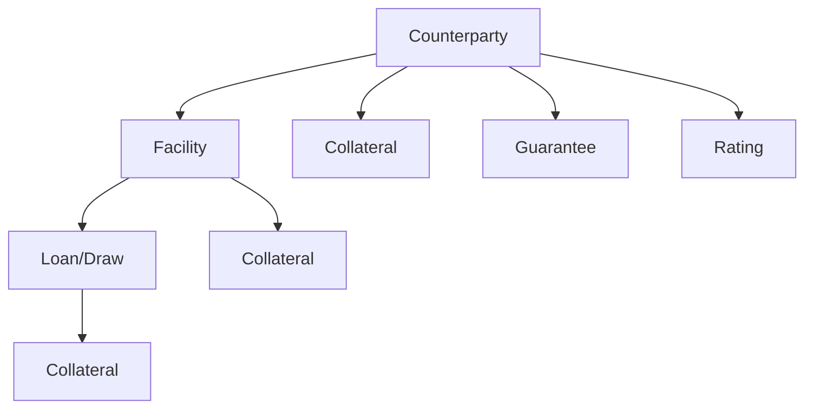

# Key Concepts

This page introduces the fundamental concepts used throughout the RWA calculator. Understanding these terms is essential for working with the system effectively.

## Risk-Weighted Assets (RWA)

**Risk-Weighted Assets (RWA)** are a measure of a bank's assets, adjusted for risk. They are used to determine the minimum capital a bank must hold to remain solvent.

```
Capital Ratio = Regulatory Capital / RWA
```

The higher the risk of an asset, the higher its risk weight, and the more capital required.

### Example

| Asset | Value | Risk Weight | RWA |
|-------|-------|-------------|-----|
| UK Government Bond | £100m | 0% | £0m |
| Corporate Loan (AAA) | £100m | 20% | £20m |
| Corporate Loan (Unrated) | £100m | 100% | £100m |

## Regulatory Frameworks

### CRR (Capital Requirements Regulation)

The **CRR** implements Basel 3.0 standards in the UK. It is the current regulatory framework, effective until 31 December 2026.

Key features:
- 1.06 scaling factor for IRB approaches
- SME Supporting Factor (Article 501)
- Infrastructure Supporting Factor
- No output floor

### Basel 3.1

**Basel 3.1** (implemented via PRA PS1/26) introduces enhanced risk sensitivity and removes certain capital relief mechanisms. Effective from 1 January 2027.

Key features:
- Removal of 1.06 scaling factor
- Removal of supporting factors
- Introduction of 72.5% output floor
- Differentiated PD floors
- A-IRB LGD floors

## Calculation Approaches

The calculator supports four approaches, each with increasing risk sensitivity:

| Approach | Key Feature | Who Estimates Risk? |
|----------|-------------|---------------------|
| **Standardised (SA)** | Regulatory-prescribed risk weights based on ratings | Regulator |
| **Foundation IRB (F-IRB)** | Bank estimates PD; supervisory LGD/EAD | Bank + Regulator |
| **Advanced IRB (A-IRB)** | Bank estimates PD, LGD, and EAD | Bank |
| **Slotting** | Category-based (Strong/Good/Satisfactory/Weak/Default) for specialised lending | Regulator |

> **Details:** See [Standardised Approach](../user-guide/methodology/standardised-approach.md), [IRB Approach](../user-guide/methodology/irb-approach.md), and [Specialised Lending](../user-guide/methodology/specialised-lending.md) for formulas, parameters, and worked examples.

## Exposure Classes

Exposures are classified into regulatory categories based on the counterparty's **entity type**:

| Class | Description | Typical Risk |
|-------|-------------|--------------|
| **Central Govt / Central Bank** | Governments and central banks | Low-High |
| **RGLA** | Regional governments, local authorities | Low-Medium |
| **PSE** | Public sector entities | Low-Medium |
| **MDB** | Multilateral development banks | Low |
| **Institution** | Banks, CCPs, financial institutions | Medium |
| **Corporate** | Non-retail companies | Medium-High |
| **Corporate SME** | Small/medium enterprises (<EUR 50m revenue) | Medium |
| **Retail Mortgage** | Residential mortgages | Low-Medium |
| **Retail QRRE** | Qualifying revolving retail | Medium |
| **Retail Other** | Other retail exposures | Medium-High |
| **Specialised Lending** | Project finance, object finance, IPRE | Variable |
| **Equity** | Equity holdings | High |
| **Defaulted** | Non-performing exposures | Very High |

### Entity Type Classification

The counterparty's `entity_type` field is the **single source of truth** for exposure class determination. The calculator supports 17 entity types that map to both SA and IRB exposure classes.

For example:
- `pse_sovereign` maps to PSE for SA (uses PSE risk weight table) but CENTRAL_GOVT_CENTRAL_BANK for IRB (uses central govt/central bank formula)
- `mdb` maps to MDB for SA (typically 0% RW) but CENTRAL_GOVT_CENTRAL_BANK for IRB

See [Classification](../features/classification.md) for the complete entity type mapping and classification algorithm.

## Key Metrics

| Metric | What It Measures | Used In |
|--------|-----------------|---------|
| **EAD** (Exposure at Default) | Expected exposure if counterparty defaults. On-balance = drawn amount; off-balance = committed × CCF | All approaches |
| **PD** (Probability of Default) | Likelihood of default within one year (0.03%–100%) | IRB only |
| **LGD** (Loss Given Default) | % of exposure lost after recoveries. Supervisory in F-IRB, bank-estimated in A-IRB | IRB only |
| **CCF** (Credit Conversion Factor) | Converts off-balance sheet commitments to on-balance equivalents (0%–100%) | All approaches |

> **Details:** See the [Standardised Approach](../user-guide/methodology/standardised-approach.md#ead-calculation) and [IRB Approach](../user-guide/methodology/irb-approach.md#risk-parameters) for full parameter tables and floor values.

## Credit Risk Mitigation (CRM)

CRM techniques reduce the capital required for an exposure:

- **Collateral** — physical or financial assets securing an exposure, subject to supervisory haircuts
- **Guarantees** — credit protection from a third party; the guaranteed portion is treated as an exposure to the guarantor (substitution approach)
- **Provisions** — specific provisions reduce EAD for SA exposures or expected loss for IRB exposures

> **Details:** See [Credit Risk Mitigation](../user-guide/methodology/crm.md) for haircut tables, overcollateralisation ratios, maturity mismatch adjustments, and worked examples.

## Data Hierarchy

Exposures follow a hierarchical structure:



- **Counterparty**: The obligor (borrower)
- **Facility**: A credit arrangement (e.g., credit line)
- **Loan**: Individual draws or tranches

Ratings and collateral can be assigned at any level and inherit down the hierarchy.

## Pipeline Stages

The calculation flows through six stages: Load → Hierarchy → Classify → CRM → Calculate → Aggregate.

> **Details:** See [Pipeline Architecture](../architecture/pipeline.md) for the full stage-by-stage walkthrough with diagrams.

## Next Steps

- [Regulatory Frameworks](../user-guide/regulatory/index.md) - Deep dive into CRR and Basel 3.1
- [Calculation Methodology](../user-guide/methodology/index.md) - Detailed calculation explanations
- [Data Model](../data-model/index.md) - Input and output data structures
