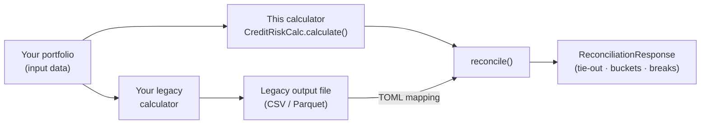

# Parallel-Run Reconciliation

Run **this** calculator and your **existing** calculator on the same portfolio, then
reconcile the two outputs **component by component** — exposure class, CCF, EAD, PD, LGD,
risk weight, RWA, and more. Every exposure is bucketed as a match, a within-tolerance
difference, a break, or missing on one side, with our engine's *reason* and *input drivers*
attached so a break can be traced to a **data** issue or an **engine** difference.

This is the feature that lets a risk team gain comfort that the new calculator produces the
right numbers **before** they switch.

## Why reconcile before you switch

Most institutions adopting this calculator already run an incumbent credit-risk engine. The
hardest part of a migration is not installing the new system — it is **signing off that the
new numbers are correct** on your own book.

The acceptance suite gives statistical confidence on ~500 hand-derived regulatory scenarios.
It cannot give absolute confidence on a real portfolio of millions of exposures with
attribute combinations no test enumerates. As the project's own
[migration note](../blog/2026-08-04-what-i-got-wrong-whats-next.md) puts it, production
deployment requires *"a parallel-run discipline against an existing system, signed-off
reconciliation thresholds, and a rollback plan."*

Parallel-run reconciliation operationalises exactly that discipline:

- **Run both engines** on the same portfolio for the same reporting date.
- **Reconcile** the outputs and review the headline tie-out and the break worklist.
- **Triage** each break: is our *input* different from theirs (a data-mapping fix), or do
  the inputs agree but the *outputs* diverge (an engine difference to investigate)?
- **Sign off** once breaks are explained and within agreed thresholds.

!!! info "Not the same as CRR vs Basel 3.1 comparison"
    The [Comparison & Impact Analysis](../framework-comparison/impact-analysis.md) feature
    runs the **same engine** across **two internal frameworks** (CRR and Basel 3.1) on the
    **same inputs** — it has no reconciliation issues because both sides come from one
    codebase. Parallel-run reconciliation is different: the other side is your **external,
    legacy** output, with its own column names, units, and identifiers that must be mapped
    onto our components.

## How it works



You supply our results (produced by the calculator) and your legacy output file, plus a
small TOML mapping that says which legacy column is which component and how the two are
keyed. The engine collapses our guarantee / real-estate sub-rows back to your reporting
grain, joins the two sides, and buckets every mapped component.

## What it compares

You map only the components you have. Each one is compared with a sensible default tolerance
(overridable), and annotated with our engine's *explain* and *input* columns.

| Component | Kind | Compared as | Our "explain" (why) |
|-----------|------|-------------|----------------------|
| `exposure_class` | categorical | exact label (after synonyms) | classification reason, pre-CRM class |
| `approach` | categorical | exact label | approach-selection reason, permission |
| `pd` | numeric | absolute tolerance | original PD, PD floor applied |
| `lgd` | numeric | absolute tolerance | original LGD, LGD floor, LGD type |
| `maturity` | numeric | absolute tolerance | residual maturity, maturity date |
| `ccf` | numeric | absolute tolerance | CCF regulatory source |
| `ead` | numeric | relative tolerance | gross EAD, converted undrawn, CRM benefit |
| `risk_weight` | numeric | absolute tolerance | RW regulatory reference / adjustment reason |
| `supporting_factor` | numeric | absolute tolerance | infra factor, SF benefit |
| `expected_loss` | numeric | relative tolerance | — |
| `rwa` | numeric | relative tolerance | — |

### Buckets

Every component on every row lands in one bucket, and the row takes its worst:

| Bucket | Meaning |
|--------|---------|
| `exact_match` | Identical (within floating-point noise). |
| `within_tolerance` | Differs, but within the configured tolerance. |
| `break` | Outside tolerance — needs investigation. |
| `missing_left` | In the legacy file but **not** in our results. |
| `missing_right` | In our results but **not** in the legacy file. |

### Data fix or engine fix?

The point of attaching our *explain* and *input* columns to every row is to make a break
**triage-able**. For a break on, say, `risk_weight`:

- If our **input** drivers (CQS, LTV band, …) differ from what the legacy system used → the
  break is a **data / mapping** issue — fix the feed or the mapping.
- If the inputs agree but the risk weight differs → it is an **engine** difference — raise it
  for investigation against the regulation.

## Reading the report

The result is layered from a one-number verdict down to a single exposure's drivers.

=== "1 · Headline"

    **Does it tie out?** `totals_tie_out` gives sum-legacy vs sum-ours (and % delta) per
    additive component; `summary_by_component` gives the per-component bucket counts and
    break rate — i.e. *which components agree and which are problematic*.

=== "2 · Segment"

    **Where do breaks concentrate?** `summary_by_bucket`, `summary_by_exposure_class`, and
    `summary_by_approach` show whether breaks cluster in a particular bucket, class, or
    approach.

=== "3 · Worklist"

    **What to investigate first.** `breaks_detail` is a long-format list of every
    `(exposure, component)` break — legacy value, our value, absolute and relative delta, and
    our explanation — ranked by materiality.

=== "4 · Forensic"

    **One exposure, end to end.** `component_reconciliation` is the per-key row carrying
    legacy-vs-ours for every component, the bucket, and our explain + input columns — the
    view you use to decide *data fix vs engine fix*.

## How to run it

### 1. Write a mapping (TOML)

The mapping declares the legacy file, the join key(s), and which legacy column feeds each
component. Numeric components accept `scale` (e.g. legacy figures in millions) and
`unit = "percent"`; categoricals accept a `value_map` of label synonyms; any component can
override its tolerance.

```toml
# reconciliation.toml
legacy_file   = "./legacy_q4.csv"
legacy_format = "csv"              # or "parquet"
legacy_keys   = ["obligor_id", "facility_id"]          # composite key supported
our_keys      = ["counterparty_reference", "root_facility_reference"]
top_n         = 50

[components.rwa]
legacy_column = "RWA_Amt"
scale         = 1_000_000          # legacy RWA is in millions
tol_kind      = "rel"              # optional override
tol           = 0.005              # 0.5% relative

[components.ead]
legacy_column = "EAD_Amt"
scale         = 1_000_000

[components.risk_weight]
legacy_column = "RW_pct"
unit          = "percent"          # 20.0 -> 0.20

[components.exposure_class]
legacy_column = "Asset_Class"
value_map     = { CORP = "corporate", RETAIL = "retail" }
```

!!! tip "The join key can be composite"
    `legacy_keys` and `our_keys` are positionally aligned, so you can reconcile at whatever
    grain both systems share — a single `exposure_reference`, or a composite such as
    `counterparty + facility`. When you key coarser than one row per exposure, our results
    are aggregated up to that grain first.

### 2. Run it from Python

```python
from datetime import date
from pathlib import Path

from rwa_calc.api import CreditRiskCalc

calc = CreditRiskCalc(
    data_path="/path/to/data",
    framework="CRR",
    reporting_date=date(2026, 12, 31),
    permission_mode="standardised",
)

response = calc.reconcile("reconciliation.toml")

# Headline: do the two engines tie out?
print(response.collect_totals_tie_out())
print(response.collect_summary_by_component())

# Warnings (non-fatal) — e.g. a mapped column the legacy file didn't contain
for err in response.errors:
    print(f"[{err.code}] {err.message}")

# The break worklist, largest first
breaks = response.collect_breaks_detail()
print(f"{breaks.height} break(s) to review")

# Full report to Excel (one sheet per view) or CSV (one file per view)
response.to_excel(Path("reconciliation.xlsx"))
response.to_csv(Path("reconciliation_out/"))
```

`reconcile()` accepts either a path to a `.toml` file (shown above) or a
`ReconciliationSettings` object built in code via `api.load_reconciliation_config`.

### 3. Or use the interactive UI

The **Reconciliation** page in the app (served at **`/reconciliation`**) gives you the same
result without writing Python: enter your data path, edit the TOML mapping in the form, and
run. It renders the four drill-down tiers (headline tie-out, per-component summary, the break
worklist, and the per-key forensic table with a bucket filter) and offers CSV / Excel
downloads of the full per-key detail.

```bash
uv add rwa-calc
rwa-ui                 # then open http://localhost:8000/reconciliation
```

The same flow is available over HTTP for programmatic callers via `POST /api/reconcile`
(with `GET /api/reconcile/export/{csv|excel}` for the downloads).

> **Details:** See [Interactive UI](../user-guide/interactive-ui.md) for the full list of
> pages and how to start the server.

## Output reference

### `ReconciliationResponse`

| Member | Returns | Description |
|--------|---------|-------------|
| `success` | `bool` | True when at least one component was reconciled. |
| `errors` | `list[APIError]` | Non-fatal reconciliation warnings (see below). |
| `collect_totals_tie_out()` | `pl.DataFrame` | Per additive component: `legacy_total`, `our_total`, `delta`, `delta_pct`. |
| `collect_summary_by_component()` | `pl.DataFrame` | Per component: bucket counts, `sum_abs_delta`, `break_rate`. |
| `collect_summary_by_bucket()` | `pl.DataFrame` | Row-level `row_bucket` counts. |
| `collect_breaks_detail()` | `pl.DataFrame` | Long-format break worklist, ranked by `abs_delta`. |
| `collect_component_reconciliation()` | `pl.DataFrame` | Per-key forensic frame (legacy vs ours + explain/input). |
| `to_excel(path)` / `to_csv(dir)` | `ExportResult` | Multi-sheet workbook / one CSV per view. |
| `has_breaks` | `bool` | True when any row reconciled to a break. |

### `ReconciliationBundle`

The underlying engine bundle (available as `response.bundle`). All frames are
`pl.LazyFrame`; `errors` is a `list`.

| Field | Description |
|-------|-------------|
| `component_reconciliation` | Per-key: `legacy_<c>` / `our_<c>` / `<c>_bucket` per component, explain + input columns, `row_bucket`, `worst_component`. |
| `summary_by_component` | Headline per-component bucket counts and break rate. |
| `summary_by_bucket` | Row-level bucket counts. |
| `summary_by_exposure_class` | Break counts / sums by our exposure class. |
| `summary_by_approach` | Break counts / sums by our approach. |
| `breaks_detail` | Long-format break worklist, ranked by materiality. |
| `totals_tie_out` | Per additive component: sum legacy vs sum ours. |

## Tolerances & data-quality warnings

Each numeric component has a sensible default tolerance — **1% relative** for money amounts
(EAD, RWA, expected loss) and a **tight absolute** tolerance for rates (risk weight, PD,
LGD, CCF, supporting factor). Override any of them per component in the mapping with
`tol_kind` (`"rel"` or `"abs"`) and `tol`. Categorical components match on the exact label
after case-folding and `value_map` synonyms.

Reconciliation never aborts on a data problem — issues are recorded as non-fatal warnings on
`response.errors` so they are visible rather than silent:

| Code | Meaning |
|------|---------|
| `REC001` | A mapped column was missing (legacy or ours); that component is skipped. |
| `REC002` | Duplicate legacy key(s); the first row of each is kept on join. |
| `REC003` | A declared join key column was not found; reconciliation cannot proceed. |
| `REC004` | A coarse key aggregated rows of differing class/approach (categoricals shown are the first in the group). |

## Related

- [Output Schemas](../data-model/output-schemas.md) — the per-exposure columns reconciliation reads from.
- [Comparison & Impact Analysis](../framework-comparison/impact-analysis.md) — CRR vs Basel 3.1 (a different kind of comparison).
- [Interactive UI](../user-guide/interactive-ui.md) — the Reconciliation page and the other app surfaces.
- [Service API](../api/service.md) — `CreditRiskCalc` reference.
