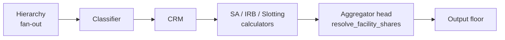

# Facility Share Allocation

How the calculator attributes the **undrawn commitment of a facility that several
counterparties may draw against** to one of them.

**Regulatory reference:** none for the allocation itself — see
[Regulatory status](#regulatory-status). The exposure value it produces cites
CRR Art. 111 and Annex I, CRR Art. 166(8)(d); PRA PS1/26 Art. 111 Table A1 and
Art. 166C.
**Design of record:** [Facility Share — Riskiest Member](../plans/facility-share-riskiest-member.md)

---

## What a Facility Share is

A **Facility Share** is one facility whose headroom more than one obligor may
draw. The calculator emits a synthetic `facility_undrawn` exposure row for a
facility's unused limit, and that row needs a counterparty: the risk weight, the
approach, the model permission, the exposure class and any credit risk
mitigation all follow from whose exposure it is. Where several obligors may draw
the same line, "whose exposure it is" has no single answer in the input data, so
the calculator has to elect one.

The policy it applies is **capitalise the commitment against the riskiest member
that could draw it**, and "riskiest" is measured on each member's *own applied
approach* — the internal-ratings formula for a member on a model, the
standardised tables for a member without one — including that member's own credit
risk mitigation.

## Detection

There is no input flag for a share. A facility row carries exactly one
`counterparty_reference`, its **owner**, and the facility reference is a unique
key. Loans, contingents and sub-facilities attach to a facility through
`facility_mappings`, and each child carries its own counterparty reference. That
is the only route by which a second counterparty can enter.

The member set of a facility is therefore

- the facility's **own** `counterparty_reference` — the owner is always a member,
  because the owner is the legal borrower and can draw the whole line; unioned
  with
- the distinct `counterparty_reference` values on its descendant loans and
  contingents, each resolved up to its root facility.

A facility whose member set holds **more than one** member is a Facility Share.

!!! warning "Including the owner changes detection, not only allocation"
    A facility owned by A whose only mapped loan belongs to B has the member set
    `{A, B}` and **is** a share. Under the descendants-only rule that preceded
    this design it had one member and its undrawn stayed with A untouched.

Nothing is drawn-weighted. A member with a small drawn balance and a member with
a large one are equal members, because either may draw the whole headroom.

**Multiple Option Facility (MOF) parents are excluded.** Their per-sub waterfall
rows already carry each sub-facility's own counterparty, so the allocation
question does not arise, and fanning them out would multiply the waterfall. The
residual row that carries the parent's own risk type is not a candidate either.

Implementation: `engine/hierarchy/facility_undrawn.py`
(`_derive_facility_share_members`, `_apply_facility_share_fanout`), described in
[Component Overview — Hierarchy Resolver](../architecture/components.md#hierarchy-resolver).

## Regulatory status

**The allocation rule is firm policy grounded in conservatism, not regulation.**
Neither UK CRR nor PRA PS1/26 defines a facility share, and neither prescribes
how to attribute a commitment that several obligors may draw. The conversion
factor articles define the undrawn exposure value for a commitment with **one**
obligor:

| Provision | What it fixes |
|---|---|
| CRR Art. 111(1) and Annex I | The off-balance-sheet exposure value as a percentage of nominal, and the risk-category assignment that selects it. Pack entry `sa_ccf`. |
| CRR Art. 166(8)(d) | The F-IRB conversion factor for undrawn credit lines. Pack entry `firb_credit_line_ccf`. |
| PRA PS1/26 Art. 111(1)(b) and Table A1 | The Basel 3.1 conversion-factor table, Column A item to Column B percentage. Pack entry `sa_ccf` on the `b31` pack. |
| PRA PS1/26 Art. 166C(1) | Under Basel 3.1 the F-IRB and slotting conversion factor **is** the standardised one, which makes the undrawn exposure value approach-invariant. Pack Feature `firb_uses_sa_ccf`. |

So the allocation carries no `@cites` of its own; the exposure value it selects
cites the articles above. The values sit in the rulepack and are rendered, with
their citations and for both regimes, in
[Regulatory Tables](../data-model/regulatory-tables.md) — this page does not
restate them.

> **Details:** the conversion-factor mechanics themselves live in
> [Credit Conversion Factors](crr/credit-conversion-factors.md).

## Mechanism — compute, then choose

The comparison the policy asks for cannot be made where the facility rows are
built. At the hierarchy stage the approach, the exposure class, the credit risk
mitigation and the output-floor state are all still undecided; the only point at
which every member's own-approach RWA **and** its standardised-equivalent RWA
both exist is the exit of the calculators. The engine therefore computes first
and chooses afterwards.



**1. Fan-out (hierarchy).** A share's single undrawn row is replicated into one
**candidate** row per member. Every candidate carries the **full** headroom —
each is "as if this member drew the whole line", so nothing is pro-rated. A
candidate is marked by:

| Column | Value on a candidate |
|---|---|
| `exposure_reference` | `<facility>_UNDRAWN@<member>` |
| `source_exposure_reference` | `<facility>` — unchanged, so reconciliation keys are untouched |
| `counterparty_reference` | the member |
| `original_counterparty_reference` | the facility owner |
| `facility_share_group` | `<facility>`; null on every non-share row |
| `is_facility_share_candidate` | `True`; false elsewhere |

**2. Pricing (classifier, CRM, calculators).** No pricing code knows about
candidates. Each is classified, CRM-adjusted and priced as an ordinary row of its
own member — its own exposure class, model permission, PD and LGD, its own
collateral and guarantees — and, under Basel 3.1, its own standardised-equivalent
RWA, because the standardised pipe runs on every row to build S-TREA.

**3. Resolution (aggregator head).** `resolve_facility_shares` keeps exactly one
candidate per `facility_share_group`, drops the losers from the combined frame
**and** from each of the three branch frames, and renames the winner back to
`<facility>_UNDRAWN`. The aggregator's exit invariant is unchanged: **one undrawn
row per facility**, so COREP, Pillar 3, reconciliation and the supervisory
register see the shape they saw before.

!!! danger "The drop must precede three things, not one"
    The output floor, or every losing candidate's standardised-equivalent RWA
    inflates S-TREA. The expected-loss summary, which reads the internal-ratings
    and slotting **branch** frames directly, or a loser's expected loss reaches
    the CET1 deduction and therefore OF-ADJ. And the by-class / by-approach
    summaries, or the class totals count rows that never reach the ledger. A drop
    applied to the combined frame alone is green on `rwa_final` and wrong on
    OF-ADJ.

There is no second implementation of any pricing logic anywhere in this design —
that is the point of it. The mechanism it replaced was a standardised-equivalent
risk-weight **preview** built at the hierarchy stage from entity type, credit
quality step and country. That preview knew nothing about whether a member was
on a model, about its PD or LGD, about its exposure class, about credit risk
mitigation on the facility, or about the floor, and it was deleted on
2026-09-05.

## The metric under CRR

Under CRR capital is additive, so the capital-maximising choice is made group by
group and no portfolio state enters:

```
winner(g) = argmax over members i of g:  own-approach pre-floor RWA of i
```

The metric is **RWA, not risk weight**. The two orderings coincide whenever the
exposure value is the same for every member, which is the common case; they
diverge wherever the conversion factor or the credit risk mitigation depends on
the obligor, and there the conservative quantity is capital rather than a gross
weight. The own-approach RWA is taken **after** the SME and infrastructure
supporting factors, so a member's relief is honoured rather than ranked away.

## The metric under Basel 3.1 — the output floor

Under Basel 3.1 total risk exposure is a portfolio-level `max`, so "riskiest" is
**state-dependent**: which member costs the most capital depends on whether the
floor binds, and whether the floor binds depends in part on which member was
chosen.

### The engine's floor formula

The engine takes the `max` over the floor-eligible rows and adds the standardised
book outside it:

```
TREA = SA_total + EQ + max( U_elig , x . S_elig + OF-ADJ )
```

where `U_elig` and `S_elig` are summed over floor-eligible approaches
(internal ratings, slotting and counterparty-credit-risk-via-standardised),
`x` is the Art. 92(5) phase-in percentage from the pack Schedule
`output_floor_pct` (or `output_floor_pct_full` where the firm skips the
transition), and `OF-ADJ` is the own-funds adjustment.

!!! note "This is the engine's form, not the article's"
    PS1/26 Art. 92(2A) takes the `max` over whole-firm totals, in which
    standardised rows appear on **both** sides. The two agree only where `x` is
    one; otherwise the engine's form binds more often and by more, so it is
    conservative. The divergence is a recorded, out-of-scope finding — see
    [Known findings](#known-findings) — and every statement on this page is made
    against the engine's form.

    The floor itself is documented in
    [Output Floor](basel31/output-floor.md).

### The floored-branch marginal

For a member `i`, let `u_i` be its own-approach pre-floor RWA and `s_i` its
standardised-equivalent. Its marginal contribution to the floored branch is

```
b_i = x . s_i      if the member's applied approach is floor-eligible
      u_i          otherwise
```

The second limb is the one an implementation gets wrong. Floor-eligible and
standardised do **not** partition the domain: counterparty-credit-risk-via-
standardised and slotting are floor-eligible without being standardised, so a
predicate written as "not internal-ratings gets `u_i`" sends both down the wrong
limb and understates the floored assignment. A specialised-lending facility's
undrawn candidate is a live slotting case.

### The rule: evaluate two assignments, keep the larger

The un-floored branch is additive across shares, so it is maximised exactly by
**assignment A** — every share to its `argmax u_i`. The floored branch is
strictly increasing in `S_elig`, so it is maximised share by share by
**assignment B** — every share to its `argmax b_i`. Since total risk exposure is
the `max` of the two branches, the capital-maximising assignment is one of those
two. The engine evaluates **both end to end** — recomputing the expected-loss
summary, OF-ADJ and the floor on each assignment's surviving book, through the
aggregator's own functions rather than a second copy of them — and keeps the
assignment with the larger total. Ties go to A, for attribution stability.

!!! warning "P2 is the better of two natural assignments, not a proof of optimality"
    OF-ADJ is **not** constant across assignments. Its internal-ratings Tier 2
    credit and CET1 deduction come from the expected-loss summary, so the winning
    member's own expected loss moves it, and the floored branch stops being
    additive across shares. The comparison is therefore **exact for the two
    assignments it evaluates and a lower bound on the true optimum**, not an
    identity. The expected-loss channel is small next to the standardised-
    equivalent channel except at high `PD × LGD`, but the claim being made here
    is a bound, and it is stated as one.

    A per-row "floored proxy" — ranking on `max(u_i, x . s_i)` — is not an
    approximation of this. It is provably wrong in **both** floor states, because
    a per-exposure floor is not how Art. 92(2A) works.

### When the floor state cannot change the answer

A useful boundary falls straight out of the two marginals. A standardised
member's marginal is its **full** RWA under both assignments, while a modelled
member's falls to `x` times its standardised-equivalent under assignment B. So:

> **No facility share whose standardised members all sit at or above the floor
> percentage — that is, whose own risk weight is at least `x` times the
> standardised-equivalent risk weight of every modelled member — can ever flip on
> the floor state.**

A regulatory-retail member is the everyday case: its full risk weight already
exceeds `x` times an unrated corporate's standardised-equivalent at every step of
the `output_floor_pct` Schedule, so assignment A and assignment B agree and the
election below changes nothing. Shares that *can* flip are the ones holding a
low-PD modelled member with a much higher standardised-equivalent weight, against
standardised members priced below the floor percentage.

## The `facility_share_metric` election

`CalculationConfig.facility_share_metric` is a **firm election**, not a regime
switch — the regime gate is the existing `output_floor` pack Feature.

| Value | Behaviour |
|---|---|
| `floor_aware` (default) | Assignment A and assignment B are both evaluated and the larger total wins. |
| `own_approach` | Pins the un-floored rule (`argmax u_i`) in every state. |

!!! danger "`own_approach` lowers RWA wherever the floor binds"
    It is **opt-in for that reason**. The default takes the larger of the two
    assignments, so it can never produce less capital than the un-floored rule;
    pinning the un-floored rule discards the larger branch whenever the floored
    one would have won. On the reference portfolio the election reduces total
    risk exposure in the binding variant and is inert everywhere else — see the
    [worked example](#worked-example).

    The election exists for firms whose reporting or reconciliation cannot
    tolerate obligor attribution moving with the floor state, the phase-in step
    or the reporting scope. It is a governance choice with a capital consequence,
    and it should be made deliberately rather than inherited from a config
    default.

Under CRR the election is accepted and **inert**: the `output_floor` Feature is
off, so the un-floored rule applies either way. There is no `OutputFloorSummary`
under CRR, so the only place the election is observable there is the
`metric_used` column of the audit frame.

## Candidates in obligor aggregates

Candidates are real rows from the classifier onwards, so the per-obligor windows
see them. The design decision is **no window special-casing anywhere**: every
candidate counts toward its own member's aggregates exactly as any exposure of
that member would. Each member's lending-group and obligor totals therefore
include the full undrawn, which is the conservative reading of "total amount
owed" for a line that member may draw in full.

Direction, relative to the single-row behaviour it replaced:

- **The eventual winner's siblings are unchanged.** The single undrawn row
  already counted for them.
- **A losing member's siblings gain the undrawn** in their partition-local
  totals, so the retail and qualifying-revolving thresholds can only be crossed
  **upward**. Crossing upward moves an obligor to a less favourable treatment.
- **The Art. 123A(1)(b)(ii) granularity denominator does not move at all.** The
  retail-threshold carrier is built from the **drawn** amount only, so an undrawn
  row contributes zero to it; the denominator divides each obligor's aggregate by
  that obligor's own line count, so extra rows of the same obligor and
  standardised class leave its term algebraically unchanged. The invariance is
  pinned by a test, not assumed.

**One residual, disclosed rather than fixed.** A member demoted out of the
qualifying revolving retail class by its enlarged obligor aggregate is priced on
the ordinary retail correlation, which decays with PD, instead of the fixed
qualifying-revolving correlation. Above a crossover PD the decaying correlation
falls **below** the fixed one, so for such an obligor the demotion *lowers* RWA.
The effect is partition-local — it touches only that member — and the crossover
sits well above any ordinary revolving portfolio's PD; the correlations are in
`engine/irb/formulas.py`. No fixture reaches it, so it is recorded as **owed
coverage**: a share with a revolving retail member near the qualifying limit and
a PD above the crossover.

The rejected alternative was an "own-inclusive" rule in which non-candidate rows
see no candidate. It is exact for losers but drops the undrawn from the
**winner's** siblings, which is RWA-reducing relative to the behaviour it would
replace.

## Tie-breaks and the fallback

Ordering within a share, for the own-approach ranking and for assignment A:

1. own-approach RWA, descending;
2. `risk_weight`, descending;
3. `pd_floored`, then `cqs`, descending — the worse credit;
4. `counterparty_reference`, ascending.

Assignment B is the same chain with `b_i` in the first rung. Nulls sort last
throughout. Rungs 3 reach only within an approach — `pd_floored` is populated on
modelled rows and `cqs` on externally rated ones — so on a mixed-approach share
the final rung is what guarantees a total order. It always does.

**Where every candidate of a share carries a non-finite or absent own-approach
RWA**, the ranking metric decides nothing. The group is **never dropped** —
dropping every candidate would delete the facility's undrawn commitment from the
submission outright. The engine falls back to `risk_weight` descending, then
`counterparty_reference` ascending, records `metric_used =
"fallback_deterministic"` with a null rank on every candidate, and emits an
**`AGG003` warning** naming the group and the candidate count. A fallback nobody
is told about is indistinguishable from a ranked outcome, which is why it is a
warning and not a log line.

## What is exposed for audit

**`AggregatedResultBundle.facility_share_resolution`** — one row per priced
candidate, in both regimes:

| Column | Meaning |
|---|---|
| `facility_share_group` | the facility competed for |
| `exposure_reference` | the candidate's fan-out reference |
| `counterparty_reference` / `original_counterparty_reference` | member / owner |
| `approach_applied`, `exposure_class` | how the candidate was priced |
| `ead_final`, `rwa_pre_floor`, `sa_rwa`, `risk_weight` | the priced figures; the standardised-equivalent is a typed null under CRR, where it does not exist |
| `floored_branch_contribution` | `b_i`; null under CRR |
| `rank_own_approach`, `rank_floored_branch` | 1 is best; the second is null under CRR |
| `is_winner` | exactly one per group |
| `metric_used` | `own_approach`, `sa_equivalent` or `fallback_deterministic` |
| `collapsed_exposure_reference` | `<facility>_UNDRAWN` on the winner, null otherwise |

Because every member is priced, the frame is a per-facility **allocation
sensitivity table**: the RWA the commitment would have carried under each member,
on each metric. That is directly useful in reconciliation against a legacy system
whose own share rule is unknown.

**`OutputFloorSummary`**, on the Basel 3.1 runs, gains two fields:

- `facility_share_metric_used` — which assignment decided the book.
- `facility_share_trea_alternative` — the total the **other** assignment came to.

Attribution flipping with the floor state is a designed consequence of the
floor-aware default, but it may never be silent. These two fields are what the
flip is read against; it should never be inferred from a moved COREP row.

## Worked example

!!! info "Illustrative figures — derived, not authoritative"
    The figures below are **derived from the reference portfolio** used to
    develop this feature and are reproduced to show the shape of the outcome.
    They are not regulatory values, they are not a golden expectation, and they
    should not be transcribed into a test. The pack is the source of truth for
    every rate involved.

One shared facility with three members: the owner, a standardised corporate; a
second standardised corporate at a better credit quality step; and a
foundation-internal-ratings corporate with a low internal PD and a high
standardised-equivalent weight. Two variants of the same portfolio differ in one
input, the PD of an unrelated anchor loan, which is what makes the floor bind in
one and not the other.

| Regime | Floor | Election | Winner | Winner's approach | Undrawn `rwa_final` |
|---|---|---|---|---|---|
| CRR | n/a | either | owner | standardised | 100,000.00 |
| Basel 3.1 | binds | `floor_aware` | modelled member | foundation IRB | 81,144.54 |
| Basel 3.1 | binds | `own_approach` | owner | standardised | 100,000.00 |
| Basel 3.1 | does not bind | either | owner | standardised | 100,000.00 |

Reading the four rows:

- **Under CRR** the owner's full RWA beats the modelled member's, which is much
  lower than its standardised-equivalent. Capital is additive, so that is the end
  of it.
- **Under a binding floor** the modelled member's marginal becomes `x` times its
  standardised-equivalent, which here exceeds the owner's full RWA, so assignment
  B wins and attribution moves to the modelled member. Note that the undrawn
  row's own `rwa_final` is *lower* while the **portfolio total is higher** — the
  member's own-approach RWA is what sits on the row, and its contribution to
  capital arrives through the floor.
- **Under the election**, the same binding book is pinned to assignment A. Total
  risk exposure falls by the difference between the two floored branches. This is
  the direction the election warning above describes.
- **Where the floor does not bind**, both assignments agree and the election is
  inert.

## Known findings

Recorded here because they bound what this page claims, and filed for separate
decisions. None is fixed by this design.

1. **The engine floors the modelled subset, not the firm.** The floor `max` is
   taken over floor-eligible rows with the standardised book added outside it,
   where Art. 92(2A) takes it over whole-firm totals. The engine's form is
   conservative; correcting it would be RWA-reducing and needs its own evidence
   and sign-off.
2. **The Art. 110A due-diligence input never reaches the standardised branch.**
   The two input columns are accepted by the loan and contingent schemas but are
   not declared on the hierarchy edge contract, so they are dropped silently
   before classification and the `SA004` warning fires on every Basel 3.1 run
   regardless of input.
3. **The binding-floor add-on has no reported home in the internal-ratings
   templates.** The pro-rata floor add-on lives inside `rwa_final` and the
   reporting projection mirrors it into the after-adjustments column, which then
   exceeds the sum of its stated components by exactly the floor shortfall. The
   fix is a reporting-basis decision, not a calculation one.

---

## Related pages

- [Facility Share — Riskiest Member](../plans/facility-share-riskiest-member.md) — the design of record, with the five decisions and the rejected alternatives
- [Component Overview](../architecture/components.md) — where the fan-out and the resolution sit in the pipeline
- [Output Floor](basel31/output-floor.md) — the floor mechanics the two-assignment rule depends on
- [Credit Conversion Factors](crr/credit-conversion-factors.md) — the undrawn exposure value
- [Regulatory Tables](../data-model/regulatory-tables.md) — every pack entry named on this page, rendered with its citation for both regimes
