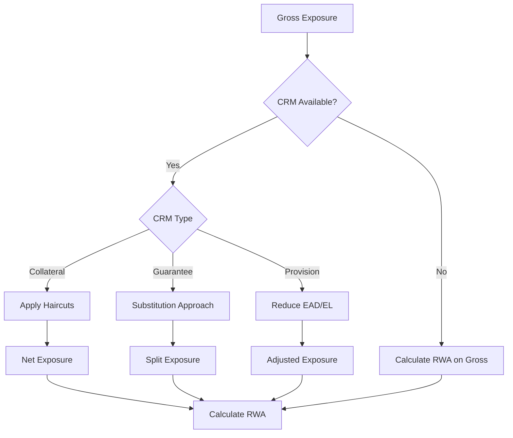
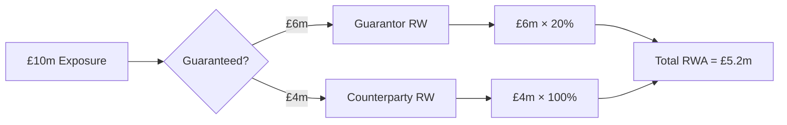

# Credit Risk Mitigation

**Credit Risk Mitigation (CRM)** techniques reduce the capital requirement for exposures by providing protection against default losses. The calculator supports collateral, guarantees, and provisions.

## Overview



## Collateral

### Pledge Percentage

Collateral can be specified as a **percentage of the beneficiary's EAD** instead of an absolute `market_value`. Set `pledge_percentage` (decimal fraction, e.g. 0.5 = 50%) and leave `market_value` null or zero. The system resolves it to an absolute value before haircuts:

- **Direct** (loan/contingent): `market_value = pledge_percentage × exposure ead_gross`
- **Facility**: `market_value = pledge_percentage × sum(ead_gross)` across all facility exposures
- **Counterparty**: `market_value = pledge_percentage × sum(ead_gross)` across all counterparty exposures

When `market_value` is provided (non-null, non-zero), it takes priority and `pledge_percentage` is ignored.

### Financial Collateral

Financial collateral (cash, bonds, equity) directly reduces exposure.

#### Simple Method (SA Only)

The collateral's risk weight substitutes for the exposure's risk weight:

```python
# Protected portion uses collateral issuer's RW
RWA_protected = Protected_Amount × Collateral_RW

# Unprotected portion uses counterparty RW
RWA_unprotected = Unprotected_Amount × Counterparty_RW

# Total
RWA = RWA_protected + RWA_unprotected
```

#### Comprehensive Method

Applies haircuts to both exposure and collateral. See [`crm/haircuts.py:69-143`](https://github.com/OpenAfterHours/rwa_calculator/blob/master/src/rwa_calc/engine/crm/haircuts.py#L69-L143) for the implementation.

!!! info "Conceptual Formula"
    ```python
    # Exposure with volatility adjustment
    E_adjusted = E × (1 + H_e)

    # Collateral with haircuts
    C_adjusted = C × (1 - H_c - H_fx)

    # Net exposure
    E_star = max(0, E_adjusted - C_adjusted)

    # RWA on net exposure
    RWA = E_star × Risk_Weight
    ```

### Supervisory Haircuts

| Collateral Type | Residual Maturity | Haircut (H_c) |
|-----------------|-------------------|---------------|
| **Cash** | Any | 0% |
| **Government/PSE CQS1** | ≤1 year | 0.5% |
| | 1-5 years | 2% |
| | >5 years | 4% |
| **Government/PSE CQS2-3** | ≤1 year | 1% |
| | 1-5 years | 3% |
| | >5 years | 6% |
| **Corporate CQS1-2** | ≤1 year | 1% |
| | 1-5 years | 4% |
| | >5 years | 8% |
| **Corporate CQS3** | ≤1 year | 2% |
| | 1-5 years | 6% |
| | >5 years | 12% |
| **Main Index Equity** | Any | 15% |
| **Other Listed Equity** | Any | 25% |
| **Gold** | Any | 15% |

**Currency Mismatch (H_fx):**
```python
# Add 8% if collateral currency ≠ exposure currency
if collateral_currency != exposure_currency:
    H_fx = 0.08
else:
    H_fx = 0.00
```

### Exposure Haircut (H_e)

For repos and similar transactions:

| Exposure Type | Haircut (H_e) |
|---------------|---------------|
| Government bonds CQS1 | Same as H_c table |
| Corporate bonds | Same as H_c table |
| Equity | 0% (exposure side) |

### Collateral Calculation Example

**Exposure:**
- Corporate loan, £10m
- Counterparty RW: 100%

**Collateral:**
- Government bonds (CQS1), £8m
- Residual maturity: 3 years
- Same currency

**Calculation (Comprehensive Method):**
```python
# Haircuts
H_e = 0%  # Loan exposure
H_c = 2%  # Govt bond 1-5yr
H_fx = 0%  # Same currency

# Adjusted values
E_adjusted = 10,000,000 × (1 + 0.00) = 10,000,000
C_adjusted = 8,000,000 × (1 - 0.02 - 0.00) = 7,840,000

# Net exposure
E_star = max(0, 10,000,000 - 7,840,000) = 2,160,000

# RWA
RWA = 2,160,000 × 100% = £2,160,000

# vs. Gross RWA
Gross_RWA = 10,000,000 × 100% = £10,000,000

# Benefit: 78.4% reduction
```

### Physical Collateral

Physical collateral (real estate, equipment) provides CRM for IRB:

| Collateral Type | F-IRB LGD |
|-----------------|-----------|
| Residential Real Estate | 35% |
| Commercial Real Estate | 35% |
| Receivables | 35% |
| Other Physical | 40% |
| Unsecured | 45% |

**Eligibility Requirements:**
- Legal certainty of enforcement
- Regular revaluation
- Proper documentation
- Insurance where appropriate

## Overcollateralisation (CRR Art. 230)

Non-financial collateral must meet overcollateralisation requirements before it can provide CRM benefit. This ensures sufficient excess coverage to absorb valuation uncertainty.

### Overcollateralisation Ratios

| Collateral Type | Required Ratio | Effectively Secured |
|----------------|---------------|-------------------|
| Financial | 1.0x | Full adjusted value |
| Receivables | 1.25x | Adjusted value / 1.25 |
| Real estate | 1.4x | Adjusted value / 1.4 |
| Other physical | 1.4x | Adjusted value / 1.4 |

```python
# Example: £1.4m of real estate collateral (after haircuts)
overcoll_ratio = 1.4
effectively_secured = 1_400_000 / 1.4  # = £1,000,000 of CRM benefit
```

### Minimum Coverage Thresholds

Physical collateral must cover a minimum portion of EAD to provide any benefit:

| Collateral Type | Minimum Coverage |
|----------------|-----------------|
| Financial | No minimum |
| Receivables | No minimum |
| Real estate | 30% of EAD |
| Other physical | 30% of EAD |

If the minimum threshold is not met, the non-financial collateral value is **zeroed** (no CRM benefit at all).

```python
# Example: EAD = £1,000,000, RE collateral adjusted value = £200,000
# Coverage = 200,000 / 1,000,000 = 20% < 30% threshold
# Result: collateral value set to £0 (threshold not met)
```

### Multi-Level Treatment

Financial and non-financial collateral are tracked separately through the multi-level allocation process (exposure, facility, counterparty levels). This ensures:

- Overcollateralisation ratios are applied per collateral type
- Minimum thresholds are checked against the total non-financial coverage
- Financial collateral is unaffected by the overcollateralisation requirements

## Guarantees

### Substitution Approach

The guaranteed portion is treated as an exposure to the guarantor:



### Eligible Guarantors

| Guarantor Type | Eligibility |
|----------------|-------------|
| Sovereigns | CQS1-3 |
| Institutions | CQS1-3 |
| Corporates | Rated corporates with lower RW |
| Parent Companies | Under certain conditions |

### Guarantee Requirements

1. **Direct claim** on guarantor
2. **Unconditional** - no conditions to payment
3. **Irrevocable** - cannot be cancelled
4. **Legally enforceable** in relevant jurisdictions

### Double Default (CRR)

For qualifying guarantees, the double default treatment may apply:

```python
# Probability both obligor AND guarantor default
PD_joint = PD_obligor × PD_guarantor × (1 + correlation)

# Typically results in lower RWA
```

### Guarantee Example

**Exposure:**
- SME loan, £5m
- Counterparty RW: 100%

**Guarantee:**
- UK Government (0% RW)
- Guaranteed amount: £4m

**Calculation:**
```python
# Guaranteed portion (G10 sovereign)
RWA_guaranteed = 4,000,000 × 0% = £0

# Unguaranteed portion
RWA_unguaranteed = 1,000,000 × 100% = £1,000,000

# Total RWA
RWA = £0 + £1,000,000 = £1,000,000

# vs. Gross RWA
Gross_RWA = £5,000,000

# Benefit: 80% reduction
```

### Maturity Mismatch

When protection maturity < exposure maturity:

```python
# Minimum protection maturity: 1 year
t = max(0.25, protection_residual_maturity)
T = max(0.25, exposure_residual_maturity)

# Adjustment factor
if t >= T:
    adjustment = 1.0
else:
    adjustment = (t - 0.25) / (T - 0.25)

# Adjusted protection
Adjusted_Protection = Protection × adjustment
```

**Example:**
- Exposure maturity: 5 years
- Guarantee maturity: 3 years

```python
adjustment = (3 - 0.25) / (5 - 0.25) = 2.75 / 4.75 = 0.579

# £4m guarantee provides £2.32m effective protection
```

## Cross-Approach CCF Substitution

When an IRB exposure is guaranteed by a counterparty that falls under the Standardised Approach, the guaranteed portion uses **SA CCFs** instead of the IRB supervisory CCFs. This reflects the principle that the risk of the guaranteed portion should be treated consistently with the guarantor's approach.

### When It Applies

Cross-approach CCF substitution triggers when:

1. The exposure is under **F-IRB or A-IRB**
2. The guarantor's approach is determined to be **SA** — either because:
   - The firm does not have IRB permission for the guarantor's exposure class, OR
   - The guarantor only has an external rating (no internal PD estimate)

### Guarantor Approach Determination

The guarantor's approach depends on three factors:

| Condition | Guarantor Approach |
|-----------|-------------------|
| Firm has IRB permission for guarantor's class AND guarantor has internal rating (PD) | IRB |
| Firm lacks IRB permission for guarantor's class | SA |
| Guarantor has external rating only (no PD) | SA |

For example, a sovereign guarantor rated CQS 1 with no internal PD will always be treated as SA, even if the firm has F-IRB permission for sovereign exposures.

### EAD Recalculation

When the guarantor approach is SA, the exposure's EAD is recalculated with a split:

```python
# Original EAD uses IRB CCF
ead_original = drawn + undrawn × ccf_irb

# Guaranteed portion recalculated with SA CCF
ead_guaranteed = guarantee_ratio × (drawn + undrawn × ccf_sa)

# Unguaranteed portion retains IRB CCF
ead_unguaranteed = (1 - guarantee_ratio) × (drawn + undrawn × ccf_irb)
```

### Output Columns

The cross-approach CCF process adds these columns:

| Column | Description |
|--------|-------------|
| `ccf_original` | Original IRB CCF |
| `ccf_guaranteed` | CCF for guaranteed portion (SA if cross-approach) |
| `ccf_unguaranteed` | CCF for unguaranteed portion (IRB) |
| `guarantee_ratio` | Proportion guaranteed |
| `guarantor_approach` | "sa" or "irb" |
| `guarantor_rating_type` | "internal" or "external" |

### Regulatory Reference

CRR Article 153(3) and CRE31.4 — when a guarantee provides credit protection, the CCF applicable to the protected portion should be consistent with the guarantor's treatment.

## Provisions

### SA Treatment (Art. 111(2) Compliant)

Provisions are resolved **before** CCF application using a drawn-first deduction approach:

```python
# Step 1: Drawn-first deduction
provision_on_drawn = min(provision_allocated, max(0, drawn_amount))

# Step 2: Remainder reduces nominal before CCF
provision_on_nominal = provision_allocated - provision_on_drawn
nominal_after_provision = nominal_amount - provision_on_nominal

# Step 3: CCF applied to adjusted nominal
ead_from_ccf = nominal_after_provision × CCF

# Step 4: Final EAD
EAD = (max(0, drawn_amount) - provision_on_drawn) + interest + ead_from_ccf
RWA = EAD × Risk_Weight
```

Provisions are allocated via multi-level beneficiary resolution:

- **Direct** (loan/exposure/contingent): provision matched to specific exposure
- **Facility**: provision distributed pro-rata across facility's exposures
- **Counterparty**: provision distributed pro-rata across all counterparty exposures

### IRB Treatment

Under IRB, provisions are tracked (`provision_allocated`) but **not deducted** from EAD. Instead, the calculator computes Expected Loss for comparison:

```python
# Provisions NOT deducted from EAD (provision_deducted = 0)
# provision_on_drawn = 0, provision_on_nominal = 0
EL = PD × LGD × EAD

if Provisions >= EL:
    # Excess provisions can be added to Tier 2 (limited)
    Excess = Provisions - EL
else:
    # Shortfall deducted from CET1
    Shortfall = EL - Provisions
```

### SCRA and GCRA Provisions

| Type | Description | Treatment |
|------|-------------|-----------|
| **SCRA** | Specific Credit Risk Adjustments | Reduce EAD directly |
| **GCRA** | General Credit Risk Adjustments | May be included in Tier 2 |

### Provision Allocation

Provisions can be allocated at different levels:

| Level | Application |
|-------|-------------|
| Counterparty | Applies to all exposures |
| Facility | Applies to facility and sub-loans |
| Loan | Applies to specific loan |

## CRM Hierarchy

When multiple CRM types are available, provisions are resolved first (before CCF), then the remaining CRM is applied after EAD initialization:

```python
# Order of application (Art. 111(2) compliant)
1. Resolve provisions (before CCF) — drawn-first deduction, adjusts nominal
2. Apply CCFs (uses nominal_after_provision for off-balance sheet conversion)
3. Initialize EAD waterfall
4. Apply collateral (reduce net exposure with haircuts)
5. Apply guarantees (substitution on remainder)
6. Finalize EAD (no further provision subtraction)
```

### Example with Multiple CRM

**Exposure:**
- Corporate loan, £10m
- Counterparty RW: 100%

**CRM:**
- Specific provision: £1m
- Cash collateral: £3m
- Bank guarantee (20% RW): £4m

**Calculation:**
```python
# Step 1: Apply provision
Net_1 = 10,000,000 - 1,000,000 = 9,000,000

# Step 2: Apply collateral (no haircut for cash)
Net_2 = 9,000,000 - 3,000,000 = 6,000,000

# Step 3: Apply guarantee (substitution)
Guaranteed = min(4,000,000, 6,000,000) = 4,000,000
Unguaranteed = 6,000,000 - 4,000,000 = 2,000,000

# Calculate RWA
RWA_guaranteed = 4,000,000 × 20% = 800,000
RWA_unguaranteed = 2,000,000 × 100% = 2,000,000

Total_RWA = £2,800,000

# vs. Gross RWA = £10,000,000
# Benefit: 72% reduction
```

## Implementation

The CRM processing is implemented in [`crm/processor.py`](https://github.com/OpenAfterHours/rwa_calculator/blob/master/src/rwa_calc/engine/crm/processor.py) and [`crm/haircuts.py`](https://github.com/OpenAfterHours/rwa_calculator/blob/master/src/rwa_calc/engine/crm/haircuts.py).

### CRM Processor

```python
from rwa_calc.engine.crm.processor import CRMProcessor
from rwa_calc.contracts.config import CalculationConfig
from datetime import date

# Create processor
processor = CRMProcessor()

# Process exposures through CRM pipeline
result = processor.get_crm_adjusted_bundle(
    data=classified_exposures_bundle,
    config=CalculationConfig.crr(reporting_date=date(2026, 12, 31))
)

# Access adjusted exposures
adjusted = result.exposures
sa_adjusted = result.sa_exposures
irb_adjusted = result.irb_exposures
```

::: rwa_calc.engine.crm.processor.CRMProcessor
    options:
      show_root_heading: true
      members:
        - apply_crm
        - resolve_provisions
        - apply_collateral
        - apply_guarantees
      show_source: false

??? example "CRM Processor Implementation (processor.py)"
    ```python
    --8<-- "src/rwa_calc/engine/crm/processor.py:51:169"
    ```

### Haircut Calculator

```python
from rwa_calc.engine.crm.haircuts import HaircutCalculator
from decimal import Decimal

calculator = HaircutCalculator()

# Calculate haircut for a single collateral item
result = calculator.calculate_single_haircut(
    collateral_type="govt_bond",
    market_value=Decimal("8000000"),
    collateral_currency="GBP",
    exposure_currency="GBP",
    cqs=1,
    residual_maturity_years=3.0,
)

print(f"Collateral haircut: {result.collateral_haircut:.1%}")
print(f"Adjusted value: {result.adjusted_value:,.0f}")
```

??? example "Haircut Application (haircuts.py)"
    ```python
    --8<-- "src/rwa_calc/engine/crm/haircuts.py:145:301"
    ```

## CRM Data Structure

The calculator accepts CRM data at multiple levels:

```python
# Collateral data
collateral = {
    "collateral_id": "COL001",
    "counterparty_id": "CP001",  # Or facility_id, loan_id
    "collateral_type": "cash",
    "value": 1_000_000,
    "currency": "GBP",
    "issuer_cqs": None,  # For bonds
    "residual_maturity": None  # For bonds
}

# Guarantee data
guarantee = {
    "guarantee_id": "GAR001",
    "counterparty_id": "CP001",  # Protected party
    "guarantor_id": "GP001",
    "amount": 5_000_000,
    "guarantor_type": "SOVEREIGN",
    "guarantor_cqs": 1,
    "maturity_date": date(2028, 12, 31)
}

# Provision data
provision = {
    "provision_id": "PRV001",
    "counterparty_id": "CP001",  # Or facility_id, loan_id
    "provision_type": "SCRA",
    "amount": 500_000,
    "ifrs_stage": "STAGE_3"
}
```

## Regulatory References

| Topic | CRR Article | BCBS CRE |
|-------|-------------|----------|
| CRM overview | Art. 192-194 | CRE22.1-10 |
| Financial collateral | Art. 197-200 | CRE22.35-70 |
| Haircuts | Art. 224-227 | CRE22.50-55 |
| Guarantees | Art. 213-216 | CRE22.71-85 |
| Maturity mismatch | Art. 238-239 | CRE22.90-95 |
| Physical collateral | Art. 199 | CRE22.100-120 |
| Overcollateralisation | Art. 230 | CRE32.9-12 |

## Next Steps

- [Supporting Factors](supporting-factors.md) - SME and infrastructure factors
- [Standardised Approach](standardised-approach.md) - SA with CRM
- [IRB Approach](irb-approach.md) - IRB with CRM
