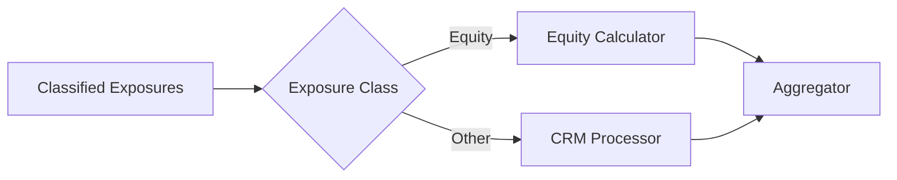

# Equity Exposures

**Equity exposures** receive dedicated risk weight treatment separate from credit risk. The calculator supports two approaches under CRR.

## Overview

Equity exposures are routed directly from classification to the equity calculator, bypassing CRM processing (collateral is not applied to equity holdings).



## Article 133 - Standardised Approach (SA)

The default approach for firms without IRB approval. Risk weights are based on equity type:

| Equity Type | Risk Weight | Description |
|-------------|-------------|-------------|
| Central bank | 0% | Central bank equity holdings |
| Listed / Exchange-traded | 100% | Publicly traded on recognised exchanges |
| Government-supported | 100% | Government-backed equity investments |
| Unlisted / Private equity | 250% | Non-publicly traded equities |
| Speculative | 400% | Venture capital, high-risk investments |

**Calculation:**
```
RWA = EAD x Risk Weight
```

## Article 155 - IRB Simple Risk Weight Method

For firms with IRB permission, a different risk weight schedule applies:

| Equity Type | Risk Weight | Description |
|-------------|-------------|-------------|
| Central bank | 0% | Central bank equity holdings |
| Private equity (diversified) | 190% | Diversified portfolio treatment |
| Government-supported | 190% | Government-backed equity investments |
| Exchange-traded / Listed | 290% | Publicly traded equities |
| Other equity | 370% | All other equity holdings |

### Diversified Portfolio Treatment

Private equity holdings in a diversified portfolio receive a reduced risk weight of **190%** (vs 370% for non-diversified). This is flagged via the `is_diversified_portfolio` attribute.

## Approach Determination

The equity approach is determined by the IRB permissions in the configuration:

| IRB Permission | Equity Approach |
|----------------|-----------------|
| SA only | Article 133 (SA) |
| IRB permitted for equity | Article 155 (IRB Simple) |

## Example

**Equity holding:** Listed shares, £2m

**SA Treatment (Article 133):**
```
RWA = £2,000,000 x 100% = £2,000,000
```

**IRB Simple Treatment (Article 155):**
```
RWA = £2,000,000 x 290% = £5,800,000
```

## Regulatory References

| Topic | Reference |
|-------|-----------|
| SA equity treatment | CRR Art. 133 |
| IRB simple risk weight | CRR Art. 155 |
| Strategic equity treatment | EBA Q&A 2023_6716 |
