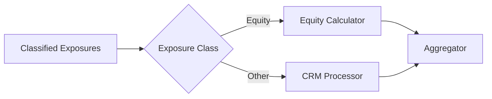

# Equity Exposures

**Equity exposures** receive dedicated risk weight treatment separate from credit risk. Under CRR, the calculator supports SA (Article 133) and IRB Simple (Article 155). Under Basel 3.1, only SA applies.

## Overview

Equity exposures are routed directly from classification to the equity calculator, bypassing CRM processing (collateral is not applied to equity holdings).


```mermaid
flowchart LR
    A[Classified Exposures] --> B{Exposure Class}
    B -->|Equity| C[Equity Calculator]
    B -->|Other| D[CRM Processor]
    C --> E[Aggregator]
    D --> E
```

## CRR Article 133 - Standardised Approach (SA)

Under CRR, Art. 133(2) assigns a **flat 100% risk weight** to all equity exposures (except central bank sovereign equity at 0%). There is no differentiation by equity type — listed, unlisted, PE, and speculative all receive 100%.

| Equity Type | Risk Weight | Reference |
|-------------|-------------|-----------|
| Central bank / sovereign equity | 0% | Sovereign treatment |
| All other equity (listed, unlisted, PE, etc.) | 100% | Art. 133(2) flat |

Under Basel 3.1, equity that is unlisted and where the business has existed for less than five years is classified as "higher-risk" (400%, Art. 133(4)). PE/VC is only higher-risk if it meets both criteria — long-established PE holdings receive standard 250%.

!!! warning "Common Confusion: CRR vs Basel 3.1 Art. 133"
    CRR Art. 133 assigns a flat 100% to all equity. **Basel 3.1** rewrites Art. 133 with differentiated weights: 250% (standard), 400% (higher risk), 150% (subordinated debt), 100% (legislative). Do not confuse the two. See the [Equity Approach Specification](../../specifications/crr/equity-approach.md) for full details including CIU treatment and the Basel 3.1 transitional schedule.

**Calculation:**
```
RWA = EAD x Risk Weight
```

## Article 155 - IRB Simple Risk Weight Method

For firms with IRB permission, a different risk weight schedule applies:

| Equity Type | Risk Weight | Reference |
|-------------|-------------|-----------|
| Exchange-traded / Listed | 290% | Art. 155(2)(a) |
| Private equity (diversified portfolios) | 190% | Art. 155(2)(b) |
| All other equity (unlisted, speculative, CIU, other) | 370% | Art. 155(2)(c) |

!!! warning "Art. 155 has exactly three categories"
    CRR Art. 155(2) defines only the three risk weight buckets shown above. The code additionally maps `GOVERNMENT_SUPPORTED` and `CENTRAL_BANK` equity types to 190% and 0% respectively — these are implementation-specific mappings with no direct basis in Art. 155 text. Government-supported equity at 100% under SA (Art. 133) is a legislative programme treatment, not an IRB Simple category. See [D3.4 in DOCS_IMPLEMENTATION_PLAN.md](../../../DOCS_IMPLEMENTATION_PLAN.md) and the [Equity Approach Specification](../../specifications/crr/equity-approach.md#crr-irb-simple-risk-weight-method-art-155) for details.

### Diversified Portfolio Treatment

Private equity holdings in a diversified portfolio receive a reduced risk weight of **190%** (vs 370% for non-diversified). This is flagged via the `is_diversified_portfolio` attribute.

!!! note "CRR Only"
    The IRB Simple Risk Weight Method (Article 155) applies only under CRR. Under Basel 3.1, all equity exposures use Article 133 SA treatment.

## Approach Determination

The equity approach depends on the regulatory framework and IRB permissions:

| Framework | IRB Permission | Equity Approach |
|-----------|----------------|-----------------|
| CRR | SA only | Article 133 (SA) |
| CRR | IRB permitted | Article 155 (IRB Simple) |
| Basel 3.1 | Any | Article 133 (SA) — IRB equity removed |

## Example

**Equity holding:** Listed shares, £2m

**SA Treatment (Article 133):**
```
RWA = £2,000,000 x 100% = £2,000,000
```

**IRB Simple Treatment (Article 155):**
```
RWA = £2,000,000 x 290% = £5,800,000
```

## Regulatory References

| Topic | Reference |
|-------|-----------|
| SA equity treatment | CRR Art. 133 |
| IRB simple risk weight | CRR Art. 155 |
| Strategic equity treatment | EBA Q&A 2023_6716 |
