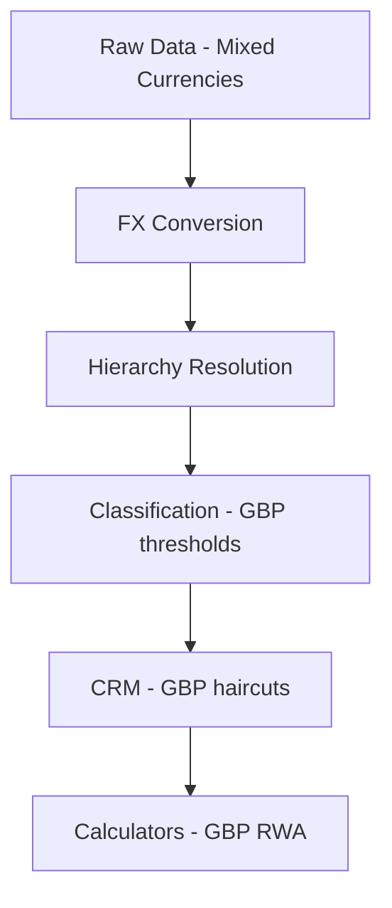

# FX Conversion

The calculator supports **multi-currency portfolios** by converting all monetary values to a base currency (GBP by default) before performing calculations.

## Why FX Conversion Matters

Regulatory thresholds (SME turnover, retail exposure limits) are defined in EUR or GBP. Without consistent currency conversion, exposures in foreign currencies would be incorrectly assessed against these thresholds.

## What Gets Converted

| Data Type | Converted Fields |
|-----------|-----------------|
| Exposures | Drawn amount, undrawn amount, nominal amount |
| Collateral | Market value, nominal value |
| Guarantees | Covered amount |
| Provisions | Provision amount |

## Configuration

FX conversion is controlled via `CalculationConfig`:

```python
from rwa_calc.contracts.config import CalculationConfig
from datetime import date

# FX conversion enabled by default
config = CalculationConfig.crr(
    reporting_date=date(2026, 12, 31),
    base_currency="GBP",           # Target currency
    apply_fx_conversion=True,      # Enable/disable
)
```

## Input Data

FX rates are provided via the `fx_rates` input table:

| Column | Type | Description |
|--------|------|-------------|
| `source_currency` | String | Currency code (e.g., "USD", "EUR") |
| `target_currency` | String | Target currency (must match `base_currency`) |
| `rate` | Float | Exchange rate (source to target) |

### Example FX Rates

```python
fx_rates = pl.DataFrame({
    "source_currency": ["USD", "EUR", "CHF"],
    "target_currency": ["GBP", "GBP", "GBP"],
    "rate": [0.79, 0.87, 0.89],
})
```

## Pipeline Integration

FX conversion occurs **early** in the pipeline, during hierarchy resolution, so that all downstream calculations (threshold checks, collateral haircuts, RWA) use consistent GBP values.



## Audit Trail

The converter preserves original values for audit:

| Audit Field | Description |
|-------------|-------------|
| `original_currency` | Currency before conversion |
| `original_amount` | Amount before conversion |
| `fx_rate_applied` | Rate used for conversion |

## Missing FX Rates

If a currency's FX rate is not provided:
- Values are left unchanged (not converted)
- `fx_rate_applied` is set to `null`
- No error is raised (graceful handling)

## Regulatory Thresholds

Key thresholds that depend on correct FX conversion:

| Threshold | EUR Value | GBP Equivalent |
|-----------|-----------|----------------|
| SME turnover | EUR 50m | ~GBP 43.7m |
| SME exposure (SF tier) | EUR 2.5m | ~GBP 2.2m |
| Retail aggregate | EUR 1m | ~GBP 880k |
| QRRE individual | EUR 100k | ~GBP 100k |

The EUR-to-GBP rate is configurable and defaults to 0.8732.
