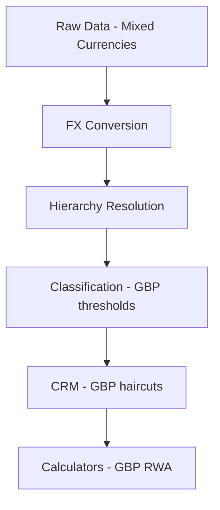

# FX Conversion

The calculator supports **multi-currency portfolios** by converting all monetary values to a base currency (GBP by default) before performing calculations.

## Why FX Conversion Matters

Regulatory thresholds (SME turnover, retail exposure limits) are defined in EUR or GBP. Without consistent currency conversion, exposures in foreign currencies would be incorrectly assessed against these thresholds.

## What Gets Converted

| Data Type | Converted Fields |
|-----------|-----------------|
| Exposures | Drawn amount, undrawn amount, nominal amount |
| Collateral | Market value, nominal value |
| Guarantees | Covered amount |
| Provisions | Provision amount |

## Configuration

FX conversion is controlled via `CalculationConfig`:

```python
from rwa_calc.contracts.config import CalculationConfig
from datetime import date

# FX conversion enabled by default (base_currency is always GBP)
config = CalculationConfig.crr(
    reporting_date=date(2026, 12, 31),
    apply_fx_conversion=True,      # Enable/disable
)
```

## Input Data

FX rates are provided via the `fx_rates` input table:

| Column | Type | Description |
|--------|------|-------------|
| `currency_from` | String | Currency code (e.g., "USD", "EUR") |
| `currency_to` | String | Target currency (must match `base_currency`) |
| `rate` | Float | Exchange rate (source to target) |

### Example FX Rates

```python
fx_rates = pl.DataFrame({
    "currency_from": ["USD", "EUR", "CHF"],
    "currency_to": ["GBP", "GBP", "GBP"],
    "rate": [0.79, 0.87, 0.89],
})
```

## Pipeline Integration

FX conversion occurs **early** in the pipeline, during hierarchy resolution, so that all downstream calculations (threshold checks, collateral haircuts, RWA) use consistent GBP values.


```mermaid
flowchart TD
    A[Raw Data - Mixed Currencies] --> B[FX Conversion]
    B --> C[Hierarchy Resolution]
    C --> D[Classification - GBP thresholds]
    D --> E[CRM - GBP haircuts]
    E --> F[Calculators - GBP RWA]
```

## Audit Trail

The converter preserves original values for audit:

| Audit Field | Description |
|-------------|-------------|
| `original_currency` | Currency before conversion |
| `original_amount` | Amount before conversion |
| `fx_rate_applied` | Rate used for conversion |

## Missing FX Rates

If a currency's FX rate is not provided:
- Values are left unchanged (not converted)
- `fx_rate_applied` is set to `null`
- No error is raised (graceful handling)

## Regulatory Thresholds

Key thresholds that depend on correct FX conversion:

| Threshold | EUR Value | GBP Equivalent |
|-----------|-----------|----------------|
| SME turnover | EUR 50m | ~GBP 43.7m |
| SME exposure (SF tier) | EUR 2.5m | ~GBP 2.18m |
| Retail aggregate (CRR) | EUR 1m | ~GBP 873k (at 0.8732) |
| QRRE individual | EUR 100k | ~GBP 100k |

The EUR-to-GBP rate is configurable and defaults to 0.8732.

!!! note "Basel 3.1 Fixed GBP Thresholds"
    Under Basel 3.1 (PRA PS1/26), the retail aggregate threshold is replaced with a fixed
    **GBP 880,000** (Art. 123(1)(b)(ii)) and the QRRE individual limit with **GBP 90,000**
    (Art. 147(5A)(c)). These do not require FX conversion. The table above applies to CRR only.

## Auto-sync of `eur_gbp_rate` from the FX table

`config.eur_gbp_rate` has two separate uses under CRR:

1. Deriving GBP equivalents of EUR regulatory thresholds (`RegulatoryThresholds.crr`).
2. Converting GBP turnover to EUR inside the IRB SME correlation formula (CRR Art. 153(4)).

Exposure/collateral/guarantee/provision **amounts** are converted using the loaded `fx_rates` table (above). Historically, these two mechanisms did not talk to each other — a user could load an up-to-date `fx_rates.parquet` with `(EUR, GBP, 0.90)` and get all amounts converted at 0.90 while the SME correlation and derived GBP thresholds silently continued to use the default 0.8732.

The pipeline now auto-syncs `config.eur_gbp_rate` with the loaded table:

- If the `fx_rates` input contains exactly one `(currency_from="EUR", currency_to="GBP")` row, the orchestrator replaces `config.eur_gbp_rate` with that value and rebuilds `config.thresholds` (`RegulatoryThresholds.crr(eur_gbp_rate=...)`).
- If the passed-in rate and the table rate differ, a `WARNING` is logged on `rwa_calc.engine.pipeline` naming both values, so the mismatch is visible in the audit trail.
- If the table contains more than one `(EUR, GBP)` row, a `WARNING` is logged on `rwa_calc.engine.fx_rate_sync` and the auto-sync is skipped — the caller's rate stands.
- Under Basel 3.1, this is a no-op (thresholds are GBP-native per PRA PS1/26 Art. 153(4)).

### Opting out

If you want the rate you pass into `CalculationConfig.crr(eur_gbp_rate=...)` to win unconditionally (regardless of the FX table contents), set the `sync_eur_gbp_rate_from_fx_table` flag to `False`:

```python
from dataclasses import replace

config = replace(
    CalculationConfig.crr(
        reporting_date=date(2026, 12, 31),
        eur_gbp_rate=Decimal("0.8732"),
    ),
    sync_eur_gbp_rate_from_fx_table=False,
)
```

No `WARNING` is emitted in this mode, and the derived thresholds stay pinned to the rate you supplied.
