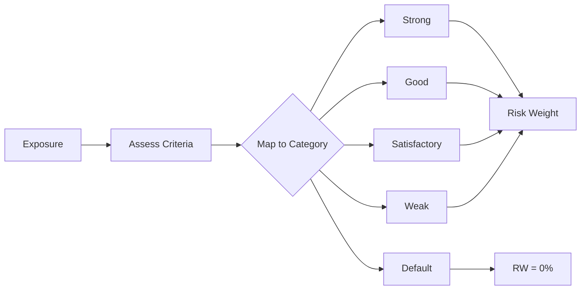

# Specialised Lending

**Specialised Lending** exposures are those where repayment depends primarily on the cash flows generated by the financed assets rather than the independent capacity of the borrower. These exposures receive special treatment under both SA and IRB frameworks.

## Overview

Specialised lending categories:

| Category | Abbreviation | Description |
|----------|--------------|-------------|
| Project Finance | PF | Financing of large, complex projects |
| Object Finance | OF | Financing of physical assets (ships, aircraft) |
| Commodities Finance | CF | Structured financing of commodities |
| Income-Producing Real Estate | IPRE | Real estate with rental/sale income |
| High Volatility Commercial Real Estate | HVCRE | Speculative CRE development |

## Slotting Approach

The **Slotting Approach** maps exposures to supervisory categories based on qualitative criteria, rather than estimating PD:



## Slotting Categories

### Assessment Criteria

Each exposure is assessed against supervisory criteria:

| Factor | Strong | Good | Satisfactory | Weak |
|--------|--------|------|--------------|------|
| **Financial strength** | Excellent | Good | Acceptable | Deteriorating |
| **Political/legal** | Very low | Low | Acceptable | High |
| **Transaction characteristics** | Very favorable | Favorable | Acceptable | Unfavorable |
| **Asset strength** | Very strong | Strong | Adequate | Weak |
| **Sponsor strength** | Excellent | Good | Adequate | Weak |

### Project Finance Criteria

| Factor | Strong | Good | Satisfactory | Weak |
|--------|--------|------|--------------|------|
| Market conditions | Few competing suppliers | Few suppliers, demand stable | Average | Weak or declining |
| Financial ratios | Strong coverage | Good coverage | Adequate | Weak |
| Stress resilience | Robust | Good | Limited | Poor |
| Contractual arrangements | Strong contracts | Acceptable | Some weaknesses | Significant gaps |
| Reserve accounts | Comprehensive | Adequate | Minimum | Insufficient |

### IPRE Criteria

| Factor | Strong | Good | Satisfactory | Weak |
|--------|--------|------|--------------|------|
| LTV | <60% | 60-75% | 75-85% | >85% |
| DSCR | >1.35x | 1.2-1.35x | 1.0-1.2x | <1.0x |
| Location | Prime | Good | Acceptable | Weak |
| Tenant quality | Strong | Adequate | Variable | Poor |
| Lease length | Long-term | Medium-term | Short-term | Month-to-month |

## Risk Weights

### CRR Risk Weights

Under CRR Art. 153(5), risk weights are differentiated by HVCRE status and remaining maturity:

**Non-HVCRE (PF, OF, CF, IPRE):**

| Category | Maturity >= 2.5yr | Maturity < 2.5yr |
|----------|-------------------|------------------|
| Strong | 70% | 50% |
| Good | 90% | 70% |
| Satisfactory | 115% | 115% |
| Weak | 250% | 250% |
| Default | 0% | 0% |

**HVCRE:**

| Category | Maturity >= 2.5yr | Maturity < 2.5yr |
|----------|-------------------|------------------|
| Strong | 95% | 70% |
| Good | 120% | 95% |
| Satisfactory | 140% | 140% |
| Weak | 250% | 250% |
| Default | 0% | 0% |

### Basel 3.1 Risk Weights

Basel 3.1 replaces the maturity-based split with three distinct tables:

| Category | Standard (Operational) | PF Pre-Operational | HVCRE |
|----------|----------------------|-------------------|-------|
| Strong | 70% | **80%** | 95% |
| Good | 90% | **100%** | 120% |
| Satisfactory | 115% | **120%** | 140% |
| Weak | 250% | **350%** | 250% |
| Default | 0% | 0% | 0% |

!!! note "Basel 3.1 Project Finance Changes"
    Pre-operational project finance receives higher risk weights under Basel 3.1,
    reflecting the construction risk premium. Other non-HVCRE types use the same
    standard weights as CRR (at the >= 2.5yr maturity level).

## Defaulted Exposures

Defaulted specialised lending exposures receive a 0% risk weight (RWA = 0). Expected loss treatment is handled separately via the provisions and EL comparison framework (see [Provisions](../../specifications/crr/provisions.md)).

## Calculation Example

**Exposure:**
- IPRE loan, £20m
- LTV: 65%
- DSCR: 1.25x
- Prime location
- Strong tenant
- Category assessment: **Good**
- Non-HVCRE, maturity >= 2.5 years

**CRR Calculation:**
```python
# Category: Good, Non-HVCRE, >= 2.5yr
Risk_Weight = 90%

# RWA
RWA = EAD × Risk_Weight
RWA = £20,000,000 × 90%
RWA = £18,000,000
```

**Basel 3.1 Calculation:**
```python
# Standard (Operational) Good = 90% (same as CRR >= 2.5yr)
RWA = £20,000,000 × 90%
RWA = £18,000,000
```

## SA Alternative

Specialised lending can also be treated under SA when the slotting approach is not used:

| Type | SA Treatment |
|------|--------------|
| Project Finance | Corporate risk weights |
| Object Finance | Corporate risk weights |
| Commodities Finance | Corporate risk weights |
| IPRE | CRE risk weights |
| HVCRE | CRE risk weights |

**When to use SA vs Slotting:**

| Use SA when | Use Slotting when |
|-------------|-------------------|
| External rating available | No PD estimate available |
| IRB not approved | IRB approved for portfolio |
| Lower SA RW expected | Specialized assessment needed |

## Implementation

### Slotting Calculator

```python
from rwa_calc.engine.slotting.calculator import SlottingCalculator
from rwa_calc.contracts.config import CalculationConfig

calculator = SlottingCalculator()

# calculate() takes a CRMAdjustedBundle and returns LazyFrameResult
result = calculator.calculate(
    data=crm_adjusted_bundle,
    config=CalculationConfig.crr(reporting_date=date(2026, 12, 31))
)

# result.frame is a LazyFrame, result.errors is list[CalculationError]
rwa_df = result.frame.collect()
```

For single-exposure calculations, build a single-row LazyFrame and call
`calculate_branch()`:

```python
import polars as pl

df = pl.DataFrame({
    "exposure_reference": ["EX1"],
    "ead": [20_000_000.0],
    "slotting_category": ["good"],
    "is_hvcre": [False],
    "is_short_maturity": [False],
    "is_pre_operational": [False],
}).lazy()

result = calculator.calculate_branch(
    df, CalculationConfig.crr(reporting_date=date(2026, 12, 31))
).collect().to_dicts()[0]
# result["rwa"] -> 18_000_000.0
```

### Risk Weight Lookup

```python
from rwa_calc.data.tables.crr_slotting import lookup_slotting_rw
from rwa_calc.domain.enums import SlottingCategory

# Non-HVCRE, standard maturity (>= 2.5yr)
rw = lookup_slotting_rw(category=SlottingCategory.GOOD)
# Returns: Decimal('0.90')

# HVCRE
rw = lookup_slotting_rw(category=SlottingCategory.GOOD, is_hvcre=True)
# Returns: Decimal('1.20')

# Short maturity (< 2.5yr)
rw = lookup_slotting_rw(category=SlottingCategory.STRONG, is_short_maturity=True)
# Returns: Decimal('0.50')
```

## Project Finance Detail

### Pre-Operational Phase

Project is in construction or commissioning:
- Construction risk present
- Cash flows not yet established
- Higher risk weights under Basel 3.1

### Operational Phase

Project is generating cash flows:
- Construction complete
- Revenue stream established
- Standard slotting weights apply

### Phase Transition

```python
# Basel 3.1 applies different weights for PF pre-operational
if framework == "BASEL_3_1" and lending_type == "PROJECT_FINANCE":
    if phase == "pre_operational":
        # Use higher pre-op weights
        weights = {"strong": 0.80, "good": 1.00, "satisfactory": 1.20, "weak": 3.50}
    else:
        # Use standard operational weights
        weights = {"strong": 0.70, "good": 0.90, "satisfactory": 1.15, "weak": 2.50}
```

## HVCRE Treatment

**High Volatility Commercial Real Estate** receives higher risk weights due to:
- Speculative development
- No established cash flows
- Higher correlation to economic cycles

**HVCRE Criteria:**
- CRE development or land acquisition
- Repayment from future sale or refinancing
- Uncertain outcome

**Risk Weight Comparison:**

| Category | CRR Non-HVCRE (>=2.5yr) | CRR HVCRE (>=2.5yr) | Basel 3.1 HVCRE |
|----------|------------------------|---------------------|-----------------|
| Strong | 70% | 95% | 95% |
| Good | 90% | 120% | 120% |
| Satisfactory | 115% | 140% | 140% |
| Weak | 250% | 250% | 250% |

## Supporting Factors

Infrastructure project finance may qualify for the **0.75 infrastructure supporting factor** under CRR (Art. 501a). This factor is applied by the `SupportingFactorCalculator` after slotting risk weights are determined, not within the slotting engine itself.

See [Supporting Factors](supporting-factors.md) for eligibility criteria and application details.

!!! warning "Basel 3.1"
    Infrastructure factor is **removed** under Basel 3.1.

## Regulatory References

| Topic | CRR Article | BCBS CRE |
|-------|-------------|----------|
| Specialised lending definition | Art. 147(8) | CRE33.1 |
| Slotting categories | Art. 153(5) | CRE33.2 |
| Risk weights | Art. 153(5) | CRE33.3-4 |
| HVCRE | Art. 153(5) | CRE33.5 |
| Infrastructure factor | Art. 501a | N/A |

## Next Steps

- [Credit Risk Mitigation](crm.md) - CRM for specialised lending
- [Supporting Factors](supporting-factors.md) - Infrastructure factor details
