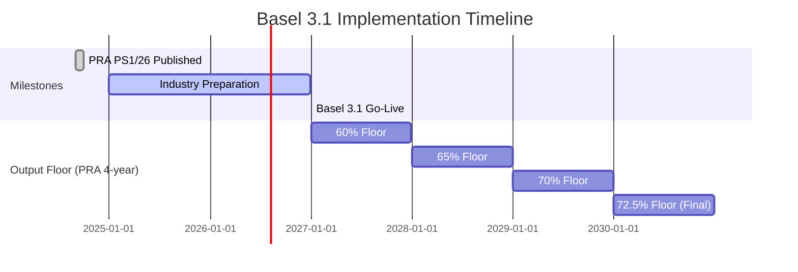

# Basel 3.1

**Basel 3.1** represents a significant overhaul of credit risk capital requirements, implemented in the UK through PRA PS1/26. It becomes effective on **1 January 2027**.

## Legal Basis

| Document | Reference |
|----------|-----------|
| Primary Policy | PRA PS1/26 (Final Rules) |
| Consultation | PRA CP16/22 (superseded) |
| Basel Standards | BCBS CRE20-CRE99 |

## Key Changes from CRR

### 1. Removal of 1.06 Scaling Factor

The 1.06 multiplier applied to all IRB RWA is removed:

=== "CRR"

    ```
    RWA = K × 12.5 × EAD × MA × 1.06
    ```

=== "Basel 3.1"

    ```
    RWA = K × 12.5 × EAD × MA
    ```

!!! info "Impact"
    This reduces IRB RWA by approximately 5.7% before other Basel 3.1 changes.

### 2. Output Floor

An **output floor** ensures IRB RWA cannot fall below **72.5%** of the equivalent SA RWA:

```
RWA_final = max(RWA_IRB, 0.725 × RWA_SA_equivalent)
```

**Transitional Phase-In:**

| Year | Floor Percentage |
|------|------------------|
| 2027 | 60% |
| 2028 | 65% |
| 2029 | 70% |
| 2030+ | 72.5% |

Note: The PRA compressed the BCBS 6-year phase-in to 4 years.
Art. 92 para 5: transitional rates are permissive — firms may use 72.5% from day one.

!!! warning "Impact"
    For exposures with significant IRB benefit (RWA_IRB < 72.5% × RWA_SA), this floor will increase capital requirements.

### 3. Removal of Supporting Factors

All CRR supporting factors are withdrawn:

| Factor | CRR | Basel 3.1 |
|--------|-----|-----------|
| SME Supporting Factor | 0.7619/0.85 | **Removed** |
| Infrastructure Factor | 0.75 | **Removed** |

### 4. Differentiated PD Floors

PD floors vary by exposure class instead of a uniform 0.03%:

| Exposure Class | CRR PD Floor | Basel 3.1 PD Floor |
|----------------|--------------|-------------------|
| Corporate | 0.03% | **0.05%** |
| Large Corporate | 0.03% | **0.05%** |
| Bank | 0.03% | **0.05%** |
| Retail Mortgage | 0.03% | **0.10%** |
| Retail QRRE (transactor) | 0.03% | **0.05%** |
| Retail QRRE (revolver) | 0.03% | **0.10%** |
| Retail Other | 0.03% | **0.05%** |

### 5. A-IRB LGD Floors

New minimum LGD values for Advanced IRB. Corporate and retail floors are defined separately:

**Corporate / Institution (Art. 161(5)):**

| Collateral Type | LGD Floor |
|-----------------|-----------|
| Unsecured | 25% |
| Secured - Financial Collateral | 0% |
| Secured - Receivables | 10%* |
| Secured - Commercial Real Estate | 10%* |
| Secured - Residential Real Estate | 10%* |
| Secured - Other Physical | 15%* |

!!! note "No senior/subordinated distinction"
    Art. 161(5)(a) sets a flat 25% floor for **all** corporate unsecured exposures (both senior and subordinated). The 50% floor applies only to retail QRRE unsecured (Art. 164(4)(b)(i)), not corporate subordinated debt.

**Retail (Art. 164(4)):**

| Exposure Type | LGD Floor |
|---------------|-----------|
| Secured by residential RE | 5% |
| QRRE unsecured | 50% |
| Other unsecured retail | 30% |

*Values reflect PRA PS1/26 implementation. BCBS standard values differ (Receivables: 15%, CRE: 10%, RRE: 10%, Other Physical: 20%).

### 6. F-IRB Supervisory LGD Changes (CRE32)

Basel 3.1 recalibrates F-IRB supervisory LGD values:

| Exposure Type | CRR | Basel 3.1 |
|---------------|-----|-----------|
| Corporate/Institution (Senior) | 45% | **40%** |
| Corporate/Institution (Subordinated) | 75% | **75%** |
| Secured - Financial Collateral | 0% | **0%** |
| Secured - Receivables | 35% | **20%** |
| Secured - CRE/RRE | 35% | **20%** |
| Secured - Other Physical | 40% | **25%** |

### 7. Revised SA Risk Weights

Standardised Approach risk weights are recalibrated:

#### Corporate Exposures

| CQS | CRR | Basel 3.1 |
|-----|-----|-----------|
| CQS 1 (AAA to AA-) | 20% | 20% |
| CQS 2 (A+ to A-) | 50% | 50% |
| CQS 3 (BBB+ to BBB-) | 100% | **75%** |
| CQS 4 (BB+ to BB-) | 100% | 100% |
| CQS 5 (B+ to B-) | 150% | 150% |
| CQS 6 (CCC+/Below) | 150% | 150% |
| Unrated | 100% | 100% |

!!! note "PRA vs BCBS Deviation for CQS 5"
    BCBS CRE20.42 reduced CQS 5 from 150% to 100%. PRA PS1/26 Art. 122(2) Table 6 **retains CQS 5 at 150%**.

#### New Corporate Sub-Categories (Art. 122(6)–(11))

| Sub-Category | Risk Weight | Criteria |
|-------------|-------------|----------|
| Investment Grade (Art. 122(6)(a)) | **65%** | Unrated, institution IG assessment, PRA permission required |
| Non-Investment Grade (Art. 122(6)(b)) | **135%** | Unrated, assessed as non-IG, PRA permission required |
| SME Corporate (Art. 122(11)) | **85%** | Turnover ≤ EUR 50m, unrated |

!!! note "PRA Permission Required"
    The 65%/135% split requires **prior PRA permission** (Art. 122(6)). Without it, all
    unrated non-SME corporates receive 100% (Art. 122(5)). "Investment grade" is determined
    by the institution's own internal assessment (Art. 122(9)–(10)), not external ratings.
    For IRB output floor S-TREA (Art. 122(8)), firms may elect the 65%/135% split or flat 100%.

#### Real Estate Exposures

New risk weight approaches for real estate:

**General Residential Real Estate — Loan-Splitting (PRA Art. 124F):**

The PRA adopted loan-splitting for general residential (not income-dependent):

- Secured portion (up to **55% of property value**) → **20%** risk weight
- Residual → **counterparty risk weight** (75% for individuals per Art. 124L,
  85% for non-retail SME, or the unsecured corporate RW)

!!! note "PRA vs BCBS"
    The BCBS standard (CRE20.73) offers both whole-loan and loan-splitting approaches.
    The PRA mandated loan-splitting. This produces continuous risk weights that increase
    with LTV rather than discrete bands.

**Income-Producing Residential Real Estate — Whole-Loan (PRA Art. 124G, Table 6B):**

| LTV | Income-Producing RW |
|-----|---------------------|
| ≤ 50% | 30% |
| 50-60% | 35% |
| 60-70% | 40% |
| 70-80% | 50% |
| 80-90% | 60% |
| 90-100% | 75% |
| > 100% | 105% |

**Commercial Real Estate — Income-Producing (PRA Art. 124I):**

| LTV | Income-Producing RW |
|-----|---------------------|
| ≤ 80% | 100% |
| > 80% | 110% |

!!! warning "PRA vs BCBS deviation"
    BCBS CRE20.86 uses a 3-band table (≤60%: 70%, 60–80%: 90%, >80%: 110%).
    The PRA simplified this to a **2-band table** in Art. 124I.

**Junior Charge Multiplier (Art. 124I(3)):** Where prior-ranking charges not held by the institution exist, multiply the base RW: ≤60% LTV = 1.0×, 60–80% = 1.25×, >80% = 1.375×.

#### ADC Exposures (CRE20.85)

Acquisition, Development and Construction exposures receive a **150%** risk weight (up from 100% under CRR).

#### Retail Exposures

| Type | CRR | Basel 3.1 | Change |
|------|-----|-----------|--------|
| Regulatory Retail QRRE | 75% | 75% | — |
| Regulatory Retail Transactor | 75% | **45%** | -30pp |
| Payroll / Pension Loans | 75% | **35%** | -40pp |
| Retail Other | 75% | 75% | — |

Transactor status requires full repayment of outstanding balance each billing cycle.
Payroll/pension loans are a new category for loans repaid directly from salary or pension.

#### Currency Mismatch Multiplier

For unhedged retail and residential real estate exposures where the lending currency differs from the
borrower's income currency, a **1.5x risk weight multiplier** applies (PRA PS1/26 Art. 123A /
CRE20.76). The effective risk weight is capped at 150%. This is distinct from the 8% FX collateral
haircut used in CRM (CRR Art. 224).

To trigger the multiplier, set `cp_borrower_income_currency` on each exposure. When it differs from
`currency`, the 1.5x multiplier is applied automatically and the `currency_mismatch_multiplier_applied`
output column is set to `True`. COREP memorandum row 0380 is populated from this flag.

#### Defaulted Exposures

Defaulted exposures receive a risk weight based on provision coverage (PRA PS1/26 Art. 127 /
CRE20.87-90). Where specific provisions are ≥20% of the unsecured exposure value, the risk weight
is **100%**; otherwise **150%**. When eligible collateral is present, the secured portion retains the
collateral-based risk weight and only the unsecured portion is subject to the provision test.

!!! note "Basel 3.1 Exception"
    Non-income-dependent residential real estate defaulted exposures receive a flat 100% risk weight
    regardless of provision level (CRE20.88 / Art. 127(1A)).

### 8. Input Floors for IRB

Beyond PD and LGD floors, Basel 3.1 introduces:

**EAD Floors:**
- CCF cannot be lower than SA values for comparable exposures
- A-IRB CCFs must be at least **50% of the SA CCF** (CRE32.27)
- Minimum 10% CCF for unconditionally cancellable facilities (vs 0% CRR)

**Maturity:**
- Effective maturity floor: 1 year
- Cap remains: 5 years

### 9. Financial Sector Entity Correlation Multiplier (CRE31.5)

**Large financial sector entities** (regulated FSEs with total assets > EUR 70bn per CRR Art. 4(1)(146)) and **unregulated financial sector entities** (regardless of size) receive a **1.25x** multiplier on their asset correlation (Art. 153(2) / CRE31.5). This increases capital requirements for exposures to financial institutions. The multiplier is unchanged between CRR and Basel 3.1.

!!! note "Not the same as the large corporate threshold"
    The 1.25x correlation multiplier applies to **financial sector entities** based on **total assets**, not to large non-financial corporates. The Art. 147A large corporate threshold (revenue > £440m) is an **approach restriction** (F-IRB only) — it does not trigger the correlation uplift. See the [IRB restrictions table](#irb-restrictions) below.

### 10. Due Diligence Requirements

Enhanced requirements for unrated exposures:
- Institutions must perform internal assessment
- Risk weight based on assessment quality
- Documentation requirements

## Risk Weight Tables (Basel 3.1)

### Sovereign Exposures

| CQS | Risk Weight |
|-----|-------------|
| CQS 1 | 0% |
| CQS 2 | 20% |
| CQS 3 | 50% |
| CQS 4 | 100% |
| CQS 5 | 100% |
| CQS 6 | 150% |
| Unrated | 100% |

!!! note "No OECD bifurcation"
    PRA PS1/26 Art. 114(1) assigns a flat 100% risk weight to all unrated sovereign
    exposures. The Basel I/II approach of 0% for OECD sovereigns and 100% for
    non-OECD sovereigns was replaced by ECAI-based credit assessments in the EU CRR
    and is not carried forward. The UK domestic currency exemption (Art. 114(4):
    UK Government/Bank of England in GBP = 0%) is a separate provision, not an
    OECD-based rule.

### Institution Exposures

External Credit Risk Assessment Approach (ECRA):

| CQS | Risk Weight |
|-----|-------------|
| CQS 1 | 20% |
| CQS 2 | 30% |
| CQS 3 | 50% |
| CQS 4 | 100% |
| CQS 5 | 100% |
| CQS 6 | 150% |

Standardised Credit Risk Assessment Approach (SCRA):

| Grade | Risk Weight (>3m) | Risk Weight (≤3m) | Criteria |
|-------|-------------------|-------------------|----------|
| A | 40% | 20% | Meets all minimum requirements + buffers |
| A (enhanced) | 30% | 20% | CET1 ≥ 14% AND leverage ratio ≥ 5% |
| B | 75% | 50% | CET1 ≥ 5.5%, Leverage ≥ 3% |
| C | 150% | 150% | Below minimum requirements |

!!! info "SCRA Grade A vs A (enhanced)"
    Standard Grade A (40%) requires a qualitative assessment that the institution meets all
    minimum capital requirements plus applicable buffers. Grade A enhanced (30%) additionally
    requires quantitative thresholds: CET1 ratio ≥ 14% and leverage ratio ≥ 5%
    (Art. 120(2A), CRE20.19).

### Subordinated Debt

| Instrument Type | Risk Weight |
|-----------------|-------------|
| Subordinated debt instruments | 150% |

### Equity Exposures

Basel 3.1 significantly increases equity risk weights and removes IRB for equity (SA only).

| Equity Type | Risk Weight (Fully Phased) |
|-------------|---------------------------|
| Standard listed equities | **250%** |
| Higher-risk equities (unlisted, < 5 years) | **400%** |
| Speculative / venture capital | **400%** |

**Transitional phase-in schedule:**

| Year | Standard | Higher-Risk |
|------|----------|-------------|
| 2027 | 160% | 220% |
| 2028 | 190% | 280% |
| 2029 | 220% | 340% |
| 2030+ | 250% | 400% |

Under CRR, standard equities receive 100%, with some categories at 250% or 400%.
The phase-in allows firms to gradually adjust to the higher capital requirements.

## IRB Restrictions

Basel 3.1 restricts IRB usage for certain exposures (Art. 147A). For some classes,
all IRB approaches are removed (SA only). For others, only A-IRB is removed
(F-IRB with supervisory LGD remains):

| Exposure Type | Allowed Approaches |
|---------------|-------------------|
| Central Govts, Central Banks & Quasi-Sovereigns | SA only |
| Large Corporate (>£440m) | SA or F-IRB only |
| Financial Sector Entities | SA or F-IRB only |
| Bank/Institution | SA or F-IRB only |
| Equity | SA only |
| IPRE / HVCRE (Specialised Lending) | SA or Slotting only |
| Other SL (Object/Project/Commodities) | SA, F-IRB, A-IRB, or Slotting |

**IRB 10% RW floor for UK residential mortgages (PRA-specific):**
Non-defaulted retail exposures secured by UK residential property must have a minimum risk weight
of **10%** under IRB, regardless of model output. This is applied as a post-model adjustment.

## CRM Changes

### Haircuts

Supervisory haircuts are recalibrated under Basel 3.1 (CRE22.52-53), with significant increases
for equities and long-dated bonds. Maturity bands expand from 3 (CRR) to 5 (Basel 3.1).

**Key changes:**

| Collateral Type | CRR Haircut | Basel 3.1 Haircut | Change |
|-----------------|-------------|-------------------|--------|
| Main index equities | 15% | **20%** | +5pp |
| Other listed equities | 25% | **30%** | +5pp |
| Gold | 15% | **20%** | +5pp |
| Cash | 0% | 0% | — |
| Govt bonds CQS 2-3 (10y+) | 6% | **12%** | +6pp |
| Corp bonds CQS 1 (5-10y) | 8% | **10%** | +2pp |
| Corp bonds CQS 1 (10y+) | 8% | **12%** | +4pp |
| Corp bonds CQS 2-3 (5-10y) | 12% | **15%** | +3pp |
| Corp bonds CQS 2-3 (10y+) | 12% | **15%** | +3pp |

**Maturity band expansion:** CRR uses 3 bands (0-1y, 1-5y, 5y+). Basel 3.1 splits the longer
bands into 5: 0-1y, 1-3y, 3-5y, 5-10y, 10y+. Short-dated haircuts (0-1y) are unchanged.

### CRM Method Taxonomy

Basel 3.1 restructures CRM methods with clearer names and applicability:

| Method | Applies To | Replaces |
|--------|-----------|----------|
| Financial Collateral Simple Method | SA only | CRR Art. 222 |
| Financial Collateral Comprehensive Method | SA + IRB | CRR Art. 223 |
| Foundation Collateral Method | F-IRB | Scattered CRR IRB collateral provisions |
| Parameter Substitution Method | F-IRB (unfunded) | CRR Art. 236 |
| LGD Adjustment Method | A-IRB (unfunded) | CRR Art. 183 |

**Foundation Collateral Method overcollateralisation thresholds (Art. 230):**

| Collateral Type | Overcollateralisation Ratio | Minimum EAD Coverage |
|-----------------|----------------------------|---------------------|
| Financial | 1.0x | None |
| Receivables | 1.25x | None |
| Residential / Commercial RE | 1.4x | 30% |
| Other physical | 1.4x | 30% |

### Guarantee Recognition

- Unfunded credit protection maintained
- G-10 sovereign guarantees: 0% RW
- Covered bond issuer guarantees: Enhanced treatment
- **New requirement:** Unfunded credit protection must include "change of control" provisions
  (transitional relief for pre-2027 contracts until June 2028)

## Specialised Lending

Slotting remains available with updated risk weights:

| Category | Strong | Good | Satisfactory | Weak | Default |
|----------|--------|------|--------------|------|---------|
| Project Finance (Pre-Operational) | 80% | 100% | 120% | 350% | 0% (EL) |
| Project Finance (Operational) | 70% | 90% | 115% | 250% | 0% (EL) |
| Object Finance | 70% | 90% | 115% | 250% | 0% (EL) |
| Commodities Finance | 70% | 90% | 115% | 250% | 0% (EL) |
| IPRE | 70% | 90% | 115% | 250% | 0% (EL) |
| HVCRE | 95% | 120% | 140% | 250% | 0% (EL) |

### SA Specialised Lending (Art. 122A-122B)

Basel 3.1 introduces explicit SA risk weights for specialised lending, separate from slotting.
Unrated exposures use the type-specific weights below; rated exposures fall through to the standard
corporate CQS table per Art. 122A(3).

| Specialised Lending Type | Risk Weight |
|--------------------------|-------------|
| Object Finance | 100% |
| Commodities Finance | 100% |
| Project Finance (pre-operational) | **130%** |
| Project Finance (operational) | 100% |
| Project Finance (high-quality operational) | **80%** |

High-quality operational project finance requires: low LTV, strong revenue predictability,
contractual protections, and adequate refinancing capacity.

## Configuration Example

```python
from datetime import date
from rwa_calc.contracts.config import CalculationConfig

config = CalculationConfig.basel_3_1(
    reporting_date=date(2027, 1, 1),
)

# Internally sets:
# - scaling_factor: 1.0 (removed)
# - output_floor: 72.5% (with transitional schedule)
# - pd_floors: differentiated by class
# - lgd_floors: by collateral type
```

## Implementation Timeline



## Regulatory References

| Topic | Reference |
|-------|-----------|
| Output floor | CRE99 |
| SA risk weights | CRE20-22 |
| IRB approach | CRE30-36 |
| Real estate | CRE20.70-90 |
| PD/LGD floors | CRE32 |
| Specialised lending | CRE33 |
| Financial sector entity correlation | CRE31.5 |
| A-IRB CCF floor | CRE32.27 |

## Next Steps

- [CRR](crr.md) - Current framework
- [Framework Comparison](../../framework-comparison/index.md) - Side-by-side comparison
- [Calculation Methodology](../methodology/index.md) - How calculations work
