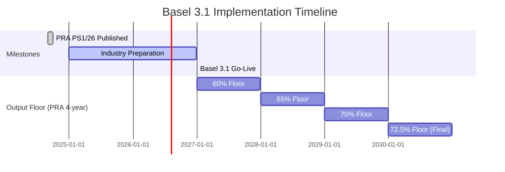

# Basel 3.1

**Basel 3.1** represents a significant overhaul of credit risk capital requirements, implemented in the UK through PRA PS1/26. It becomes effective on **1 January 2027**.

## Legal Basis

| Document | Reference |
|----------|-----------|
| Primary Policy | PRA PS1/26 (Final Rules) |
| Consultation | PRA CP16/22 (superseded) |
| Basel Standards | BCBS CRE20-CRE99 |

## Key Changes from CRR

### 1. Removal of 1.06 Scaling Factor

The 1.06 multiplier applied to all IRB RWA is removed:

=== "CRR"

    ```
    RWA = K × 12.5 × EAD × MA × 1.06
    ```

=== "Basel 3.1"

    ```
    RWA = K × 12.5 × EAD × MA
    ```

!!! info "Impact"
    This reduces IRB RWA by approximately 5.7% before other Basel 3.1 changes.

### 2. Output Floor

An **output floor** ensures IRB RWA cannot fall below **72.5%** of the equivalent SA RWA:

```
RWA_final = max(RWA_IRB, 0.725 × RWA_SA_equivalent)
```

**Transitional Phase-In:**

| Year | Floor Percentage |
|------|------------------|
| 2027 | 60% |
| 2028 | 65% |
| 2029 | 70% |
| 2030+ | 72.5% |

Note: The PRA compressed the BCBS 6-year phase-in to 4 years.
Art. 92 para 5: transitional rates are permissive — firms may use 72.5% from day one.

!!! warning "Impact"
    For exposures with significant IRB benefit (RWA_IRB < 72.5% × RWA_SA), this floor will increase capital requirements.

The full regulatory formula (Art. 92(2A)) is `TREA = max{U-TREA; x × S-TREA + OF-ADJ}`, where
OF-ADJ reconciles the different treatment of provisions under IRB and SA. The output floor also
does **not** apply to all entities — Art. 92(2A)(b)–(d) exempts certain entity/basis combinations
(e.g., non-ring-fenced institutions on sub-consolidated basis, international subsidiaries on
consolidated basis). See the
[Technical Reference](../../framework-comparison/technical-reference.md#output-floor-adjustment-of-adj)
for the OF-ADJ component formula and
[output floor spec](../../specifications/basel31/output-floor.md#entity-type-carve-outs) for the
full applicability table.

### 3. Removal of Supporting Factors

All CRR supporting factors are withdrawn:

| Factor | CRR | Basel 3.1 |
|--------|-----|-----------|
| SME Supporting Factor | 0.7619/0.85 | **Removed** |
| Infrastructure Factor | 0.75 | **Removed** |

### 4. Differentiated PD Floors

PD floors vary by exposure class instead of a uniform 0.03%:

| Exposure Class | CRR PD Floor | Basel 3.1 PD Floor |
|----------------|--------------|-------------------|
| Corporate | 0.03% | **0.05%** |
| Large Corporate | 0.03% | **0.05%** |
| Sovereign | 0.03% | **0.05%** |
| Institution | 0.03% | **0.05%** |
| Retail Mortgage | 0.03% | **0.10%** |
| Retail QRRE (transactor) | 0.03% | **0.05%** |
| Retail QRRE (revolver) | 0.03% | **0.10%** |
| Retail Other | 0.03% | **0.05%** |

!!! warning "Sovereign Row is Regulatory Dead Letter (Art. 147A(1)(a))"
    Sovereign exposures (Art. 147(2)(a)) are **restricted to the Standardised Approach** by
    Art. 147A(1)(a); PS1/26 provides no grandfathering or transitional carve-out for pre-existing
    sovereign IRB models. The 0.05% sovereign row is retained for completeness and CRR
    cross-reference only.

    Institutions (Art. 147(2)(b)) are capped at F-IRB by Art. 147A(1)(b) — A-IRB is unavailable,
    but F-IRB remains the default path. The 0.05% institution PD floor therefore applies normally
    to F-IRB institution exposures. See
    [IRB Approach Restrictions](../../framework-comparison/key-differences.md#irb-approach-restrictions)
    for the full Art. 147A(1) class mapping.

### 5. A-IRB LGD Floors

Basel 3.1 introduces **per-exposure input** LGD floors for Advanced IRB, replacing the CRR
Art. 164(4) portfolio-level mechanism (which required exposure-weighted average LGD ≥ 10% for
retail residential RE and ≥ 15% for retail commercial RE). Corporate and retail floors are
defined separately:

**Corporate / Institution (Art. 161(5)):**

| Collateral Type | LGD Floor |
|-----------------|-----------|
| Unsecured | 25% |
| Secured - Financial Collateral | 0% |
| Secured - Receivables | 10%* |
| Secured - Commercial Real Estate | 10%* |
| Secured - Residential Real Estate | 10%* |
| Secured - Other Physical | 15%* |

!!! note "No senior/subordinated distinction"
    Art. 161(5)(a) sets a flat 25% floor for **all** corporate unsecured exposures (both senior and subordinated). The 50% floor applies only to retail QRRE unsecured (Art. 164(4)(b)(i)), not corporate subordinated debt. Unlike F-IRB supervisory LGD, A-IRB LGD floors do not distinguish FSE from non-FSE.

**Retail (Art. 164(4)):**

| Exposure Type | Collateral | LGD Floor | Sub-paragraph |
|---------------|------------|-----------|---------------|
| Residential RE mortgage (flat) | RE secured | 5% | Art. 164(4)(a) |
| QRRE (transactor and revolver) | Unsecured | 50% | Art. 164(4)(b)(i) |
| Other retail | Unsecured | 30% | Art. 164(4)(b)(ii) |
| Other retail (LGDU in LGD* formula) | Partially unsecured | 30% | Art. 164(4)(c)(iii) |
| Other retail | Financial collateral | 0% | Art. 164(4)(c)(iv)(1) |
| Other retail | Receivables | 10%* | Art. 164(4)(c)(iv)(2) |
| Other retail | Immovable property (CRE / RRE as collateral) | 10%* | Art. 164(4)(c)(iv)(3) |
| Other retail | Other physical | 15%* | Art. 164(4)(c)(iv)(4) |

!!! info "Secured-retail blended floor (Art. 164(4)(c))"
    For retail exposures outside the flat-5% RRE-mortgage path, the LGD floor is the
    variable LGD\* produced by the Foundation Collateral Method (Art. 230 single-collateral
    or Art. 231 multi-collateral), substituting **LGDU = 30%** and the LGDS values above.
    Art. 164(4A) additionally requires Art. 193(7) multi-facility collateral allocation
    when the same collateral backs multiple facilities. See the
    [B31 A-IRB spec](../../specifications/basel31/airb-calculation.md#retail-a-irb-lgd-floors-art-1644)
    for the full formula and implementation detail.

*Values reflect PRA PS1/26 implementation. BCBS standard values differ (Receivables: 15%, CRE: 10%, RRE: 10%, Other Physical: 20%).

### 6. F-IRB Supervisory LGD Changes (Art. 161)

Basel 3.1 recalibrates F-IRB supervisory LGD values. Notably, senior unsecured LGD is now
differentiated by whether the counterparty is a **financial sector entity (FSE)**:

| Exposure Type | CRR | Basel 3.1 |
|---------------|-----|-----------|
| Financial Sector Entity (Senior) | 45% | **45%** |
| Other Corporate/Institution (Senior) | 45% | **40%** |
| Corporate/Institution (Subordinated) | 75% | **75%** |
| Covered Bonds | 11.25% | **11.25%** |
| Senior purchased corporate receivables | 45% | **40%** |
| Subordinated purchased corporate receivables | 100% | **100%** |
| Dilution risk | 75% | **100%** |
| Secured - Financial Collateral | 0% | **0%** |
| Secured - Receivables | 35% | **20%** |
| Secured - CRE/RRE | 35% | **20%** |
| Secured - Other Physical | 40% | **25%** |

!!! note "FSE Distinction — New in Basel 3.1"
    Art. 161(1)(aa) reduces the senior unsecured LGD from 45% to 40% for non-FSE corporates
    only. FSEs (banks, investment firms, insurance companies — Art. 4(1)(27)) retain 45% under
    Art. 161(1)(a), reflecting higher observed loss severity. The `is_financial_sector_entity`
    input flag drives this distinction. See the
    [F-IRB specification](../../specifications/basel31/firb-calculation.md#supervisory-lgd-art-161)
    for full detail.

!!! info "Covered Bond LGD — Value Unchanged"
    The 11.25% covered bond LGD already exists in CRR Art. 161(1)(d) for bonds eligible under
    Art. 129(4)/(5). Basel 3.1 restructures this into Art. 161(1B) with the same value.

!!! info "Purchased Receivables and Dilution (Art. 161(1)(e)–(g))"
    Art. 161(1)(e)/(f) apply where PD cannot be estimated for the purchased receivables pool.
    Senior aligns with the non-FSE rate (45% → 40%); subordinated remains at 100%.
    The dilution risk LGD increases from 75% to **100%** under Basel 3.1.

### 7. Revised SA Risk Weights

Standardised Approach risk weights are recalibrated:

#### Corporate Exposures

| CQS | CRR | Basel 3.1 |
|-----|-----|-----------|
| CQS 1 (AAA to AA-) | 20% | 20% |
| CQS 2 (A+ to A-) | 50% | 50% |
| CQS 3 (BBB+ to BBB-) | 100% | **75%** |
| CQS 4 (BB+ to BB-) | 100% | 100% |
| CQS 5 (B+ to B-) | 150% | 150% |
| CQS 6 (CCC+/Below) | 150% | 150% |
| Unrated | 100% | 100% |

!!! note "PRA vs BCBS Deviation for CQS 5"
    BCBS CRE20.42 reduced CQS 5 from 150% to 100%. PRA PS1/26 Art. 122(2) Table 6 **retains CQS 5 at 150%**.

!!! info "Art. 122(4) — Due Diligence CQS Step-Up for Rated Corporates"
    Where an ECAI rating drives the CQS lookup above, Art. 122(4) requires firms to
    confirm the external rating appropriately reflects risk; if internal due diligence shows
    higher risk, the firm must assign **at least one CQS step higher** than the ECAI-implied
    weight. This is a class-specific instance of the framework-wide Art. 110A obligation
    discussed in [section 10](#10-due-diligence-requirements), with parallels for
    institutions (Art. 120(4)) and covered bonds (Art. 129(4A)). See the
    [B31 SA spec](../../specifications/basel31/sa-risk-weights.md#rated-corporate-due-diligence-cqs-step-up-art-1224) for the full trigger/effect table.

#### New Corporate Sub-Categories (Art. 122(6)–(11))

| Sub-Category | Risk Weight | Criteria |
|-------------|-------------|----------|
| Investment Grade (Art. 122(6)(a)) | **65%** | Unrated, institution IG assessment, PRA permission required |
| Non-Investment Grade (Art. 122(6)(b)) | **135%** | Unrated, assessed as non-IG, PRA permission required |
| SME Corporate (Art. 122(11)) | **85%** | Turnover ≤ GBP 44m (PS1/26 Glossary SME definition), unrated |

!!! note "PRA Permission Required"
    The 65%/135% split requires **prior PRA permission** (Art. 122(6)). Without it, all
    unrated non-SME corporates receive 100% (Art. 122(5)). "Investment grade" is determined
    by the institution's own internal assessment (Art. 122(9)–(10)), not external ratings.
    For IRB output floor S-TREA (Art. 122(8)), firms may elect the 65%/135% split or flat 100%.

!!! note "PRA SME Threshold: GBP 44m (not BCBS EUR 50m)"
    The 85% SME corporate rate under Art. 122(11) relies on the **PS1/26 Glossary definition
    of SME** (p.9): "a micro, small or medium enterprise with an annual turnover of not
    more than GBP 44 million", calculated on the highest consolidated accounts of the
    group. This is a PRA-specific fixed threshold that replaces the BCBS CRE20.45 /
    CRR Art. 501 SME Supporting Factor threshold of **EUR 50m**. The SME definition
    applies both in the SA (Credit Risk: Standardised Approach (CRR) Part) and IRB
    (Credit Risk: Internal Ratings Based Approach (CRR) Part).

#### Short-Term Corporate ECAI (Art. 122(3), Table 6A)

New in Basel 3.1 — corporate exposures with a specific short-term ECAI assessment use
Table 6A instead of the long-term Table 6. CRR has no equivalent short-term corporate table.

| Short-Term CQS | Risk Weight |
|----------------|-------------|
| CQS 1 | 20% |
| CQS 2 | 50% |
| CQS 3 | 100% |
| Others | 150% |

!!! warning "Not Yet Implemented"
    Short-term corporate ECAI (Table 6A) is not yet implemented. All corporate exposures
    currently use the long-term CQS table (Table 6).

#### Real Estate Exposures

New risk weight approaches for real estate. All preferential RE risk weights require the
exposure to be a **regulatory real estate exposure** per Art. 124A — satisfying six
qualifying criteria covering property condition, legal certainty, charge conditions,
valuation (Art. 124D), borrower independence, and insurance monitoring. Exposures failing
any criterion are "other real estate" under Art. 124J (150% if income-dependent, or
counterparty / floor RW otherwise). See the
[Art. 124A specification](../../specifications/basel31/sa-risk-weights.md#real-estate-qualifying-criteria-art-124a)
for full details.

!!! info "Mixed Residential/Commercial Property (Art. 124(4))"
    A single exposure secured by **both** residential and commercial property (e.g., a
    mixed-use building with flats above retail units) must be split in proportion to the
    value of each property, and each part risk-weighted separately. The preferential
    Art. 124F–124I treatment applies **only if both parts separately qualify** under
    Art. 124A — if either part fails the six-criterion gate, **both** parts fall to
    Art. 124J. Pre-split mixed-use exposures into two input rows (one residential, one
    commercial) at the loader boundary with `EAD` apportioned by property value. See
    [Art. 124 specification](../../specifications/basel31/sa-risk-weights.md#real-estate-framework-scope-art-124).

!!! info "Underwriting Standards (Art. 124B)"
    Basel 3.1 introduces a one-paragraph governance obligation: institutions must have an
    **underwriting policy for originating real estate exposures** that, at a minimum,
    requires assessment of the **borrower's ability to repay**. The obligation applies to
    **all** RE exposures (regulatory RE, other RE, ADC) and sits upstream of the calculator
    — there is no input field or validation step. Compliance is evidenced through policy
    documentation, credit-committee records, and PRA supervisory review (SS20/15, SS11/13).
    A breach does **not** reclassify exposures under Art. 124J; it is a standalone
    governance requirement enforced via supervisory action (potentially a Pillar 2A
    capital add-on). See
    [Art. 124B specification](../../specifications/basel31/sa-risk-weights.md#real-estate-underwriting-standards-art-124b).

!!! info "LTV Definition (Art. 124C)"
    Basel 3.1 defines a formal regulatory LTV: outstanding balance + undrawn committed
    amounts + **all prior/pari passu charges** (Art. 124C(3)), divided by property value.
    The `property_ltv` input field must reflect this stacked calculation. Where charge
    ranking is unknown, treat other charges as pari passu (conservative default).
    See [Art. 124C specification](../../specifications/basel31/sa-risk-weights.md#real-estate-ltv-definition-art-124c).

!!! info "Valuation Requirements (Art. 124D)"
    The property value used by the calculator must be an Art. 124D-compliant **qualifying
    valuation**. Firms are responsible for: (a) obtaining initial valuations from an
    independent qualified valuer or a suitably robust statistical method (Art. 124D(8));
    (b) revaluing after a **likely permanent** impairment event, after an estimated
    **>10% market-price decline**, at least every **3 years for loans > GBP 2.6m** (or
    5% of own funds), and at least every **5 years** for all other regulatory RE
    (Art. 124D(5)); and (c) for **self-build exposures** (defined in Art. 1.2,
    PS1/26 Appendix 1 p. 27 — residential exposure ≤ 4 units, borrower's primary residence),
    using the higher of the pre-construction land value and 0.8 × the latest qualifying
    valuation (Art. 124D(9)). Self-build is the only route under Art. 124A(1)(a)(iii) that
    lets a development-phase mortgage qualify as regulatory RE before construction is
    complete (see the [Glossary entry](../../appendix/glossary.md#self-build-exposure)).
    Pre-2027 exposures benefit from an explicit grandfathering rule (Art. 124D(11))
    allowing the most recent legacy valuation to count as a qualifying valuation, subject
    to the three-circumstance test. The calculator does **not** validate Art. 124D
    compliance — the `property_value` supplied must already be the Art. 124D-compliant
    value. See the [Art. 124D specification](../../specifications/basel31/sa-risk-weights.md#real-estate-valuation-requirements-art-124d)
    for the full paragraph-by-paragraph breakdown.

!!! info "Material Dependency Classification (Art. 124E)"
    Basel 3.1 introduces a formal test for whether a RE exposure is "materially dependent
    on cash flows generated by the property". **Residential** RE is materially dependent
    by default — it qualifies for general treatment (loan-splitting) only if it meets one
    of five exceptions: (a) primary residence, (b) natural person with ≤3 non-primary
    qualifying properties, (c) SPE with natural person guarantor meeting the same limit,
    (d) social housing, or (e) cooperative/association for primary residence use.
    **Commercial** RE is materially dependent unless the borrower uses each property
    predominantly for its own business (not rental). Set `is_income_producing` accordingly
    on the collateral record. See [Art. 124E specification](../../specifications/basel31/sa-risk-weights.md#real-estate-material-dependency-classification-art-124e).

**General Residential Real Estate — Loan-Splitting (PRA Art. 124F):**

The PRA adopted loan-splitting for general residential (not income-dependent):

- Secured portion (up to **55% of property value**) → **20%** risk weight
- Residual → **counterparty risk weight** (75% for individuals per Art. 124L,
  85% for non-retail SME, or the unsecured corporate RW)

!!! note "PRA vs BCBS"
    The BCBS standard (CRE20.73) offers both whole-loan and loan-splitting approaches.
    The PRA mandated loan-splitting. This produces continuous risk weights that increase
    with LTV rather than discrete bands.

**Income-Producing Residential Real Estate — Whole-Loan (PRA Art. 124G, Table 6B):**

| LTV | Income-Producing RW |
|-----|---------------------|
| ≤ 50% | 30% |
| 50-60% | 35% |
| 60-70% | 40% |
| 70-80% | 50% |
| 80-90% | 60% |
| 90-100% | 75% |
| > 100% | 105% |

!!! info "Junior Charge Multiplier (Art. 124G(2))"
    Where prior-ranking charges exist that the institution does not hold, the Table 6B
    risk weight is multiplied by **1.25×** for LTV > 50% (**not capped** — may exceed 105%,
    e.g. 105% × 1.25 = 131.25% at LTV > 100%).
    Set `prior_charge_ltv` > 0 on the collateral record to trigger this treatment.
    See [key-differences](../../framework-comparison/key-differences.md#residential-real-estate)
    for the full CRR vs Basel 3.1 comparison.

**Commercial Real Estate — General (Art. 124H):**

For natural persons and SMEs, CRE uses **loan-splitting**: 60% RW on the secured portion
(up to 55% of property value), counterparty RW on the residual (Art. 124H(1)–(2)).

For all other counterparties (large corporates, institutions), no loan-splitting applies.
Art. 124H(3) assigns a whole-loan risk weight:

`RW = max(60%, min(counterparty_rw, income_producing_rw))`

This ensures the weight is at least 60% but capped at the lower of the counterparty's unsecured
weight and the income-producing table rate (Art. 124I). Set `cp_is_natural_person` and `is_sme`
in the input data to route exposures correctly — if both are `False` (or absent), the Art. 124H(3)
path applies by default.

**Commercial Real Estate — Income-Producing (PRA Art. 124I):**

| LTV | Income-Producing RW |
|-----|---------------------|
| ≤ 80% | 100% |
| > 80% | 110% |

!!! warning "PRA vs BCBS deviation"
    BCBS CRE20.86 uses a 3-band table (≤60%: 70%, 60–80%: 90%, >80%: 110%).
    The PRA simplified this to a **2-band table** in Art. 124I.

**Junior Charge Treatment (Art. 124I(3)):** Where prior-ranking charges not held by the institution exist, the whole-loan RW is replaced by a band-dependent **absolute** weight (NOT a multiplier on Art. 124I(1)/(2)): ≤60% LTV → 100%, 60–80% → 125%, >80% → 137.5%.

**Other Real Estate (Art. 124J):** Exposures failing the Art. 124A qualifying criteria receive
punitive treatment: 150% if income-dependent (Art. 124J(1)); counterparty RW if residential
and non-income-dependent (Art. 124J(2)); or max(60%, counterparty RW) if commercial and
non-income-dependent (Art. 124J(3)). Set `is_qualifying_re = False` to route to this treatment.
See the [Art. 124J specification](../../specifications/basel31/sa-risk-weights.md#consequence-of-failing--other-real-estate-art-124j).

#### ADC Exposures (Art. 124K)

Acquisition, Development and Construction (ADC) exposures — loans to corporates or SPEs
financing land acquisition for development/construction, or financing RE
development/construction — receive a default **150%** risk weight (Art. 124K(1)),
up from 100% (standard corporate unrated) under CRR where Art. 128 was omitted.

A reduced **100%** risk weight is available for **residential ADC only** where both:
(a) the exposure has prudent underwriting standards; and (b) either legally binding
pre-sale/pre-lease contracts with substantial forfeitable deposits cover a significant
portion of total contracts, or the borrower has substantial equity at risk (Art. 124K(2)).
Commercial ADC always receives 150%.

Set `is_adc = True` and optionally `is_presold = True` in the input data. The `is_adc` flag
overrides all LTV-based RE treatment. See the
[ADC specification](../../specifications/basel31/sa-risk-weights.md#real-estate-adc-exposures-art-124k)
for full qualifying conditions.

#### Retail Exposures

**Classification threshold:** The retail aggregate exposure limit changes from **EUR 1m**
(CRR Art. 123(c), FX-converted) to a fixed **GBP 880,000** (Art. 123(1)(b)(ii)). The QRRE
individual limit changes from EUR 100k to **GBP 90,000** (Art. 147(5A)(c)). This eliminates
FX volatility from retail classification boundaries.

| Type | CRR | Basel 3.1 | Change |
|------|-----|-----------|--------|
| Regulatory Retail QRRE | 75% | 75% | — |
| Regulatory Retail Transactor | 75% | **45%** | -30pp |
| Payroll / Pension Loans | 35% | 35% | Unchanged from CRR2 |
| Retail Other | 75% | 75% | — |

!!! warning "Transactor Eligibility — 12-Month Behavioural Test"
    The 45% transactor weight under Art. 123(3)(a) is gated by the PRA Glossary (p. 9) definition:
    an exposure qualifies only if, over the **previous 12-month period**, either (1) the
    revolving balance has been repaid **in full at each scheduled repayment date** (credit cards,
    charge cards, and similar), or (2) the overdraft facility has **not been drawn down**. Per
    Art. 154(4), revolving accounts with less than 12 months of repayment history must be
    classified as non-transactor (75% SA weight, 0.10% IRB PD floor). The 12-month assessment is
    the institution's responsibility — the calculator accepts `is_qrre_transactor` as-is and does
    not validate the underlying history. See the
    [Transactor Exposure Eligibility](../../specifications/basel31/sa-risk-weights.md#transactor-exposure-eligibility-art-1233a-pra-glossary)
    spec section for full detail.

Payroll/pension loans (35%) were introduced by CRR2 (Regulation (EU) 2019/876) — not new in
Basel 3.1. The four qualifying conditions (unconditional salary/pension deduction, insurance,
payments ≤ 20% of net income, maturity ≤ 10 years) are carried forward unchanged from CRR
Art. 123 second subparagraph to PRA PS1/26 Art. 123(4).

!!! warning "Code Divergence — CRR Path"
    The CRR code path applies flat 75% to all retail exposures. The `is_payroll_loan` flag is
    only checked in the Basel 3.1 branch. See [CRR SA Risk Weights spec](../../specifications/crr/sa-risk-weights.md#payroll--pension-loans-crr-art-123-crr2).

#### Currency Mismatch Multiplier

For unhedged retail and residential real estate exposures where the lending currency differs from the
borrower's income currency, a **1.5x risk weight multiplier** applies (PRA PS1/26 Art. 123B /
CRE20.76). Art. 123A governs retail qualifying criteria, not currency mismatch. The effective risk weight is capped at 150%. This is distinct from the 8% FX collateral
haircut used in CRM (CRR Art. 224).

To trigger the multiplier, set `cp_borrower_income_currency` on each exposure. When it differs from
`currency`, the 1.5x multiplier is applied automatically and the `currency_mismatch_multiplier_applied`
output column is set to `True`. COREP memorandum row 0380 is populated from this flag.

#### Defaulted Exposures

Defaulted exposures receive a risk weight based on provision coverage (PRA PS1/26 Art. 127 /
CRE20.87-90). Where specific provisions are ≥20% of **the outstanding amount of the item or
facility** (gross), the unsecured portion receives a risk weight of **100%**; otherwise **150%**.
When eligible collateral is present, the secured portion retains the collateral-based risk weight
and only the unsecured portion is subject to the provision test.

!!! info "Denominator Difference from CRR"
    CRR Art. 127(1) uses the **pre-provision unsecured** exposure value as denominator.
    PRA PS1/26 Art. 127(1) uses the **gross outstanding amount** (the full facility). See
    [Defaulted Exposures Specification](../../specifications/basel31/defaulted-exposures.md)
    for details.

!!! note "Basel 3.1 Exception"
    Non-income-dependent residential real estate defaulted exposures receive a flat 100% risk weight
    regardless of provision level (CRE20.88 / Art. 127(1A)).

### 8. Input Floors for IRB

Beyond PD and LGD floors, Basel 3.1 introduces:

**EAD Floors:**
- CCF cannot be lower than SA values for comparable exposures
- A-IRB CCFs must be at least **50% of the SA CCF** (CRE32.27)
- Minimum 10% CCF for unconditionally cancellable facilities (vs 0% CRR)
- UK residential mortgage commitments carved out at **50%** CCF (Art. 111 Table A1 Row 4(b)) — PRA-specific, not in BCBS (which would assign 40%). See [key differences](../../framework-comparison/key-differences.md#credit-conversion-factors)

**Maturity (Art. 162):**

- F-IRB fixed maturities (0.5yr repo / 2.5yr other) — **deleted**; all IRB firms must calculate M
- Revolving exposures must use **max contractual termination date** (Art. 162(2A)(k))
- Purchased receivables minimum M raised from 90 days to **1 year**
- SME maturity simplification (Art. 162(4)) — **deleted**
- Floor remains 1 year (general); cap remains 5 years

See [Technical Reference](../../framework-comparison/technical-reference.md#irb-effective-maturity-art-162) for the full comparison table.

### 9. Financial Sector Entity Correlation Multiplier (CRE31.5)

**Large financial sector entities (LFSEs)** — regulated FSEs with total assets **≥ GBP 79 billion** under PS1/26 Glossary p. 78 (CRR equivalent: ≥ EUR 70 billion per CRR Art. 142(1)(4)) — and **unregulated financial sector entities** (regardless of size) receive a **1.25x** multiplier on their asset correlation (Art. 153(2) / CRE31.5). This increases capital requirements for exposures to financial institutions. The multiplier mechanism is unchanged between CRR and Basel 3.1; only the LFSE definition switches from the CRR EUR 70bn threshold to the PS1/26 GBP 79bn threshold.

!!! note "Not the same as the large corporate threshold"
    The 1.25x correlation multiplier applies to **financial sector entities** based on **total assets**, not to large non-financial corporates. The Art. 147A large corporate threshold (revenue > £440m) is an **approach restriction** (F-IRB only) — it does not trigger the correlation uplift. See the [IRB restrictions table](#irb-restrictions) below.

### 10. Due Diligence Requirements

Basel 3.1 introduces a **framework-wide due diligence (DD) obligation** for Standardised Approach exposures under PRA PS1/26 Art. 110A. CRR has no equivalent SA-specific provision.

**Core obligation (Art. 110A(2)).** Firms must "perform due diligence to ensure [they have] an adequate understanding of the risk profile, creditworthiness and characteristics of exposures to individual obligors and at a portfolio level". The sophistication of DD scales with the nature, scale, and complexity of the firm's activities (Art. 110A(3)).

**Minimum practical standards (Art. 110A(4)).** Firms must:

- Take reasonable and adequate steps to assess each obligor's operating and financial condition.
- Maintain internal policies, processes, systems, and controls that assign the appropriate risk-weighted exposure amount to each obligor.
- Perform DD before incurring an exposure and re-perform at least annually thereafter.
- Perform DD at the level of each individual exposure where reasonably practicable.
- Factor the obligor's corporate-group membership into the assessment.

**Exempt obligor classes (Art. 110A(5)).** The obligation does *not* apply to exposures in scope of:

- Central governments and central banks (Art. 112(1)(a))
- Regional governments and local authorities (Art. 112(1)(b))
- Public sector entities (Art. 112(1)(c))
- Named 0%-RW multilateral development banks (Art. 117(2))
- International organisations (Art. 118(1))

All other obligor classes — institutions, corporates, retail, real estate, equity, CIUs, and non-named MDBs — are within scope.

**Risk-weight uplift.** Where internal DD indicates the class/ECAI-based risk weight understates the risk, the firm must assign a higher RW. The uplift is **unbounded** — not limited to one CQS step. Three narrower class-specific CQS step-up rules apply alongside Art. 110A for rated exposures: Art. 120(4) (rated institutions), Art. 122(4) (rated corporates), and [Art. 129(4A)](#covered-bonds) (covered bonds). Each limits the uplift to *one* CQS step and applies only where ECAI assessment is the default RW source.

**Using the calculator.** The facility schema exposes two optional fields to carry DD status and any uplifted RW:

```python
facility = {
    "facility_ref": "LOAN-001",
    # ... standard fields ...
    "due_diligence_performed": True,       # firm attestation per Art. 110A(2)
    "due_diligence_override_rw": 1.50,     # uplifted RW (decimal) — 150% here
}
```

Override behaviour:

- Applied as the **final** risk-weight modification — after CQS lookup, CRM substitution, and the Art. 123B currency-mismatch multiplier, before `RWA = EAD × RW`.
- Directional floor: `RW_final = max(RW_calculated, RW_override)`. Lower override values have no effect.
- Null override values are silently ignored.

Validation:

- When `due_diligence_performed` is absent from the input under Basel 3.1, the calculator emits a `SA004` (`ERROR_DUE_DILIGENCE_NOT_PERFORMED`) WARNING — the calculation continues.
- Under CRR both fields are ignored and no warning is raised.

Audit: the output column `due_diligence_override_applied` (Boolean) flags exposures whose RW was raised by the override — use this to reconcile against DD-process evidence and to populate internal disclosures.

See the [Basel 3.1 SA Risk Weights specification](../../specifications/basel31/sa-risk-weights.md#due-diligence-obligation-art-110a) for the verbatim regulatory text and the full SA-calculator sequencing diagram.

## Risk Weight Tables (Basel 3.1)

### Sovereign Exposures

| CQS | Risk Weight |
|-----|-------------|
| CQS 1 | 0% |
| CQS 2 | 20% |
| CQS 3 | 50% |
| CQS 4 | 100% |
| CQS 5 | 100% |
| CQS 6 | 150% |
| Unrated | 100% |

!!! note "No OECD bifurcation"
    PRA PS1/26 Art. 114(1) assigns a flat 100% risk weight to all unrated sovereign
    exposures. The Basel I/II approach of 0% for OECD sovereigns and 100% for
    non-OECD sovereigns was replaced by ECAI-based credit assessments in the EU CRR
    and is not carried forward. The UK domestic currency exemption (Art. 114(4):
    UK Government/Bank of England in GBP = 0%) is a separate provision, not an
    OECD-based rule.

### Institution Exposures

External Credit Risk Assessment Approach (ECRA, PRA PS1/26 Art. 120 Table 3):

| CQS | Risk Weight | Change from CRR |
|-----|-------------|-----------------|
| CQS 1 | 20% | — |
| CQS 2 | **30%** | Reduced from 50% |
| CQS 3 | 50% | — |
| CQS 4 | 100% | — |
| CQS 5 | 100% | — |
| CQS 6 | 150% | — |

!!! info "Trade Finance Exception (Art. 120(2A))"
    Rated institution exposures with an **original maturity ≤ 6 months** that **arose from
    the movement of goods** receive Table 4 short-term weights (CQS 1-3 = 20%, CQS 4-5 = 50%)
    — even though the general short-term window under Art. 120(2) is limited to ≤ 3 months.
    This mirrors the SCRA Art. 121(4) exception for unrated counterparties: together they
    preserve the BCBS CRE20.20 capital treatment for cross-border documentary credits and
    similar short-dated trade instruments.

    **Input flag:** set `is_short_term_trade_lc = True` on the facility and provide
    `original_maturity_years ≤ 0.5`. The SA calculator already routes these through the
    ECRA short-term branch; no extra configuration is needed.

    **No CRR equivalent.** Under CRR Art. 120(2), short-term preferential treatment is
    gated solely on residual maturity ≤ 3 months with no trade-goods carve-out. A 5-month
    trade-finance exposure to a rated CRR bank picks up Table 3's long-term weight. The
    Basel 3.1 Art. 120(2A) extension closes this gap. See
    [B31 SA Risk Weights — Art. 120(2A)](../../specifications/basel31/sa-risk-weights.md#ecra-short-term-trade-finance-exception-art-1202a-table-4)
    for worked examples and the side-by-side comparison with Art. 121(4).

!!! warning "Table 4A — Short-Term ECAI (Art. 120(2B))"
    Institutions with a specific **short-term credit assessment** use Table 4A
    (CQS 1 = 20%, CQS 2 = 50%, CQS 3 = 100%, Others = 150%) instead of the general
    Table 4 short-term preferential weights (CQS 1-3 = 20%, CQS 4-5 = 50%). The
    `has_short_term_ecai` schema field is not yet implemented — all short-term exposures
    currently fall back to Table 4. See [B31 SA Risk Weights spec](../../specifications/basel31/sa-risk-weights.md#ecra-short-term-ecai-art-1202b-table-4a).

!!! info "Art. 120(4) — Due Diligence CQS Step-Up for Rated Institutions"
    Where an ECAI rating drives the CQS lookup above, Art. 120(4) requires firms to
    confirm the external rating appropriately reflects risk; if internal due diligence
    shows higher risk, the firm must assign **at least one CQS step higher** than the
    ECAI-implied weight. This is a class-specific instance of the framework-wide
    Art. 110A obligation discussed in [section 10](#10-due-diligence-requirements),
    with parallels for corporates (Art. 122(4)) and covered bonds (Art. 129(4A)).
    CRR has no equivalent institution-specific step-up rule. See the
    [B31 SA spec](../../specifications/basel31/sa-risk-weights.md#rated-institution-due-diligence-cqs-step-up-art-1204)
    for the full trigger/effect table and short-term Table 4 / Table 4A applicability.

!!! info "Art. 138(1)(g) & Art. 139(6) — Implicit Government Support Higher-of Rule"
    Basel 3.1 adds two new provisions restricting the use of ECAI ratings that
    incorporate **implicit government support** when risk-weighting rated institution
    exposures. Art. 138(1)(g) prohibits such ratings unless the institution is owned
    by or set up and sponsored by central / regional / local government; Art. 139(6)
    is a residual **higher-of** floor where no "clean" issue-specific rating exists.

    Typical target: private banks whose BBB+ / A− ratings rely on market-anticipated
    sovereign bailout uplift ("too big to fail"). The higher-of comparison forces
    recognition of the unsupported creditworthiness (often one or two CQS bands
    lower, e.g. BB+ / 100% instead of BBB+ / 50%).

    **Not yet implemented** — the schema lacks both an issue-specific vs general-
    issuer distinction and an implicit-support flag. Firms must pre-adjust
    `external_cqs` offline or use `due_diligence_override_rw` (Art. 110A pathway)
    as a workaround. CRR has no equivalent provision. See the
    [B31 SA spec](../../specifications/basel31/sa-risk-weights.md#ecai-assessment-implicit-government-support-art-1381g-art-1396)
    for the full trigger, worked example, and exemption scope.

Standardised Credit Risk Assessment Approach (SCRA):

| Grade | Risk Weight (>3m) | Risk Weight (≤3m) | Criteria |
|-------|-------------------|-------------------|----------|
| A | 40% | 20% | Meets all minimum requirements + buffers |
| A (enhanced) | 30% | 20% | CET1 ≥ 14% AND leverage ratio ≥ 5% |
| B | 75% | 50% | Meets minimum requirements (excluding buffers) but not Grade A (Art. 121(1)(b)) |
| C | 150% | 150% | Does not meet minimum requirements, or adverse audit opinion (Art. 121(1)(c)) |

!!! info "SCRA Grade A vs A (enhanced)"
    Standard Grade A (40%) requires a **qualitative** assessment that the institution meets all
    minimum capital requirements plus applicable buffers (Art. 121(1)(a)). Grade A enhanced (30%)
    additionally requires **quantitative** thresholds: CET1 ratio ≥ 14% and leverage ratio ≥ 5%
    (Art. 121(5)). Grade B has **no quantitative thresholds** — it is the qualitative residual
    for institutions meeting minimum requirements (excluding buffers) but not qualifying for
    Grade A.

!!! warning "Disclosure Barring Ladder (Art. 121(1)(a), (1)(b))"
    Public disclosure of prudential requirements drives two distinct barring rules. A
    single "undisclosed → Grade C" heuristic is **incorrect** under final PS1/26; missing
    buffer disclosure bars Grade A without forcing Grade C, so the firm lands at Grade B.

    - **Buffers not disclosed** (requirements disclosed): Art. 121(1)(a) — *may not be
        classified as Grade A*. Grade B (75%) is the best available outcome.
    - **Minimum requirements not disclosed**: Art. 121(1)(b) — *shall be classified as
        Grade C* (150%).

    Institution-specific Pillar 2 add-ons kept confidential by the home supervisor are
    excluded from both tests (Art. 121(1)(a), (1)(b) disclosure carve-out). For
    third-country counterparties, the disclosure test extends to any local-equivalent
    published requirements and buffers (Art. 121(1B)).

    `scra_grade` is a pre-determined input — the calculator relies on the firm to
    evaluate disclosure before assigning the grade. See
    [B31 SA spec — Disclosure Barring Rules](../../specifications/basel31/sa-risk-weights.md#scra-disclosure-barring-rules-art-1211a-1b)
    for the full barring table and the near-final → final direction reversal.

!!! info "Short-Term Trade Finance Exception (Art. 121(4))"
    Unrated institution exposures with an **original maturity ≤ 6 months** that **arose from
    the movement of goods** receive the Table 5A short-term SCRA weights (Grade A / A enhanced
    20%, Grade B 50%, Grade C 150%) — even though the general short-term preferential window
    under Art. 121(3) is limited to ≤ 3 months. This preserves the historical BCBS
    self-liquidating trade-finance carve-out.

    Why it matters: documentary credits and similar short-dated trade instruments would
    otherwise fall into the > 3-month Table 5 weights (Grade A 40%, Grade B 75%). Banks
    financing cross-border goods movements must flag maturity **and** the trade-related nature
    of the exposure to qualify.

    Art. 121(4) sits alongside the Art. 121(6) foreign-currency sovereign floor below — they
    operate independently. A 9-month foreign-currency trade exposure is *carved out of* the
    floor (Art. 121(6)(b)) but is *above* the 6-month threshold for Table 5A, so it receives
    the standard > 3m SCRA grade weight (e.g. Grade A 40%). See
    [B31 SA Risk Weights — Art. 121(4)](../../specifications/basel31/sa-risk-weights.md#scra-short-term-trade-finance-exception-art-1214).

!!! warning "Sovereign Floor for Foreign-Currency SCRA Exposures (Art. 121(6))"
    Where an unrated institution exposure is denominated in a currency other than the
    local currency of the institution's jurisdiction of incorporation (or, for branch
    bookings, other than the branch jurisdiction's local currency), the assigned risk
    weight may not be less than the home sovereign's RW (Art. 114(1)/(2)):
    `RW = max(SCRA_grade_RW, sovereign_RW)`. Self-liquidating trade-related contingent
    items arising from the movement of goods with original maturity < 1 year are carved
    out and retain the SCRA grade weight (or the Art. 121(4) Table 5A 20%/50%/150% trade
    weights, where eligible). See
    [B31 SA Risk Weights — Art. 121(6)](../../specifications/basel31/sa-risk-weights.md#scra-sovereign-floor-for-foreign-currency-exposures-art-1216)
    for the full conditions and worked examples.

### Covered Bond Exposures

Eligible covered bonds issued by institutions receive preferential treatment under Art. 129.
Rated bonds map into Table 7 (CQS 1 → 10%, CQS 2/3 → 20%, CQS 4/5 → 50%, CQS 6 → 100%) —
PRA PS1/26 retained the CRR values and did **not** adopt the BCBS CRE20.28–29 reductions.
Unrated bonds derive their RW from the issuing institution's senior unsecured RW via the
Art. 129(5) expanded 7-entry table (new rows at 15%/20%/25%/35% to accommodate ECRA 30% /
SCRA 40%/50%/75% institution weights). See
[Key Differences — Covered Bonds](../../framework-comparison/key-differences.md#covered-bonds-art-129)
for the full CQS table and CRR comparison, and the [institution exposure-class page](../exposure-classes/institution.md#covered-bonds)
for the practitioner walk-through.

!!! info "Art. 129(4A) — Due Diligence CQS Step-Up for Covered Bonds"
    Where an ECAI rating drives the Table 7 lookup above, Art. 129(4A) requires firms to
    conduct due diligence on the external assessment; if internal DD reveals higher risk
    characteristics than implied by the CQS, the firm must assign **at least one CQS step
    higher** than the ECAI-implied weight. Sample uplifts against Table 7: CQS 1 → CQS 2
    (10% → 20%), CQS 3 → CQS 4 (20% → 50%), CQS 5 → CQS 6 (50% → 100%). The CQS 2 → CQS 3
    and CQS 4 → CQS 5 transitions yield no numerical change because Table 7 assigns
    identical weights to those adjacent steps — the reassignment is still mandatory for
    any downstream CQS-keyed process (e.g. disclosure).

    This is a class-specific instance of the framework-wide Art. 110A obligation discussed
    in [section 10](#10-due-diligence-requirements), with parallels for corporates
    (Art. 122(4)) and institutions (Art. 120(4)). CRR has no equivalent covered-bond
    step-up rule. Currently routed through the Art. 110A `due_diligence_override_rw` input
    (no dedicated Art. 129(4A) branch in the calculator) — set the override to the
    next-CQS-band weight and the engine will apply it as a directional floor. See the
    [B31 SA spec](../../specifications/basel31/sa-risk-weights.md#covered-bond-due-diligence-cqs-step-up-art-1294a)
    for the full trigger/effect table and worked uplifts.

### Subordinated Debt

| Instrument Type | Risk Weight |
|-----------------|-------------|
| Subordinated debt instruments | 150% |

### Equity Exposures

Basel 3.1 significantly increases equity risk weights and removes IRB for equity (SA only).

| Equity Type | Risk Weight (Fully Phased) |
|-------------|---------------------------|
| Standard listed equities | **250%** |
| Higher-risk equities (unlisted + business < 5 years) | **400%** |

**Transitional phase-in schedule:**

| Year | Standard | Higher-Risk |
|------|----------|-------------|
| 2027 | 160% | 220% |
| 2028 | 190% | 280% |
| 2029 | 220% | 340% |
| 2030+ | 250% | 400% |

!!! warning "Transitional Scope: IRB vs Non-IRB Firms"
    The phase-in schedule above (Rules 4.2/4.3) applies directly only to firms **without**
    IRB equity permission at 31 December 2026. Firms with prior IRB permission follow
    Rules 4.4–4.6, which bifurcate the equity portfolio: SA equities use the schedule above,
    while legacy IRB equities use the **higher of** the old IRB risk weight and the
    transitional SA schedule. An irrevocable opt-out to full steady-state weights is
    available (Rules 4.9–4.10). See [Key Differences — Equity](../../framework-comparison/key-differences.md#equity-exposures)
    for full details including the CIU transitional (Rules 4.7–4.8).

Under CRR, standard equities receive 100%, with some categories at 250% or 400%.
The phase-in allows firms to gradually adjust to the higher capital requirements.

## IRB Restrictions

Basel 3.1 restricts IRB usage for certain exposures (Art. 147A). For some classes,
all IRB approaches are removed (SA only). For others, only A-IRB is removed
(F-IRB with supervisory LGD remains):

| Exposure Type | Allowed Approaches |
|---------------|-------------------|
| Central Govts, Central Banks & Quasi-Sovereigns | SA only |
| Large Corporate (>£440m) | SA or F-IRB only |
| Financial Sector Entities | SA or F-IRB only |
| Bank/Institution | SA or F-IRB only |
| Equity | SA only |
| IPRE / HVCRE (Specialised Lending) | SA or Slotting only |
| Other SL (Object/Project/Commodities) | SA, F-IRB, A-IRB, or Slotting |

**IRB 10% RW floor for UK residential mortgages (PRA-specific):**
Non-defaulted retail exposures secured by UK residential property must have a minimum risk weight
of **10%** under IRB, regardless of model output. This is applied as a post-model adjustment.

## CRM Changes

### Haircuts

Supervisory haircuts are recalibrated under Basel 3.1 (CRE22.52-53), with significant increases
for equities and long-dated bonds. Maturity bands expand from 3 (CRR) to 5 (Basel 3.1).

**Key changes:**

| Collateral Type | CRR Haircut | Basel 3.1 Haircut | Change |
|-----------------|-------------|-------------------|--------|
| Main index equities | 15% | **20%** | +5pp |
| Other listed equities | 25% | **30%** | +5pp |
| Gold | 15% | **20%** | +5pp |
| Cash | 0% | 0% | — |
| Govt bonds CQS 2-3 (10y+) | 6% | **12%** | +6pp |
| Corp bonds CQS 1 (5-10y) | 8% | **10%** | +2pp |
| Corp bonds CQS 1 (10y+) | 8% | **12%** | +4pp |
| Corp bonds CQS 2-3 (5-10y) | 12% | **15%** | +3pp |
| Corp bonds CQS 2-3 (10y+) | 12% | **15%** | +3pp |

**Maturity band expansion:** CRR uses 3 bands (0-1y, 1-5y, 5y+). Basel 3.1 splits the longer
bands into 5: 0-1y, 1-3y, 3-5y, 5-10y, 10y+. Short-dated haircuts (0-1y) are unchanged.

### CRM Method Taxonomy

Basel 3.1 restructures CRM methods with clearer names and applicability:

| Method | Applies To | Replaces |
|--------|-----------|----------|
| Financial Collateral Simple Method | SA only | CRR Art. 222 |
| Financial Collateral Comprehensive Method | SA + IRB | CRR Art. 223 |
| Foundation Collateral Method | F-IRB | Scattered CRR IRB collateral provisions |
| Parameter Substitution Method | F-IRB (unfunded) | CRR Art. 236 |
| LGD Adjustment Method | A-IRB (unfunded) **— own-LGD permission required for the class** | CRR Art. 183 |

!!! info "LGD-AM is not available to every A-IRB firm"
    Under PS1/26 Art. 143(2A)(c), A-IRB permission is granted per exposure
    class / subclass, not bank-wide. LGD-AM (Art. 183) is the Art. 179(1)(aa)
    exception that lets an A-IRB firm take guarantee recoveries into its own
    LGD estimates — it is only available for classes where the firm holds
    A-IRB own-LGD permission. F-IRB classes, Art. 147A SA-only classes
    (sovereigns, institutions, large corporates, FSEs, equity) and slotting
    classes must use **PSM (Art. 236)** for unfunded credit protection
    instead. See the [B31 CRM specification § LGD-AM Availability
    Gate](../../specifications/basel31/credit-risk-mitigation.md#lgd-am-availability-gate-art-143-art-1791aa-art-147a)
    for the full decision logic.

**Foundation Collateral Method overcollateralisation thresholds (Art. 230):**

| Collateral Type | Overcollateralisation Ratio | Minimum EAD Coverage |
|-----------------|----------------------------|---------------------|
| Financial | 1.0x | None |
| Receivables | 1.25x | None |
| Residential / Commercial RE | 1.4x | 30% |
| Other physical | 1.4x | 30% |

### Guarantee Recognition

- Unfunded credit protection maintained
- G-10 sovereign guarantees: 0% RW
- Covered bond issuer guarantees: Enhanced treatment
- **New requirement:** Unfunded credit protection must include "change of control" provisions
  (transitional relief for pre-2027 contracts until June 2028)

## Specialised Lending

Slotting remains available with updated risk weights (PRA PS1/26 Art. 153(5) Table A),
including the **introduction of HVCRE** as a distinct sub-type with elevated weights (UK CRR
has no HVCRE concept). The table below shows the **default column** values (column B for
Strong, column D for Good per Art. 153(5)(c)). Lower column A/C weights are available for
exposures with < 2.5 years residual maturity (Art. 153(5)(d)) or enhanced underwriting criteria
(Art. 153(5)(e)/(f)). See [Key Differences](../../framework-comparison/key-differences.md#slotting-subgrades-table-a-column-structure-art-1535) for the full Table A with all subgrade columns.

| Category | Strong | Good | Satisfactory | Weak | Default |
|----------|--------|------|--------------|------|---------|
| Project Finance | 70% | 90% | 115% | 250% | 0% (EL) |
| Object Finance | 70% | 90% | 115% | 250% | 0% (EL) |
| Commodities Finance | 70% | 90% | 115% | 250% | 0% (EL) |
| IPRE | 70% | 90% | 115% | 250% | 0% (EL) |
| **HVCRE** (new) | 95% | 120% | 140% | 250% | 0% (EL) |

!!! warning "PRA Deviation from BCBS — No Pre-Operational PF Slotting Distinction"
    BCBS CRE33.6 Table 6 defines separate elevated slotting weights for pre-operational
    project finance (Strong 80%, Good 100%, Satisfactory 120%, Weak 350%). **PRA PS1/26
    does not adopt this distinction** — all project finance uses the standard non-HVCRE
    table regardless of operational status. The pre-operational / operational distinction
    only applies under the SA approach (Art. 122B(2)(c)) shown below.

### SA Specialised Lending (Art. 122A-122B)

Basel 3.1 introduces explicit SA risk weights for specialised lending, separate from slotting.
Unrated exposures use the type-specific weights below; rated exposures fall through to the standard
corporate CQS table per Art. 122A(3).

| Specialised Lending Type | Risk Weight |
|--------------------------|-------------|
| Object Finance | 100% |
| Commodities Finance | 100% |
| Project Finance (pre-operational) | **130%** |
| Project Finance (operational) | 100% |
| Project Finance (high-quality operational) | **80%** |

High-quality operational project finance requires: low LTV, strong revenue predictability,
contractual protections, and adequate refinancing capacity.

## Configuration Example

```python
from datetime import date
from rwa_calc.contracts.config import CalculationConfig

config = CalculationConfig.basel_3_1(
    reporting_date=date(2027, 1, 1),
)

# Internally sets:
# - scaling_factor: 1.0 (removed)
# - output_floor: 72.5% (with transitional schedule)
# - pd_floors: differentiated by class
# - lgd_floors: by collateral type
```

## Implementation Timeline



## Regulatory References

| Topic | Reference |
|-------|-----------|
| Output floor | CRE99 |
| SA risk weights | CRE20-22 |
| IRB approach | CRE30-36 |
| Real estate | CRE20.70-90 |
| PD/LGD floors | CRE32 |
| Specialised lending | CRE33 |
| Financial sector entity correlation | CRE31.5 |
| A-IRB CCF floor | CRE32.27 |

## Next Steps

- [CRR](crr.md) - Current framework
- [Framework Comparison](../../framework-comparison/index.md) - Side-by-side comparison
- [Calculation Methodology](../methodology/index.md) - How calculations work
